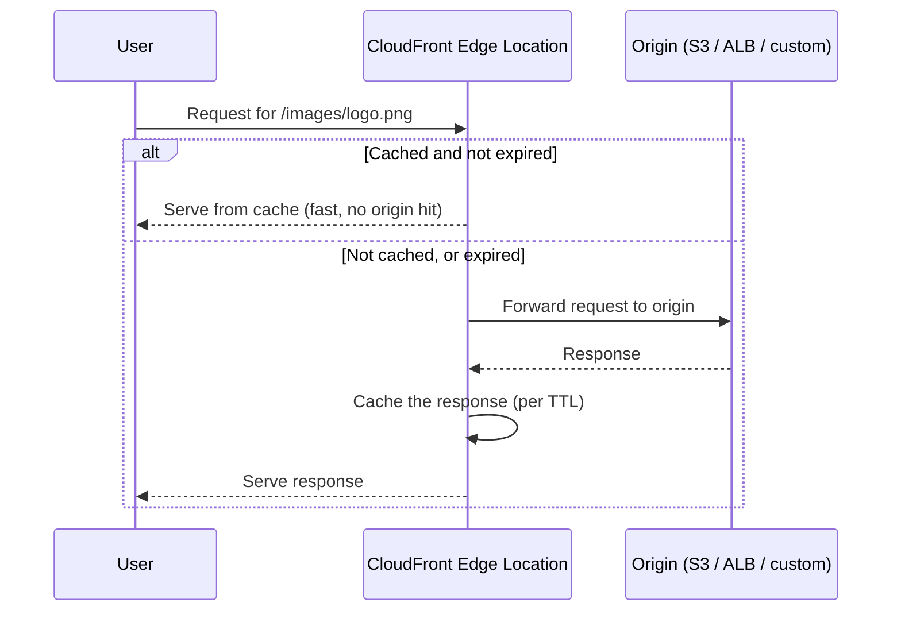

# 01 - Introduction Of AWS CloudFront Content Delivery Network (CDN)

> Goal: understand what a CDN actually solves, where CloudFront sits relative to an origin (S3, an ALB, or any HTTP server), and the core vocabulary — edge locations, distributions, cache behaviors — used throughout the rest of this folder.

---

## 1. The problem a CDN solves

Every origin (an S3 bucket, an ALB, a custom web server) lives in exactly **one physical location** — one Region, one set of AZs. A user far away from that location pays for it in **latency**: every request has to travel the full physical distance there and back, no matter how fast the origin itself responds.

A **Content Delivery Network (CDN)** solves this by **caching copies of your content at many locations physically close to your users**, so most requests never have to reach the origin at all — they're served from a nearby cache instead.

> 🧠 **Mental model:** this is the same principle as `EC2-Storage`'s FSx/EFS notes discussing "data close to compute," just inverted — here it's "**cached copies of content close to the *end user***," wherever in the world they happen to be.

---

## 2. What CloudFront specifically is

**Amazon CloudFront** is AWS's CDN service: a global network of **edge locations** (400+, far more numerous than AWS Regions) that cache and serve your content close to end users, while transparently pulling from your actual **origin** whenever content isn't already cached (or has expired from cache).

| Term | Meaning |
|---|---|
| **Origin** | Where the real, authoritative content lives — an S3 bucket, an ALB, an EC2 instance, or any custom HTTP(S) endpoint |
| **Edge location** | A physical CloudFront point of presence, geographically distributed, that caches content and serves it to nearby users |
| **Distribution** | The CloudFront configuration object tying together one or more origins, cache behaviors, and settings — this is "a CloudFront" in practical, console terms |
| **Cache behavior** | A rule set (path pattern → origin + caching/access settings) — every distribution has a **default** cache behavior, and can have additional path-pattern-specific ones (Notes 04, 08-10) |

---

## 3. How a request actually flows

The **first** request for a given piece of content from a given edge location is a **cache miss** — it has to reach the origin. Every subsequent request (until the cached copy expires) is a **cache hit**, served entirely from the edge, without touching the origin at all.

---

## 4. Beyond just caching — what else CloudFront gives you

- **HTTPS termination close to the user**, with lower TLS handshake latency than terminating directly at a distant origin (Note 05).
- **DDoS protection** — CloudFront (integrated with AWS Shield) absorbs a large amount of attack traffic at the edge, before it ever reaches your origin.
- **Reduced origin load** — since most requests are served from cache, the origin (and its associated cost — e.g. S3 request charges, or ALB/EC2 compute) sees dramatically less traffic.
- **Programmable edge logic** — CloudFront Functions and Lambda@Edge (Note 11) let you run custom code at the edge itself, before a request even reaches your origin.

> 🎯 **Exam tip:** "reduce latency for users geographically distant from our origin" and "reduce load on our origin (S3/ALB/EC2)" are the two most common CloudFront-signaling phrases on SAA-C03 — almost any scenario combining "global users" + "static or semi-static content" points at CloudFront.

---

## 5. Recap

- CloudFront caches content at globally distributed **edge locations**, serving most requests without ever reaching the **origin** — dramatically cutting latency and origin load for geographically distant users.
- A **distribution** ties together one or more **origins** and **cache behaviors** — the core configuration unit covered throughout this folder.
- Beyond caching, CloudFront also provides edge HTTPS termination, DDoS absorption, and programmable edge logic.
- Next: Note 02 — AWS CloudFront Hands-On Lab 1, creating a real distribution in front of an S3 bucket.

### Sources
- [What is Amazon CloudFront? — AWS docs](https://docs.aws.amazon.com/AmazonCloudFront/latest/DeveloperGuide/Introduction.html)
- [How CloudFront delivers content — AWS docs](https://docs.aws.amazon.com/AmazonCloudFront/latest/DeveloperGuide/HowCloudFrontWorks.html)
- [Amazon CloudFront edge locations — AWS](https://aws.amazon.com/cloudfront/features/)
