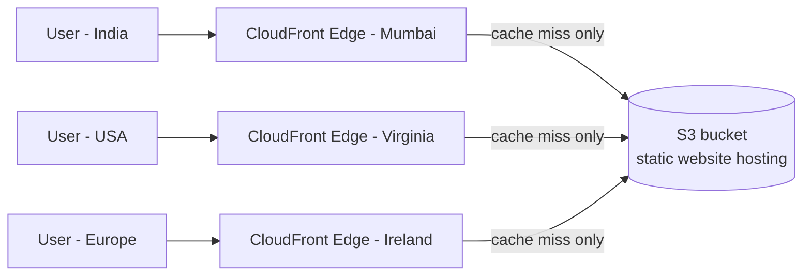

# 02 - AWS CloudFront Hands-On Lab 1 (End-to-End: S3 Static Website + CloudFront CDN)

> Goal: build a real, complete demo from scratch — entirely through the **AWS Console**, click by click — a small static site in S3, a CloudFront distribution in front of it, then directly observe the cache-hit/cache-miss behavior Note 01 described, and **prove** CloudFront is actually helping using a real multi-region testing tool (GeoPeeker), not just take it on faith.

> 🧠 Everything below is done via the Console on purpose, no CLI, no scripts. At this learning stage the goal is to *see* every setting and understand what it does — automation (CLI/Terraform) is worth reaching for later, once the console flow is second nature.

This lab is fully self-contained: every file it needs lives in [`demo-site/`](demo-site/) right next to this note, and is also inlined below so you can copy-paste directly from here if you prefer.

---

## 1. What we're building



- **Origin**: one S3 bucket, static website hosting enabled (like `S3-Simple_Storage_Services/26-27`), public-read.
- **Distribution**: one CloudFront distribution pointed at that bucket's **website endpoint**.
- **Demo site**: `index.html`, `style.css`, `script.js`, `error.html`, `assets/logo.svg` — deliberately a few small files of different types (HTML/CSS/JS/SVG), so caching behavior is visible across a realistic mix of assets, not just one file.

> 🧠 Why the website endpoint (and not Origin Access Control) for this first lab: it's the simplest possible path to a working end-to-end demo. Note 03 (origin types) and Note 06 (Origin Access Control) come back and do this the **production-recommended** way — private bucket, CloudFront-only access via OAC — once you understand the baseline.

---

## 2. The demo site files (copy-paste ready)

All five files below already exist in [`demo-site/`](demo-site/) in this folder. If you want to type them by hand instead, copy them exactly as-is.

**`index.html`**
```html
<!DOCTYPE html>
<html lang="en">
<head>
  <meta charset="UTF-8">
  <meta name="viewport" content="width=device-width, initial-scale=1.0">
  <title>CloudFront CDN Demo</title>
  <link rel="icon" href="assets/logo.svg" type="image/svg+xml">
  <link rel="stylesheet" href="style.css">
</head>
<body>
  <header class="site-header">
    <div class="brand">
      
      <span>CloudFront CDN Demo</span>
    </div>
    <span class="badge" id="build-badge">build v1.0.0</span>
  </header>

  <main>
    <section class="hero">
      <h1>This page is a static file, served through Amazon CloudFront.</h1>
      <p>
        It lives as three files in an S3 bucket &mdash; <code>index.html</code>, <code>style.css</code>,
        <code>script.js</code> &mdash; with zero server-side code. CloudFront caches all three at edge
        locations around the world so most visitors get them from a nearby edge location instead of
        round-tripping all the way back to the origin bucket.
      </p>
    </section>

    <section class="grid">
      <div class="card">
        <h2>Live client clock</h2>
        <p>
          Proves personalization can still happen <em>after</em> a cached static shell loads &mdash;
          this runs entirely in your browser via <code>script.js</code>, not on any server.
        </p>
        <p class="clock" id="clock">--:--:--</p>
        <p class="muted" id="tz">detecting timezone&hellip;</p>
      </div>

      <div class="card">
        <h2>Which edge location served you?</h2>
        <p>
          Static HTML can't read CloudFront's response headers about itself. Run this from a terminal
          to see the actual edge Point of Presence (POP) and cache status:
        </p>
        <pre><code>curl -sI https://&lt;your-distribution&gt;.cloudfront.net/ | grep -iE "x-cache|x-amz-cf-pop"</code></pre>
      </div>

      <div class="card">
        <h2>Prove the CDN is actually helping</h2>
        <p>
          Open this same URL in <a href="https://geopeeker.com" target="_blank" rel="noopener noreferrer">GeoPeeker</a>
          and compare load time / screenshot against the raw S3 website endpoint, from several global
          regions at once.
        </p>
      </div>

      <div class="card">
        <h2>Trigger a 404</h2>
        <p>
          Request a path that doesn't exist to see the custom <code>error.html</code> served by S3's
          error-document routing, right through CloudFront:
        </p>
        <p><a href="/does-not-exist">/does-not-exist &rarr;</a></p>
      </div>
    </section>
  </main>

  <footer>
    <p>
      Deployed <span id="year"></span> &middot; Served via Amazon S3 + CloudFront &middot;
      bump the version in <span class="badge-inline">build-badge</span> above and re-upload to test
      cache-busting without an invalidation.
    </p>
  </footer>

  <script src="script.js"></script>
</body>
</html>
```

**`style.css`** — full content in [`demo-site/style.css`](demo-site/style.css) (dark theme, responsive card grid; omitted here for length — copy it directly from the file).

**`script.js`**
```javascript
document.getElementById('year').textContent = new Date().getFullYear();

function tick() {
  const el = document.getElementById('clock');
  if (el) el.textContent = new Date().toLocaleTimeString();
}
setInterval(tick, 1000);
tick();

const tzEl = document.getElementById('tz');
if (tzEl) {
  tzEl.textContent = `your browser reports: ${Intl.DateTimeFormat().resolvedOptions().timeZone}`;
}
```

**`error.html`**
```html
<!DOCTYPE html>
<html lang="en">
<head>
  <meta charset="UTF-8">
  <title>404 — Not Found</title>
  <link rel="icon" href="assets/logo.svg" type="image/svg+xml">
  <link rel="stylesheet" href="style.css">
</head>
<body>
  <header class="site-header">
    <div class="brand"><span>CloudFront CDN Demo</span></div>
  </header>
  <main>
    <section class="hero">
      <h1>404 — This page doesn't exist.</h1>
      <p>This is S3's <strong>error document</strong>, served for any path that doesn't match an object in the bucket — routed through CloudFront exactly like every other file.</p>
      <p><a href="/">&larr; Back to the demo home page</a></p>
    </section>
  </main>
</body>
</html>
```

**`assets/logo.svg`**
```xml
<svg xmlns="http://www.w3.org/2000/svg" viewBox="0 0 64 64" fill="none">
  <path d="M46 26.5C45.2 19.6 39.3 14 32 14c-5.8 0-10.8 3.5-13 8.6C13 23.4 8 28.2 8 34.3 8 40.7 13.3 46 19.7 46h26.6C52.3 46 57 41.3 57 35.5 57 30 52.7 25.5 47.1 25.2z" fill="#38bdf8"/>
  <path d="M26 38l6 6 10-12" stroke="#0f172a" stroke-width="3" stroke-linecap="round" stroke-linejoin="round"/>
</svg>
```

**`bucket-policy.json`** (used manually in Section 3, Step 4 — not applied via CLI)
```json
{
  "Version": "2012-10-17",
  "Statement": [
    {
      "Sid": "PublicReadForWebsite",
      "Effect": "Allow",
      "Principal": "*",
      "Action": "s3:GetObject",
      "Resource": "arn:aws:s3:::<BUCKET_NAME>/*"
    }
  ]
}
```

---

## 3. Create and configure the S3 bucket (AWS Console)

### Step 1 — Create the bucket
1. Open the **S3 console** → **Create bucket**.
2. **Bucket name**: something globally unique, e.g. `cf-demo-static-site-<your-name-or-date>`.
3. **AWS Region**: pick one close to you, e.g. `ap-south-1` (Mumbai).
4. **Object Ownership**: leave as **ACLs disabled (Bucket owner enforced)** — the default; access will be controlled via bucket policy, not ACLs.
5. **Block Public Access settings for this bucket**: uncheck **Block all public access**, then check the acknowledgement box. (We'll grant public read explicitly via a bucket policy in Step 4.)
6. Leave everything else default → **Create bucket**.

### Step 2 — Upload the demo site files
1. Open the new bucket → **Upload** → **Add files**: select `index.html`, `style.css`, `script.js`, `error.html` from `demo-site/`.
2. **Add folder**: select the `assets` folder (so `logo.svg` uploads to `assets/logo.svg`, preserving the path the HTML expects).
3. **Upload**.
4. Confirm the bucket now shows: `index.html`, `style.css`, `script.js`, `error.html`, and an `assets/` folder containing `logo.svg`.

### Step 3 — Enable static website hosting
1. **Properties** tab → scroll to **Static website hosting** → **Edit**.
2. **Static website hosting**: Enable. **Hosting type**: Host a static website.
3. **Index document**: `index.html`. **Error document**: `error.html`.
4. **Save changes** — the console now shows a **Bucket website endpoint** URL, e.g. `http://cf-demo-static-site-xxxx.s3-website.ap-south-1.amazonaws.com`. Note this URL down, it's needed in Section 5.

### Step 4 — Attach a public-read bucket policy
1. **Permissions** tab → **Bucket policy** → **Edit**.
2. Paste the JSON from `demo-site/bucket-policy.json` (shown in Section 2 above), replacing `<BUCKET_NAME>` with your actual bucket name.
3. **Save changes**.

---

## 4. Verify the S3 website endpoint directly (before CloudFront)

Get the baseline working before adding CloudFront on top — isolates which layer is responsible if something breaks later.

1. Open the **Bucket website endpoint** URL from Section 3, Step 3 in a browser. You should see the demo page, with the live clock ticking, served over **plain HTTP** (Note 26: website endpoints are HTTP-only).
2. Try a path that doesn't exist, e.g. append `/does-not-exist` to the URL — you should see the styled `error.html` page with a `404` status (check via browser dev tools **Network** tab, **Status** column).

---

## 5. Create the CloudFront distribution (AWS Console)

1. Open the **CloudFront console** → **Distributions** → **Create distribution**.
2. **Origin domain**: start typing your bucket name — the console will suggest entries for it. Pick the one that matches the **website endpoint** format, `<bucket>.s3-website-<region>.amazonaws.com` (**not** the plain `<bucket>.s3.amazonaws.com` REST endpoint). If the console only auto-fills the REST endpoint, manually type/paste the website endpoint URL from Section 3, Step 3 instead (dropping the `http://` prefix).

   > This distinction matters a lot and is covered fully in Note 03 (origin types) and Note 06 (Origin Access Control): the REST endpoint supports private buckets via OAC; the website endpoint is what gives you index/error-document routing, but only works with a public bucket.
3. **Origin protocol policy**: since the website endpoint only speaks HTTP, this is fixed to **HTTP only** — CloudFront will still serve HTTPS to your visitors regardless (more on this in Section 6).
4. **Default cache behavior**:
   - **Viewer protocol policy**: **Redirect HTTP to HTTPS**.
   - **Allowed HTTP methods**: leave default (**GET, HEAD**) — this is a static site, nothing to write.
   - **Cache policy**: leave the default **CachingOptimized** managed policy.
5. **Settings** (bottom of the page): **Default root object**: `index.html`.
6. Leave **WAF**, **Price class**, and everything else at their defaults for this lab (all explored in later notes).
7. **Create distribution**. Status will show **Deploying** — provisioning takes several minutes to propagate to all edge locations. Wait until it shows **Enabled** / **Deployed**.

---

## 6. Test it end-to-end

1. Once status shows **Enabled/Deployed**, copy the distribution's **Domain name** from the console (e.g. `d1234abcdefgh.cloudfront.net`).
2. Open `https://d1234abcdefgh.cloudfront.net/` in a browser. Same page as Section 4, but now served over **HTTPS**, from a CloudFront domain — even though the underlying S3 website endpoint is HTTP-only. CloudFront terminates HTTPS at the edge and talks to the origin over whichever protocol the origin supports, decoupling the visitor-facing protocol from the origin's own capability.
3. Click **"/does-not-exist"** on the page and confirm the styled 404 (`error.html`) still renders correctly through CloudFront.
4. Open browser dev tools → **Network** tab → reload the page → click the `index.html` (or `/`) request → check the **Response Headers**. Look for:
   - `x-cache`: `Miss from cloudfront` (first load) or `Hit from cloudfront` (on a reload within the cache TTL).
   - `x-amz-cf-pop`: a code like `BOM50-C1` (Mumbai) or `IAD89-C2` (Virginia/Ashburn) — the physical edge location that answered you.

---

## 7. Observe cache hit vs. cache miss

Using the same **Network** tab in dev tools:

1. Reload the CloudFront URL a few times and watch the `x-cache` header on `index.html`, `style.css`, and `script.js`.
2. **First request** (or first after the cache expires): `X-Cache: Miss from cloudfront` — CloudFront had to fetch from the origin.
3. **Subsequent requests** (within the cache TTL): `X-Cache: Hit from cloudfront` — served entirely from the edge, no origin hit at all.

> 🧠 `X-Cache` and `X-Amz-Cf-Pop` are the two fastest ways to confirm, hands-on, whether CloudFront actually served a request from cache and *where* — worth checking any time cache behavior needs debugging throughout this folder.

---

## 8. Prove the CDN is actually helping — real-world verification with GeoPeeker

Headers confirm caching is *happening*; they don't show the **user-experienced latency win** a CDN is actually for. [GeoPeeker](https://geopeeker.com) is a free tool that loads a URL simultaneously from several real-world regions (its free tier covers Singapore, Brazil, Virginia, California, Ireland, and Australia) and reports back screenshots and load times from each — exactly the "users far from the origin" problem Note 01 opened with.

1. Go to **https://geopeeker.com**.
2. Paste in your **raw S3 website endpoint** (from Section 3, Step 3) first, and run the check. Note the load times per region — regions far from your bucket's AWS Region (e.g. Sydney or São Paulo, if your bucket is in `ap-south-1`) will visibly lag, since every single region has to fetch directly from that one physical bucket location.
3. Now paste in your **CloudFront domain** (from Section 6) and run the check again. After the first pass warms the cache at each region's nearest edge location, re-run it — load times across *all* regions should tighten up and even out, because each is now being served from a nearby CloudFront edge location instead of the single distant origin.
4. Compare the two result sets side by side — this is the actual, observable effect Note 01 described in theory: CloudFront collapsing "far from origin = slow" down to roughly the same fast experience everywhere.

> ⚠️ GeoPeeker is a free community tool and its uptime isn't guaranteed. If it's unavailable, equivalent alternatives for the same before/after, multi-region comparison are [KeyCDN Performance Test](https://tools.keycdn.com/performance) and [dotcom-tools Website Speed Test](https://www.dotcom-tools.com/website-speed-test) — both run the same "load this URL from many regions" check.

---

## 9. Troubleshooting

| Symptom | Likely cause |
|---|---|
| `403 Forbidden` on the S3 website endpoint | Block Public Access still blocking the bucket policy, or the bucket policy wasn't attached/scoped correctly (Section 3, Steps 1 & 4) |
| CloudFront returns `504` or times out | Origin domain in Section 5 points at the REST endpoint (`<bucket>.s3.amazonaws.com`) instead of the **website endpoint** (`<bucket>.s3-website-<region>.amazonaws.com`) |
| CSS/JS/logo don't load, only raw HTML | Relative paths broken during upload — confirm `style.css`, `script.js`, and `assets/logo.svg` actually landed in the bucket in the right locations (check the bucket's **Objects** list) |
| Browser shows old content after re-uploading a file | Expected — CloudFront is still serving the cached copy until its TTL expires; force a refresh with an invalidation (Note 18) or bump the filename/query string (cache-busting) |
| `X-Cache` header missing entirely | You opened the raw S3 endpoint by mistake, not the `.cloudfront.net` domain |

---

## 10. Cleanup (avoid ongoing charges)

1. **CloudFront console** → select your distribution → **Disable** → wait until status shows **Deployed** (a distribution must be fully disabled and deployed before it can be deleted, same propagation delay as creation) → **Delete**.
2. **S3 console** → open the bucket → select all objects → **Delete** (empties the bucket) → then delete the bucket itself from the bucket list.

---

## 11. Recap

- A complete S3 + CloudFront static site demo needs: the site files (`demo-site/`), a public bucket with static website hosting enabled, and a CloudFront distribution pointed at the bucket's **website endpoint** (not the REST endpoint, for this simple path) — all configurable entirely from the AWS Console.
- CloudFront terminates HTTPS at the edge regardless of the origin's own protocol support.
- `X-Cache` and `X-Amz-Cf-Pop` response headers (visible in browser dev tools' Network tab) directly show hit/miss and which physical edge location answered — the fastest hands-on way to confirm caching behavior.
- Tools like **GeoPeeker** make the latency benefit *observable*, not just theoretical — comparing the same page via the raw origin vs. via CloudFront from multiple real-world regions is the clearest demonstration of what a CDN is actually for.
- Next: Note 03 — AWS CloudFront Origin Setting, covering every origin configuration option in depth.

### Sources
- [Getting started with a standard distribution — AWS docs](https://docs.aws.amazon.com/AmazonCloudFront/latest/DeveloperGuide/GettingStarted.SimpleDistribution.html)
- [Using Amazon S3 origins and custom origins — AWS docs](https://docs.aws.amazon.com/AmazonCloudFront/latest/DeveloperGuide/DownloadDistS3AndCustomOrigins.html)
- [Hosting a static website using Amazon S3 — AWS docs](https://docs.aws.amazon.com/AmazonS3/latest/userguide/WebsiteHosting.html)
- [GeoPeeker — view a site from multiple geographic locations](https://geopeeker.com/about)
