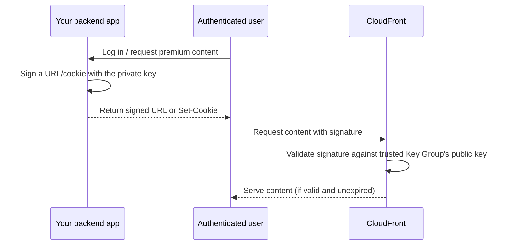

# 08 - AWS CloudFront Default Cache Behavior — Restrict Viewer Access

> Goal: require **signed URLs or signed cookies** for a cache behavior — CloudFront's own equivalent of `S3-Simple_Storage_Services/35`'s presigned URLs, but built for premium/private content distributed at CDN scale rather than one-off S3 object access.

---

## 1. What "Restrict Viewer Access" adds

Enabling this setting on a cache behavior means **every request must present a valid signature** (via a signed URL or signed cookie) before CloudFront will serve it — even though the content is being served from a public-facing CDN endpoint. Without this, anyone who discovers a content URL can access it directly; with it, only requests carrying a cryptographically valid, time-limited authorization can succeed.

> 🧠 **Mental model:** this is conceptually the same idea as an S3 presigned URL (`S3-Simple_Storage_Services/35`) — a signature and expiration baked into the access itself — but scoped to a **CloudFront distribution** instead of a single S3 object, and with considerably more expressive power (Section 3).

---

## 2. Signed URLs vs. signed cookies

| | Signed URL | Signed Cookie |
|---|---|---|
| Where the signature lives | In the URL's query string | In a browser cookie, set once |
| Best for | A single file, or a small number of individually-linked files (e.g. one video, one PDF) | Granting access to **many** files at once (e.g. an entire video course, a whole private app's static assets) — the viewer doesn't need a uniquely-signed link for every single asset |
| Player/app compatibility | Works with any HTTP client, including ones that don't handle cookies | Requires the client to handle cookies (fine for browsers, awkward for some non-browser players) |

> 🎯 **Exam tip:** "grant a logged-in user access to many private files without generating a unique signed link for each one" is the signature **signed cookies** scenario; "grant temporary access to one specific private file/link" points to a **signed URL** instead — directly parallel to the "many objects vs. one object" distinction that also shows up in S3 access-control scenarios.

---

## 3. Who issues the signature — trusted key groups

Signed URLs/cookies are generated using a **private key**, whose corresponding **public key** is registered with CloudFront inside a **Key Group**, which the cache behavior's Restrict Viewer Access setting then trusts. Your own backend application (holding the private key) is what actually creates signed URLs/cookies for legitimate, authenticated users — CloudFront itself never needs to know *why* a user deserves access, only that the signature is valid and unexpired.

---

## 4. Custom policies — beyond a simple expiration

A signed URL/cookie can use a **canned policy** (a fixed expiration time, one resource) or a **custom policy**, which additionally supports:

- **Date range** (valid-from / valid-until, not just a single expiration).
- **IP address range restriction** — only requests from a specific CIDR block are honored.
- **Wildcard resource paths** — one signed cookie/URL can grant access to an entire path pattern (e.g. `/premium/*`), not just one exact file — this is what makes signed cookies practical for "grant access to an entire course/library" use cases.

---

## 5. Recap

- **Restrict Viewer Access** requires a valid signed URL or signed cookie for every request on that cache behavior — CloudFront's own presigned-access mechanism, conceptually parallel to S3 presigned URLs but built for CDN-scale, multi-file distribution.
- **Signed URLs** suit single/few files; **signed cookies** suit many files under one grant.
- A **custom policy** unlocks date ranges, IP restrictions, and wildcard resource paths — capabilities a simple canned/expiring link can't express.
- Next: Note 09 — AWS CloudFront Default Cache Behavior: Cache Key And Origin Requests, covering what actually varies a cached copy.

### Sources
- [Serving private content with signed URLs and signed cookies — AWS docs](https://docs.aws.amazon.com/AmazonCloudFront/latest/DeveloperGuide/PrivateContent.html)
- [Choosing signed URLs or signed cookies — AWS docs](https://docs.aws.amazon.com/AmazonCloudFront/latest/DeveloperGuide/private-content-choosing-signed-urls-cookies.html)
- [Creating a custom policy for signed URLs and cookies — AWS docs](https://docs.aws.amazon.com/AmazonCloudFront/latest/DeveloperGuide/private-content-creating-signed-url-custom-policy.html)
