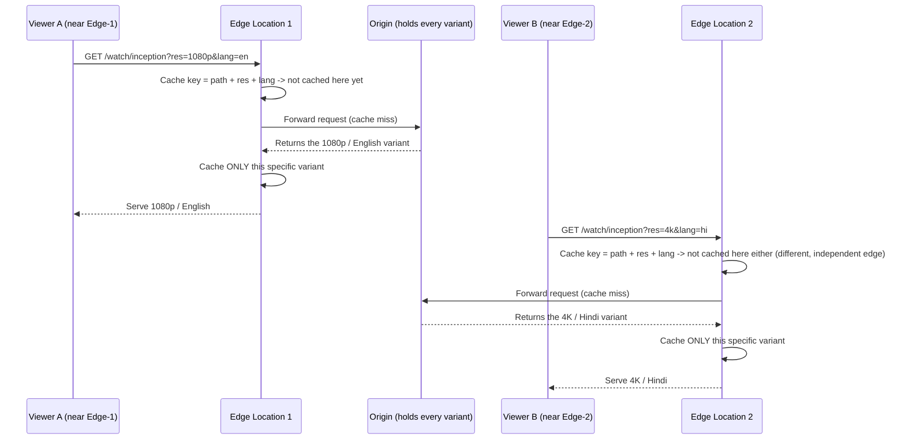
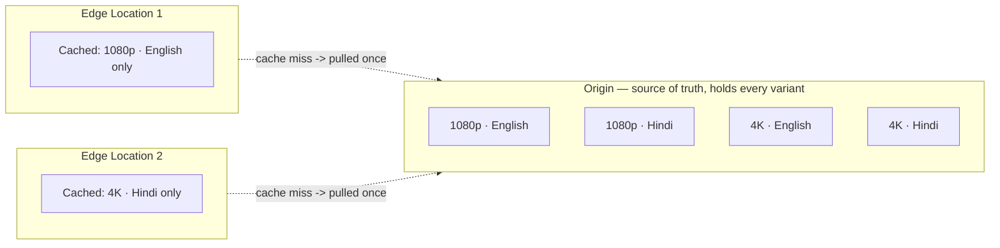

# 09 - AWS CloudFront Default Cache Behavior — Cache Key And Origin Requests

> Goal: understand exactly what makes two requests "the same" for caching purposes — the **cache key** — via the modern **Cache Policy** and **Origin Request Policy** objects that replaced the older, more limited legacy TTL/forwarding settings.

---

## 1. What a cache key actually is

The **cache key** is the set of request attributes CloudFront uses to decide whether an incoming request can be served from an **existing** cached copy, or needs to be treated as a **different** cacheable variant entirely. By default, the cache key is just the **request path**.

**Example — a streaming service:** imagine a video URL like `/watch/inception`, requested at different quality levels and audio languages via a query string or header — say `?res=1080p&lang=en` versus `?res=4k&lang=hi`. By default, the cache key is *just* `/watch/inception` — meaning, without further configuration, CloudFront would treat **every resolution/language combination as the exact same cache entry**, potentially serving a viewer who asked for 4K Hindi the cached 1080p English copy instead.

> ⚠️ This default-cache-key behavior is a classic real-world CloudFront misconfiguration: dynamic content that varies by query string, header, or cookie needs those specific elements **explicitly added to the cache key**, or CloudFront will happily serve one user's cached response to a completely different request.

---

## 2. Architecture & workflow — seeing the cache key play out across edge locations

The streaming example above isn't just about *what's* in the cache key — it also reveals something Section 1 doesn't cover on its own: **each edge location's cache is independent**. CloudFront doesn't maintain one single global cache; every one of its edge locations builds up its own cache based purely on the requests *it personally* has seen. A variant cached at one edge location is not automatically present at another.

After both requests above, the two edge locations and the origin end up holding **different amounts of the same content**:

- **Origin** always holds the *full* catalog of variants — it's unaffected by any CloudFront cache configuration, since it's the authoritative source every edge eventually pulls from.
- **Edge Location 1** has only ever seen requests for 1080p/English, so that's the *only* variant it has cached — a Hindi or 4K request arriving at Edge Location 1 for the first time would still be a cache miss there, even though Edge Location 2 already has a 4K/Hindi copy.
- This is why "first request from a given region is a cache miss" (Note 01) applies **per cached variant, per edge location** — not just once globally.

> 🧠 **Mental model:** the cache key is the "address" CloudFront uses to file away a cached response — the narrower the address (path only), the more requests share one cache slot (higher hit ratio, but risk of serving the wrong content for anything actually variable, like the wrong resolution or language above); the wider the address (path + query + headers + cookies), the more precisely correct each cache slot is, at the cost of more cache misses overall — and that trade-off plays out independently at *every* edge location.

---

## 3. Cache Policy — controlling the cache key

A **Cache Policy** (attached to a cache behavior) explicitly declares which of three categories of request data should be included in the cache key. These are the exact dropdown options CloudFront's **Create cache policy** console page (**CloudFront → Policies → Cache → Create cache policy**) gives you for each, under **Cache key settings**:

| Category | Console options (exact dropdown values) | Example |
|---|---|---|
| **Headers** | `None` / `Include the following headers` | e.g. `Accept-Language`, or a custom `X-Resolution` header, to cache a different version per locale or quality level |
| **Query strings** | `None` / `All` / `All query strings except` / `Include the following query strings` | e.g. `Include the following query strings` → `res`, `lang` in the streaming example above |
| **Cookies** | `None` / `All` / `All cookies except` / `Include the following cookies` | e.g. a session/personalization cookie needing its own distinct cache entry per value |

> 🧠 **Note the asymmetry:** Headers only ever get `None` or an explicit allow-list (`Include the following headers`) — there's no `All` option for headers in a cache policy, unlike query strings and cookies. This is a deliberate CloudFront limit: blindly keying on *every* header (many of which vary per-request for reasons that have nothing to do with content, like `User-Agent` or `Referer`) would fragment the cache into near-uselessness. If you genuinely need broad header-based forwarding, that's what the Origin Request Policy (Section 4) is for — it *can* forward `All` headers to the origin, independent of the cache key.

Including `res` and `lang` in the cache key is exactly what makes Section 2's diagram correct — without it, Edge Location 1 and Edge Location 2 would both cache under the same key (`/watch/inception`) and could hand out mismatched quality/language to the next visitor who happens to hit that edge.

Each additional included dimension **increases the number of distinct cached variants** stored — improving correctness (no more wrongly-shared cache entries) but potentially lowering the **cache hit ratio** (more distinct variants means each one is requested less often, so fewer requests find an existing cached copy).

---

## 4. Origin Request Policy — what CloudFront forwards to the origin on a cache miss

Separately, an **Origin Request Policy** controls what CloudFront sends **to the origin** on a cache miss — which can be **broader** than the cache key itself. In the streaming example: the origin needs to know `res` and `lang` on every cache miss to return the correct variant at all — but whether that combination also gets its *own* cache slot at the edge is a completely separate decision, made by the Cache Policy. You could, in principle, forward `res`/`lang` to the origin (Origin Request Policy) while *not* including them in the cache key (Cache Policy) — decoupling "what makes this cacheable as distinct" from "what the origin needs to know to answer the request." (Note 09.01's hands-on demo shows exactly this gap happening live, with a header that's forwarded but not cache-keyed.)

> 🎯 **Exam tip:** "the cache hit ratio is too low because too much varies the cache key" or "users are intermittently seeing the wrong quality/language/version of content" are the two opposite-direction signals this note's settings resolve — too broad a cache key hurts hit ratio; too narrow a cache key (or none at all) risks serving stale/wrong content, exactly like the mismatched-resolution scenario above. The fix is always tuning the **Cache Policy**, with the **Origin Request Policy** handling anything the origin needs but that shouldn't affect caching itself.

---

## 5. Managed policies vs. custom policies

CloudFront ships several **AWS managed** cache policies and origin request policies for common cases (e.g. `CachingOptimized`, `CachingDisabled`, `AllViewer`) — usable directly without authoring your own, exactly parallel to `IAM/02`'s AWS managed IAM policies. A **custom** policy is created when the specific combination of query strings/headers/cookies needed doesn't match any managed option — e.g. "cache key = path + `res` + `lang`" from this note's example has no managed equivalent.

---

## 6. Recap

- The **cache key** (governed by a **Cache Policy**) determines which requests are treated as the same cached entry — by default, just the path, which is often too coarse for dynamic content varying by query string, header, or cookie (Section 1's resolution/language example).
- Each **edge location caches independently** — a variant cached at one edge isn't automatically present at another; the same cache-key logic plays out separately, per location, per variant (Section 2).
- An **Origin Request Policy** independently controls what's forwarded to the origin on a cache miss, which can be broader than the cache key itself (Section 4).
- Broadening the cache key improves correctness for variable content but can reduce the cache hit ratio — a real trade-off to tune deliberately, not a "more is always better" setting (Section 3).
- Next: Note 09.01 — a hands-on demo that makes this exact cache-key vs. origin-request-policy gap directly observable. Then Note 10 — AWS CloudFront Default Cache Behavior: Response Header Policy, controlling what headers actually come back to the viewer.

### Sources
- [Understanding the cache key — AWS docs](https://docs.aws.amazon.com/AmazonCloudFront/latest/DeveloperGuide/understanding-the-cache-key.html)
- [Controlling the cache key with a cache policy — AWS docs](https://docs.aws.amazon.com/AmazonCloudFront/latest/DeveloperGuide/controlling-the-cache-key.html)
- [Controlling origin requests with an origin request policy — AWS docs](https://docs.aws.amazon.com/AmazonCloudFront/latest/DeveloperGuide/controlling-origin-requests.html)
