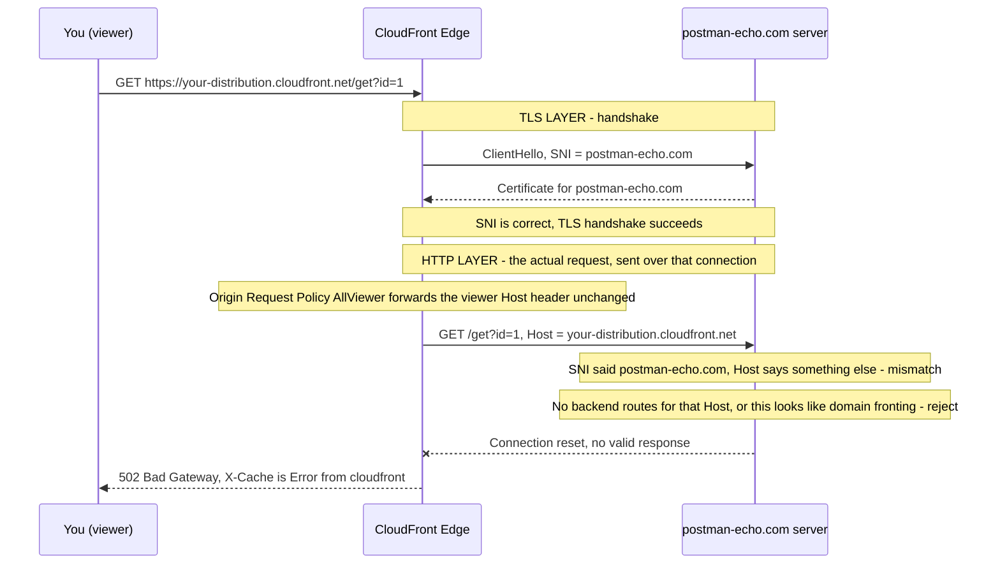
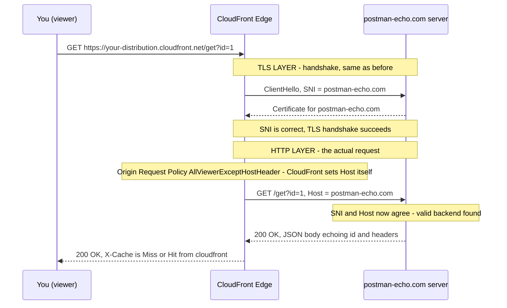

# 09.01 - Hands-On Demo: Cache Key vs. Origin Request Policy in Practice

> Goal: make Note 09's central idea — the **cache key** decides "sameness," the **Origin Request Policy** decides what the origin *sees*, and these are two independent, decoupled controls — something you can actually **watch happen**, not just read about. Entirely via the **AWS Console**, no CLI.

> ⚠️ **Before you start — this lab has a real cost gate, not just a time one.** As of AWS's November 2025 flat-rate CloudFront pricing overhaul, **custom** cache policies, origin request policies, and response header policies are only available on the **Business** ($200/month) and **Premium** ($1,000/month) plans — the **Free** ($0) and **Pro** ($15/month) plans can only attach **AWS managed** policies, and the console shows an "Upgrade to Business" paywall the moment you try to create a custom one. Section 4 (the baseline bug, using only managed policies) works on any plan. Sections 5-6 (creating `Demo-CacheKey-Custom`) will hit that paywall on Free/Pro. Check your account's current plan (**CloudFront console → Savings Bundle**, or **Billing**) before proceeding — don't upgrade just for this lab unless you're deliberately willing to pay for it; the mechanics in Sections 5-6 are still worth reading even if you can't click through them live.

---

## 1. Why this demo needs a second origin

The S3 origin from [Note 02](02-CloudFront-HandsOn-Lab1.md) always returns the exact same bytes for `index.html`, no matter what query string or header you send — so it can't visually prove anything about cache keys. A request for `/index.html?id=1` and `/index.html?id=2` would *look* identical either way, bug or no bug.

To make the cache key's effect **visible**, this demo adds a second, ordered cache behavior pointed at [**postman-echo.com**](https://postman-echo.com) — a free, public, widely-used testing API (maintained by Postman) whose `/get` endpoint echoes back, in its JSON response body, exactly the query string and headers it received. That turns CloudFront's internal "what did I treat as this request's identity, and what did I forward to origin?" into something you can literally read off the screen.

> 🧠 **Mental model:** think of `postman-echo.com/get` as a mirror. If CloudFront serves you a cached response, the mirror shows you what an *earlier* request looked like — not necessarily your own. That mismatch **is** the cache-key bug from Note 09, Section 1, made visible.

This demo is the mechanical proof behind Note 09 Section 2's **two-leg model** (Viewer → Edge is the Cache Key check; Edge → Origin, on a Miss only, is the Origin Request Policy) and Section 3's Netflix walkthrough — same two controls, just isolated here with a tool that lets you see both legs directly instead of inferring them from video quality/language.

---

## 2. Prerequisite

The CloudFront distribution + S3 bucket from [Note 02](02-CloudFront-HandsOn-Lab1.md), still deployed. If you already cleaned that up, just recreate a minimal distribution (any origin works as the *default* behavior — this demo only touches a new, separate cache behavior, so what the default origin is doesn't matter here).

---

## 3. Add the echo origin and a `/get` cache behavior (Console)

### Step 1 — Add the origin
1. **CloudFront console** → your distribution → **Origins** tab → **Create origin**.
2. **Origin domain**: type `postman-echo.com` into the search box (no `https://` prefix).
3. **Protocol**: select **HTTPS only**. This expands two more fields:
   - **HTTPS port**: leave at the default `443`.
   - **Minimum Origin SSL protocol**: leave at the default **TLSv1.2**.
4. **Origin path** (optional): leave **blank** — requests should hit `postman-echo.com`'s paths directly (e.g. `/get`), matching the cache behavior's path pattern in Step 2.
5. **Name**: the console auto-fills this as `postman-echo.com` from Step 2 above — clear it and rename to `PostmanEchoOrigin` for clarity (this is the name you'll pick from the dropdown when creating the cache behavior next).
6. Leave **Enable origin mutual TLS** off, don't add a custom header, leave **Origin Shield** off, and leave **Additional settings** collapsed — none of these are needed for this demo.
7. **Create origin**.

### Step 2 — Add a cache behavior for it
1. **Behaviors** tab → **Create behavior**.
2. **Path pattern**: `/get`
3. **Origin and origin groups**: select `PostmanEchoOrigin`.
4. **Compress objects automatically**: leave at **Yes** (default).
5. **Viewer** section:
   - **Viewer protocol policy**: leave at **Redirect HTTP to HTTPS** (default).
   - **Allowed HTTP methods**: leave at **GET, HEAD** (default).
   - **Restrict viewer access**: leave at **No** (default).
6. **Cache key and origin requests** (the page defaults to the recommended cache-policy/origin-request-policy mode already):
   - **Cache policy**: the dropdown defaults to `CachingDisabled` — change it to `Managed-CachingOptimized` (cache key is **path only**, nothing else).
   - **Origin request policy — optional**: defaults to unselected — choose **`Managed-AllViewerExceptHostHeader`** (forwards **all** viewer headers, cookies, and query strings to the origin, regardless of what's in the cache key — with one deliberate exception, explained below).
   - **Response headers policy — optional**: leave unselected — not needed for this demo.
   - **Additional settings**: leave collapsed.
7. **Function associations — optional**: leave all four rows (Viewer request, Viewer response, Origin request, Origin response) at **No association** — this is CloudFront Functions/Lambda@Edge territory (Note 11), not needed here.
8. **Create behavior**. Wait for the distribution to show **Deployed** again.

> 🧠 You'll notice a **"Custom cache policies — Upgrade to Business"** banner sitting right above the Cache policy dropdown on this same page. It's just informational here, since we're only picking a **managed** policy — but it's the exact paywall the cost warning at the top of this note refers to, and Section 5 runs straight into it.

> ⚠️ **Why `AllViewerExceptHostHeader` and not plain `AllViewer`:** every HTTPS request actually carries **two separate identity signals** — a TLS-layer one and an HTTP-layer one — and they need to agree.

**Every request has two layers, checked at two different points:**

| Layer | Field | Who sets it | What it does |
|---|---|---|---|
| TLS (connection setup) | **SNI** (Server Name Indication) | CloudFront — always the **origin domain** you configured, no policy can change this | Which server/certificate to connect to |
| HTTP (the actual request) | **`Host` header** | Controlled by the **Origin Request Policy** | Which *application* on that server should handle the request |

With plain `AllViewer`, those two disagree — here's the request that produced your `502`:



Switching to `AllViewerExceptHostHeader` changes exactly one thing — CloudFront sets `Host` itself instead of forwarding the viewer's — so both layers finally agree:



Why `postman-echo.com` actively **rejects** the mismatched request rather than just ignoring it, two reasons (likely both apply):
- **Virtual hosting**: like almost every modern web host, `postman-echo.com`'s server sits behind infrastructure that uses the `Host` header to decide *which backend application* handles the request — a `Host` it has no route for simply has nowhere to go.
- **Anti domain-fronting security**: an SNI/`Host` mismatch is the exact signature of *domain fronting* — a technique for hiding a request's real destination from network observers by presenting one domain at the TLS layer and a different one at the HTTP layer. Many hosts explicitly detect and refuse this pattern as a security measure.

Either way, CloudFront's TLS connection succeeds but never gets a usable HTTP response back — which is precisely what `502 Bad Gateway` means: connected, but no good answer came back. This is a genuine, common real-world CloudFront gotcha whenever your origin isn't your own infrastructure (S3 and your own ALB don't care about `Host`, which is why Note 02's S3 origin never hit this).

> ⚠️ This exact combination — `CachingOptimized` + `AllViewerExceptHostHeader` — is picked deliberately. It's a very common real-world misconfiguration: people reach for a broad forwarding policy because they want the origin to *see* everything, without realizing the cache *key* is still path-only underneath. Section 4 below shows exactly what that combination breaks.

---

## 4. Baseline: watch the coarse-cache-key bug happen

With the distribution deployed, run two requests with **different query strings and different headers**:

```bash
CF_URL="https://<your-distribution>.cloudfront.net"

curl -s -D - "$CF_URL/get?id=1" -H "X-Demo-User: alice" | grep -iE "x-cache:|\"id\"|\"x-demo-user\""

curl -s -D - "$CF_URL/get?id=2" -H "X-Demo-User: bob"   | grep -iE "x-cache:|\"id\"|\"x-demo-user\""
```

Expected result:

| Request | `X-Cache` | Echoed `args.id` | Echoed `headers.x-demo-user` |
|---|---|---|---|
| `?id=1`, `alice` (1st call) | `Miss from cloudfront` | `1` (correct) | `alice` (correct) |
| `?id=2`, `bob` (2nd call) | **`Hit from cloudfront`** | **`1`** ← wrong! | **`alice`** ← wrong! |

The second request asked for `id=2` from `bob`, but CloudFront treated it as **the same cache entry** as the first request (cache key = path only, `/get`, ignoring the query string and header entirely) — Leg 1 (Note 09 Section 2) returned a Hit. Because Leg 1 was a Hit, **Leg 2 never ran** — `AllViewerExceptHostHeader` never got the chance to forward `id=2`/`bob` anywhere, since there was no miss to trigger it. This is Note 09 Section 1's warning, no longer theoretical.

---

## 5. Fix #1 — narrow the cache key to include the query string

> ⚠️ This is where the cost gate from the top of this note actually bites. Creating a **custom** cache policy needs the CloudFront **Business** ($200/month) or **Premium** ($1,000/month) plan — on **Free**/**Pro**, the **Create cache policy** page below will show the same "Upgrade to Business" banner instead of letting you save one. If you're not upgrading, read Sections 5-6 for the mechanics (they're accurate) and skip straight to Section 7 for what the result would look like.

### Step 1 — Create a custom Cache Policy
1. **CloudFront console** → **Policies** (left nav) → **Cache** tab → **Create cache policy**.
2. **Details**:
   - **Name**: `Demo-CacheKey-Custom`.
   - **Description** (optional): leave blank.
3. **TTL settings**: leave the defaults as they are — **Minimum TTL**: `1`, **Maximum TTL**: `31536000`, **Default TTL**: `86400`.
4. **Cache key settings** (fields appear in this order — **Headers**, then **Query strings**, then **Cookies**):
   - **Headers** dropdown: leave at **None** for now (Section 6 comes back to this — note the dropdown only offers `None` or `Include the following headers`, there's no `All` option for headers).
   - **Query strings** dropdown: change from **None** to **Include the following query strings** → an input box appears → type `id` and add it.
   - **Cookies** dropdown: leave at **None**.
5. **Compression support**: leave **Gzip** and **Brotli** both checked (defaults).
6. **Create**.

### Step 2 — Attach it to the `/get` behavior
1. **Behaviors** tab → select the `/get` behavior → **Edit**.
2. **Cache policy**: switch from `Managed-CachingOptimized` to `Demo-CacheKey-Custom`.
3. Leave **Origin request policy** as `Managed-AllViewerExceptHostHeader`, unchanged.
4. **Save changes** → wait for **Deployed**.

### Re-run the same two requests
```bash
curl -s -D - "$CF_URL/get?id=1" -H "X-Demo-User: alice" | grep -iE "x-cache:|\"id\"|\"x-demo-user\""
curl -s -D - "$CF_URL/get?id=2" -H "X-Demo-User: bob"   | grep -iE "x-cache:|\"id\"|\"x-demo-user\""
```

| Request | `X-Cache` | Echoed `args.id` | Echoed `headers.x-demo-user` |
|---|---|---|---|
| `?id=1`, `alice` | `Miss` (fresh variant) | `1` ✅ | `alice` ✅ |
| `?id=2`, `bob` | **`Miss`** (different query = different cache key now) | `2` ✅ | `bob` ✅ |

The query string bug is fixed — `id` is now part of the cache key. But there's still a gap: re-run `?id=1` with a **different** header:

```bash
curl -s -D - "$CF_URL/get?id=1" -H "X-Demo-User: charlie" | grep -iE "x-cache:|\"id\"|\"x-demo-user\""
```

You'll get `X-Cache: Hit`, `args.id: 1` (correct — same query), but `headers.x-demo-user` still shows **`alice`**, not `charlie`. The header reached the origin fine on the *first* request (Leg 2, per the `AllViewerExceptHostHeader` Origin Request Policy) — but this third request never even got there. It hit `X-Cache: Hit` on Leg 1, so Leg 2 never ran at all. This is Note 09 Section 5's point directly: **forwarding** and **cache-key inclusion** are genuinely independent controls, not two names for the same thing.

---

## 6. Fix #2 — also include the header in the cache key

1. **CloudFront console** → **Policies** → **Cache** tab → select `Demo-CacheKey-Custom` → **Edit**.
2. Under **Cache key settings**, **Headers** dropdown: switch from **None** to **Include the following headers** → an input box appears → type `X-Demo-User` and add it.
3. **Save changes**. (No need to touch the behavior again — it already references this policy, so the change propagates automatically once redeployed.)

Re-run all three requests from Sections 4-5 again. Now every distinct `(id, X-Demo-User)` combination gets `Miss` on first sight and `Hit` (with its own correct echoed values) on repeats — no more cross-contamination in either dimension.

---

## 7. What just happened — the hit-ratio trade-off, made concrete

| Stage | Cache key | Distinct cache slots for our 3 test requests | Correctness |
|---|---|---|---|
| Section 4 (baseline) | path only | 1 slot | ❌ wrong content served twice |
| Section 5 (fix #1) | path + `id` | 2 slots | ⚠️ correct for query, still wrong for header |
| Section 6 (fix #2) | path + `id` + `X-Demo-User` | 3 slots | ✅ fully correct |

Every fix that made the response **more correct** also made the cache **less shared** — 1 slot became 3 slots for the same 3 requests. In a real system with thousands of distinct `id` values and header values, this is exactly the hit-ratio cost Note 09 Section 2 describes: each additional cache-key dimension is a deliberate trade of hit ratio for correctness, not a free upgrade.

---

## 8. Managed vs. custom policy, in this demo

- **`Managed-CachingOptimized`** and **`Managed-AllViewerExceptHostHeader`** (Section 3) are **AWS managed policies** — ready-made for the common cases, no authoring needed (Note 09 Section 6).
- **`Demo-CacheKey-Custom`** (Sections 5-6) had to be a **custom policy** — no managed policy matches "cache key = path + this one specific query param + this one specific header," because that combination is inherently application-specific.

---

## 9. Troubleshooting

| Symptom | Likely cause |
|---|---|
| `502 Bad Gateway`, `X-Cache: Error from cloudfront` | Origin request policy is plain `Managed-AllViewer` instead of `Managed-AllViewerExceptHostHeader` — it's forwarding your CloudFront domain as the `Host` header to `postman-echo.com`, which rejects it. Switch the behavior's Origin request policy (Section 3, Step 2) |
| `301 Moved Permanently` to the exact same URL you requested, `X-Cache: Redirect from cloudfront` | Your `$CF_URL` shell variable lost its `https://` prefix (common after opening a new terminal — env vars don't persist across sessions). Run `echo "$CF_URL"` to confirm, and re-set it: `CF_URL="https://<your-distribution>.cloudfront.net"` |
| Every `/get` request returns `403`/`Access Denied` | The `PostmanEchoOrigin` origin's protocol isn't set to **HTTPS only**, or the path pattern doesn't exactly match `/get` |
| `X-Cache` always shows `Miss`, never `Hit` | You changed something (query, header) between every request — reuse the *exact same* `id`/header pair to see a `Hit` |
| Editing the cache policy doesn't seem to change behavior | Give the distribution a minute to redeploy after saving; check its status is back to **Deployed** before retesting |
| JSON body is hard to read in the terminal | Pipe through `python3 -m json.tool` or `jq` instead of `grep`, e.g. `curl -s "$CF_URL/get?id=1" -H "X-Demo-User: alice" \| python3 -m json.tool` |

---

## 10. Cleanup

1. **Behaviors** tab → select the `/get` behavior → **Delete**.
2. **Origins** tab → select `PostmanEchoOrigin` → **Delete**.
3. **CloudFront console** → **Policies** → **Cache** tab → select `Demo-CacheKey-Custom` → **Delete** (only possible once no behavior references it).
4. Leave the rest of the distribution/S3 bucket in place if you're continuing to other hands-on notes in this folder — only tear those down per Note 02's own cleanup section when you're done with the whole series.

---

## 11. Recap

- A cache key that's too narrow (default: path only) can make CloudFront serve **one request's cached response to a completely different request** — Section 4 showed this happening, not just described it.
- A **Cache Policy** narrows or widens the cache key; each dimension added (query string, header, cookie) trades cache hit ratio for correctness — Section 7 quantified that trade-off directly against this demo's own test requests.
- An **Origin Request Policy** is fully independent of the cache key — it controls what the *origin* sees, not what CloudFront treats as "the same request." Section 5's `charlie` test proved a header can be forwarded to the origin while still being invisible to the cache.
- Managed policies (`CachingOptimized`, `AllViewerExceptHostHeader`) cover common cases; anything application-specific — like this demo's exact `id` + `X-Demo-User` combination — needs a custom policy.

### Sources
- [Understanding the cache key — AWS docs](https://docs.aws.amazon.com/AmazonCloudFront/latest/DeveloperGuide/understanding-the-cache-key.html)
- [Controlling the cache key with a cache policy — AWS docs](https://docs.aws.amazon.com/AmazonCloudFront/latest/DeveloperGuide/controlling-the-cache-key.html)
- [Controlling origin requests with an origin request policy — AWS docs](https://docs.aws.amazon.com/AmazonCloudFront/latest/DeveloperGuide/controlling-origin-requests.html)
- [Postman Echo — request/response testing service](https://learning.postman.com/docs/developer/echo-api/)
