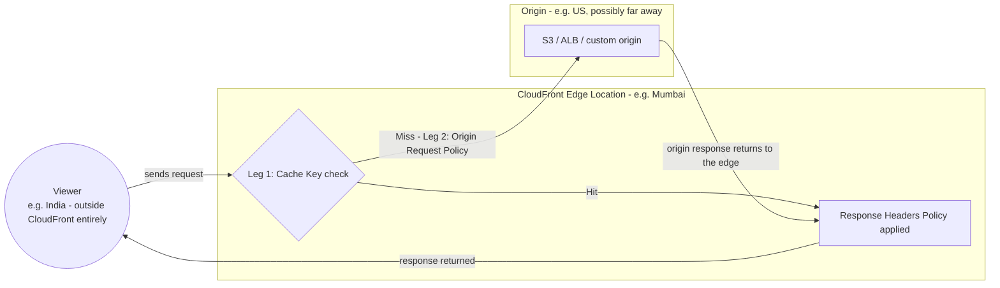

# 10 - AWS CloudFront Default Cache Behavior — Response Header Policy

> Goal: use a **Response Headers Policy** to add, override, or remove HTTP headers on the way back to the viewer — independent of whatever headers the origin itself sends — most commonly for security headers and CORS (`S3-Simple_Storage_Services/29`).

---

## 1. What a Response Headers Policy does

Attached to a cache behavior, a **Response Headers Policy** lets CloudFront modify the **response** headers sent to viewers, regardless of what the origin actually returned — the origin can be completely unaware this is happening. This is useful when you don't control the origin's code directly, or want a single, consistent header policy enforced at the edge across multiple origins/cache behaviors.

> 🧠 **Mental model:** this is the same "modify traffic in flight, transparently to the origin" idea as Note 03's custom request headers, just applied to the **response** side instead of the request side.

---

## 2. Common categories of headers set this way

| Category | Example headers | Purpose |
|---|---|---|
| **Security headers** | `Strict-Transport-Security`, `X-Content-Type-Options`, `X-Frame-Options`, `Content-Security-Policy` | Harden the browser's handling of the response — CloudFront ships a managed **Security headers policy** with sensible defaults for exactly this |
| **CORS headers** | `Access-Control-Allow-Origin`, `Access-Control-Allow-Methods` | Serve the same role as an S3 bucket's own CORS configuration (`S3-Simple_Storage_Services/29`), but enforced at the CloudFront edge instead of (or in addition to) the origin |
| **Custom headers** | Any application-specific header | E.g. a header identifying which cache behavior/distribution served the response, useful for debugging |

---

## 3. Architecture & workflow — where this actually fits in the request lifecycle

Note 09 Section 2 introduced the **two-leg model**: Leg 1 (Viewer → Edge, the Cache Key check, decides Hit/Miss) and Leg 2 (Edge → Origin, only on a Miss, the Origin Request Policy). Both of those legs are about producing a **response body**. A Response Headers Policy is a separate, later stage — it runs **after** the body is already decided, on the way out to the viewer, regardless of which path produced that body:



Three separate physical locations, three separate roles:

- **Viewer** — outside CloudFront entirely, wherever the user actually is (India, in Note 09's running example).
- **CloudFront Edge Location** — the nearby CloudFront point of presence (Mumbai). **Both** Leg 1's Cache Key check *and* the Response Headers Policy step happen here, right next to the viewer — which is exactly why a policy edit is fast to take effect: nothing has to travel back to a distant origin for it.
- **Origin** — potentially on the other side of the world (US). Only reached on a Miss, via Leg 2's Origin Request Policy — and even then, the response still routes back through the *same* edge location for the Response Headers Policy step before reaching the viewer, it doesn't go straight from origin to viewer.

The important consequence: **the Response Headers Policy step runs on every single response, Hit or Miss alike, entirely at the edge** — it isn't part of what gets cached, it's applied fresh each time a response actually leaves that edge location. That has a very practical effect: editing a Response Headers Policy's header value takes effect on the **very next request**, no invalidation (Note 18) required, and no round trip to the origin either — unlike a change to the cached body itself, which only updates on a Miss or an explicit invalidation. [Note 10.01](10.01-Response-Header-Policy_Demo.md) Section 7 verifies this directly: a cached object still reports `X-Cache: Hit` after a policy edit, while its headers have already changed.

> ⚠️ Don't over-generalize that instant-update behavior to headers the **origin itself** sets. Those travel *with* the cached body — if S3 (or any origin) already sent a CORS or other header as part of a response CloudFront then cached, that header is frozen into that cached object until it expires or is invalidated, same as the body. Only headers added/overridden by CloudFront's *own* Response Headers Policy get the fresh-every-time treatment above. Section 5 below covers exactly this ambiguity for CORS specifically.

---

## 4. Real-world walkthrough: applying this to the Note 09 streaming example

Picking the same India-based Netflix-style session from Note 09 Section 3 back up, a Response Headers Policy would typically show up at two of its four stages:

| Stage | Where a Response Headers Policy applies | Example headers |
|---|---|---|
| 1. Open web app | The static UI files (`index.html`, `main.js`, `styles.css`) | `Content-Security-Policy` (restricts which domains scripts/frames may load from — hardens against XSS), `X-Frame-Options: DENY` (stops the login page being embedded in a clickjacking iframe), `Strict-Transport-Security` (forces HTTPS on every future request to this domain) |
| 3. Search "Inception" in Hindi | The `/api/search` responses, if the web app calls it from a separate subdomain (e.g. `www.netflix.com` calling `api.netflix.com`) | `Access-Control-Allow-Origin` scoped specifically to `www.netflix.com` — **not** `*`, since this is an authenticated, personalized response, and the CORS spec itself disallows combining wildcard origins with credentials (the same constraint [Note 10.01](10.01-Response-Header-Policy_Demo.md) Section 6 hits when configuring `Access-Control-Allow-Credentials`) |
| 2. Login, 4. Watch | Not typically relevant | Video segments are usually loaded directly by a `<video>` element, not `fetch`/`XHR`, so CORS headers rarely apply there; login responses care more about `Set-Cookie`/cache-control than response-header hardening |

---

## 5. CORS at CloudFront vs. CORS at S3 — which one actually matters

If a distribution sits in front of an S3 bucket that already has its own CORS configuration (`S3-Simple_Storage_Services/29`), you now have **two possible places** CORS headers could come from: the origin (S3) or the CloudFront Response Headers Policy. Whichever one actually reaches the browser is what the browser evaluates — if CloudFront's policy is configured to **override** existing headers rather than just adding when absent, it takes precedence over whatever S3 itself sent.

> ⚠️ A CORS header set at the S3 origin only actually reaches the browser if CloudFront **forwards** it unmodified — and only takes effect for requests CloudFront doesn't already have cached with a *different* (or missing) CORS header from an earlier response. This is a real, sometimes-confusing interaction between Notes 09-10's caching rules and CORS, and a common source of "CORS works sometimes but not always" bug reports in production CloudFront setups. It's the origin-header side of the caveat in Section 3 above — the CloudFront-policy side doesn't have this problem, since it re-applies on every response regardless of cache state.

---

## 6. Configure a managed Security Headers policy

1. **CloudFront console** → distribution → cache behavior → **Response headers policy** → **Create response headers policy** (or select the managed **`Managed-SecurityHeadersPolicy`**).
2. Review/adjust the security header values (e.g. `Strict-Transport-Security: max-age=63072000; includeSubdomains; preload`).
3. Attach it to the cache behavior → **Save changes**.
4. Verify:
   ```bash
   curl -I https://d1234abcdefgh.cloudfront.net/
   ```
   Confirm the security headers now appear in the response, even if the origin never set them.

For a full hands-on walkthrough — including a custom policy, CORS, and directly testing Section 3's Hit-but-headers-changed behavior — see [Note 10.01](10.01-Response-Header-Policy_Demo.md).

---

## 7. Recap

- A **Response Headers Policy** adds/overrides/removes response headers at the CloudFront edge, independent of the origin's own behavior — most commonly used for **security headers** and **CORS**.
- It sits **after** Note 09's two-leg Cache Key/Origin Request Policy model, applying fresh on every response regardless of whether that response was a cache Hit or Miss — a genuinely different timeline from the cached body itself (Section 3).
- When both S3 and CloudFront could set CORS/security headers, whichever policy actually reaches the browser (accounting for caching) is what governs — a real source of subtle bugs worth testing explicitly (Section 5).
- Next: Note 11 — AWS CloudFront Function Associations, the most powerful cache-behavior customization: running actual code at specific points in the request/response lifecycle.

### Sources
- [Adding or removing HTTP headers in CloudFront responses — AWS docs](https://docs.aws.amazon.com/AmazonCloudFront/latest/DeveloperGuide/adding-response-headers.html)
- [Using the CloudFront managed Security headers policy — AWS docs](https://docs.aws.amazon.com/AmazonCloudFront/latest/DeveloperGuide/using-managed-response-headers-policies.html)
