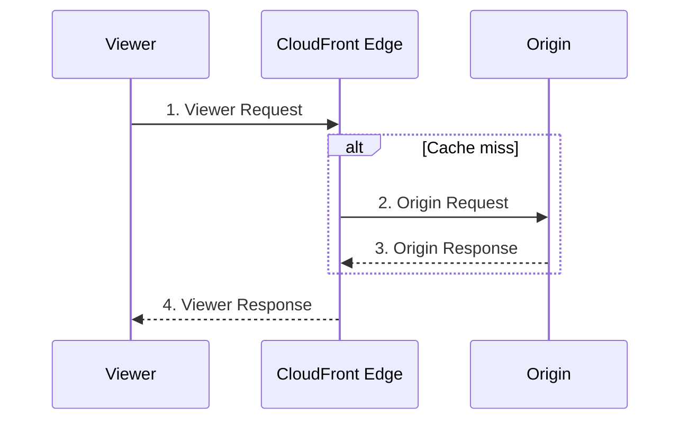

# 11 - AWS CloudFront Function Associations

> Goal: run actual custom code at the edge, at four distinct points in a request's lifecycle, choosing correctly between **CloudFront Functions** (lightweight, viewer-side) and **Lambda@Edge** (heavier, full compute) based on what the logic actually needs.

---

## 1. The four lifecycle points



| Trigger | Runs when | Typical use |
|---|---|---|
| **Viewer Request** | Every request, before checking the cache | URL rewrites/redirects, header inspection/normalization, simple auth checks |
| **Origin Request** | Only on a cache miss, before forwarding to the origin | Adding/modifying headers sent to the origin, origin selection logic |
| **Origin Response** | Only on a cache miss, after the origin responds, before caching | Modifying/enriching the response before it's cached (e.g. adding a header based on origin status) |
| **Viewer Response** | Every request, right before returning to the viewer | Adding response headers, final response tweaks (overlaps with Note 10's Response Headers Policy, but as arbitrary code instead of a fixed rule set) |

---

## 2. CloudFront Functions vs. Lambda@Edge — choosing correctly

| | CloudFront Functions | Lambda@Edge |
|---|---|---|
| **Language** | JavaScript only | Node.js or Python |
| **Available triggers** | **Viewer Request / Viewer Response only** | All four triggers, including Origin Request/Response |
| **Execution location** | 400+ edge locations (every CloudFront edge) | 13 regional edge caches (fewer, more centralized locations) |
| **Execution speed** | Sub-millisecond | Higher latency — runs in a full Lambda environment |
| **Max execution time** | Effectively instantaneous, tightly bounded | Up to 30 seconds |
| **Memory** | 2 MB | 128 MB – 3 GB |
| **Function size** | Max 10 KB | Up to 1 MB (viewer triggers), 50 MB (origin triggers) |
| **Network/file system access, request body access** | ❌ No | ✅ Yes |
| **Scale** | 10,000,000+ requests/second | Up to 10,000 requests/second per Region |
| **Cost (high volume)** | Roughly 6x cheaper per invocation | More expensive, but justified when its extra capability is genuinely needed |

> 🧠 **Mental model:** CloudFront Functions are for **simple, fast, viewer-facing logic with no external dependencies** — URL rewrites, header manipulation, basic validation. Lambda@Edge is for anything needing **real compute, network calls, or origin-side (not just viewer-side) logic** — user authentication against an external service, personalization pulling from a database, or image/content transformation.

---

## 3. AWS's own decision guidance

- If logic can be done with **either** CloudFront Functions or Lambda@Edge **on viewer events**, use **CloudFront Functions** — faster and cheaper, with no capability trade-off for that simple case.
- If logic could run as **CloudFront Functions on viewer events** vs. **Lambda@Edge on origin events**, prefer CloudFront Functions **unless** cache hit ratio is very high (in which case relatively few requests actually reach the origin-event stage anyway, so Lambda@Edge's cost/latency there matters less in aggregate).
- Anything needing **network calls, the request body, or file system access** must use **Lambda@Edge** — CloudFront Functions cannot do any of these at all.

> 🎯 **Exam tip:** "lightweight URL rewrite/redirect or header manipulation at massive scale, minimal latency" → **CloudFront Functions**. "User authentication against an external identity provider, or a computation needing more than a few KB of code / network access" → **Lambda@Edge**. This is one of the most directly-testable "pick the right tool" pairs in the whole CloudFront domain.

---

## 4. Associate a CloudFront Function

1. **CloudFront console** → **Functions** → **Create function** → write JavaScript (e.g. a simple URL rewrite):
   ```javascript
   function handler(event) {
     var request = event.request;
     if (request.uri.endsWith('/')) {
       request.uri += 'index.html';
     }
     return request;
   }
   ```
2. **Publish** the function.
3. Distribution → cache behavior → **Function associations** → **Viewer request** → select the published function → **Save changes**.

---

## 5. Recap

- Four lifecycle triggers exist: **Viewer Request**, **Origin Request**, **Origin Response**, **Viewer Response** — CloudFront Functions only support the two **viewer**-side triggers; Lambda@Edge supports all four.
- **CloudFront Functions**: JavaScript, sub-millisecond, 400+ locations, no network/file access, cheapest — for simple, high-volume viewer-side logic.
- **Lambda@Edge**: Node.js/Python, up to 30s execution, 13 regional locations, full compute capability — for anything needing real logic, network calls, or origin-side triggers.
- Next: Note 12 — AWS CloudFront Setting Options: Supported HTTP Versions & Default Root Object, covering distribution-wide (not cache-behavior-specific) settings.

### Sources
- [Differences between CloudFront Functions and Lambda@Edge — AWS docs](https://docs.aws.amazon.com/AmazonCloudFront/latest/DeveloperGuide/edge-functions-choosing.html)
- [CloudFront Functions — AWS docs](https://docs.aws.amazon.com/AmazonCloudFront/latest/DeveloperGuide/cloudfront-functions.html)
- [Lambda@Edge — AWS docs](https://docs.aws.amazon.com/AmazonCloudFront/latest/DeveloperGuide/lambda-at-the-edge.html)
