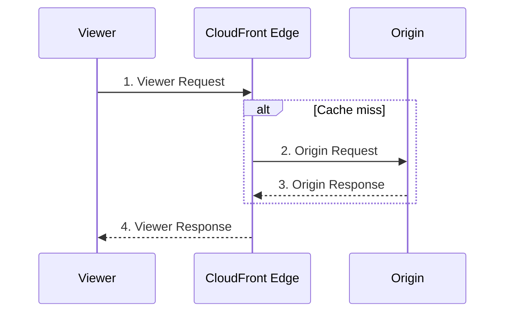
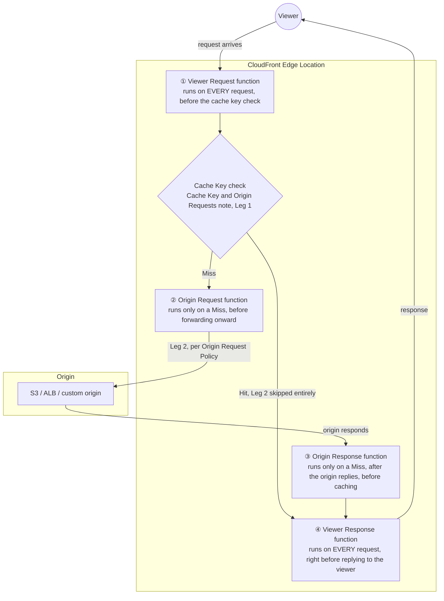

# 11 - AWS CloudFront Function Associations

> Goal: run actual custom code at the edge, at four distinct points in a request's lifecycle, choosing correctly between **CloudFront Functions** (lightweight, viewer-side) and **Lambda@Edge** (heavier, full compute) based on what the logic actually needs.

---

## 1. The four lifecycle points


```mermaid
sequenceDiagram
    participant V as Viewer
    participant CF as CloudFront Edge
    participant O as Origin
    V->>CF: 1. Viewer Request
    alt Cache miss
        CF->>O: 2. Origin Request
        O-->>CF: 3. Origin Response
    end
    CF-->>V: 4. Viewer Response
```

| Trigger | Runs when | Typical use |
|---|---|---|
| **Viewer Request** | Every request, before checking the cache | URL rewrites/redirects, header inspection/normalization, simple auth checks |
| **Origin Request** | Only on a cache miss, before forwarding to the origin | Adding/modifying headers sent to the origin, origin selection logic |
| **Origin Response** | Only on a cache miss, after the origin responds, before caching | Modifying/enriching the response before it's cached (e.g. adding a header based on origin status) |
| **Viewer Response** | Every request, right before returning to the viewer | Adding response headers, final response tweaks (overlaps with the [Response Headers Policy](10-Default-Cache-Behavior-Response-Header-Policy.md) note's Response Headers Policy, but as arbitrary code instead of a fixed rule set) |

---

## 2. Architecture & workflow — where each trigger actually runs

The [Cache Key and Origin Requests](09-Default-Cache-Behavior-Cache-Key-and-Origin-Requests.md) note's Section 2 established the two-leg model — Leg 1 (Viewer → Edge, the Cache Key check) decides Hit vs. Miss, and Leg 2 (Edge → Origin) only happens on a Miss. The four function triggers slot into that same flow at four precise points, **all physically at the edge location** — even the two "Origin" triggers run as code executing at the CloudFront edge, just timed around the Leg 2 round trip rather than actually running on the origin itself:


```mermaid
flowchart TB
    V(("Viewer"))

    subgraph EDGE["CloudFront Edge Location"]
        VR["① Viewer Request function<br/>runs on EVERY request, before the cache key check"]
        CK{"Cache Key check<br/>Cache Key and Origin Requests note, Leg 1"}
        OR["② Origin Request function<br/>runs only on a Miss, before forwarding onward"]
        ORESP["③ Origin Response function<br/>runs only on a Miss, after the origin replies, before caching"]
        VRESP["④ Viewer Response function<br/>runs on EVERY request, right before replying to the viewer"]
    end

    subgraph ORIGIN["Origin"]
        O["S3 / ALB / custom origin"]
    end

    V -->|"request arrives"| VR
    VR --> CK
    CK -->|"Hit, Leg 2 skipped entirely"| VRESP
    CK -->|"Miss"| OR
    OR -->|"Leg 2, per Origin Request Policy"| O
    O -->|"origin responds"| ORESP
    ORESP --> VRESP
    VRESP -->|"response"| V
```

- **① Viewer Request** and **④ Viewer Response** run on **every** request, Hit or Miss alike — same "runs at the edge, every time, regardless of cache outcome" timing as the [Response Headers Policy](10-Default-Cache-Behavior-Response-Header-Policy.md) note's Response Headers Policy step (in fact, ④ can do anything that policy does, plus arbitrary logic).
- **② Origin Request** and **③ Origin Response** only exist on a **Miss** — on a Hit, they're skipped entirely, exactly as Leg 2 itself is skipped. A function attached to either of these triggers simply never runs for a request the edge already had cached.
- This is exactly why **CloudFront Functions only support ① and ④**: both run purely at the edge with data already in hand (the request, or the response about to go out) — no dependency on the Miss-only Leg 2 round trip at all. **Lambda@Edge supports all four**, including the two Miss-only triggers, because it's built for heavier logic that can afford to run less often and take longer.

---

## 3. CloudFront Functions vs. Lambda@Edge — choosing correctly

| | CloudFront Functions | Lambda@Edge |
|---|---|---|
| **Language** | JavaScript only | Node.js or Python |
| **Available triggers** | **Viewer Request / Viewer Response only** | All four triggers, including Origin Request/Response |
| **Execution location** | 400+ edge locations (every CloudFront edge) | 13 regional edge caches (fewer, more centralized locations) |
| **Execution speed** | Sub-millisecond | Higher latency — runs in a full Lambda environment |
| **Max execution time** | Effectively instantaneous, tightly bounded | Up to 30 seconds |
| **Memory** | 2 MB | 128 MB – 3 GB |
| **Function size** | Max 10 KB | Up to 1 MB (viewer triggers), 50 MB (origin triggers) |
| **Network/file system access, request body access** | ❌ No | ✅ Yes |
| **Scale** | 10,000,000+ requests/second | Up to 10,000 requests/second per Region |
| **Cost (high volume)** | Roughly 6x cheaper per invocation | More expensive, but justified when its extra capability is genuinely needed |

> 🧠 **Mental model:** CloudFront Functions are for **simple, fast, viewer-facing logic with no external dependencies** — URL rewrites, header manipulation, basic validation. Lambda@Edge is for anything needing **real compute, network calls, or origin-side (not just viewer-side) logic** — user authentication against an external service, personalization pulling from a database, or image/content transformation.

---

## 4. Real-world walkthrough: applying triggers to the Cache Key and Origin Requests Netflix-style session

Picking the same India-based Netflix-style session from the [Cache Key and Origin Requests](09-Default-Cache-Behavior-Cache-Key-and-Origin-Requests.md) note's Section 3 back up — open app, login, search, watch — here's which trigger point (if any) would realistically carry custom code at each stage, and which tool fits:

| Stage | Trigger point | Example logic | CloudFront Functions or Lambda@Edge? |
|---|---|---|---|
| 1. Open web app (`index.html`, `main.js`) | Viewer Request | Rewrite a bare `/` to `/index.html`, or redirect an old bookmarked path to a new one | **CloudFront Functions** — no external dependency, needs to run at massive scale on every single page load |
| 2. Login (`POST /api/login`) | Viewer Request | Reject an obviously malformed request (missing a required header) before it even reaches the origin, saving origin load | **CloudFront Functions** — the check itself needs nothing external; real credential verification still happens at the origin, not at the edge |
| 3. Search "Inception" in Hindi | Origin Request | Call an external personalization service and attach an `X-User-Segment` header before forwarding to the origin, so the origin can tailor ranking | **Lambda@Edge only** — CloudFront Functions cannot make network calls at all, and this trigger isn't even available to them |
| 3. Search (continued) | Origin Response | Re-rank or filter the origin's raw search JSON before it's returned to the viewer | **Lambda@Edge** — needs to parse/transform a response body; Origin Response isn't available to CloudFront Functions regardless |
| 4. Watch (video segment requests) | Viewer Request | Validate a signed token proving this viewer is authorized to watch this specific title, entirely from data already in the request, without asking the origin at all | **CloudFront Functions** — this is one of AWS's own flagship use cases for the service |

> 🎯 **Exam tip:** signed-URL/signed-cookie **token validation at the Viewer Request trigger** is one of the most commonly tested real-world CloudFront Functions examples — it's fast, needs no network call (the token is self-contained and verifiable with data already present), and runs on every single request at massive scale, which is exactly the profile CloudFront Functions is built for. The moment a scenario mentions calling out to another service, checking a database, or touching the request/response body, that's the signal to reach for **Lambda@Edge** instead.

---

## 5. AWS's own decision guidance

- If logic can be done with **either** CloudFront Functions or Lambda@Edge **on viewer events**, use **CloudFront Functions** — faster and cheaper, with no capability trade-off for that simple case.
- If logic could run as **CloudFront Functions on viewer events** vs. **Lambda@Edge on origin events**, prefer CloudFront Functions **unless** cache hit ratio is very high (in which case relatively few requests actually reach the origin-event stage anyway, so Lambda@Edge's cost/latency there matters less in aggregate).
- Anything needing **network calls, the request body, or file system access** must use **Lambda@Edge** — CloudFront Functions cannot do any of these at all.

> 🎯 **Exam tip:** "lightweight URL rewrite/redirect or header manipulation at massive scale, minimal latency" → **CloudFront Functions**. "User authentication against an external identity provider, or a computation needing more than a few KB of code / network access" → **Lambda@Edge**. This is one of the most directly-testable "pick the right tool" pairs in the whole CloudFront domain.

---

## 6. Associate a CloudFront Function

1. **CloudFront console** → **Functions** → **Create function** → write JavaScript (e.g. a simple URL rewrite):
   ```javascript
   function handler(event) {
     var request = event.request;
     if (request.uri.endsWith('/')) {
       request.uri += 'index.html';
     }
     return request;
   }
   ```
2. **Publish** the function.
3. Distribution → cache behavior → **Function associations** → **Viewer request** → select the published function → **Save changes**.

---

## 7. Recap

- Four lifecycle triggers exist: **Viewer Request**, **Origin Request**, **Origin Response**, **Viewer Response** — CloudFront Functions only support the two **viewer**-side triggers; Lambda@Edge supports all four (Section 1).
- All four triggers execute **at the CloudFront edge location**, timed around the [Cache Key and Origin Requests](09-Default-Cache-Behavior-Cache-Key-and-Origin-Requests.md) note's two-leg model — Viewer Request/Response run on every request regardless of Hit or Miss, while Origin Request/Response only run on a Miss, which is exactly why CloudFront Functions (viewer-only, no Miss dependency) can't reach the origin-side triggers at all (Section 2).
- **CloudFront Functions**: JavaScript, sub-millisecond, 400+ locations, no network/file access, cheapest — for simple, high-volume viewer-side logic like URL rewrites or signed-token validation (Section 3, Section 4).
- **Lambda@Edge**: Node.js/Python, up to 30s execution, 13 regional locations, full compute capability — for anything needing real logic, network calls, or origin-side triggers, like calling a personalization service or transforming a response body (Section 3, Section 4).
- Next: the [Supported HTTP Versions and Default Root Object](12-CloudFront-Settings-Supported-HTTP-Versions-and-Default-Root-Object.md) note, covering distribution-wide (not cache-behavior-specific) settings.

### Sources
- [Differences between CloudFront Functions and Lambda@Edge — AWS docs](https://docs.aws.amazon.com/AmazonCloudFront/latest/DeveloperGuide/edge-functions-choosing.html)
- [CloudFront Functions — AWS docs](https://docs.aws.amazon.com/AmazonCloudFront/latest/DeveloperGuide/cloudfront-functions.html)
- [Lambda@Edge — AWS docs](https://docs.aws.amazon.com/AmazonCloudFront/latest/DeveloperGuide/lambda-at-the-edge.html)
