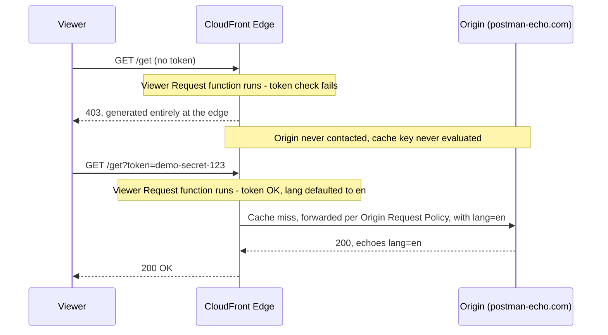

# 11.01 - Hands-On Demo: CloudFront Function Associations in Practice

> Goal: watch a **CloudFront Function** run real JavaScript at the edge — blocking a request entirely without ever contacting the origin, mutating a request before it's cached, and stamping a response header — and see exactly where each of these sits in the [CloudFront Function Associations](11-CloudFront-Function-Associations.md) note's four-trigger architecture. Continuation of the [Cache Key vs Origin Request Policy hands-on demo](09.01-Cache-Behavior_Demo.md) and the [Response Headers Policy hands-on demo](10.01-Response-Header-Policy_Demo.md), reusing the exact same `/get` cache behavior. Entirely via the **AWS Console**, no CLI.

---

## 1. Why this reuses 09.01/10.01's setup

`postman-echo.com/get` still echoes back, in its JSON body, exactly what it received — query string, headers, everything. That's what made the cache-key and response-header demos visible, and it's exactly what's needed here too: if a CloudFront Function **rewrites** the request before it reaches the origin, the echoed JSON will show the *rewritten* version, not what you actually sent — direct, visible proof the function ran, and ran **before** the origin ever saw the request.

> 🧠 **Mental model:** the [Cache Key vs Origin Request Policy hands-on demo](09.01-Cache-Behavior_Demo.md) and the [Response Headers Policy hands-on demo](10.01-Response-Header-Policy_Demo.md) both worked with **fixed, declarative** controls — a policy is a set of dropdowns and checkboxes. A **CloudFront Function** is different in kind: it's arbitrary JavaScript, so it can do things no policy can — like generating an entire response and returning it straight from the edge, without the origin ever being involved at all. That's Section 4 below.

---

## 2. Prerequisite

The `/get` cache behavior + `PostmanEchoOrigin` from the [Cache Key vs Origin Request Policy hands-on demo](09.01-Cache-Behavior_Demo.md), still in place on your distribution. Whether the [Response Headers Policy hands-on demo](10.01-Response-Header-Policy_Demo.md)'s custom Response Headers Policy is still attached or not doesn't matter for this demo — Section 6 below works either way and calls out the difference.

---

## 3. What we're building — mapped to the four triggers

The [CloudFront Function Associations](11-CloudFront-Function-Associations.md) note's Section 2 diagram showed **Viewer Request** running before the Cache Key check, and **Viewer Response** running right before the reply leaves the edge, on every request regardless of Hit or Miss. This demo puts one CloudFront Function on each of those two triggers on the `/get` behavior (CloudFront Functions can't attach to Origin Request/Response at all, per that note's Section 2 — only Lambda@Edge can):

| Function | Trigger | What it does | Proves |
|---|---|---|---|
| `EdgeGate-AddDefaults` | **Viewer Request** | Rejects requests missing a token — **entirely at the edge** — and fills in a missing `lang` query param for requests that pass | A Viewer Request function can short-circuit a request before the cache key is even evaluated, or mutate it before caching/origin ever see it |
| `StampEdgeHeader` | **Viewer Response** | Adds a header to every outgoing response | Runs on every response, Hit or Miss — and can coexist with a Response Headers Policy (the [Response Headers Policy](10-Default-Cache-Behavior-Response-Header-Policy.md) note), since they're independent mechanisms |

> ⚠️ **One function per trigger, per behavior.** The `/get` behavior's **Function associations** section has exactly one slot for **Viewer request** and one for **Viewer response** — you can't stack two CloudFront Functions on the same trigger. If more logic is needed on one trigger, it has to live inside that one function.

---

## 4. Function 1 — Viewer Request: an edge-only token gate

This is the [CloudFront Function Associations](11-CloudFront-Function-Associations.md) note's Section 4 flagship example made real: validating a token **without asking the origin anything at all**.

### Step 1 — Write and create the function
1. **CloudFront console** → **Functions** (left nav) → **Create function**.
2. **Details** → **Name**: `EdgeGate-AddDefaults`. **Description — optional**: leave blank.
3. **Runtime**: leave at the default, **cloudfront-js-2.0** (recommended — supports `async`/`await` and key-value pairs; `cloudfront-js-1.0` is the older, legacy runtime).
4. **Tags — optional**: leave empty.
5. **Create function** — this creates the function and opens its detail page on the **Build** tab's code editor.
6. Replace the default template with:
   ```javascript
   function handler(event) {
       var request = event.request;
       var params = request.querystring;

       // 1. Edge-only gate: reject anything without the right token,
       //    before the cache key is even checked and before the origin
       //    is ever contacted.
       if (!params.token || params.token.value !== "demo-secret-123") {
           return {
               statusCode: 403,
               statusDescription: "Forbidden",
               headers: {
                   "content-type": { value: "text/plain" }
               },
               body: {
                   encoding: "text",
                   data: "Blocked at the edge: missing or invalid token. The origin was never contacted."
               }
           };
       }

       // 2. Default a missing 'lang' query param to 'en' before
       //    this request continues on to the cache key check / origin.
       if (!params.lang) {
           request.querystring.lang = { value: "en" };
       }

       return request;
   }
   ```
5. **Save changes**.


### Step 2 — Publish it
1. **Publish** tab → **Publish function**.

### Step 3 — Associate it to the `/get` behavior's Viewer request trigger
1. Distribution → **Behaviors** tab → select `/get` → **Edit**.
2. Scroll to **Function associations — optional**.
3. **Viewer request** row → **Function type**: **CloudFront Functions**. **Function ARN/name**: select `EdgeGate-AddDefaults`.
4. **Save changes** → wait for **Deployed**.


### Step 4 — Test the gate: blocked request
```bash
CF_URL="https://<your-distribution>.cloudfront.net"

curl -s -D - "$CF_URL/get" -o -
```
```bash
HTTP/2 403 
server: CloudFront
date: Sat, 25 Jul 2026 13:24:34 GMT
content-type: text/plain
content-length: 78
x-cache: FunctionGeneratedResponse from cloudfront
via: 1.1 2f8bce85b3232f01dc0a9ceec714d90c.cloudfront.net (CloudFront)
x-amz-cf-pop: BLR50-P4
x-amz-cf-id: sVvMl2yB1D_5ngdifsteQTzrfIXTN888A7AP8YI80eYIpwmkwb7Nug==
x-demo-response: v2
vary: Origin

Blocked at the edge: missing or invalid token. The origin was never contacted.
```

Expected: `HTTP/2 403`, body reading `Blocked at the edge: missing or invalid token. The origin was never contacted.` — check the response headers too: you should **not** see the usual `postman-echo.com`-flavored headers (`cf-ray`, `x-envoy-upstream-service-time`) from earlier demos, because this response never left the edge location at all (exact `x-cache` value may vary by account/edge — confirm what you see, that's the point of testing it live rather than reading it off the page).

### Step 5 — Test the gate: authorized request, default applied
```bash
curl -s "$CF_URL/get?token=demo-secret-123" | python3 -m json.tool | grep -A2 '"args"'
```
Expected: the echoed `args` object shows `"lang": "en"` — a query parameter **you never sent**, injected by the function before the request ever reached `postman-echo.com`.

### Step 6 — Test the gate: authorized request, explicit value preserved
```bash
curl -s "$CF_URL/get?token=demo-secret-123&lang=hi" | python3 -m json.tool | grep -A2 '"args"'
```
```bash
➜ curl -s "$CF_URL/get?token=demo-secret-123" | python3 -m json.tool 
{
    "args": {
        "id": "1"
    },
    "headers": {
        "host": "postman-echo.com",
        "x-forwarded-proto": "https",
        "cloudfront-viewer-country-region": "KA",
        "cloudfront-viewer-country-region-name": "Karnataka",
        "cloudfront-viewer-time-zone": "Asia/Kolkata",
        "cloudfront-viewer-postal-code": "562130",
        "accept-encoding": "gzip, br",
        "cloudfront-viewer-city": "Bengaluru",
        "x-amz-cf-id": "HOuJa04vTZxF6R58A97JMUIwi9NYb4B-Xg0Kj-31eO21pjVidT6d6g==",
        "cloudfront-is-mobile-viewer": "false",
        "cloudfront-is-tablet-viewer": "false",
        "cloudfront-is-smarttv-viewer": "false",
        "cloudfront-is-desktop-viewer": "true",
        "cloudfront-is-ios-viewer": "false",
        "cloudfront-is-android-viewer": "false",
        "accept": "*/*",
        "cloudfront-forwarded-proto": "https",
        "user-agent": "curl/8.18.0",
        "via": "2.0 19cb490cec696fbdcfd00c6719a65536.cloudfront.net (CloudFront)",
        "cloudfront-viewer-address": "2401:4900:894c:c70e:31d8:7045:b10e:67a5:55578",
        "cloudfront-viewer-longitude": "77.59100",
        "cloudfront-viewer-tls": "TLSv1.3:TLS_AES_128_GCM_SHA256:fullHandshake",
        "cloudfront-viewer-latitude": "12.97530",
        "cloudfront-viewer-asn": "24560",
        "x-demo-user": "alice",
        "cloudfront-viewer-http-version": "2.0",
        "cloudfront-viewer-country": "IN",
        "cloudfront-viewer-country-name": "India"
    },
    "url": "https://postman-echo.com/get?id=1"
}
```

Expected: `"lang": "hi"` — the function only fills in a default when the field is **absent**, it doesn't override one you actually provided.

| Request | Result | Why |
|---|---|---|
| `/get` (no token) | `403`, custom body, origin never contacted | Viewer Request function returned a response directly |
| `/get?token=demo-secret-123` (no `lang`) | `200`, origin echoes `lang: en` | Function passed the token check, then defaulted the missing field |
| `/get?token=demo-secret-123&lang=hi` | `200`, origin echoes `lang: hi` | Function left an already-present field untouched |

> 🧠 Because the Viewer Request trigger runs **before** the Cache Key check (the [CloudFront Function Associations](11-CloudFront-Function-Associations.md) note's Section 2 diagram), the *rewritten* request — with `lang=en` already added — is what the cache key sees, not your original request. If you wanted that default to also affect what counts as "the same" cached entry, you'd add `lang` to the [Cache Key vs Origin Request Policy hands-on demo](09.01-Cache-Behavior_Demo.md)'s `Demo-CacheKey-Custom` cache policy the same way `id` was added there — the function and the cache policy operate on the request in that order, function first.

---

## 5. Why this matters beyond the demo

Real systems use exactly this pattern — signed-URL/token validation entirely at the edge — to reject obviously-invalid requests (expired links, hotlinking, missing auth) **before** they cost an origin round trip, at up to 10,000,000+ requests/second (the [CloudFront Function Associations](11-CloudFront-Function-Associations.md) note's Section 3 comparison table). The origin never even sees the rejected traffic, which is both cheaper and reduces the origin's exposed attack surface.



---

## 6. Function 2 — Viewer Response: stamp a header alongside the Response Headers Policy

### Step 1 — Write and create the function
1. **Functions** → **Create function**.
2. **Details** → **Name**: `StampEdgeHeader`. **Description — optional**: leave blank.
3. **Runtime**: leave at the default, **cloudfront-js-2.0**.
4. **Tags — optional**: leave empty.
5. **Create function** → opens the **Build** tab:
   ```javascript
   function handler(event) {
       var response = event.response;
       response.headers['x-edge-function'] = { value: 'v1' };
       return response;
   }
   ```
4. **Save changes**.

### Step 2 — Publish and associate
1. **Publish** tab → **Publish function**.
2. Distribution → **Behaviors** → `/get` → **Edit** → **Function associations**.
3. **Viewer response** row → **Function type**: **CloudFront Functions**. **Function ARN/name**: `StampEdgeHeader`.
4. **Save changes** → wait for **Deployed**.

### Step 3 — Test
```bash
curl -s -D - "$CF_URL/get?token=demo-secret-123" -o /dev/null | grep -iE "x-edge-function:|x-demo-response:|strict-transport-security:"
```
- `x-edge-function: v1` should now be present on **every** response from this behavior, Hit or Miss — same "runs fresh on every response" timing the [Response Headers Policy](10-Default-Cache-Behavior-Response-Header-Policy.md) note's Section 3 described for Response Headers Policies.
- If the [Response Headers Policy hands-on demo](10.01-Response-Header-Policy_Demo.md)'s `Demo-ResponseHeaders-Custom` policy (or `Managed-SecurityHeadersPolicy`) is still attached to this behavior, you'll see **both** `x-edge-function` **and** the policy's headers (e.g. `x-demo-response` or `strict-transport-security`) on the same response — proof a Response Headers Policy and a Viewer Response function are two independent mechanisms that stack, unlike two Response Headers Policies (which replace each other, per the [Response Headers Policy hands-on demo](10.01-Response-Header-Policy_Demo.md)'s Section 5) or two functions on the same trigger (Section 3's warning above).
- If you already ran the [Response Headers Policy hands-on demo](10.01-Response-Header-Policy_Demo.md)'s own cleanup (Response headers policy set back to unselected), you'll just see `x-edge-function: v1` on its own — that's expected too.

---

## 7. Troubleshooting

| Symptom | Likely cause |
|---|---|
| `403` with the custom body even when you *did* send a token | Typo in the query param name/value — the function checks the literal string `demo-secret-123`; also confirm you used `?token=`, not a header |
| Function association dropdown doesn't list your function | It wasn't **published** (Section 4 Step 2 / Section 6 Step 2) — a saved-but-unpublished function isn't selectable for association |
| Changes to the function's code don't seem to take effect | Editing a function's code alone doesn't redeploy it to associated behaviors — **Publish** the new version again after editing |
| `x-edge-function` header missing | Distribution still **Deploying**, not **Deployed** — wait and retest; also confirm the **Viewer response** row (not Viewer request) has this function attached |
| Can't attach a second function to **Viewer request** | Only one function per trigger per behavior — combine logic into the existing function instead (Section 3) |
| `lang` default not appearing in the echoed JSON | You're testing against `/get` without a valid `token` — the function returns its 403 before the default-filling code ever runs (Section 4's code order) |

---

## 8. Cleanup

1. **Behaviors** tab → select `/get` → **Edit** → **Function associations** → set both **Viewer request** and **Viewer response** rows back to **No association** → **Save changes**.
2. **Functions** → select `EdgeGate-AddDefaults` → **Delete** (only possible once no behavior references it). Repeat for `StampEdgeHeader`.
3. Leave the `/get` behavior, `PostmanEchoOrigin`, and the rest of the distribution/S3 bucket in place if continuing to other hands-on notes — only tear those down per the [CloudFront Hands-On Lab 1 (S3 static site + CDN)](02-CloudFront-HandsOn-Lab1.md) note's own cleanup section when done with the whole series.

---

## 9. Recap

- A **Viewer Request** CloudFront Function runs before the cache key is even checked — it can reject a request outright and **generate a full response at the edge**, with the origin never contacted at all (Section 4), or mutate the request (e.g. defaulting a missing query param) before caching/origin logic ever sees it.
- Only **one** function attaches per trigger per behavior — unlike a Response Headers Policy stacking with a Viewer Response function (independent mechanisms), two functions can't stack on the same trigger (Section 3, Section 6).
- A **Viewer Response** CloudFront Function runs on every response, Hit or Miss, and coexists with a Response Headers Policy rather than replacing it — Section 6 showed both sets of headers on the same response.
- This is the mechanical proof behind the [CloudFront Function Associations](11-CloudFront-Function-Associations.md) note's Section 2 architecture diagram and Section 4 real-world walkthrough — same four trigger points, now directly observable instead of just described.

### Sources
- [CloudFront Functions — AWS docs](https://docs.aws.amazon.com/AmazonCloudFront/latest/DeveloperGuide/cloudfront-functions.html)
- [Generating HTTP responses in request event type functions — AWS docs](https://docs.aws.amazon.com/AmazonCloudFront/latest/DeveloperGuide/functions-event-structure.html)
- [Testing and debugging CloudFront Functions — AWS docs](https://docs.aws.amazon.com/AmazonCloudFront/latest/DeveloperGuide/test-debug-functions.html)
- [Postman Echo — request/response testing service](https://learning.postman.com/docs/developer/echo-api/)
