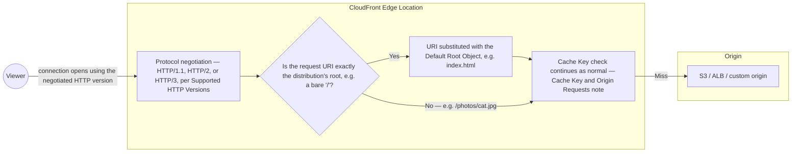

# 12 - AWS CloudFront Setting Options: Supported HTTP Versions & Default Root Object

> Goal: cover two **distribution-wide** settings (as opposed to the [Default Cache Behavior Options](04-Default-Cache-Behavior-Options.md), [CloudFront Custom HTTPS](05-CloudFront-Custom-HTTPS.md), [CloudFront Origin Access](06-CloudFront-Origin-Access.md), [CloudFront Allowed HTTP Methods](07-CloudFront-Allowed-HTTP-Methods.md), [Restrict Viewer Access](08-Default-Cache-Behavior-Restrict-Viewer-Access.md), [Cache Key and Origin Requests](09-Default-Cache-Behavior-Cache-Key-and-Origin-Requests.md), [Response Headers Policy](10-Default-Cache-Behavior-Response-Header-Policy.md), and [CloudFront Function Associations](11-CloudFront-Function-Associations.md) notes' cache-behavior-specific ones) — which HTTP protocol versions viewers can use, and what CloudFront serves for a bare root/subdirectory request.

---

## 1. Supported HTTP versions

A distribution can be configured to accept viewer connections over:

| Version | Notes |
|---|---|
| **HTTP/1.1** | The baseline, universally supported |
| **HTTP/2** | Multiplexes many requests over a single connection — reduces latency for pages loading many small assets (common for typical websites), widely supported by modern browsers |
| **HTTP/3 (QUIC)** | Built on UDP instead of TCP — faster connection establishment and better performance on lossy/high-latency networks (e.g. mobile), the newest option |

Enabling the newer versions is generally a **free performance improvement** with no downside for compatible clients — older/incompatible clients simply negotiate down to a version they support, so there's little reason not to enable HTTP/2 and HTTP/3 unless a specific legacy client requirement says otherwise.

> 🧠 **Mental model:** this setting only affects the **viewer-to-CloudFront** leg (same scope as the [CloudFront Custom HTTPS](05-CloudFront-Custom-HTTPS.md) note's viewer protocol policy) — it has no bearing on what protocol CloudFront uses when talking to the **origin**, which is governed independently by the origin protocol policy.

---

## 2. Architecture & workflow — where these two settings actually apply

Both settings act **at the edge, before the cache key is even evaluated** — they're part of how the edge location receives and interprets the incoming request, upstream of the [Cache Key and Origin Requests](09-Default-Cache-Behavior-Cache-Key-and-Origin-Requests.md) note's Leg 1 check entirely:



- **Supported HTTP Versions** governs how the **connection itself** is established, before CloudFront even looks at what's being requested.
- **Default Root Object** is a **one-time URI substitution**, applied only when the request path is exactly the root — every other path (including subdirectories) flows through unchanged, which is exactly why it doesn't automatically apply to `/photos/`.
- Both then feed into the same [Cache Key and Origin Requests](09-Default-Cache-Behavior-Cache-Key-and-Origin-Requests.md) note's cache-key/origin-request logic downstream — neither setting bypasses or replaces that logic, they just shape what reaches it.

---

## 3. Default Root Object

**Default Root Object** tells CloudFront what to serve when a viewer requests the **distribution's root URL** with no specific file path (e.g. `https://d1234abcdefgh.cloudfront.net/` with nothing after the trailing slash) — typically set to `index.html`.

> ⚠️ **Default Root Object only applies to the distribution's actual root** — it does **not** automatically apply to every subdirectory (e.g. a request for `/photos/` doesn't automatically get `/photos/index.html` from this setting alone). Getting subdirectory-level default-document behavior requires either an **S3 website endpoint origin** (which has its own index-document logic, `S3-Simple_Storage_Services/26`) or a **CloudFront Function** (the [CloudFront Function Associations](11-CloudFront-Function-Associations.md) note) rewriting the URI, as shown in that note's own example.

---

## 4. Real-world walkthrough: applying this to the Cache Key and Origin Requests Netflix-style session

Picking the same India-based Netflix-style session from the [Cache Key and Origin Requests](09-Default-Cache-Behavior-Cache-Key-and-Origin-Requests.md) note's Section 3 back up:

| Stage | Setting that applies | Why it matters here |
|---|---|---|
| 1. Open web app — user types just `https://netflix.example/` into the address bar, no path | **Default Root Object** | Without it, that bare root request has nothing to resolve to and would fail — the setting is what silently turns it into a request for `index.html` |
| 1. Open web app — same page, but over a congested Indian mobile network | **HTTP/3 (QUIC)** | QUIC's faster connection setup and better tolerance of packet loss directly reduces the time-to-first-byte on exactly the kind of lossy, high-latency mobile connection this note's Section 1 describes — a real, measurable win on top of whatever the [Cache Key and Origin Requests](09-Default-Cache-Behavior-Cache-Key-and-Origin-Requests.md) note's Mumbai-edge caching already saves |
| 4. Watch — requesting a specific video segment path like `/videos/inception/hi/1080p/seg0042.ts` | Neither setting is relevant | The path is already fully specified — there's no root-object substitution to do, and HTTP version only affects connection setup, not which segment gets served |

> 🎯 **Exam tip:** "the root URL of a distribution returns an error, but a direct path like `/index.html` works fine" always points to a **missing Default Root Object**, never to HTTP version settings — keep those two firmly separate, they solve unrelated problems that happen to both live on the same **General** settings tab.

---

## 5. Configure both

1. **CloudFront console** → distribution → **General** tab → **Edit**.
2. **Supported HTTP versions**: check **HTTP/2** and **HTTP/3** in addition to the default HTTP/1.1.
3. **Default root object**: `index.html`.
4. **Save changes**.

---

## 6. Verify

```bash
curl -I --http2 https://d1234abcdefgh.cloudfront.net/
curl https://d1234abcdefgh.cloudfront.net/       # should return index.html's content, not a 403/404
```

---

## 7. Recap

- **Supported HTTP versions** governs the viewer-to-CloudFront protocol only — enabling HTTP/2 and HTTP/3 alongside HTTP/1.1 is a low-risk, generally-beneficial default (Section 1).
- Both settings act **at the edge, before the cache key is evaluated** — protocol negotiation shapes how the connection opens, and Default Root Object is a one-time URI substitution for the bare root only, before either feeds into the normal Cache Key and Origin Request flow (Section 2).
- **Default Root Object** serves a specified file (e.g. `index.html`) for the distribution's bare root — but does **not** extend that behavior to subdirectories automatically; that needs an S3 website-endpoint origin or a CloudFront Function URI rewrite instead (Section 3).
- Next: the [CloudFront Settings Options Part 2](13-CloudFront-Settings-Options-Part2.md) note, covering the remaining distribution-wide settings (price class, logging, WAF association).

### Sources
- [Values that you specify when you create or update a distribution — AWS docs](https://docs.aws.amazon.com/AmazonCloudFront/latest/DeveloperGuide/distribution-web-values-specify.html)
- [Specifying a default root object — AWS docs](https://docs.aws.amazon.com/AmazonCloudFront/latest/DeveloperGuide/DefaultRootObject.html)
