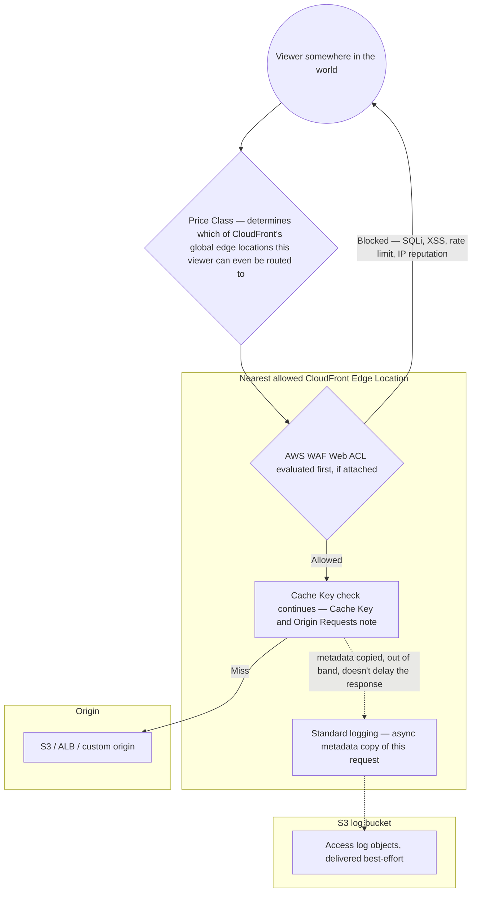

# 13 - AWS CloudFront Setting Options, Part 2

> Goal: cover the remaining distribution-wide settings that don't fit into a specific cache behavior — **Price Class**, **WAF association**, **standard logging**, and **IPv6** — closing out the general-settings tour started in the [Supported HTTP Versions and Default Root Object](12-CloudFront-Settings-Supported-HTTP-Versions-and-Default-Root-Object.md) note.

---

## 1. Price Class — trading global edge coverage for cost

CloudFront's edge network spans **every region of the world**, but you can restrict **which edge locations are actually used** to serve your content, trading some geographic coverage for a lower cost:

| Price Class | Edge locations used |
|---|---|
| **Use all edge locations (best performance)** | Every edge location worldwide — highest cost, best performance for globally-distributed users |
| **Use North America and Europe** | A restricted subset — cheaper, but users outside these regions get routed to a farther-away edge location (still functional, just less optimal latency) |
| **Use North America, Europe, Asia, Middle East, and Africa** | A broader (but still not "all") subset |

> 🎯 **Exam tip:** "our users are concentrated in North America and Europe, and we want to reduce CloudFront cost without impacting performance for our actual audience" is the textbook **Price Class** scenario — it's purely a cost/coverage trade-off, never a caching or security setting.

---

## 2. Architecture & workflow — three settings, three different points in the pipeline

These four settings don't all act at the same stage. Price Class acts **before a request even exists** (it shapes routing/DNS), WAF acts **at the edge, ahead of caching**, and Standard Logging happens **alongside**, not in the critical path at all:

- **Price Class** operates one level above everything else — it's not a per-request decision at all, it's a standing configuration that determines the **set of edge locations CloudFront's global network is even allowed to route this distribution's traffic through**.
- **AWS WAF** sits at the very front of the per-request pipeline, ahead of the [Cache Key and Origin Requests](09-Default-Cache-Behavior-Cache-Key-and-Origin-Requests.md) note's Leg 1 check — a blocked request never reaches the cache key logic at all, same "gate before everything else" position IAM/security controls tend to occupy.
- **Standard logging** is the only one of the four that's genuinely **out of band** — it doesn't sit on the request/response path at all, it's a side-effect copy delivered to S3 asynchronously, which is exactly why it's "best-effort" rather than a hard guarantee.

---

## 3. AWS WAF association

A distribution can have an **AWS WAF Web ACL** attached, filtering malicious requests (SQL injection, XSS, rate-based rules, IP reputation lists) **before** they ever reach the cache-behavior logic or origin — configured via **AWS WAF console** → **Web ACLs** → associate with the specific CloudFront distribution. This is the standard way to add application-layer (L7) protection to content served through CloudFront, complementing CloudFront's built-in AWS Shield Standard DDoS protection (the [Introduction to CloudFront](01-Introduction-to-CloudFront.md) note) with more granular, rule-based filtering.

---

## 4. Standard logging — access logs delivered to S3

CloudFront can deliver **detailed per-request access logs** to an S3 bucket — conceptually parallel to `S3-Simple_Storage_Services/32`'s server access logging, but for CloudFront requests specifically (viewer IP, requested object, response status, edge location that served the request, cache hit/miss, and more).

1. **Distribution** → **General** tab → **Edit** → **Standard logging** → **On** → select a destination S3 bucket and prefix.
2. Logs are delivered on a **best-effort basis** (same caveat as S3 server access logs) — not real-time, and not a hard delivery guarantee.

> 🧠 A common real use case: analyzing these logs (often via Athena) to compute actual **cache hit ratio** across a distribution, informing whether the cache-key tuning from the [Cache Key and Origin Requests](09-Default-Cache-Behavior-Cache-Key-and-Origin-Requests.md) note is working as intended.

---

## 5. IPv6 support

Distributions support IPv6 by default for viewer connections (dual-stack, alongside IPv4) — a simple toggle, with essentially no downside for standard web content, though relevant to disable only if downstream systems (e.g. WAF rules, custom logging pipelines) specifically aren't IPv6-aware yet.

---

## 6. Real-world walkthrough: applying this to the Cache Key and Origin Requests Netflix-style session

Picking the same India-based Netflix-style session from the [Cache Key and Origin Requests](09-Default-Cache-Behavior-Cache-Key-and-Origin-Requests.md) note's Section 3 back up:

| Setting | Where it shows up in the session | Concrete effect |
|---|---|---|
| **AWS WAF** | Stage 2 — login | A burst of `POST /api/login` attempts from the same IP, matching a rate-based WAF rule, gets blocked **at the edge** — before it ever reaches the Origin Request Policy step or the origin's actual authentication logic. The origin never even sees the attack traffic. |
| **Price Class** | Stages 1 and 4 — open app, watch | This note's own Section 2 established the Mumbai edge as the whole reason the Indian viewer gets fast responses. If the distribution's Price Class were restricted to **"Use North America and Europe"**, that Indian viewer would no longer route to Mumbai at all — they'd be pushed to a farther, non-optimal edge location, quietly undoing the exact latency benefit the [Cache Key and Origin Requests](09-Default-Cache-Behavior-Cache-Key-and-Origin-Requests.md) note's Section 3 walkthrough praised. Price Class has to match where your **actual** audience is, not just where it's cheapest. |
| **Standard logging** | All four stages | Every request across the session — cacheable and not — gets an async log entry delivered to S3, which is exactly what lets an operator later compute the real-world cache hit ratio this note's Section 4 describes, broken down by stage if the URL patterns are distinct enough. |

> ⚠️ This is the one genuine trade-off worth internalizing: **Price Class is a global, distribution-wide setting** — you can't selectively apply "all edge locations" to some viewers and a restricted set to others. Choosing it wrong for even part of your audience (e.g. an app that's mostly US/EU but has a meaningful Indian user base) silently degrades performance for that whole segment, with no error or warning anywhere — it just quietly routes them farther away.

---

## 7. Recap

- **Price Class** trades edge-location coverage for cost — pick based on where your actual audience is concentrated, and it applies globally to the whole distribution, not selectively (Section 1, Section 6).
- Of the four settings here, only **AWS WAF** sits directly in the per-request path, ahead of the Cache Key check; **Price Class** shapes routing before a request even exists, and **Standard Logging** is an async side-channel that never delays the response (Section 2).
- **AWS WAF** attaches application-layer filtering (SQLi, XSS, rate limiting, IP reputation) directly to a distribution, ahead of cache behaviors and the origin.
- **Standard logging** delivers detailed, best-effort access logs to S3 — the CloudFront-level parallel to S3's own server access logging.
- This closes the distribution-wide settings tour (the [Supported HTTP Versions and Default Root Object](12-CloudFront-Settings-Supported-HTTP-Versions-and-Default-Root-Object.md) note and this note). Next: the [Geographic Restrictions](14-CloudFront-Geographic-Restrictions.md) note, controlling access by the viewer's country.

### Sources
- [Choosing the price class for a CloudFront distribution — AWS docs](https://docs.aws.amazon.com/AmazonCloudFront/latest/DeveloperGuide/PriceClass.html)
- [Using AWS WAF to control access to your content — AWS docs](https://docs.aws.amazon.com/AmazonCloudFront/latest/DeveloperGuide/distribution-web-awswaf.html)
- [Configuring and using standard logs (access logs) — AWS docs](https://docs.aws.amazon.com/AmazonCloudFront/latest/DeveloperGuide/AccessLogs.html)
