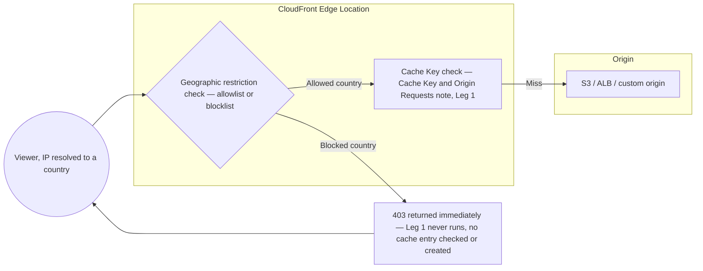

# 14 - AWS CloudFront Geographic Restrictions

> Goal: block or allow access to an entire distribution's content based on the viewer's **country**, using CloudFront's built-in geo restriction feature — and see how this is a fundamentally different tool from Route 53's geolocation/latency-based **routing** covered in this repo's `Route53` folder.

---

## 1. What geographic restriction actually does

CloudFront can determine a viewer's **country** (via its IP address, using a geo-IP lookup CloudFront performs automatically) and either **allow only specific countries** or **block specific countries** from reaching the distribution's content at all — a request from a disallowed country receives an error response instead of the actual content.

> 🧠 **Mental model:** this is an **allow/deny gate at the edge**, evaluated **before** anything else (caching, origin requests) — not a routing decision. Contrast this with Route 53 geolocation routing, which decides **which origin/endpoint** a DNS query resolves to based on the resolver's location — Route 53 routes *to* different destinations; CloudFront geo restriction simply **blocks or allows** access to the *same* distribution's content.

---

## 2. Architecture & workflow — a gate ahead of the cache key, not a routing decision

Geographic restriction is evaluated **before** the [Cache Key and Origin Requests](09-Default-Cache-Behavior-Cache-Key-and-Origin-Requests.md) note's Leg 1 check even runs — a blocked viewer's request never gets far enough to be treated as a Hit or a Miss at all:

- This is the **earliest** gate in the entire request pipeline covered across this folder so far — earlier even than AWS WAF (the [CloudFront Settings Options Part 2](13-CloudFront-Settings-Options-Part2.md) note's Section 2), since geo restriction is evaluated per-distribution using data CloudFront already has (the viewer's resolved country) with no rule engine to run.
- A blocked request produces a `403` **without ever touching the cache key logic** — it isn't cached as a Miss, and it doesn't consume any of the [Cache Key and Origin Requests](09-Default-Cache-Behavior-Cache-Key-and-Origin-Requests.md) note's per-edge cache capacity.
- The `403` itself can be swapped for a friendlier page via the [CloudFront Error Pages](17-CloudFront-Error-Pages.md) note's mechanism — that substitution happens **after** this gate has already made its block/allow decision, a genuinely later stage in the pipeline (Section 4 below, and that note's own Section 2 diagram).

---

## 3. The two modes

| Mode | Behavior |
|---|---|
| **Allowlist** | Only the specified countries can access the content; every other country is blocked |
| **Blocklist** | The specified countries are blocked; every other country can access the content |

Configured per-distribution (not per cache behavior) — **CloudFront console** → distribution → **Geographic restrictions** tab → **Edit** → choose **Allow list** or **Block list** → select countries → **Save changes**.

---

## 4. Why this exists — the common real-world drivers

- **Licensing/content rights** — a media company may only be licensed to distribute certain video content in specific countries.
- **Regulatory/compliance requirements** — certain data or services may be legally restricted from being served to users in specific countries.
- **Reducing abuse from specific regions** — a blunt, country-level tool to cut off traffic from regions known to generate disproportionate abusive/fraudulent traffic (WAF, covered in the [CloudFront Settings Options Part 2](13-CloudFront-Settings-Options-Part2.md) note, is the more precise tool for this, but geo restriction is a simpler first line).

---

## 5. Real-world walkthrough: applying this to the Cache Key and Origin Requests Netflix-style session

Picking the same India-based Netflix-style session from the [Cache Key and Origin Requests](09-Default-Cache-Behavior-Cache-Key-and-Origin-Requests.md) note's Section 3: if the entire service were geo-blocked in a given country, that country's viewer never even reaches **Stage 1 — open web app**. The `GET /index.html` request is rejected at the edge with a `403` before any static file, let alone a video segment, is ever served — the whole four-stage session never begins.

> ⚠️ **Honesty caveat, matching this folder's earlier one about Netflix's real infrastructure:** in practice, "Inception isn't licensed in this specific country" is almost never implemented as a CloudFront geographic restriction. Distribution-wide geo restriction blocks or allows an **entire distribution** — it can't selectively block one title while allowing the rest of the catalog through the same distribution. Real per-title licensing restrictions are handled by the **application/catalog layer** (the backend simply doesn't return "Inception" in that country's catalog, or the CloudFront Functions/Lambda@Edge layer, the [CloudFront Function Associations](11-CloudFront-Function-Associations.md) note, does finer-grained checks). CloudFront geo restriction is the right tool for a coarser question — "should this entire service be reachable from this country at all" — not "should this one piece of content be visible here."

> 🎯 **Exam tip:** "block or allow access to content based on the end user's country" is the CloudFront **geographic restriction** scenario — direct and specific enough that it rarely gets confused with anything else on the exam, **except** the deliberate distinction from Route 53 geolocation routing (which chooses a destination, not an allow/deny decision) — expect the exam to test that exact distinction.

---

## 6. Custom error responses for blocked requests

A blocked request returns an HTTP 403 by default — this can be customized (the [CloudFront Error Pages](17-CloudFront-Error-Pages.md) note's error-page mechanism) to show a friendly "not available in your country" message instead of a generic error.

---

## 7. Recap

- **Geographic restriction** allow-lists or block-lists entire countries at the CloudFront edge, evaluated before caching or origin logic — a blunt allow/deny gate, not a routing mechanism (Section 1).
- It's the **earliest** gate in the request pipeline — a blocked request is rejected before the Cache Key check ever runs, so it never becomes a Hit, a Miss, or a cached entry at all (Section 2).
- Distinct from **Route 53 geolocation routing**, which routes different users to different destinations rather than blocking access outright.
- Common drivers: content licensing, regulatory compliance, and coarse-grained abuse mitigation — but note this is a whole-distribution, not per-title, tool (Section 5).
- Next: the [Origin Group Failover Lab, EC2/S3](15-CloudFront-Origin-Group-Lab1-EC2-S3-Failover-HandsOn.md) note, moving from access-control features into CloudFront's own origin-level high-availability mechanism.

### Sources
- [Restricting the geographic distribution of your content — AWS docs](https://docs.aws.amazon.com/AmazonCloudFront/latest/DeveloperGuide/georestrictions.html)
- [Customizing error responses — AWS docs](https://docs.aws.amazon.com/AmazonCloudFront/latest/DeveloperGuide/HTTPStatusCodes.html)
