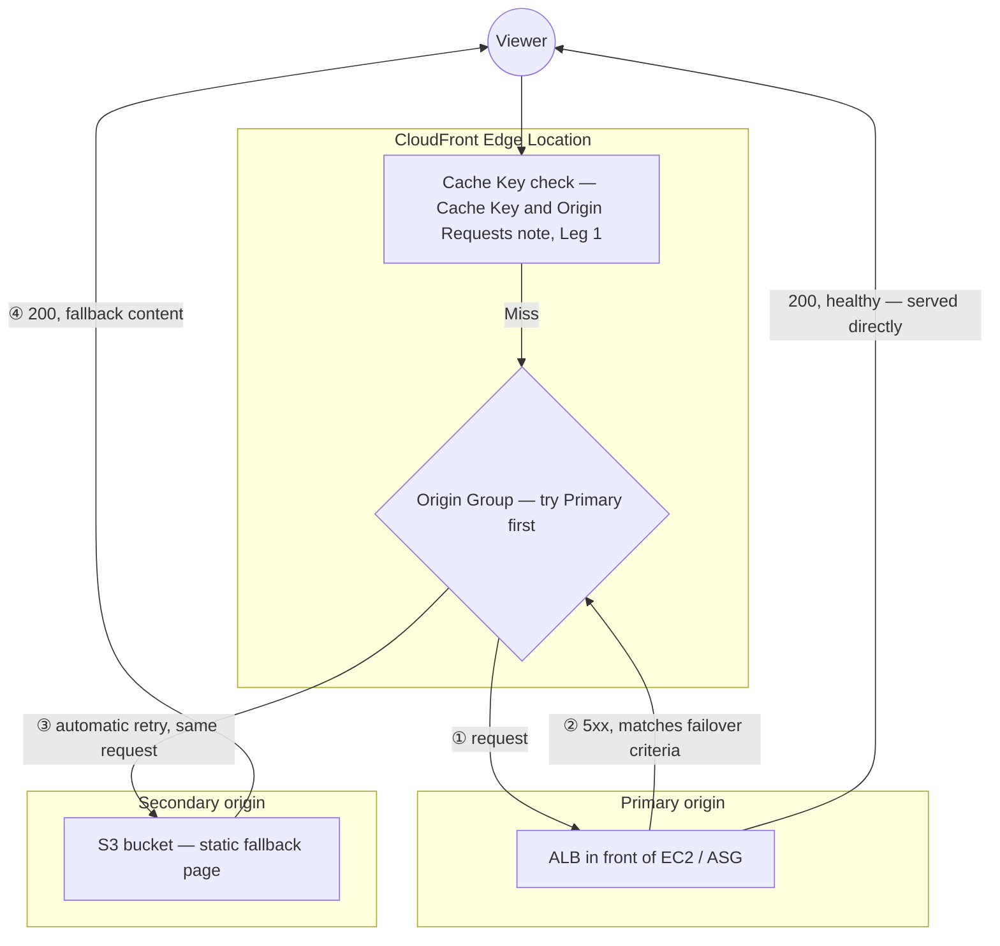

# 15 - AWS CloudFront Origin Group Lab 1: EC2 & S3 Failover

> Goal: configure an **Origin Group** with a primary EC2/ALB origin and a secondary S3 origin, so CloudFront automatically fails over to the static S3 backup the moment the primary starts returning errors — a CloudFront-native HA pattern distinct from anything at the origin's own infrastructure layer.

---

## 1. What an Origin Group is

An **Origin Group** combines **two origins** — a **primary** and a **secondary** — behind a single cache behavior. CloudFront always tries the **primary** first; if the primary's response matches a configured set of **failover criteria** (specific HTTP status codes), CloudFront **automatically retries the same request against the secondary** origin instead.

> 🧠 **Mental model:** this is conceptually similar to an ALB's health-check-driven failover between targets (`Capstone-Project/Project-1/02`'s target group model), except the "targets" here are two entirely different **origins** (potentially different services altogether — EC2 vs. S3, in this lab), and the decision is made **per-request**, at the CloudFront edge, not via a continuous background health check.

---

## 2. The scenario: dynamic primary, static fallback

A common real pattern: the **primary origin** is a dynamic backend (an ALB in front of an EC2/ASG fleet) serving the live application; the **secondary origin** is an **S3 bucket** holding a **static "maintenance page" or last-known-good snapshot** of the site. If the primary becomes unavailable (deployment failure, application crash, overload), visitors seamlessly see the static fallback instead of a raw error page.

---

## 3. Architecture & workflow — where the failover decision happens

The failover decision is made **entirely at the edge**, on a Cache Miss, after the primary has already been tried — it's a continuation of the [Cache Key and Origin Requests](09-Default-Cache-Behavior-Cache-Key-and-Origin-Requests.md) note's Leg 2, not a separate mechanism sitting elsewhere:



- On a **Cache Hit**, none of this runs at all — same as the [Cache Key and Origin Requests](09-Default-Cache-Behavior-Cache-Key-and-Origin-Requests.md) note's Leg 2, Origin Group logic only ever executes on a Miss.
- The retry against the secondary happens **within the same request**, at the edge — the viewer never sees an intermediate error, just the final successful response, whichever origin it came from.
- This is why the diagram's ③ step matters: CloudFront doesn't just report the primary's failure back to the viewer, it **actively retries the exact same request** against the secondary before ever replying.

---

## 4. Configure the Origin Group

1. **CloudFront console** → distribution → **Origins** tab → confirm both origins already exist: the ALB (primary) and the S3 bucket (secondary, with OAC configured per the [CloudFront Origin Access](06-CloudFront-Origin-Access.md) note if it should stay private, or public if serving as a plain static fallback).
2. **Origin groups** tab → **Create origin group**.
3. **Primary origin**: the ALB. **Secondary origin**: the S3 bucket.
4. **Failover criteria**: select the HTTP status codes that should trigger failover — typically `500`, `502`, `503`, `504` (server-side error codes indicating the primary is unhealthy or unreachable).
5. **Create origin group**.
6. Go to the relevant **cache behavior** → **Origin or origin group** → select the newly-created origin group instead of a single origin → **Save changes**.

---

## 5. Test the failover

1. Confirm normal operation: requests through the distribution serve live content from the ALB.
2. Simulate a primary failure — e.g. temporarily stop the ASG's instances, or modify a security group to block the ALB, so requests to it start returning `503`.
3. Request the distribution's URL again:
   ```bash
   curl -I https://d1234abcdefgh.cloudfront.net/
   ```
   CloudFront now serves the **S3 fallback content** instead of propagating the ALB's error to the viewer — confirmed by the response body matching the static bucket's content, not the application's.
4. Restore the ALB/ASG, and confirm requests return to being served from the primary again.

---

## 6. Real-world walkthrough: applying this to the Cache Key and Origin Requests Netflix-style session

Picking the same India-based Netflix-style session from the [Cache Key and Origin Requests](09-Default-Cache-Behavior-Cache-Key-and-Origin-Requests.md) note's Section 3 back up — specifically **Stage 4, watch**: the dynamic ALB origin (serving video manifests/metadata for `/videos/inception/hi/1080p/manifest.json`) suffers an outage. Without an Origin Group, every Indian viewer mid-session would suddenly see a raw `503` where the player expects a manifest. With the Origin Group configured here, the very next request for that manifest instead gets a static, pre-prepared S3 fallback — e.g. a "we're experiencing technical difficulties, please try again shortly" response the frontend can render gracefully, instead of a broken player and a raw error.

> ⚠️ This only degrades gracefully for content the fallback origin can meaningfully substitute for. A static S3 fallback can't actually serve the real video segments (Stage 4's `seg0042.ts` requests) — this pattern fits best for **manifest/metadata/HTML-shaped** responses where a generic "come back later" substitute makes sense, not for the raw media bytes themselves.

---

## 7. What failover does NOT do

> ⚠️ Origin Group failover is a **per-request** decision based on the **response status code** — it is **not** a continuous health check the way an ALB's target group health check is (`EC2/LoadBalancer` notes). CloudFront doesn't proactively "know" the primary is down ahead of time; it only discovers this when an actual request to the primary comes back with a matching failure status code, and fails that **specific request** over. There's no persistent "sticky" state that keeps routing to the secondary once a failure is seen — the very next request tries the primary again first, by design.

---

## 8. Recap

- An **Origin Group** pairs a primary and secondary origin under one cache behavior, with CloudFront automatically retrying a failed request (matching configured status codes) against the secondary (Section 1).
- The failover decision happens **entirely at the edge**, only on a Cache Miss, as a continuation of the [Cache Key and Origin Requests](09-Default-Cache-Behavior-Cache-Key-and-Origin-Requests.md) note's Leg 2 — the viewer only ever sees the final response, never an intermediate error (Section 3).
- A common pattern: dynamic ALB/EC2 primary + static S3 fallback, giving visitors a graceful degraded experience instead of a raw error during an outage — best suited to manifest/HTML-shaped responses, not raw media bytes (Section 6).
- Failover is evaluated **per-request**, based on response status codes — not a continuous background health check like an ALB target group's.
- Next: the [Origin Group Geographical Failover Lab, Load Balancer](16-CloudFront-Origin-Group-Lab2-Geographical-Failover-LB-HandsOn.md) note, extending this pattern to two full ALB-backed origins in different Regions.

### Sources
- [Optimizing high availability with CloudFront origin failover — AWS docs](https://docs.aws.amazon.com/AmazonCloudFront/latest/DeveloperGuide/high_availability_origin_failover.html)
- [Creating an origin group — AWS docs](https://docs.aws.amazon.com/AmazonCloudFront/latest/DeveloperGuide/high_availability_origin_failover.html#concept_origin_groups.creating)
