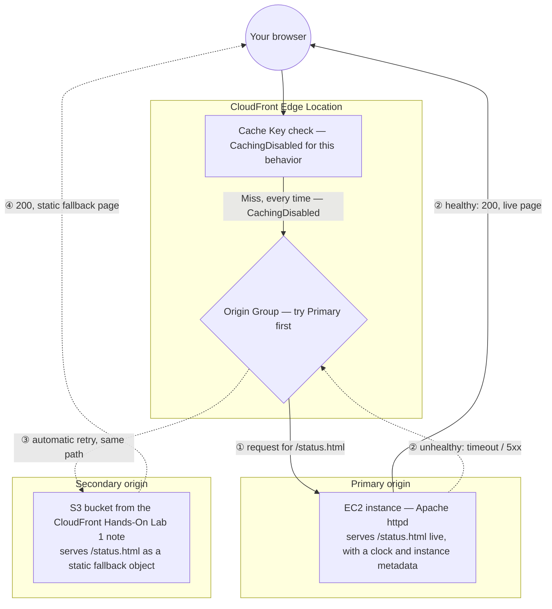

# 15.01 - Hands-On Demo: Origin Group Failover in Practice (EC2 Primary + S3 Secondary)

> Goal: watch CloudFront **actually fail over** from a live EC2-hosted page to a static S3 fallback the moment the primary becomes unreachable — no ALB, no Auto Scaling Group, just one EC2 instance and the S3 static site already sitting in this project from the [CloudFront Hands-On Lab 1 (S3 static site + CDN)](02-CloudFront-HandsOn-Lab1.md) note. Entirely via the **AWS Console** (except the EC2 **User data** box, which is how the console itself accepts a boot script — no CLI, no external automation).

---

## 1. Why this demo simplifies the [Origin Group Failover Lab, EC2/S3](15-CloudFront-Origin-Group-Lab1-EC2-S3-Failover-HandsOn.md) note's architecture

That note's primary origin was an ALB in front of an EC2/ASG fleet — the realistic production shape, but overkill for a first hands-on pass at Origin Groups. The actual mechanism this demo needs to prove — "CloudFront retries a failed request against a secondary origin, automatically, per-request" — doesn't require a load balancer or Auto Scaling at all. A **single EC2 instance running Apache**, used directly as a custom origin, demonstrates exactly the same failover behavior with far less to set up.

For the secondary origin, this demo reuses the **S3 bucket and static site already created** in the [CloudFront Hands-On Lab 1 (S3 static site + CDN)](02-CloudFront-HandsOn-Lab1.md) note — that bucket already has static website hosting enabled and is already a working CloudFront origin, so Section 4 below only adds **one new file** to it rather than building a new bucket from scratch.

> 🧠 **What makes the failover visible:** the EC2 page and the S3 fallback page are both styled the same way (an AWS-flavored orange-on-dark theme) but carry a different, unmissable **badge** — "Primary Origin — EC2" vs. "Secondary Origin — S3 Static Fallback" — so which origin actually served a given request is obvious at a glance, in a browser, with no need to inspect response headers to prove the point.

---

## 2. Architecture & workflow for this demo



Both origins are asked for the **exact same path**, `/status.html` — that's a hard requirement of Origin Group failover (the [Origin Group Failover Lab, EC2/S3](15-CloudFront-Origin-Group-Lab1-EC2-S3-Failover-HandsOn.md) note's Section 3), which is why Section 4 below adds a file with that exact name to the S3 bucket, rather than reusing its existing `index.html`.

---

## 3. Step 1 — Launch the primary EC2 origin

### Step 1a — Launch the instance
1. **EC2 console** → **Instances** → **Launch instances**.
2. **Name**: `CloudFront-Origin-StatusPage`.
3. **Application and OS Images**: **Amazon Linux 2023 AMI** (Free tier eligible).
4. **Instance type**: `t2.micro` or `t3.micro` (Free tier eligible).
5. **Key pair**: **Proceed without a key pair** — nothing in this demo requires SSH access; the page is fully built by the user data script at boot.
6. **Network settings** → **Edit**:
   - **Auto-assign public IP**: **Enable**.
   - **Firewall (security groups)**: **Create security group** → keep the default SSH rule (harmless if unused) and **Add security group rule**: **Type**: `HTTP`, **Source type**: `Anywhere` (`0.0.0.0/0`).
   > ⚠️ Opening HTTP to the whole internet is fine for a short-lived learning lab, but note the production-correct version: restrict the security group's source to the **`com.amazonaws.global.cloudfront.origin-facing`** managed prefix list, so only CloudFront's own edge IP ranges can reach the instance directly. Skipped here to keep the lab focused on Origin Groups specifically.
7. **Configure storage**: leave the default (8 GiB gp3).
8. **Advanced details** → scroll to **User data** → paste:
   ```bash
   #!/bin/bash
   dnf install -y httpd
   systemctl enable --now httpd

   TOKEN=$(curl -s -X PUT "http://169.254.169.254/latest/api/token" -H "X-aws-ec2-metadata-token-ttl-seconds: 21600")
   PUBLIC_IP=$(curl -s -H "X-aws-ec2-metadata-token: $TOKEN" http://169.254.169.254/latest/meta-data/public-ipv4)
   PUBLIC_DNS=$(curl -s -H "X-aws-ec2-metadata-token: $TOKEN" http://169.254.169.254/latest/meta-data/public-hostname)
   INSTANCE_ID=$(curl -s -H "X-aws-ec2-metadata-token: $TOKEN" http://169.254.169.254/latest/meta-data/instance-id)
   AZ=$(curl -s -H "X-aws-ec2-metadata-token: $TOKEN" http://169.254.169.254/latest/meta-data/placement/availability-zone)

   cat > /var/www/html/status.html <<'PAGE'
   <!DOCTYPE html>
   <html lang="en">
   <head>
   <meta charset="UTF-8">
   <title>DevopsWithDeepak - CloudFront</title>
   <style>
     :root { --aws-orange:#FF9900; --aws-dark:#131A22; --aws-darker:#0F1111; --aws-text:#E9ECEF; }
     * { box-sizing:border-box; margin:0; padding:0; }
     body {
       background: radial-gradient(circle at top, #1B2430, var(--aws-darker));
       color: var(--aws-text);
       font-family: 'Segoe UI', Arial, sans-serif;
       min-height: 100vh;
       display: flex; align-items: center; justify-content: center;
       padding: 20px;
     }
     .card {
       background: var(--aws-dark);
       border: 1px solid #2b3542;
       border-top: 4px solid var(--aws-orange);
       border-radius: 12px;
       max-width: 640px; width: 100%;
       padding: 36px 40px;
       box-shadow: 0 20px 60px rgba(0,0,0,0.5);
     }
     .badge {
       display: inline-block;
       background: var(--aws-orange);
       color: #131A22;
       font-weight: 700; font-size: 12px; letter-spacing: 1px;
       padding: 6px 14px; border-radius: 999px;
       text-transform: uppercase;
       margin-bottom: 18px;
     }
     h1 { font-size: 28px; margin-bottom: 4px; }
     h1 span { color: var(--aws-orange); }
     .subtitle { color:#9AA5B1; margin-bottom:28px; font-size:14px; }
     .clock {
       font-size: 42px; font-weight: 700;
       color: var(--aws-orange); letter-spacing: 2px;
       margin-bottom: 28px;
       font-variant-numeric: tabular-nums;
     }
     .grid { display:grid; grid-template-columns:1fr 1fr; gap:16px; }
     .field { background:#0F1111; border:1px solid #2b3542; border-radius:8px; padding:14px 16px; }
     .field .label { color:#9AA5B1; font-size:11px; text-transform:uppercase; letter-spacing:1px; margin-bottom:6px; }
     .field .value { color:#fff; font-size:14px; font-family:Consolas,Monaco,monospace; word-break:break-all; }
     footer { margin-top:28px; text-align:center; color:#5C6773; font-size:12px; }
   </style>
   </head>
   <body>
     <div class="card">
       <span class="badge">Primary Origin — EC2 (Live)</span>
       <h1>DevopsWith<span>Deepak</span> - CloudFront</h1>
       <div class="subtitle">Origin Group Failover Demo — served live from an EC2 instance</div>
       <div class="clock" id="clock">--:--:--</div>
       <div class="grid">
         <div class="field"><div class="label">Public DNS</div><div class="value">__PUBLIC_DNS__</div></div>
         <div class="field"><div class="label">Public IP</div><div class="value">__PUBLIC_IP__</div></div>
         <div class="field"><div class="label">Instance ID</div><div class="value">__INSTANCE_ID__</div></div>
         <div class="field"><div class="label">Availability Zone</div><div class="value">__AZ__</div></div>
       </div>
       <footer>Served by Apache httpd on EC2 — if you're seeing this, the Origin Group's primary is healthy.</footer>
     </div>
     <script>
       function tick() {
         var d = new Date();
         var pad = function(n) { return n < 10 ? '0' + n : n; };
         document.getElementById('clock').textContent = pad(d.getHours()) + ':' + pad(d.getMinutes()) + ':' + pad(d.getSeconds());
       }
       tick();
       setInterval(tick, 1000);
     </script>
   </body>
   </html>
   PAGE

   sed -i "s/__PUBLIC_DNS__/$PUBLIC_DNS/; s/__PUBLIC_IP__/$PUBLIC_IP/; s/__INSTANCE_ID__/$INSTANCE_ID/; s/__AZ__/$AZ/" /var/www/html/status.html
   ```
   > 🧠 The heredoc uses a **quoted** delimiter (`<<'PAGE'`), so bash treats everything inside it as completely literal text — none of the page's own `$`-free CSS/JS gets accidentally interpreted. The `__PLACEHOLDER__` tokens are swapped for the real instance metadata values **after** the file is written, via `sed`, which is the safe way to inject dynamic values into a large embedded HTML block.
9. **Launch instance**.

### Step 1b — Allocate and associate an Elastic IP
Without this step, stopping and restarting the instance later (Section 8) would hand it a **new** public IP/DNS, silently breaking the CloudFront origin you're about to configure — a real, easy-to-hit gotcha this step avoids proactively:
1. **EC2 console** → **Network & Security** → **Elastic IPs** → **Allocate Elastic IP address** → **Allocate**.
2. Select the newly allocated address → **Actions** → **Associate Elastic IP address** → **Instance**: `CloudFront-Origin-StatusPage` → **Associate**.
3. Note the instance's **Public IPv4 DNS** (visible on the instance's **Details** tab) — this is now stable across stop/start and is what you'll use as the CloudFront origin domain in Section 5.

### Step 1c — Verify directly (testing only, not provisioning)
Once the instance shows **Running** and **2/2 checks passed**, open `http://<public-ipv4-dns>/status.html` in a **browser** (not curl — the clock is client-side JavaScript, so curl will show you the HTML/JS source but not the ticking clock itself). You should see the dark, orange-accented card with the **"Primary Origin — EC2 (Live)"** badge, a ticking clock, and your instance's real public DNS/IP/instance ID/AZ filled in.

---

## 4. Step 2 — Add the S3 fallback page to the existing bucket

1. **S3 console** → open the bucket from the [CloudFront Hands-On Lab 1 (S3 static site + CDN)](02-CloudFront-HandsOn-Lab1.md) note (the one already serving `index.html`/`style.css`/`script.js` through your distribution).
2. **Upload** → **Add files** → create and upload a file named **exactly** `status.html`:
   ```html
   <!DOCTYPE html>
   <html lang="en">
   <head>
   <meta charset="UTF-8">
   <title>DevopsWithDeepak - CloudFront (Fallback)</title>
   <style>
     :root { --aws-orange:#FF9900; --aws-dark:#131A22; --aws-darker:#0F1111; --aws-text:#E9ECEF; }
     * { box-sizing:border-box; margin:0; padding:0; }
     body {
       background: radial-gradient(circle at top, #24211B, var(--aws-darker));
       color: var(--aws-text);
       font-family: 'Segoe UI', Arial, sans-serif;
       min-height: 100vh;
       display: flex; align-items: center; justify-content: center;
       padding: 20px;
     }
     .card {
       background: var(--aws-dark);
       border: 1px solid #2b3542;
       border-top: 4px solid #C97A00;
       border-radius: 12px;
       max-width: 560px; width: 100%;
       padding: 36px 40px;
       box-shadow: 0 20px 60px rgba(0,0,0,0.5);
       text-align: center;
     }
     .badge {
       display: inline-block;
       background: #545B64;
       color: #fff;
       font-weight: 700; font-size: 12px; letter-spacing: 1px;
       padding: 6px 14px; border-radius: 999px;
       text-transform: uppercase;
       margin-bottom: 18px;
     }
     h1 { font-size: 26px; margin-bottom: 12px; }
     h1 span { color: var(--aws-orange); }
     p { color:#9AA5B1; font-size:14px; line-height:1.6; }
     footer { margin-top:24px; color:#5C6773; font-size:12px; }
   </style>
   </head>
   <body>
     <div class="card">
       <span class="badge">Secondary Origin — S3 Static Fallback</span>
       <h1>DevopsWith<span>Deepak</span> - CloudFront</h1>
       <p>The primary origin is currently unreachable. You're seeing this pre-built, static object served directly from S3 — no live server, no clock, no instance metadata, because there's no compute behind this page at all.</p>
       <footer>Origin Group failover in action — served by S3, not EC2.</footer>
     </div>
   </body>
   </html>
   ```
3. Leave permissions as-is (the bucket is already public-read from the [CloudFront Hands-On Lab 1 (S3 static site + CDN)](02-CloudFront-HandsOn-Lab1.md) note's bucket policy — this new object inherits the same bucket-level access).
4. **Upload**.
5. Sanity-check directly: `http://<bucket>.s3-website-<region>.amazonaws.com/status.html` in a browser should show the gray-badged fallback card.

---

## 5. Step 3 — Add the EC2 instance as a CloudFront origin

1. **CloudFront console** → your distribution → **Origins** tab → **Create origin**.
2. **Origin domain**: paste the EC2 instance's **Public IPv4 DNS** from Section 3, Step 1c.
3. **Protocol**: **HTTP only** (the instance has no TLS certificate configured — keeping this a plain HTTP origin avoids that whole setup for a demo focused on Origin Groups, not custom HTTPS).
4. **HTTP port**: leave at the default `80`.
5. **Origin path**: leave blank.
6. **Name**: clear the auto-filled value and set it to `EC2StatusOrigin`.
7. Leave mutual TLS, custom headers, and Origin Shield all off/collapsed.
8. **Create origin**.

---

## 6. Step 4 — Create the Origin Group

1. **CloudFront console** → your distribution → **Origin groups** tab → **Create origin group**.
2. **Primary origin**: `EC2StatusOrigin`.
3. **Secondary origin**: the existing S3 origin from the [CloudFront Hands-On Lab 1 (S3 static site + CDN)](02-CloudFront-HandsOn-Lab1.md) note (its name will match your bucket, in `<bucket>.s3-website-<region>.amazonaws.com` form).
4. **Failover criteria**: check `500`, `502`, `503`, `504`.
5. **Create origin group**.

---

## 7. Step 5 — Create the `/status.html` cache behavior

1. **Behaviors** tab → **Create behavior**.
2. **Path pattern**: `status.html`.
3. **Origin and origin groups**: select the origin group created in Section 6.
4. **Viewer** section: leave all defaults (**Redirect HTTP to HTTPS**, **GET, HEAD**, **Restrict viewer access**: No).
5. **Cache key and origin requests**: **Cache policy**: `Managed-CachingDisabled` — deliberately, so **every** request in this demo hits the Origin Group fresh instead of serving a cached copy, making the failover instantly observable on each test without waiting on a TTL or issuing an invalidation (the [Cache Invalidation](18-CloudFront-Cache-Invalidation.md) note).
6. **Origin request policy**, **Response headers policy**, **Function associations**: leave unselected/no association.
7. **Create behavior** → wait for **Deployed**.

---

## 8. Test normal operation and failover

### Normal operation
Open `https://<your-distribution>.cloudfront.net/status.html` in a browser. You should see the **orange "Primary Origin — EC2 (Live)"** badge, the ticking clock, and your real instance metadata — served through CloudFront, via the Origin Group's primary.

### Simulate a primary failure
**EC2 console** → select `CloudFront-Origin-StatusPage` → **Instance state** → **Stop instance**. Wait for it to reach **Stopped**.

Re-request `https://<your-distribution>.cloudfront.net/status.html`. You should now see the **gray "Secondary Origin — S3 Static Fallback"** badge instead — CloudFront's Origin Group detected the primary's failure (a connection timeout while the instance was stopped, matching the `504` failover criterion) and automatically retried the exact same request against the S3 secondary.

> 🧠 **Faster alternative for repeated testing**: instead of stopping/starting the instance each time (which takes a minute or two per cycle), temporarily remove the HTTP rule from the instance's security group to simulate an outage, then add it back to simulate recovery — same observable effect, much quicker iteration.

### Restore and confirm recovery
**EC2 console** → **Instance state** → **Start instance**. Once it's back to **Running** and **2/2 checks passed** (thanks to the Elastic IP from Section 3, Step 1b, its public DNS is unchanged), re-request `/status.html` again — the **orange EC2 badge** should reappear. This confirms the [Origin Group Failover Lab, EC2/S3](15-CloudFront-Origin-Group-Lab1-EC2-S3-Failover-HandsOn.md) note's Section 7 point directly: there's no "stuck on secondary" state — the very next request tries the primary again first, and succeeds the moment it's healthy again.

---

## 9. Real-world walkthrough: connecting this back to the Cache Key and Origin Requests Netflix-style session

The [Origin Group Failover Lab, EC2/S3](15-CloudFront-Origin-Group-Lab1-EC2-S3-Failover-HandsOn.md) note's own Section 6 walkthrough imagined the [Cache Key and Origin Requests](09-Default-Cache-Behavior-Cache-Key-and-Origin-Requests.md) note's Stage 4 (watch) video-manifest requests failing over from a dynamic ALB to a static S3 "technical difficulties" response. This demo's single EC2 instance is a simplified stand-in for that same dynamic backend — same failure mode, same fallback pattern, same automatic per-request retry — just without the ALB/ASG layer in between, so the mechanism itself is easier to see and test directly.

---

## 10. Troubleshooting

| Symptom | Likely cause |
|---|---|
| `/status.html` returns `403`/`404` from the EC2 side, or the connection just hangs | Security group's HTTP (80) rule isn't allowing your traffic, or the instance is still initializing — user data can take a minute after **Running** to finish installing/starting httpd |
| Clock never starts ticking, page looks unstyled | You tested with `curl` instead of a browser — the clock and full rendering need JavaScript execution, which `curl` doesn't do |
| `__PUBLIC_DNS__`/`__PUBLIC_IP__` literally shown on the page instead of real values | The `sed` substitution step didn't run — check `/var/log/cloud-init-output.log` on the instance (via EC2 Instance Connect) for user data script errors |
| Failover never happens, EC2 badge stays even after stopping the instance | The `/status.html` behavior's Cache policy isn't `CachingDisabled` — a cached copy from before the instance stopped is being served without re-contacting either origin |
| Failover happens but recovery doesn't, even after restarting EC2 | No Elastic IP was associated (Section 3, Step 1b) — the instance came back with a **different** public DNS than what's configured in the `EC2StatusOrigin` origin; update the origin's domain to match, or associate an Elastic IP now for future stop/start cycles |
| S3 fallback page 404s | The uploaded object isn't named **exactly** `status.html`, or it's not at the bucket root — Origin Group failover retries the identical path, so the secondary must have an object at that same path |

---

## 11. Cleanup

1. **Behaviors** tab → select the `status.html` behavior → **Delete**.
2. **Origin groups** tab → select the origin group → **Delete**.
3. **Origins** tab → select `EC2StatusOrigin` → **Delete**.
4. **S3 console** → the bucket from the [CloudFront Hands-On Lab 1 (S3 static site + CDN)](02-CloudFront-HandsOn-Lab1.md) note → delete the `status.html` object only (leave the rest of that lab's site intact).
5. **EC2 console** → **Instances** → select `CloudFront-Origin-StatusPage` → **Instance state** → **Terminate instance**.
6. **Elastic IPs** → select the address from Section 3, Step 1b → **Actions** → **Release Elastic IP address** (an unassociated Elastic IP is billed if left allocated).
7. Leave the rest of the distribution and the S3 static site in place if continuing to other hands-on notes — only tear those down per the [CloudFront Hands-On Lab 1 (S3 static site + CDN)](02-CloudFront-HandsOn-Lab1.md) note's own cleanup section when done with the whole series.

---

## 12. Recap

- A single EC2 instance, used directly as a custom HTTP origin, demonstrates the exact same Origin Group failover mechanism as a full ALB/ASG setup — the load balancer isn't what makes failover work (Section 1).
- Both origins had to serve an object at the **identical path**, `/status.html` — Origin Group failover retries the same request, it doesn't redirect elsewhere (Section 2, Section 4).
- `CachingDisabled` on the demo behavior was a deliberate choice, so every test request actually reaches the Origin Group instead of being masked by a cached response (Section 7).
- An **Elastic IP** on the primary origin avoided a real, easy-to-hit gotcha: without one, restarting a stopped EC2 instance silently changes its public DNS, breaking the CloudFront origin's configured domain (Section 3, Section 8, Troubleshooting).
- Stopping the instance and re-requesting proved the [Origin Group Failover Lab, EC2/S3](15-CloudFront-Origin-Group-Lab1-EC2-S3-Failover-HandsOn.md) note's core claim directly — automatic, per-request failover with no persistent "stuck on secondary" state (Section 8).

### Sources
- [Optimizing high availability with CloudFront origin failover — AWS docs](https://docs.aws.amazon.com/AmazonCloudFront/latest/DeveloperGuide/high_availability_origin_failover.html)
- [Instance metadata and user data — AWS docs](https://docs.aws.amazon.com/AWSEC2/latest/UserGuide/ec2-instance-metadata.html)
- [Elastic IP addresses — AWS docs](https://docs.aws.amazon.com/AWSEC2/latest/UserGuide/elastic-ip-addresses-eip.html)
