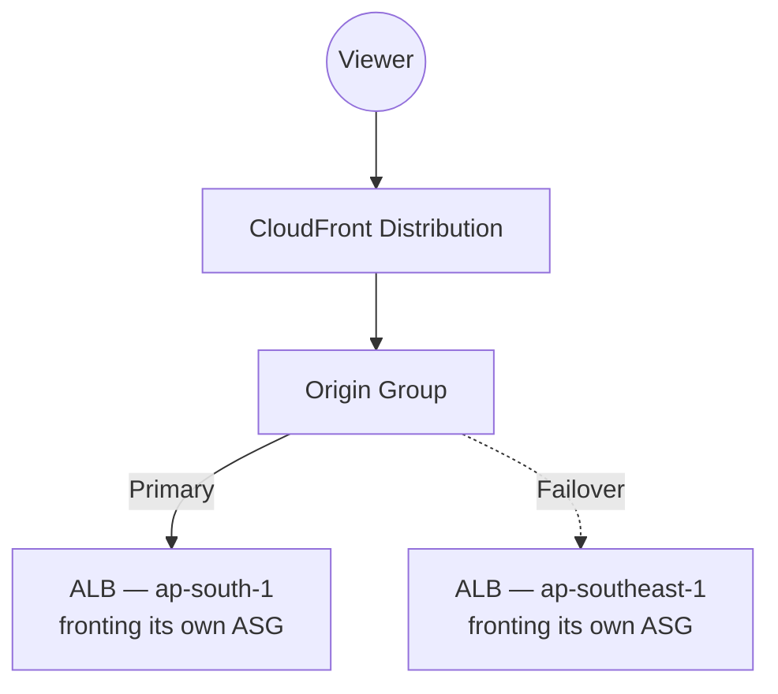

# 16 - AWS CloudFront Origin Group Lab 2: Geographical Failover with Load Balancer

> Goal: extend Note 15's Origin Group pattern to **two full, independently-running application deployments** behind load balancers in **different Regions** — real multi-Region disaster recovery, not just a static fallback page.

---

## 1. How this differs from Lab 1

Note 15's secondary origin was a **static S3 fallback** — good for graceful degradation, but not a substitute for the real application. This lab's secondary origin is a **second, fully-functional ALB**, fronting its **own EC2/ASG fleet in a different AWS Region** — so failover here means genuinely continuing to serve the **live application**, not a degraded static page.

> 🧠 **Mental model:** this is the CloudFront-edge equivalent of Route 53 failover routing (covered in this repo's `Route53` folder) — both solve "keep serving traffic if an entire Region goes down" — but this pattern operates at the **CDN/edge layer**, evaluated per-request against real-time origin responses, rather than at the **DNS layer** with its own health-check cadence and TTL-bound propagation delay.

---

## 2. Architecture

Both Regions run a **complete, independent copy** of the application stack — this is meaningfully more expensive and operationally heavier than Note 15's pattern (two full environments to deploy, patch, and keep in sync), which is exactly why it's reserved for workloads where a true multi-Region active/standby posture is actually justified.

---

## 3. Configure it

1. Deploy (or assume already deployed) two independent ALB + ASG stacks, one in each Region — e.g. `ap-south-1` (primary) and `ap-southeast-1` (secondary/DR).
2. **CloudFront console** → distribution → **Origins** → add both ALBs as **custom origins** (Note 03).
3. **Origin groups** → **Create origin group** → **Primary**: `ap-south-1` ALB. **Secondary**: `ap-southeast-1` ALB. **Failover criteria**: `500`, `502`, `503`, `504`.
4. Cache behavior → **Origin or origin group** → select the origin group → **Save changes**.

---

## 4. Test cross-Region failover

1. Confirm normal traffic serves from the `ap-south-1` primary.
2. Simulate a full Regional outage of the primary (e.g. scale the primary ASG to 0, or detach the ALB's target group) so requests to it fail with a matching status code.
3. Request the distribution again — traffic now serves from the **`ap-southeast-1`** ALB's live application, fully functional, not a static page.
4. Restore the primary and confirm traffic naturally returns to it on the next request (same per-request evaluation behavior as Note 15 — no persistent "stuck on secondary" state).

---

## 5. When this pattern is worth the cost, vs. Route 53 failover

| | CloudFront Origin Group failover (this note) | Route 53 failover routing (`Route53` folder) |
|---|---|---|
| Layer | CDN/edge, per-request | DNS, resolved once per TTL |
| Failover speed | Immediate — the very next request after a failing response | Bound by DNS TTL and health-check interval — visitors with a cached DNS resolution may keep hitting the failed endpoint until their resolver re-queries |
| Best combined with | Static or dynamic secondary content served through the *same* distribution | Any architecture, including non-CloudFront-fronted ones (e.g. failing over directly between two ALBs with no CDN at all) |

> 🎯 **Exam tip:** "failover must happen as fast as possible, on a per-request basis, for content served through CloudFront" points to **Origin Group failover**; "failover for an architecture that isn't necessarily behind CloudFront at all, or where DNS-level redirection is the natural mechanism" points to **Route 53 failover routing** instead — the two are complementary, and real production DR architectures often use both together.

---

## 6. Recap

- This lab's Origin Group uses **two full, independently-running ALB-backed environments** in different Regions — genuine multi-Region DR, not a static fallback (Note 15's simpler pattern).
- CloudFront's per-request, immediate failover (bound to actual response status codes) contrasts with Route 53 failover routing's DNS-TTL-bound cadence — the two operate at different layers and are often combined.
- This closes the two-lab Origin Group series (Notes 15-16). Next: Note 17 — AWS CloudFront Tutorial: AWS CloudFront Error Pages, customizing what viewers actually see when even failover doesn't resolve an error.

### Sources
- [Optimizing high availability with CloudFront origin failover — AWS docs](https://docs.aws.amazon.com/AmazonCloudFront/latest/DeveloperGuide/high_availability_origin_failover.html)
- [Choosing a routing policy — Amazon Route 53 — AWS docs](https://docs.aws.amazon.com/Route53/latest/DeveloperGuide/routing-policy.html)
