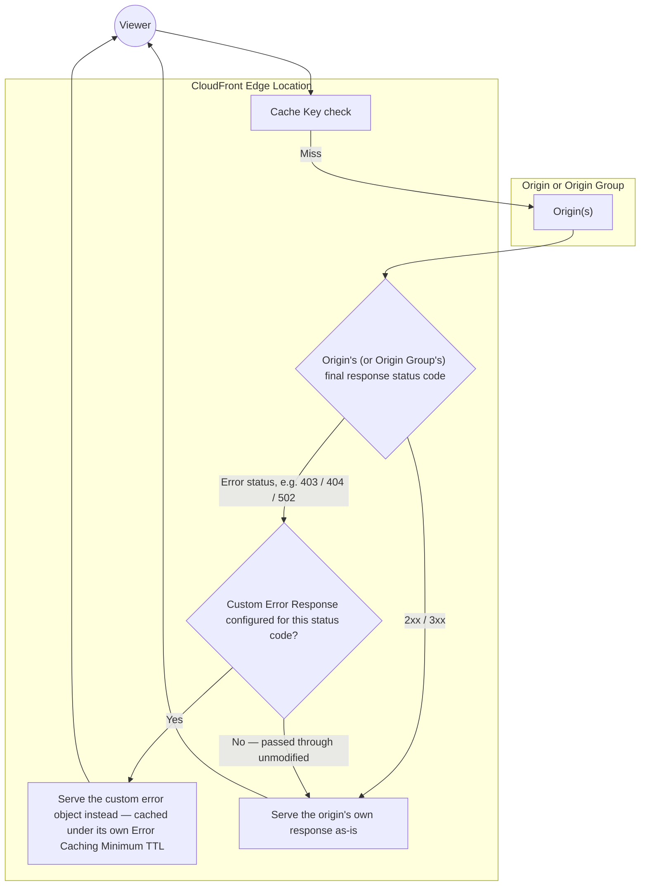

# 17 - AWS CloudFront Tutorial: AWS CloudFront Error Pages

> Goal: configure **Custom Error Responses** so viewers see a branded, friendly error page instead of the origin's raw error output — and control how long CloudFront caches an error response itself, independent of the [Default Cache Behavior Options](04-Default-Cache-Behavior-Options.md) note's normal content-caching TTLs.

---

## 1. Why the origin's own error page usually isn't good enough

Left unconfigured, an error from the origin (a raw S3 `403`/`404` XML document, or an ALB's generic error page) is passed straight through to the viewer — functionally correct, but a poor user experience and inconsistent with the rest of a branded site. **Custom Error Responses** let CloudFront intercept specific HTTP status codes and serve a **different, custom object** (e.g. a nicely designed `error.html` from an S3 bucket) instead.

---

## 2. Architecture & workflow — a post-response substitution, not a pre-request gate

This is a **later** stage than the other access-control mechanisms covered in this folder. The [Geographic Restrictions](14-CloudFront-Geographic-Restrictions.md) note's geo restriction blocks a request **before** anything else runs; Custom Error Responses instead wait until CloudFront already **has** a final response — from the origin directly, or from an Origin Group (the [Origin Group Failover Lab, EC2/S3](15-CloudFront-Origin-Group-Lab1-EC2-S3-Failover-HandsOn.md) and [Origin Group Geographical Failover Lab, Load Balancer](16-CloudFront-Origin-Group-Lab2-Geographical-Failover-LB-HandsOn.md) notes) that's already exhausted its failover options — and only then decides whether to substitute it:

- Custom Error Responses only ever see a status code **after** every earlier stage — geo restriction (the [Geographic Restrictions](14-CloudFront-Geographic-Restrictions.md) note), the Cache Key check, and any Origin Group failover attempts (the [Origin Group Failover Lab, EC2/S3](15-CloudFront-Origin-Group-Lab1-EC2-S3-Failover-HandsOn.md) and [Origin Group Geographical Failover Lab, Load Balancer](16-CloudFront-Origin-Group-Lab2-Geographical-Failover-LB-HandsOn.md) notes) — has already run its course.
- If an Origin Group's secondary origin succeeds, the response reaching this stage is already a `2xx`, so no custom error substitution happens at all — Custom Error Responses only matter when **every** upstream recovery mechanism has already failed.
- The substituted error object gets its **own** caching lifetime (Section 3 below), entirely separate from the normal content TTL that would have applied to a successful response for that same path.

---

## 3. Configure a custom error response

1. **CloudFront console** → distribution → **Error pages** tab → **Create custom error response**.
2. **HTTP error code**: `403` (a common one, especially relevant for the private-bucket-via-OAC pattern from the [CloudFront Origin Access](06-CloudFront-Origin-Access.md) note, where a disallowed direct request naturally returns 403).
3. **Customize error response**: **Yes**.
4. **Response page path**: `/error-pages/403.html` (a path within one of the distribution's own origins).
5. **HTTP response code**: choose what the viewer's browser actually receives — often deliberately set to `200` for a friendly page (so browsers/crawlers don't treat it as a hard failure) or kept as the original code if that distinction matters to the calling application.
6. **Error caching minimum TTL**: how long CloudFront caches **this error response itself** before trying the origin again on the next request.

---

## 4. Error Caching Minimum TTL — a setting worth understanding on its own

This TTL is **independent** of the [Default Cache Behavior Options](04-Default-Cache-Behavior-Options.md) note's normal content TTLs — it controls how long CloudFront serves the **cached error** before attempting a fresh request to the origin again, even for a URL that would otherwise have a much longer (or shorter) normal-content TTL.

> ⚠️ Setting this **too high** means a since-recovered origin keeps getting masked by a stale cached error for longer than necessary — visitors keep seeing "content unavailable" even after the underlying issue is fixed, until the error TTL expires. Setting it **too low** means a still-struggling origin gets hit with retries very frequently, potentially worsening an already-degraded situation. This is a genuine tuning trade-off, not a "set and forget" value.

---

## 5. Real-world walkthrough: two scenarios from earlier in this folder, finally getting a friendly face

- **A geo-blocked request** (the [Geographic Restrictions](14-CloudFront-Geographic-Restrictions.md) note): without a Custom Error Response, a viewer in a blocked country sees a raw `403`. With one configured for `403`, they instead see a branded "this service isn't available in your region yet" page — same underlying block, a materially better experience.
- **A total Origin Group failure** (the [Origin Group Failover Lab, EC2/S3](15-CloudFront-Origin-Group-Lab1-EC2-S3-Failover-HandsOn.md) and [Origin Group Geographical Failover Lab, Load Balancer](16-CloudFront-Origin-Group-Lab2-Geographical-Failover-LB-HandsOn.md) notes): if **both** the primary and the secondary/DR origin are down — a genuinely rare but real "both Regions are having a bad day" scenario — the Origin Group's own failover logic is exhausted, and the request finally reaches this note's Custom Error Response stage. That's the case a friendly, branded "we're experiencing technical difficulties" page matters most, since it's the last line of defense before a viewer would otherwise see a raw `502`/`504`.

> 🧠 These two scenarios also show *why* Custom Error Responses matter for a **different** set of failures than Origin Groups do: an Origin Group makes the **common case** (one origin down) invisible to the viewer entirely; Custom Error Responses handle the **residual case** — either something Origin Groups don't apply to at all (geo restriction), or the rare case where failover itself didn't have anywhere left to go.

---

## 6. Error pages combined with Geographic Restrictions (the [Geographic Restrictions](14-CloudFront-Geographic-Restrictions.md) note) and Origin Groups (the [Origin Group Failover Lab, EC2/S3](15-CloudFront-Origin-Group-Lab1-EC2-S3-Failover-HandsOn.md) and [Origin Group Geographical Failover Lab, Load Balancer](16-CloudFront-Origin-Group-Lab2-Geographical-Failover-LB-HandsOn.md) notes)

- A geo-restricted request (the [Geographic Restrictions](14-CloudFront-Geographic-Restrictions.md) note) returning `403` can be given a custom, friendly "not available in your region" page via this exact mechanism.
- When an Origin Group (the [Origin Group Failover Lab, EC2/S3](15-CloudFront-Origin-Group-Lab1-EC2-S3-Failover-HandsOn.md) and [Origin Group Geographical Failover Lab, Load Balancer](16-CloudFront-Origin-Group-Lab2-Geographical-Failover-LB-HandsOn.md) notes) fails over successfully, the viewer never even sees an error at all — the secondary origin's actual content is returned transparently. Custom Error Responses matter for the case where **both** the primary **and** the failover attempt fail, or where no Origin Group is configured at all.

---

## 7. Recap

- **Custom Error Responses** let CloudFront serve a friendly, branded page (and optionally a different HTTP status code to the viewer) in place of an origin's raw error output, for specific HTTP status codes.
- This is a **post-response** substitution — it only runs after geo restriction, the cache key check, and any Origin Group failover attempts have already produced a final status code, never as a pre-request gate (Section 2).
- **Error Caching Minimum TTL** independently controls how long an error response itself stays cached before CloudFront retries the origin — a real tuning trade-off between masking a since-recovered origin and hammering a still-struggling one.
- It's the natural finishing touch for two earlier scenarios in this folder — geo-blocked requests and exhausted Origin Group failover — turning a raw error into a branded page in both cases (Section 5).
- Next: the [Error Pages hands-on demo](17.01-Error-Pages_Demo.md) — a hands-on demo proving this live with a real ALB + EC2 origin and a private, OAC-protected S3 error-pages origin, including a genuinely simulated `502`. Then the [Cache Invalidation](18-CloudFront-Cache-Invalidation.md) note, the mechanism for forcibly clearing cached content before its TTL naturally expires — the final note in this folder.

### Sources
- [Creating custom error pages for specific HTTP status codes — AWS docs](https://docs.aws.amazon.com/AmazonCloudFront/latest/DeveloperGuide/HTTPStatusCodes.html#custom-error-pages)
- [How CloudFront processes and caches HTTP 4xx and 5xx status codes — AWS docs](https://docs.aws.amazon.com/AmazonCloudFront/latest/DeveloperGuide/HTTPStatusCodes.html)
