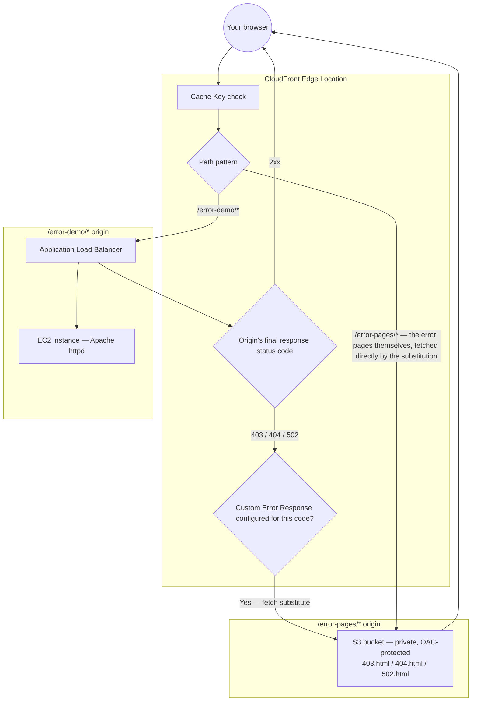

# 17.01 - Hands-On Demo: Custom Error Responses in Practice (ALB + EC2 Origin, S3 Error Pages)

> Goal: watch CloudFront **swap a raw origin error for a branded page** — for a `403`, a `404`, and a live-simulated `502` — using a real Application Load Balancer + EC2 instance as the content origin and a private, OAC-protected S3 bucket as the error-pages origin. This demo is fully self-contained: it doesn't depend on any earlier hands-on note in this folder, and builds every resource from scratch. Entirely via the **AWS Console** (except the EC2 **User data** box, which is how the console itself accepts a boot script — no CLI, no external automation).

---

## 1. Why this demo builds everything fresh

Earlier hands-on demos in this folder reused a shared S3 static site or a shared `/get` behavior. This one deliberately doesn't — the [CloudFront Error Pages](17-CloudFront-Error-Pages.md) note is about what happens when an origin **fails**, and the cleanest way to prove that convincingly is with an origin you can deliberately break and repair on demand, without worrying about disturbing anything another demo depends on. So this lab creates:

- **One EC2 instance**, running Apache, as the real backend.
- **One Application Load Balancer + target group**, fronting that instance — this is what actually gets used as the CloudFront origin, so this demo also shows a `502 Bad Gateway` the honest way: by making the ALB genuinely unable to reach any healthy target.
- **One new, private S3 bucket** (Origin Access Control, not a public website endpoint this time — the production-recommended pattern from the [CloudFront Origin Access](06-CloudFront-Origin-Access.md) note) holding three branded error pages: `403.html`, `404.html`, `502.html`.

The three error pages already exist at [`demo-site/error-pages/403.html`](demo-site/error-pages/403.html), [`demo-site/error-pages/404.html`](demo-site/error-pages/404.html), and [`demo-site/error-pages/502.html`](demo-site/error-pages/502.html) — new files, alongside the rest of this project's `demo-site/` assets, styled in the same AWS orange-on-dark theme as the [Origin Group Failover hands-on demo](15.01-Origin-Group-Failover_Demo.md)'s pages for visual consistency across this whole hands-on series.

---

## 2. Architecture & workflow for this demo



Two separate cache behaviors, two separate origins — the ALB serves the real application at `/error-demo/*`, and the S3 bucket serves the branded replacements at `/error-pages/*`. A Custom Error Response doesn't have its own "origin" setting; per the [CloudFront Error Pages](17-CloudFront-Error-Pages.md) note's Section 3, its **Response page path** is just a normal path within the distribution — which is exactly why the `/error-pages/*` behavior has to exist first, or CloudFront would have nowhere to resolve that substitution path to.

---

## 3. Step 1 — Launch the EC2 instance

1. **Region selector** → **Asia Pacific (Mumbai) `ap-south-1`** (any Region works; this just keeps everything in one place for the lab).
2. **EC2 console** → **Instances** → **Launch instances**.
3. **Name**: `CloudFront-ErrorDemo-Backend`.
4. **Application and OS Images**: **Amazon Linux 2023 AMI** (Free tier eligible).
5. **Instance type**: `t2.micro` or `t3.micro`.
6. **Key pair**: **Proceed without a key pair**.
7. **Network settings** → **Edit**:
   - **Auto-assign public IP**: **Enable** (this instance doesn't strictly need to be reachable directly once the ALB is in front of it, but keeping it simple avoids a NAT Gateway for this lab).
   - **Firewall (security groups)**: **Create security group**, name it `EC2-SG-ErrorDemo` → **Add security group rule**: **Type**: `HTTP`, **Source type**: `Anywhere` (`0.0.0.0/0`) — **temporary**, Section 5 below tightens this to the ALB's security group specifically once it exists.
8. **Configure storage**: leave the default.
9. **Advanced details** → **User data** → paste:
   ```bash
   #!/bin/bash
   dnf install -y httpd
   systemctl enable --now httpd

   TOKEN=$(curl -s -X PUT "http://169.254.169.254/latest/api/token" -H "X-aws-ec2-metadata-token-ttl-seconds: 21600")
   PRIVATE_IP=$(curl -s -H "X-aws-ec2-metadata-token: $TOKEN" http://169.254.169.254/latest/meta-data/local-ipv4)
   INSTANCE_ID=$(curl -s -H "X-aws-ec2-metadata-token: $TOKEN" http://169.254.169.254/latest/meta-data/instance-id)
   AZ=$(curl -s -H "X-aws-ec2-metadata-token: $TOKEN" http://169.254.169.254/latest/meta-data/placement/availability-zone)

   mkdir -p /var/www/html/error-demo/private

   cat > /var/www/html/error-demo/index.html <<'PAGE'
   <!DOCTYPE html>
   <html lang="en">
   <head>
   <meta charset="UTF-8">
   <title>DevopsWithDeepak - CloudFront</title>
   <style>
     :root { --aws-orange:#FF9900; --aws-dark:#131A22; --aws-darker:#0F1111; --aws-text:#E9ECEF; }
     * { box-sizing:border-box; margin:0; padding:0; }
     body {
       background: radial-gradient(circle at top, #1B2430, var(--aws-darker));
       color: var(--aws-text);
       font-family: 'Segoe UI', Arial, sans-serif;
       min-height: 100vh;
       display: flex; align-items: center; justify-content: center;
       padding: 20px;
     }
     .card {
       background: var(--aws-dark);
       border: 1px solid #2b3542;
       border-top: 4px solid var(--aws-orange);
       border-radius: 12px;
       max-width: 640px; width: 100%;
       padding: 36px 40px;
       box-shadow: 0 20px 60px rgba(0,0,0,0.5);
     }
     .badge {
       display: inline-block;
       background: var(--aws-orange);
       color: #131A22;
       font-weight: 700; font-size: 12px; letter-spacing: 1px;
       padding: 6px 14px; border-radius: 999px;
       text-transform: uppercase;
       margin-bottom: 18px;
     }
     h1 { font-size: 28px; margin-bottom: 4px; }
     h1 span { color: var(--aws-orange); }
     .subtitle { color:#9AA5B1; margin-bottom:28px; font-size:14px; }
     .clock {
       font-size: 42px; font-weight: 700;
       color: var(--aws-orange); letter-spacing: 2px;
       margin-bottom: 28px;
       font-variant-numeric: tabular-nums;
     }
     .grid { display:grid; grid-template-columns:1fr 1fr; gap:16px; }
     .field { background:#0F1111; border:1px solid #2b3542; border-radius:8px; padding:14px 16px; }
     .field .label { color:#9AA5B1; font-size:11px; text-transform:uppercase; letter-spacing:1px; margin-bottom:6px; }
     .field .value { color:#fff; font-size:14px; font-family:Consolas,Monaco,monospace; word-break:break-all; }
     .links { margin-top:20px; font-size:13px; }
     .links a { color: var(--aws-orange); margin-right: 16px; }
     footer { margin-top:28px; text-align:center; color:#5C6773; font-size:12px; }
   </style>
   </head>
   <body>
     <div class="card">
       <span class="badge">Origin: ALB &rarr; EC2 (Healthy)</span>
       <h1>DevopsWith<span>Deepak</span> - CloudFront</h1>
       <div class="subtitle">Custom Error Responses Demo — served live through an Application Load Balancer</div>
       <div class="clock" id="clock">--:--:--</div>
       <div class="grid">
         <div class="field"><div class="label">Private IP</div><div class="value">__PRIVATE_IP__</div></div>
         <div class="field"><div class="label">Instance ID</div><div class="value">__INSTANCE_ID__</div></div>
         <div class="field"><div class="label">Availability Zone</div><div class="value">__AZ__</div></div>
         <div class="field"><div class="label">Served via</div><div class="value">Apache httpd</div></div>
       </div>
       <div class="links">
         Try: <a href="/error-demo/private/">/error-demo/private/ (403)</a>
         <a href="/error-demo/does-not-exist">/error-demo/does-not-exist (404)</a>
       </div>
       <footer>If you're seeing this, the ALB has a healthy target to forward requests to.</footer>
     </div>
     <script>
       function tick() {
         var d = new Date();
         var pad = function(n) { return n < 10 ? '0' + n : n; };
         document.getElementById('clock').textContent = pad(d.getHours()) + ':' + pad(d.getMinutes()) + ':' + pad(d.getSeconds());
       }
       tick();
       setInterval(tick, 1000);
     </script>
   </body>
   </html>
   PAGE

   sed -i "s/__PRIVATE_IP__/$PRIVATE_IP/; s/__INSTANCE_ID__/$INSTANCE_ID/; s/__AZ__/$AZ/" /var/www/html/error-demo/index.html

   # A directory Apache can't even read → a reliable, config-independent 403,
   # regardless of the AMI's default Options/Indexes settings.
   chmod 000 /var/www/html/error-demo/private
   ```
   > 🧠 `/error-demo/does-not-exist` needs **no setup at all** — any path with no matching file under `/var/www/html/error-demo/` already gets Apache's default `404`, which is exactly the raw response this demo wants to intercept.
10. **Launch instance**.

---

## 4. Step 2 — Create the Target Group and Application Load Balancer

### Step 2a — Target group
1. **EC2 console** → **Load Balancing** → **Target Groups** → **Create target group**.
2. **Target type**: **Instances**.
3. **Target group name**: `ErrorDemo-TG`.
4. **Protocol : Port**: `HTTP : 80`.
5. **VPC**: your default VPC.
6. **Health checks** → **Advanced health check settings** → **Health check path**: `/error-demo/index.html` (not the default `/` — nothing is served at the doc root, only under `/error-demo/`, so leaving this at `/` would mark the target permanently unhealthy).
7. **Next** → select `CloudFront-ErrorDemo-Backend` → **Include as pending below** → **Create target group**.

### Step 2b — Application Load Balancer
1. **EC2 console** → **Load Balancing** → **Load Balancers** → **Create load balancer** → **Application Load Balancer** → **Create**.
2. **Name**: `ErrorDemo-ALB`.
3. **Scheme**: **Internet-facing**.
4. **VPC**: your default VPC → **Mappings**: select at least **two** Availability Zones (e.g. `ap-south-1a` and `ap-south-1b`) and their default subnets — an ALB requires at least two.
5. **Security groups**: **Create new security group**, name it `ALB-SG-ErrorDemo` → allow **HTTP (80)** from **Anywhere** (`0.0.0.0/0`) — the ALB is meant to be the public entry point.
6. **Listeners and routing**: **HTTP : 80** → **Forward to**: `ErrorDemo-TG`.
7. **Create load balancer**. Wait for its state to become **Active** (a few minutes).
8. Note the ALB's **DNS name** (e.g. `errordemo-alb-123456789.ap-south-1.elb.amazonaws.com`) from its **Details** tab — this is what you'll use as the CloudFront origin domain in Section 6.

---

## 5. Harden the EC2 security group

Now that the ALB's security group exists, tighten `EC2-SG-ErrorDemo` to only trust traffic **from the ALB**, not the whole internet:
1. **EC2 console** → **Security Groups** → `EC2-SG-ErrorDemo` → **Inbound rules** → **Edit inbound rules**.
2. Change the existing HTTP rule's **Source** from `Anywhere-IPv4` to **`ALB-SG-ErrorDemo`** (start typing its name/ID and select it from the dropdown — this references the security group itself, not a CIDR block).
3. **Save rules**.

> 🧠 This is a real, common production pattern: the ALB stays open to the internet since that's its job, but the EC2 instance behind it only accepts traffic that's already passed through the ALB — direct requests to the instance's own public IP on port 80 are now rejected.

Sanity-check the ALB directly (testing only, not provisioning): `http://<alb-dns-name>/error-demo/index.html` in a **browser** should show the orange "Origin: ALB → EC2 (Healthy)" badge, live clock, and instance metadata.

---

## 6. Step 3 — Create the private S3 bucket for error pages

1. **S3 console** → **Create bucket**.
2. **Bucket name**: `cf-demo-error-pages-<yourname>` (must be globally unique).
3. **Region**: `ap-south-1` (Mumbai) — matches the rest of this demo.
4. **Block Public Access settings for this bucket**: leave **all four boxes checked** (fully private) — unlike the [CloudFront Hands-On Lab 1 (S3 static site + CDN)](02-CloudFront-HandsOn-Lab1.md) note's public website-hosting bucket, this one will be reached **only** through CloudFront, via Origin Access Control.
5. **Create bucket**.
6. **Upload** → **Add folder** (or **Add files** while typing the `error-pages/` prefix into the destination) → upload [`demo-site/error-pages/403.html`](demo-site/error-pages/403.html), [`404.html`](demo-site/error-pages/404.html), and [`502.html`](demo-site/error-pages/502.html) so their final **object keys** are `error-pages/403.html`, `error-pages/404.html`, and `error-pages/502.html` — matching the `/error-pages/*` path pattern Section 8 will route through this origin.

---

## 7. Step 4 — Add both as CloudFront origins

### ALB origin
1. **CloudFront console** → your distribution → **Origins** tab → **Create origin**.
2. **Origin domain**: paste the ALB's DNS name from Section 4, Step 2b.
3. **Protocol**: **HTTP only**, port `80` (no certificate configured on the ALB for this demo).
4. **Name**: `ALBErrorDemoOrigin`.
5. **Create origin**.

### S3 origin (OAC)
1. **Create origin** again.
2. **Origin domain**: select your `cf-demo-error-pages-<yourname>` bucket from the dropdown (this picks the REST endpoint, `<bucket>.s3.ap-south-1.amazonaws.com`).
3. **Name**: `ErrorPagesS3Origin`.
4. **Origin access** → **Origin access control settings (recommended)** → **Create new OAC** → leave **Signing behavior** at **Sign requests (recommended)** → **Create**.
5. **Create origin**. CloudFront now shows a banner: **"The S3 bucket policy needs to be updated"** → copy the provided JSON policy.
6. **S3 console** → your bucket → **Permissions** tab → **Bucket policy** → **Edit** → paste the copied policy → **Save changes**. This grants `cloudfront.amazonaws.com` read access, scoped to this specific distribution's ARN — the [CloudFront Origin Access](06-CloudFront-Origin-Access.md) note's OAC mechanism, now applied for real.

---

## 8. Step 5 — Create the two cache behaviors

### `/error-demo/*` → ALB
1. **Behaviors** tab → **Create behavior**.
2. **Path pattern**: `/error-demo/*`.
3. **Origin and origin groups**: `ALBErrorDemoOrigin`.
4. **Viewer** section: leave all defaults.
5. **Cache policy**: `Managed-CachingDisabled` — so every test request reaches the ALB fresh, no cached response masking a status change.
6. **Create behavior**.

### `/error-pages/*` → S3
1. **Create behavior** again.
2. **Path pattern**: `/error-pages/*`.
3. **Origin and origin groups**: `ErrorPagesS3Origin`.
4. **Cache policy**: `Managed-CachingOptimized` — these are static files that rarely change, a deliberate contrast with the dynamic behavior above.
5. **Create behavior** → wait for the distribution to show **Deployed**.

---

## 9. Step 6 — Configure the three Custom Error Responses

Repeat **Error pages** tab → **Create custom error response** three times:

| HTTP error code | Customize error response | Response page path | HTTP response code | Error caching minimum TTL |
|---|---|---|---|---|
| `403` | Yes | `/error-pages/403.html` | `200` | `10` |
| `404` | Yes | `/error-pages/404.html` | `200` | `10` |
| `502` | Yes | `/error-pages/502.html` | `200` | `10` |

> 🧠 **Why `10` seconds and not a realistic production value** (the [CloudFront Error Pages](17-CloudFront-Error-Pages.md) note's Section 4 default guidance would suggest something much longer, e.g. `300`): a short TTL here means Section 11's recovery test doesn't require a long wait to observe the cached-error-outliving-the-fix behavior directly. In production, pick this value based on that same note's real trade-off — how long you're willing to keep masking a since-recovered origin vs. how often you're willing to re-hit a still-struggling one.

---

## 10. Test normal operation and each error

### Normal
`https://<your-distribution>.cloudfront.net/error-demo/index.html` → the orange "Origin: ALB → EC2 (Healthy)" badge, live clock, real instance metadata.

### 403
`https://<your-distribution>.cloudfront.net/error-demo/private/` → the red-badged **"403 Forbidden — Custom Error Response"** page from S3, not Apache's raw `403`. Verify the actual status code the browser received:
```bash
curl -s -o /dev/null -w "%{http_code}\n" "https://<your-distribution>.cloudfront.net/error-demo/private/"
```
Expected: `200` — the Custom Error Response's **HTTP response code** setting rewrote it.

### 404
`https://<your-distribution>.cloudfront.net/error-demo/does-not-exist` → the orange-badged **"404 Not Found — Custom Error Response"** page.

### 502 — simulate a real backend outage
1. **EC2 console** → **Target Groups** → `ErrorDemo-TG` → **Targets** tab → select `CloudFront-ErrorDemo-Backend` → **Deregister**. Wait for its status to leave **draining** and disappear from the healthy target list.
2. Re-request `https://<your-distribution>.cloudfront.net/error-demo/index.html` → the gray-badged **"502 Bad Gateway — Custom Error Response"** page — the ALB genuinely has no healthy target to forward to, and CloudFront substituted the branded page for its raw `502`.

---

## 11. Confirm recovery — and watch the Error Caching Minimum TTL in action

1. **Target Groups** → `ErrorDemo-TG` → **Targets** → **Register targets** → re-add `CloudFront-ErrorDemo-Backend` → wait for its health check to pass (**healthy**, usually under a minute given the default health check interval).
2. Immediately re-request `/error-demo/index.html`. If you're **within** the 10-second Error Caching Minimum TTL window from your last `502` test, you may still briefly see the **cached 502 page**, even though the origin is already healthy again — this is Section 9's TTL doing exactly what the [CloudFront Error Pages](17-CloudFront-Error-Pages.md) note's Section 4 describes: masking a since-recovered origin for the configured window.
3. Wait a few seconds past that TTL and request again — the orange "Healthy" page should return.

---

## 12. Real-world walkthrough

- **The `/error-demo/private/` 403** is a direct hands-on version of the exact scenario the [CloudFront Error Pages](17-CloudFront-Error-Pages.md) note's Section 3 calls out by name — "especially relevant for the private-bucket-via-OAC pattern... where a disallowed direct request naturally returns 403." This demo's `ErrorPagesS3Origin` bucket is itself protected the same way; a request that somehow bypassed CloudFront and hit that bucket directly would hit the same kind of `403` this section demonstrates on the ALB side.
- **The `/error-demo/does-not-exist` 404** is the everyday case — a stale link, a typo, a removed page — where a branded page keeps a broken link from looking like the whole site is broken.
- **The simulated `502`** is this note's Section 5 "last line of defense" scenario made real: no Origin Group is configured for this behavior, so there's nothing to fail over to — the Custom Error Response is the **only** thing standing between the viewer and a raw gateway error during a genuine backend outage.

---

## 13. Troubleshooting

| Symptom | Likely cause |
|---|---|
| `/error-demo/index.html` returns a raw `504` from CloudFront, page never loads | ALB isn't **Active** yet, or `EC2-SG-ErrorDemo`'s inbound rule doesn't actually allow `ALB-SG-ErrorDemo` — recheck Section 5 |
| `/error-demo/private/` shows a raw XML/blank error instead of the branded page | The `/error-pages/*` behavior doesn't exist yet, or its origin isn't `ErrorPagesS3Origin` — CloudFront can't resolve `/error-pages/403.html` at all without that route (Section 2, Section 8) |
| S3-origin requests return `403` even though the Custom Error Response is configured correctly | The bucket policy from Section 7's OAC banner wasn't actually pasted/saved, or was pasted into the wrong bucket |
| Target group health check never turns healthy | Health check path is still the default `/` instead of `/error-demo/index.html` (Section 4, Step 2a) |
| `502` test doesn't trigger the branded page | The `/error-demo/*` behavior's Cache policy isn't `CachingDisabled` — a cached `200` from before deregistration is still being served |
| Branded error page shows, but the browser's dev tools report the **original** status code (`403`/`404`/`502`) instead of `200` | The Custom Error Response's **HTTP response code** field wasn't set to `200` — recheck Section 9's table |

---

## 14. Cleanup

1. **CloudFront console** → **Error pages** tab → delete all three custom error responses.
2. **Behaviors** tab → delete the `/error-demo/*` and `/error-pages/*` behaviors.
3. **Origins** tab → delete `ALBErrorDemoOrigin` and `ErrorPagesS3Origin`.
4. **EC2 console** → **Load Balancers** → delete `ErrorDemo-ALB`.
5. **Target Groups** → delete `ErrorDemo-TG`.
6. **Instances** → terminate `CloudFront-ErrorDemo-Backend`.
7. **Security Groups** → delete `ALB-SG-ErrorDemo` and `EC2-SG-ErrorDemo` (only possible once nothing references them).
8. **S3 console** → empty and delete the `cf-demo-error-pages-<yourname>` bucket.

---

## 15. Recap

- A real ALB + EC2 backend, deliberately broken via **target deregistration**, produces a genuine `502` — a more convincing demonstration than simulating the status code any other way (Section 10).
- A Custom Error Response's **Response page path** is resolved through the distribution's own cache behaviors like any other request — which is why the `/error-pages/*` behavior had to exist before the error responses referencing it could work at all (Section 2, Section 8).
- The three error pages are served from a **private, OAC-protected S3 bucket** — the production-recommended access pattern (the [CloudFront Origin Access](06-CloudFront-Origin-Access.md) note), not the public website endpoint used in earlier demos in this folder.
- The **HTTP response code** setting genuinely rewrites what the viewer's browser sees — verified directly with `curl -w "%{http_code}"`, not just by eyeballing the page content (Section 10).
- The **Error Caching Minimum TTL** is real, observable behavior, not just a note in the docs — a short 10-second value made it possible to catch a since-recovered origin still being masked by a cached error page (Section 11).

### Sources
- [Creating custom error pages for specific HTTP status codes — AWS docs](https://docs.aws.amazon.com/AmazonCloudFront/latest/DeveloperGuide/HTTPStatusCodes.html#custom-error-pages)
- [How CloudFront processes and caches HTTP 4xx and 5xx status codes — AWS docs](https://docs.aws.amazon.com/AmazonCloudFront/latest/DeveloperGuide/HTTPStatusCodes.html)
- [Restricting access to an Amazon S3 origin — AWS docs](https://docs.aws.amazon.com/AmazonCloudFront/latest/DeveloperGuide/private-content-restricting-access-to-s3.html)
- [Target group health checks for Application Load Balancers — AWS docs](https://docs.aws.amazon.com/elasticloadbalancing/latest/application/target-group-health-checks.html)
