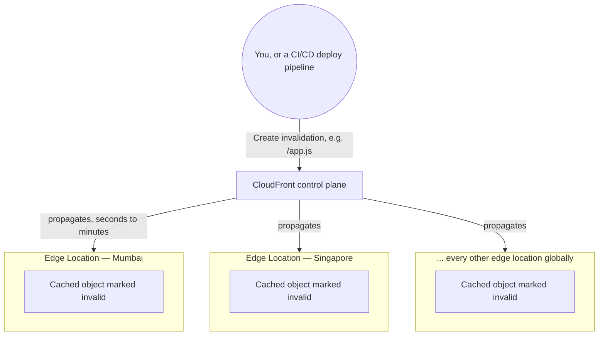

# 18 - AWS CloudFront Cache Invalidation

> Goal: forcibly remove content from CloudFront's cache **before** its TTL naturally expires — the standard fix for "I updated the origin, but visitors are still seeing the old version" — and understand its cost model and the versioned-filename alternative.

---

## 1. The problem: TTLs mean stale content by design

The [Default Cache Behavior Options](04-Default-Cache-Behavior-Options.md) note established that cached content is deliberately served **without** re-checking the origin until its TTL expires — that's the entire point of caching. But this means updating the origin's content (a new `logo.png`, a bug-fixed `app.js`) doesn't automatically reach viewers already being served a cached copy — they'll keep seeing the **old** version until the TTL runs out naturally.

**Cache invalidation** forces CloudFront to treat specified paths as **immediately expired**, so the **next** request for them is treated as a cache miss and re-fetched from the origin, regardless of remaining TTL.

---

## 2. Architecture & workflow — the one operation that reaches every edge location at once

The [Cache Key and Origin Requests](09-Default-Cache-Behavior-Cache-Key-and-Origin-Requests.md) note's Section 2 made a point of showing that **each edge location caches independently** — a variant cached in Mumbai isn't automatically present in Singapore or anywhere else. Invalidation is the one mechanism in this entire folder that deliberately **breaks** that independence, by reaching into every edge location at once:



- A normal request only ever touches **one** edge location's cache — the one nearest the viewer that made it. An invalidation is different in kind: a single API call fans out to **every** edge location in the distribution's footprint, whether or not that location has ever actually cached the path in question.
- This is also why invalidation isn't instant — "propagates across all edge locations" (Section 5 below) is the direct cost of reaching a **global**, independently-caching network from one control-plane call, rather than updating a single centralized cache.
- Contrast this with the [Response Headers Policy](10-Default-Cache-Behavior-Response-Header-Policy.md) note's Section 3 finding that a **Response Headers Policy** update applies instantly with no invalidation needed at all — that's because a policy is re-applied fresh on every response regardless of cache state, whereas the cached **body** itself is exactly what invalidation exists to force-refresh.

---

## 3. Create an invalidation

1. **CloudFront console** → distribution → **Invalidations** tab → **Create invalidation**.
2. **Object paths**: one or more paths, one per line:
   ```
   /images/logo.png
   /css/style.css
   /*
   ```
3. `/*` invalidates **everything** in the distribution — the blunt, "just clear it all" option.
4. **Create invalidation** — takes anywhere from seconds to a few minutes to fully propagate across all edge locations.

```bash
aws cloudfront create-invalidation \
  --distribution-id EDFDVBD6EXAMPLE \
  --paths "/images/logo.png" "/css/style.css"
```

---

## 4. Cost model — invalidations are not free at scale

- The first **1,000 invalidation paths per month** are **free**.
- Beyond that, **each additional path is billed**.
- Critically, **`/*` counts as a single path** for billing purposes — a wildcard invalidating an entire distribution's worth of content is billed the same as invalidating one specific file, making `/*` both operationally blunt **and** cost-efficient compared to submitting thousands of individual specific paths.

> ⚠️ Frequent, large-scale invalidations (e.g. as part of every single deployment) can still add up in cost and in the several-minutes propagation delay each time — for high-deployment-frequency workloads, Section 6's alternative is usually the better long-term pattern.

---

## 5. Real-world walkthrough: getting a bug fix to the Mumbai edge

Continuing the India-based Netflix-style session from the [Cache Key and Origin Requests](09-Default-Cache-Behavior-Cache-Key-and-Origin-Requests.md) note's Section 3 — **Stage 1, open web app**: a bug is discovered in the deployed `main.js`, and a fix is pushed to the origin. Because of Section 2's per-edge independence, that fix doesn't reach Indian viewers automatically — the **Mumbai edge specifically** is still holding the old, buggy cached copy, and will keep serving it to every Indian visitor until either the path-only cache key's TTL naturally expires, or an invalidation is issued for `/main.js`. Submitting that invalidation is what forces the **Mumbai edge, along with every other edge location worldwide**, to drop its cached copy and re-fetch the fixed version on the very next request — the direct, immediate fix for exactly the "I updated the origin, but visitors are still seeing the old version" problem this note opened with.

---

## 6. The alternative: versioned file names (avoid needing invalidation at all)

Instead of invalidating `/app.js` every time it changes, many production pipelines instead **change the filename itself** on every deploy — e.g. `/app.v2.js`, or a content-hash-based name like `/app.3f2a91b.js` — referenced by an HTML file that itself has a **short TTL** (so the *reference* to the new filename propagates quickly) while the **versioned asset files** get very long, effectively "cache forever" TTLs, since a new deployment simply uses a new, never-before-seen filename rather than overwriting an old one.

> 🎯 **Exam tip:** "we need updated content to reach users immediately after a deployment" can point to **either** cache invalidation **or** versioned filenames, depending on the exact scenario framing — but the exam (and real-world best practice) increasingly favors recognizing **versioned filenames** as the more scalable, cost-effective long-term solution, with invalidation reserved for occasional, unplanned "we need this specific stale content gone right now" situations rather than routine deployment tooling.

---

## 7. Recap

- **Cache invalidation** forces specified paths (or `/*` for everything) to be treated as immediately expired, bypassing the remaining TTL — the direct fix for stale cached content after an origin update.
- It's the one operation that reaches **every** edge location at once, deliberately overriding the [Cache Key and Origin Requests](09-Default-Cache-Behavior-Cache-Key-and-Origin-Requests.md) note's per-edge cache independence — which is also why it isn't instant (Section 2).
- First 1,000 paths/month are free; **`/*` counts as one path** regardless of how much content it actually covers.
- **Versioned/content-hashed filenames** avoid needing invalidation at all for routine deployments — the more scalable pattern for frequent releases, reserving invalidation for occasional, unplanned situations.
- This closes the entire CloudFront folder: the [Introduction to CloudFront](01-Introduction-to-CloudFront.md), [CloudFront Hands-On Lab 1 (S3 static site + CDN)](02-CloudFront-HandsOn-Lab1.md), and [CloudFront Origin Settings](03-CloudFront-Origin-Settings.md) notes covered fundamentals and origins; the [Default Cache Behavior Options](04-Default-Cache-Behavior-Options.md), [CloudFront Custom HTTPS](05-CloudFront-Custom-HTTPS.md), [CloudFront Origin Access](06-CloudFront-Origin-Access.md), [CloudFront Allowed HTTP Methods](07-CloudFront-Allowed-HTTP-Methods.md), [Restrict Viewer Access](08-Default-Cache-Behavior-Restrict-Viewer-Access.md), [Cache Key and Origin Requests](09-Default-Cache-Behavior-Cache-Key-and-Origin-Requests.md), [Response Headers Policy](10-Default-Cache-Behavior-Response-Header-Policy.md), and [CloudFront Function Associations](11-CloudFront-Function-Associations.md) notes covered every cache-behavior setting in depth; the [Supported HTTP Versions and Default Root Object](12-CloudFront-Settings-Supported-HTTP-Versions-and-Default-Root-Object.md), [CloudFront Settings Options Part 2](13-CloudFront-Settings-Options-Part2.md), and [Geographic Restrictions](14-CloudFront-Geographic-Restrictions.md) notes covered distribution-wide settings and geographic restriction; the [Origin Group Failover Lab, EC2/S3](15-CloudFront-Origin-Group-Lab1-EC2-S3-Failover-HandsOn.md) and [Origin Group Geographical Failover Lab, Load Balancer](16-CloudFront-Origin-Group-Lab2-Geographical-Failover-LB-HandsOn.md) notes covered Origin Group failover; and the [CloudFront Error Pages](17-CloudFront-Error-Pages.md) note and this note covered error handling and cache invalidation.

### Sources
- [Invalidating files — AWS docs](https://docs.aws.amazon.com/AmazonCloudFront/latest/DeveloperGuide/Invalidation.html)
- [Adding, removing, or replacing content that CloudFront distributes — AWS docs](https://docs.aws.amazon.com/AmazonCloudFront/latest/DeveloperGuide/UpdatingExistingObjects.html)
- [Amazon CloudFront pricing — AWS](https://aws.amazon.com/cloudfront/pricing/)
