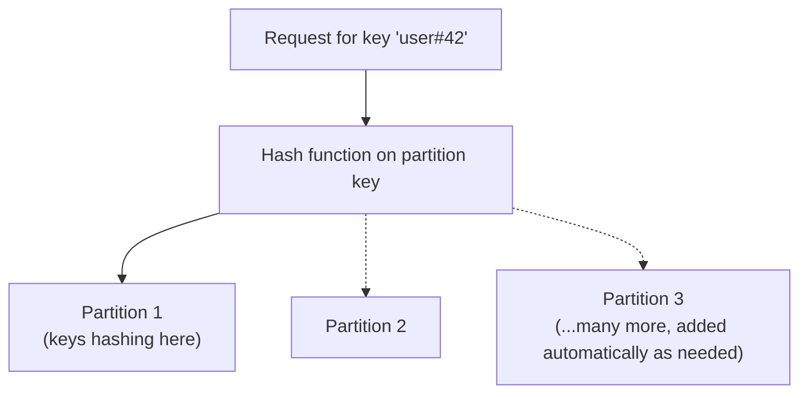

# 06 - AWS DynamoDB Storage Architecture

> Goal: understand partitioning — how DynamoDB actually achieves its "massive scale, consistent latency" promise from Note 01, and why primary key design (Note 04) matters so much.

---

## 1. Partitions: the physical scaling unit

- DynamoDB automatically splits a table's data across multiple **partitions** — independent units of storage and throughput, each hosted on separate physical infrastructure.
- Which partition an item lives on is determined by **hashing its partition key** — items with the **same partition key always hash to the same partition**, which is exactly why a composite key's sort key (Note 04) is used to group related items together (same partition key, different sort keys) while still spreading unrelated items across many partitions.
- DynamoDB adds partitions **automatically** as a table's data size or throughput needs grow — this is the actual mechanism behind Note 01's "near-unlimited horizontal scale" claim.

---

## 2. Why partition key choice matters so much: hot partitions

If too many requests target the **same partition key** (or a small number of keys), all that traffic lands on the **same physical partition**, which has its own throughput ceiling — a **"hot partition"** — even if the table's *overall* provisioned/available throughput (Notes 09-12) is far higher.

> ⚠️ A table with plenty of overall capacity can still throttle requests if that capacity isn't evenly distributed across partitions — this is why partition key **cardinality** (many distinct values, evenly accessed) is one of the most important DynamoDB data-modeling decisions, not an afterthought.

> 🧠 **Mental model:** this is conceptually the same "even distribution across shards" concern as `RDS/35`'s Redis Cluster Mode Enabled hash slots — any system that partitions data by a key's hash lives or dies by how evenly that key's real-world values actually distribute.

---

## 3. Recap

- DynamoDB automatically partitions data (and throughput) based on a hash of the **partition key**, adding partitions as needed — the mechanism behind its scaling promise.
- A poorly-chosen partition key (low cardinality, uneven access) causes **hot partitions**, throttling requests regardless of a table's overall provisioned capacity.
- Next: Note 07 — AWS DynamoDB Read Consistency, covering how reads behave across this distributed storage.

### Sources
- [Partitions and data distribution — AWS docs](https://docs.aws.amazon.com/amazondynamodb/latest/developerguide/HowItWorks.Partitions.html)
- [Designing partition keys to distribute your workload evenly — AWS docs](https://docs.aws.amazon.com/amazondynamodb/latest/developerguide/bp-partition-key-design.html)
