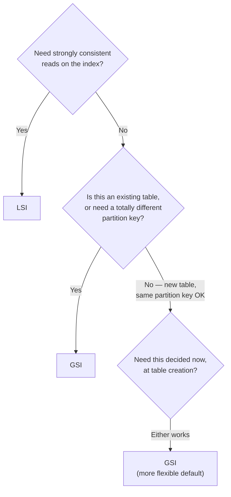

# 17 - AWS DynamoDB LSI Vs GSI

> Goal: consolidate Notes 15-16 into a single decision framework.

---

## 1. The decision flow

---

## 2. Quick reference table

| Requirement | Pick |
|---|---|
| Strongly consistent reads on the index | **LSI** |
| Query by a completely different attribute (not just alternate sort order) | **GSI** |
| Add the index to an already-existing table | **GSI** |
| Need the index's own independent throughput | **GSI** |
| Fine with eventual consistency, flexible on when it's added | **GSI** (the more commonly reached-for default) |

> 🎯 **Exam tip:** in practice, **GSI is the default answer** unless the scenario specifically calls out "strongly consistent" for the index — that single word is the one requirement only LSI satisfies.

---

## 3. Recap

- This closes the secondary-index mini-arc (Notes 14-17): use **GSI** by default for its flexibility and independent throughput; reach for **LSI** only when strongly consistent reads on the index are explicitly required.
- Next: Note 18 — DynamoDB Encryption at Rest Explained!, moving into DynamoDB's security features.

### Sources
- [Local secondary indexes — AWS docs](https://docs.aws.amazon.com/amazondynamodb/latest/developerguide/LSI.html)
- [Global secondary indexes — AWS docs](https://docs.aws.amazon.com/amazondynamodb/latest/developerguide/GSI.html)
