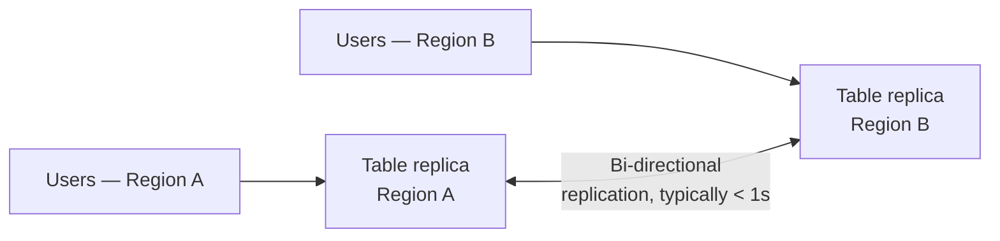

# 20 - DynamoDB Global Tables Explained: Replication Made Simple

> Goal: cover Global Tables — DynamoDB's multi-Region, multi-active replication feature — the DynamoDB analogue to Aurora Global Database (`RDS/38`).

---

## 1. Architecture: multi-active, not primary/standby

- A **Global Table** consists of **replica tables in multiple Regions**, all of which can accept **both reads and writes** — there is no single "primary" Region.
- Replication between replicas is typically **sub-second**, using DynamoDB Streams (Note 25) internally as the replication mechanism.
- **Conflict resolution** uses **"last writer wins"** based on timestamp, for the rare case of concurrent writes to the same item in different Regions.

---

## 2. Why use it

- **Low-latency global access**: users in each Region read/write to their **local** replica, avoiding cross-Region round trips for every request.
- **Disaster recovery / Regional resilience**: if one Region becomes unavailable, applications can redirect entirely to another Region's already-live, already-current replica — no restore process needed.

---

## 3. Version and requirements

- Current version (**2019.11.21**) is the modern, actively developed version — DynamoDB Streams (Note 25) must be enabled on the table, since Global Tables use streams internally to propagate changes between Regions.
- Settings like **Warm Throughput** (Note 13) set on a Global Table automatically apply to **all** its replicas.

> 🎯 **Exam tip:** "active-active, multi-Region," "users read/write to their nearest Region with sub-second global replication," or "DynamoDB disaster recovery across Regions" are the Global Tables signals — contrast with Aurora Global Database (`RDS/38`), which is Aurora's equivalent for the relational side.

---

## 4. Recap

- Global Tables provide multi-active, multi-Region DynamoDB replication with typically sub-second propagation and last-writer-wins conflict resolution — built on DynamoDB Streams internally.
- Used for both low-latency global access and Regional disaster recovery.
- Next: Note 21 — Master DynamoDB Global Tables with These Mini Labs, a hands-on walkthrough.

### Sources
- [Global tables — AWS docs](https://docs.aws.amazon.com/amazondynamodb/latest/developerguide/GlobalTables.html)
- [Global tables: How it works — AWS docs](https://docs.aws.amazon.com/amazondynamodb/latest/developerguide/GlobalTables.HowItWorks.html)
