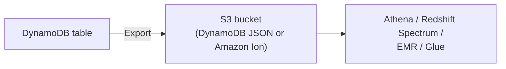

# 23 - How To Export S3 In DynamoDB?

> Goal: cover exporting a DynamoDB table to S3 — a fundamentally different mechanism from backups (Note 22), purpose-built for feeding analytics/data-lake workflows without impacting the live table.

---

## 1. What this is, and why it's not just "another backup"

**Export to S3** copies a table's data (or a point-in-time version of it, if PITR is enabled, Note 22) into an **S3 bucket**, in a queryable format — designed to be **read and processed by other tools** (Athena, Redshift Spectrum, EMR, Glue), not to be restored back into DynamoDB directly the way a backup would be.

---

## 2. Key properties

- **No impact on table performance or provisioned capacity** — the export process reads from the underlying storage independently of the table's normal RCU/WCU consumption, so it doesn't compete with live application traffic.
- Can export the **full table** or, if PITR is enabled, a **specific point in time** in the past — not just "right now."
- **Incremental exports** are also supported — exporting only the changes since a previous export, useful for keeping a data lake in sync without repeatedly re-exporting the entire table.

> 🧠 **Mental model:** this is DynamoDB's version of the same "get data out for analytics without touching the transactional system" need that `RDS/31`'s Zero-ETL Integration addresses for RDS — different mechanism (S3 export vs. direct Redshift integration), same underlying goal of decoupling analytics from the live transactional path.

---

## 3. Recap

- Export to S3 copies DynamoDB data into S3 for analytics tooling, without touching the table's live capacity — supporting both full and point-in-time exports, plus incremental exports for ongoing sync.
- Next: Note 24 — How To Export S3 In DynamoDB? Part 2, covering the export file format choice.

### Sources
- [Exporting DynamoDB table data to Amazon S3 — AWS docs](https://docs.aws.amazon.com/amazondynamodb/latest/developerguide/S3DataExport.html)
