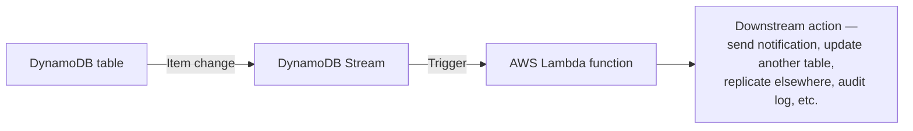

# 25 - AWS DynamoDB Stream & Trigger

> Goal: cover DynamoDB Streams — the change-data-capture log underlying Global Tables (Note 20) — and Lambda Triggers, the most common way applications react to those changes.

---

## 1. What a Stream captures

A **DynamoDB Stream** is a **time-ordered log of item-level changes** (inserts, updates, deletes) in a table, retained for **24 hours**. Each stream record captures the change and, depending on the configured **view type**:

| View type | What's captured |
|---|---|
| `KEYS_ONLY` | Just the key of the changed item |
| `NEW_IMAGE` | The item as it looks **after** the change |
| `OLD_IMAGE` | The item as it looked **before** the change |
| `NEW_AND_OLD_IMAGES` | Both before and after |

---

## 2. Triggers: Lambda reacting to a Stream

- A **Lambda function subscribed to a table's stream** is invoked automatically for each batch of changes — no polling required, this repo's `Lambda` folder covers Lambda's event-source-mapping model generically.
- Common uses: sending a notification on a new order, keeping a search index (e.g. OpenSearch) in sync, auditing changes, or replicating changes elsewhere.

---

## 3. Streams are the mechanism behind other features

- **Global Tables** (Note 20) use Streams internally to propagate changes between Region replicas.
- **DynamoDB → Kinesis Data Streams integration** (Note 26) is a related, but separate and more scalable, alternative to the native DynamoDB Streams + Lambda pattern.

> 🎯 **Exam tip:** "react to every insert/update/delete on a table, in near real time, without polling" is the Streams + Lambda Trigger signal — the same event-driven pattern this repo's `S3` folder covers for S3 Event Notifications, just for DynamoDB's item-level changes instead.

---

## 4. Recap

- DynamoDB Streams captures a 24-hour, time-ordered log of item-level changes; Lambda Triggers subscribe to that stream for real-time, event-driven processing — and Streams itself is the internal mechanism behind Global Tables' replication.
- Next: Note 26 — AWS DynamoDB - Kinesis Data Stream, covering the higher-throughput alternative integration.

### Sources
- [Change data capture for DynamoDB Streams — AWS docs](https://docs.aws.amazon.com/amazondynamodb/latest/developerguide/Streams.html)
- [DynamoDB Streams and AWS Lambda triggers — AWS docs](https://docs.aws.amazon.com/amazondynamodb/latest/developerguide/Streams.Lambda.html)
