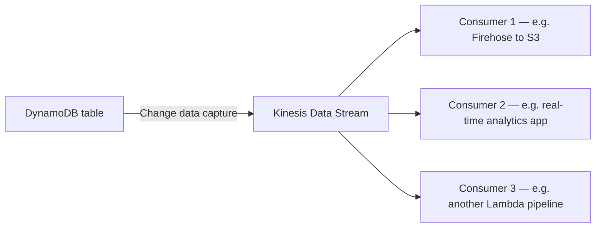

# 26 - AWS DynamoDB - Kinesis Data Stream

> Goal: cover DynamoDB's integration with Kinesis Data Streams — a separate, higher-throughput, longer-retention alternative to native DynamoDB Streams (Note 25).

---

## 1. Why a second change-capture mechanism exists

Native DynamoDB Streams (Note 25) retains data for **only 24 hours** and is designed primarily around Lambda Triggers. For workloads needing:

- **Longer retention** of the change log (Kinesis Data Streams supports up to **365 days**).
- **Multiple, independent consumers** reading the same change log at their own pace (fan-out to several downstream systems simultaneously).
- Integration with the broader **Kinesis ecosystem** (Kinesis Data Firehose for delivery to S3/Redshift/OpenSearch, Kinesis Data Analytics for real-time processing).

...enabling a **Kinesis Data Streams destination** directly on a DynamoDB table is the better fit.

---

## 2. Key differences from native DynamoDB Streams

| | DynamoDB Streams (Note 25) | Kinesis Data Streams integration |
|---|---|---|
| Retention | 24 hours | Up to 365 days |
| Typical consumer | A single Lambda Trigger | Multiple independent consumers, fan-out |
| Ecosystem | Standalone, Lambda-centric | Full Kinesis ecosystem (Firehose, Data Analytics, etc.) |
| Enabling it | Built-in stream setting | A separate, explicitly enabled "Kinesis data stream destination" on the table |

> 🎯 **Exam tip:** "need longer retention than 24 hours" or "need multiple independent systems consuming the same change feed" points to the **Kinesis Data Streams integration**; a single, simple Lambda-based reaction to changes is well served by **native DynamoDB Streams** alone, with less setup.

---

## 3. Recap

- The Kinesis Data Streams integration is a separate change-capture destination from native DynamoDB Streams, trading some setup simplicity for much longer retention (up to 365 days) and true multi-consumer fan-out via the broader Kinesis ecosystem.
- Next: Note 27 — Amazon DynamoDB Accelerator (DAX), covering DynamoDB's dedicated in-memory caching layer.

### Sources
- [Using Kinesis Data Streams to capture changes to DynamoDB — AWS docs](https://docs.aws.amazon.com/amazondynamodb/latest/developerguide/Kinesis.html)
