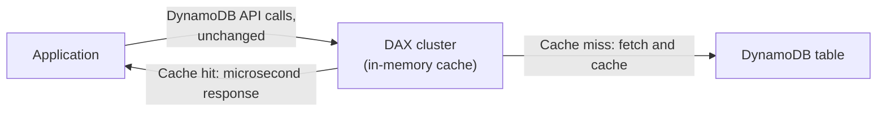

# 27 - Amazon DynamoDB Accelerator (DAX)

> Goal: cover DAX — DynamoDB's own dedicated, API-compatible caching layer, and why it's a distinct, purpose-built alternative to using ElastiCache (`RDS/32-36`) in front of DynamoDB.

---

## 1. What DAX is

**DAX** is a fully-managed, **in-memory cache built specifically for DynamoDB**, sitting between the application and the table, reducing read latency from single-digit milliseconds down to **microseconds** for cached data.

---

## 2. Why DAX specifically, not generic ElastiCache

- **API-compatible**: DAX exposes the **same DynamoDB API** — applications use the existing DynamoDB SDK, pointed at the DAX endpoint instead, requiring **minimal code changes** (essentially just the endpoint/client configuration).
- Generic ElastiCache in front of DynamoDB would require **application code to manage the cache explicitly** — check the cache, on a miss query DynamoDB, then write the result back to the cache — all hand-written logic. DAX handles this **transparently**.
- DAX caches both **item-level results** (from `GetItem`) and **query/scan results**, with its own configurable TTL.

---

## 3. What DAX doesn't help with

- **Write-heavy workloads**: DAX primarily accelerates **reads** — writes still go through to DynamoDB (DAX writes through to keep the cache consistent), so it doesn't reduce write latency or cost the way it does for reads.
- **Strongly consistent reads**: DAX itself serves **eventually consistent** data from its cache — a request requiring a strongly consistent read (Note 07) bypasses the cache and goes directly to DynamoDB.

> 🎯 **Exam tip:** "microsecond read latency for DynamoDB, with minimal application code change" is the DAX signal — distinct from ElastiCache in front of RDS (`RDS/32`), which requires custom application-level cache-aside logic since RDS has no API-compatible managed cache equivalent.

---

## 4. Recap

- DAX is a DynamoDB-API-compatible, fully-managed in-memory cache, reducing read latency to microseconds with minimal application changes — but it doesn't accelerate writes or serve strongly consistent reads from cache.
- Next: Note 28 — How To Create DAX Cluster?, a hands-on walkthrough.

### Sources
- [In-memory acceleration with DAX — AWS docs](https://docs.aws.amazon.com/amazondynamodb/latest/developerguide/DAX.html)
