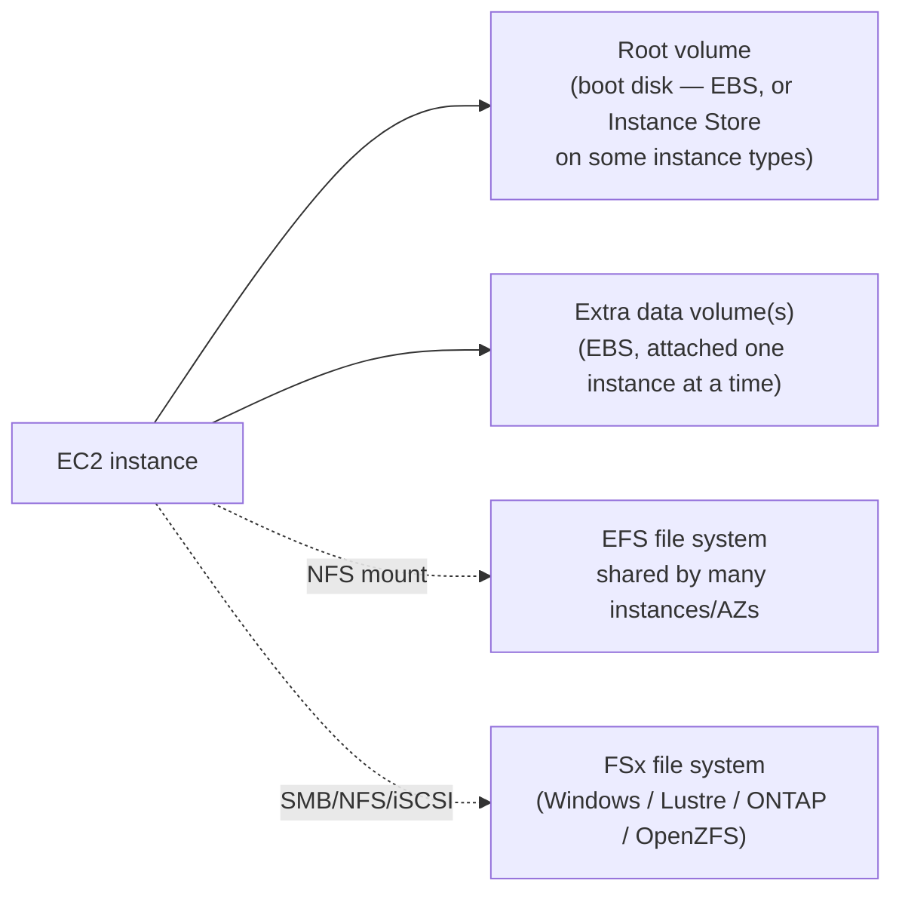

# 01 - AWS Storage Basics: An Essential Overview

> Goal: build the map before the territory — see how **Instance Store**, **EBS**, **EFS**, and **FSx** relate to each other and to EC2, before going deep on each one in the rest of this folder. Every later note in this series (02-15) is a zoom-in on one box in this map.

---

## 1. Why EC2 storage is its own topic

An EC2 instance is compute (CPU + RAM) — it needs somewhere to persist data that survives longer than a single running process, and in most designs, longer than the instance itself. AWS offers several storage options that all attach to (or are reachable from) EC2, but they differ enormously in **durability**, **shareability**, **performance**, and **cost** — picking the wrong one is a classic exam trap and a real production mistake.

> 🧠 **Mental model:** think of EC2 storage as a spectrum from "fast but disposable" to "slower but bulletproof and shareable":
> **Instance Store** (fastest, disappears with the instance) → **EBS** (durable, but one instance at a time*) → **EFS** (durable, shared by many Linux instances at once) → **S3** (not attached to an instance at all — object storage, covered in its own folder, not this one).

---

## 2. The four EC2-attached storage options, at a glance

| Storage type | What it is | Survives instance stop/terminate? | Shared across instances? | Typical use |
|---|---|---|---|---|
| **Instance Store** | Physically-attached NVMe SSD on the host hardware | ❌ No — ephemeral | ❌ No | Cache, buffer, scratch/temp data, replicated data |
| **EBS (Elastic Block Store)** | Network-attached virtual disk, block-level | ✅ Yes (unless you choose to delete it) | ⚠️ Mostly one instance at a time (io1/io2 support Multi-Attach) | Boot volumes, databases, general-purpose persistent disks |
| **EFS (Elastic File System)** | Managed, elastic **NFS** file system | ✅ Yes | ✅ Yes — many instances at once, across AZs | Shared Linux file storage: content repos, home directories, CMS |
| **FSx** | Managed, purpose-built file systems (Windows, Lustre, ONTAP, OpenZFS) | ✅ Yes | ✅ Yes (protocol-dependent) | Windows SMB shares, HPC/ML scratch space, enterprise NAS migrations |

*Amazon S3 is the fifth major AWS storage service, but it's **object storage**, not attached to an instance as a disk or file system — it gets its own folder in this repo and isn't covered again here.

---

## 3. Block storage vs. file storage vs. object storage

This distinction underpins almost every storage decision on the exam:

| Model | Unit of storage | Example services | Analogy |
|---|---|---|---|
| **Block storage** | Fixed-size blocks, no built-in file structure — the OS formats it | EBS, Instance Store | A raw, empty hard drive you plug in |
| **File storage** | Files organized in a hierarchical directory tree, accessed over a network protocol (NFS/SMB) | EFS, FSx | A shared network drive (`\\server\share` or an NFS mount) |
| **Object storage** | Flat namespace of objects (data + metadata + a key), accessed over HTTP(S) API | S3 | A key-value store for whole files, not a disk at all |

> 🎯 **Exam tip:** if a scenario says "multiple EC2 instances need to read/write the *same* files at the *same* time," that's file storage (EFS, or FSx depending on OS) — a plain EBS volume cannot do this (with the narrow exception of io1/io2 Multi-Attach, which shares raw *blocks*, not a filesystem, and needs cluster-aware software to avoid corruption). If it says "static assets served over HTTP" or "a data lake," that's S3.

---

## 4. Where this fits with EC2 and Auto Scaling

- An ASG's instances (Notes in `EC2/ASG`) are typically **stateless** — each one boots from the same launch template's AMI/EBS root volume and can be replaced at any time. Anything that must outlive an individual instance (uploaded files, shared config, a database) belongs on EBS (if only one instance needs it), EFS/FSx (if several instances need to share it), or S3 (if it's really just objects).
- This is exactly why a database on a single EC2 instance (as seen in the CloudMart capstone) is a named HA gap — its data lives on that one instance's EBS volume, with no automatic multi-instance failover, unlike RDS Multi-AZ.

---

## 5. Recap

- Four EC2-facing storage choices: **Instance Store** (fast, ephemeral, free), **EBS** (durable block storage, mostly single-instance), **EFS** (durable shared file storage, Linux/NFS), **FSx** (managed purpose-built file systems, Windows/HPC/enterprise).
- Block vs. file vs. object storage is the foundational distinction — it decides whether multiple instances can share the same data live.
- S3 (object storage) is a separate service/folder — not covered again in this EC2-Storage series.
- Next: Note 02 — Instance Store vs. EBS Volume, Part 1.

### Sources
- [Amazon EC2 storage options — AWS docs](https://docs.aws.amazon.com/AWSEC2/latest/UserGuide/Storage.html)
- [What is Amazon Elastic Block Store? — AWS docs](https://docs.aws.amazon.com/AWSEC2/latest/UserGuide/EBSFeatures.html)
- [What is Amazon Elastic File System? — AWS docs](https://docs.aws.amazon.com/efs/latest/ug/whatisefs.html)
- [What is Amazon FSx? — AWS docs](https://docs.aws.amazon.com/fsx/latest/WhatIsFSx/what-is-fsx.html)
