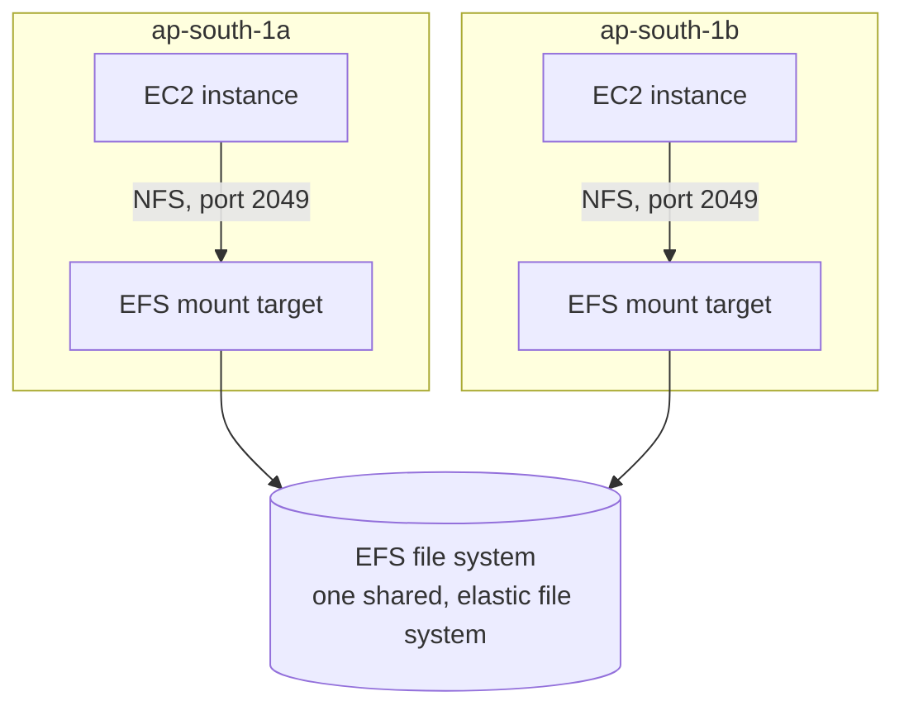

# 12 - Elastic File System (EFS)

> Goal: understand what makes **EFS** fundamentally different from everything in Notes 02-11 — it's the first storage type in this folder that multiple EC2 instances can genuinely read and write **at the same time**, over the network, as a shared filesystem.

---

## 1. What EFS is

**Amazon EFS** is a **fully managed, elastic NFS (Network File System) file system** for use with AWS compute services, primarily **Linux-based** EC2 instances (and containers, Lambda, etc.). Instances **mount** an EFS file system over NFS (v4.1), exactly like mounting a shared network drive.

> 🧠 **Mental model:** every EBS volume so far in this folder has been "one disk, one instance" (or, with Multi-Attach, one disk shared by cluster-aware software). EFS flips that: it's designed from the ground up to be **mounted by many instances simultaneously**, across multiple Availability Zones, all seeing the exact same files and directory structure at the same time — the shared-file-storage use case Note 04, Scenario E, and Note 01's block/file/object comparison both pointed toward.

---

## 2. Key properties

| Property | EFS behavior |
|---|---|
| **Protocol** | NFS v4.1 / v4.0 — Linux-native, POSIX-compliant filesystem semantics |
| **Scalability** | Grows and shrinks **automatically** as you add/remove files — no capacity to provision ahead of time, unlike an EBS volume's fixed size |
| **Availability** | **Regional** by design — a single EFS file system has mount targets in multiple AZs, so instances in any AZ (in the same VPC/peered network) can mount the same file system |
| **Sharing** | Many instances, across many AZs, can mount and use the same file system **concurrently** |
| **Billing** | Pay only for the storage you actually use (plus throughput/IOPS depending on mode) — no pre-provisioned size to pay for, unlike EBS |
| **OS support** | Linux only (via NFS) — Windows workloads needing a shared network drive should look at FSx for Windows File Server instead (Note 15) |

---

## 3. How instances actually reach EFS

- EFS creates one or more **mount targets**, one per Availability Zone you want to support, each with its own **ENI and IP address** inside your VPC.
- An EC2 instance mounts the file system by connecting to the mount target in **its own AZ** — this keeps traffic local to the AZ rather than crossing AZ boundaries for every file operation.
- Access is governed by **security groups on the mount targets** (same mental model as any other ENI-based access control in this repo) — an instance's security group must be allowed inbound NFS (port `2049`) from the mount target's security group, or vice versa, matching the chained security-group pattern used throughout the CloudMart capstone.

---

## 4. Performance modes

| Mode | Best for |
|---|---|
| **General Purpose** (default) | The right choice for the vast majority of workloads — lowest per-operation latency |
| **Max I/O** | Highly parallelized workloads with many instances hitting the file system at once (e.g. big data analytics across a large fleet), trading a bit of per-operation latency for much higher aggregate throughput/operations-per-second ceiling |

> ⚠️ Performance mode can only be set **at creation time** — it cannot be changed on an existing file system, so pick deliberately (General Purpose unless you specifically know you need Max I/O's higher aggregate ceiling).

---

## 5. Throughput modes

| Mode | How throughput is determined |
|---|---|
| **Bursting Throughput** | Throughput scales with the amount of data stored (like gp2's IOPS-tied-to-size model), with a burst-credit system for temporary spikes |
| **Provisioned Throughput** | You specify a fixed throughput level independent of how much data is stored, paying for exactly that — useful when you need high throughput on a file system that doesn't (yet) hold much data |
| **Elastic Throughput** (recommended default for most new file systems) | Automatically scales throughput up and down based on your workload's actual demand in real time, with no need to provision or predict anything |

---

## 6. Storage classes and lifecycle management

- **EFS Standard** — the default, for frequently-accessed files.
- **EFS Standard-Infrequent Access (Standard-IA)** and **EFS Archive** — lower per-GB storage cost, higher per-access retrieval cost, for files accessed rarely.
- **Lifecycle management** can be configured to automatically move files between these classes based on how long it's been since they were last accessed (e.g. "move to IA after 30 days of no access") — fully automatic, no application changes needed, since the file still appears in the same place in the directory tree regardless of which storage class is actually holding it.

---

## 7. Recap

- EFS is a fully managed, **elastic**, **regional**, NFS file system — the first storage type in this folder built for many Linux instances to share the same files **simultaneously**, across AZs.
- Grows/shrinks automatically, no pre-provisioned capacity, billed on actual usage.
- Instances connect via **mount targets** (one per AZ), governed by security groups on port `2049`.
- Two performance modes (General Purpose default, Max I/O for very parallel workloads — locked in at creation) and three throughput modes (Bursting, Provisioned, Elastic — the modern recommended default).
- Storage classes (Standard, IA, Archive) plus lifecycle management automatically cut cost for infrequently-accessed files.
- Next: Note 13 — EFS Options in AWS Console, walking through every setting covered here as it actually appears when creating a file system.

### Sources
- [What is Amazon Elastic File System? — AWS docs](https://docs.aws.amazon.com/efs/latest/ug/whatisefs.html)
- [Amazon EFS performance — AWS docs](https://docs.aws.amazon.com/efs/latest/ug/performance.html)
- [Amazon EFS storage classes — AWS docs](https://docs.aws.amazon.com/efs/latest/ug/storage-classes.html)
- [Managing file system lifecycle — AWS docs](https://docs.aws.amazon.com/efs/latest/ug/lifecycle-management-efs.html)
