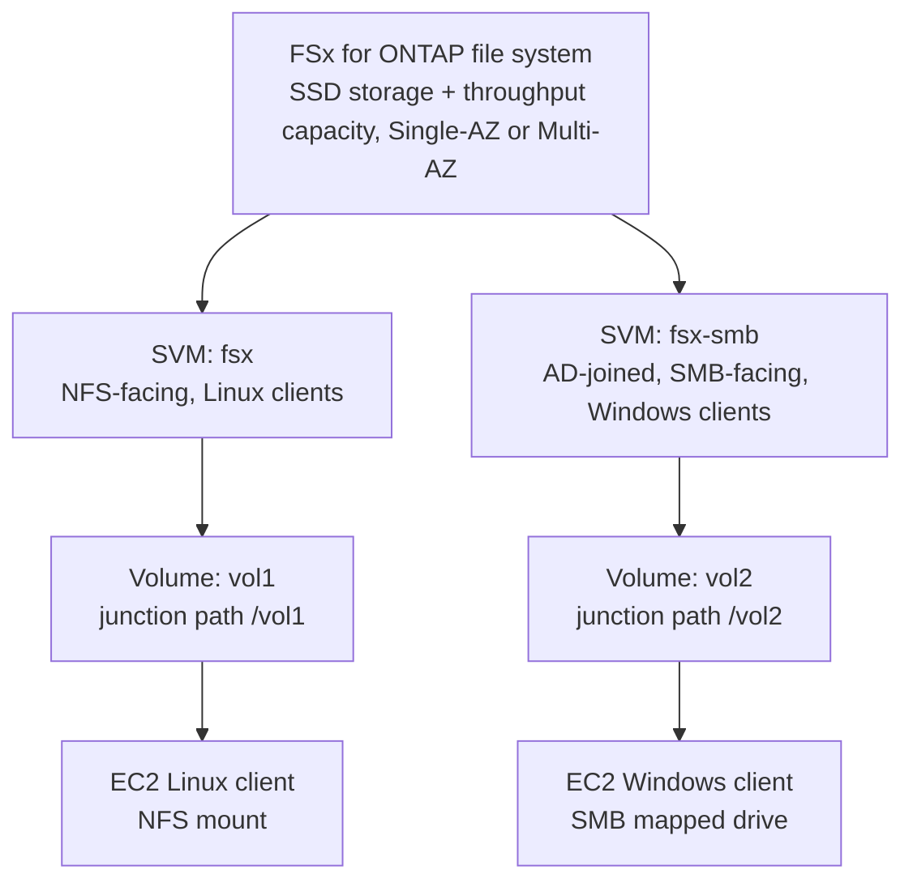

# 16 - FSx for NetApp ONTAP

> Goal: understand FSx for ONTAP's own internal structure — it isn't just "a file system," it's AWS running a real, multi-tenant **NetApp ONTAP cluster**, with its own hierarchy of objects (file system → SVM → volume) that doesn't exist in EFS or plain EBS. Get that hierarchy straight before the [hands-on](17-FSx-for-NetApp-ONTAP-HandsOn.md), since every console screen assumes you already know which level you're working at.

---

## 1. Why this exists: real NetApp, not "NetApp-like"

Plenty of enterprises already run **NetApp ONTAP** on-premises — it's one of the most established enterprise NAS platforms, with its own well-known feature set (SnapMirror replication, FlexClone instant cloning, storage efficiency via dedup/compression). Migrating off it usually means either giving up those specific features, or continuing to self-host ONTAP inside AWS on EC2 (still your problem to patch, scale, and make highly available).

**FSx for NetApp ONTAP** is AWS running the **actual ONTAP software** as a managed service — not a compatible clone, the real thing, accessed with the same NetApp CLI/API/tooling teams already know, so existing scripts, backup tools, and operational habits keep working unchanged.

---

## 2. The object hierarchy: file system → SVM → volume

This is the one structural idea that makes ONTAP different from every other storage note in this folder:

| Level | What it is | Analogy |
|---|---|---|
| **File system** | The underlying ONTAP cluster itself — the infrastructure, storage capacity, and throughput capacity you provision | The physical (or virtual) NetApp appliance |
| **Storage Virtual Machine (SVM)** | A logically isolated "virtual NetApp filer" running inside the file system — its own namespace, its own security/auth settings (including its own optional Active Directory join for SMB), its own admin credentials | A tenant, or a separate virtual server, carved out of the same underlying cluster |
| **Volume** | The actual container for your data, created inside an SVM, mounted at a **junction path** — this is what you actually mount over NFS or share over SMB | A specific shared folder/drive |

A single file system can host **multiple SVMs**, and each SVM can host **multiple volumes** — e.g. one SVM joined to Active Directory serving Windows teams over SMB, and a separate SVM on the same file system serving Linux teams over NFS, all sharing the same underlying capacity and throughput.

---

## 3. Architecture & workflow

---

## 4. Deployment types and storage efficiency

| Setting | Options | Notes |
|---|---|---|
| **Deployment type** | **Single-AZ** or **Multi-AZ** | Multi-AZ replicates data and fails over across AZs, same HA instinct as every other Multi-AZ service in this repo |
| **Storage efficiency** | Enabled / Disabled | Turns on ONTAP's own **compression, deduplication, and compaction** — a genuine NetApp-native feature, not something AWS bolted on |
| **Endpoint IP address range** (Multi-AZ only) | From the VPC's own CIDR, or a separate floating range outside it | Each SVM consumes an IP from this range — worth remembering if you plan to host many SVMs on one file system |

---

## 5. Key ONTAP-native features worth knowing by name

- **SnapMirror** — NetApp's own replication technology, usable for scheduled cross-Region/cross-account replication of ONTAP data, including from an on-premises ONTAP system into FSx for ONTAP.
- **FlexClone** — near-instant, storage-efficient cloning of a volume (a clone shares blocks with its parent until data actually diverges) — useful for spinning up a full-size dev/test copy of a dataset without doubling storage cost immediately.
- **Multi-protocol access** — the same underlying volume's data can be exposed over **NFS, SMB, and iSCSI** (block, via iSCSI) depending on the SVM configuration — a genuinely unique FSx capability, since every other FSx type speaks exactly one protocol family.

> 🎯 **Exam tip:** "SnapMirror," "FlexClone," "multi-protocol NFS **and** SMB on the same data," or "lift-and-shift an existing on-premises NetApp environment" are the clearest FSx for ONTAP signals — none of the other three FSx types offer NetApp-specific features or true multi-protocol access to the same volume.

---

## 6. Recap

- FSx for ONTAP runs **real NetApp ONTAP software** as a managed service — same tooling, same feature names, same operational model teams already know from on-premises NetApp.
- Its object model is a hierarchy unique among this folder's services: **file system → Storage Virtual Machine (SVM) → volume**, with the SVM as the isolation/auth boundary and the volume as what's actually mounted.
- Signature features: **SnapMirror** (replication), **FlexClone** (instant cloning), **storage efficiency** (dedup/compression/compaction), and true **multi-protocol** (NFS + SMB + iSCSI) access.
- Next: [FSx for NetApp ONTAP Hands-On](17-FSx-for-NetApp-ONTAP-HandsOn.md) — build a real file system, SVM, and volume, then mount it over NFS from an EC2 instance.

### Sources
- [What is Amazon FSx for NetApp ONTAP? — AWS docs](https://docs.aws.amazon.com/fsx/latest/ONTAPGuide/what-is-fsx-ontap.html)
- [Getting started with Amazon FSx for NetApp ONTAP — AWS docs](https://docs.aws.amazon.com/fsx/latest/ONTAPGuide/getting-started.html)
- [FSx for ONTAP high availability and deployment options — AWS docs](https://docs.aws.amazon.com/fsx/latest/ONTAPGuide/high-availability-AZ.html)
