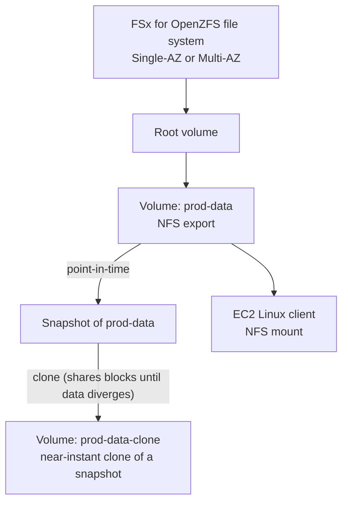

# 18 - Amazon FSx for OpenZFS

> Goal: understand what makes FSx for OpenZFS distinct from both EFS and FSx for ONTAP — it's built around the **ZFS** file system's own signature capability (near-instant snapshots and clones), delivered as SSD-class, low-latency NFS storage, without ONTAP's SVM/multi-protocol complexity.

---

## 1. Why this exists: ZFS's specific feature set, fully managed

**ZFS** is a well-known open-source file system (and volume manager) prized for a specific set of capabilities: extremely fast, storage-efficient **point-in-time snapshots**, near-instant **clones** built from those snapshots, and strong built-in data integrity checking. Plenty of Linux/Unix shops already run ZFS on self-managed file servers specifically for these properties.

**Amazon FSx for OpenZFS** runs the real, open-source **OpenZFS** file system as a managed service — same snapshot/clone semantics, same general operational model, without you having to patch, size, or fail over the underlying servers yourself.

> 🧠 **Mental model:** if FSx for ONTAP is "real NetApp, with NetApp's enterprise feature set (SnapMirror, FlexClone, multi-protocol)," FSx for OpenZFS is "real ZFS, with ZFS's feature set (fast snapshots/clones, high per-operation IOPS)" — similar shape, different underlying technology, different signature strengths.

---

## 2. Architecture & workflow

---

## 3. Protocol and deployment model

| | Detail |
|---|---|
| **Protocol** | **NFS only** (v3, v4.0, v4.1, v4.2) — no SMB, no iSCSI, unlike ONTAP's multi-protocol support |
| **Deployment types** | **Multi-AZ (HA)**, **Single-AZ (HA)** (primary + standby in the same AZ), **Single-AZ (non-HA)** (self-healing within one AZ, ~30 min recovery instead of ~60s failover) |
| **Storage classes** | **SSD** (you provision a fixed size, pay for what you provision) or **Intelligent-Tiering** (fully elastic, pay for what you actually store, optional SSD read cache) |
| **Performance** | Up to millions of IOPS and sub-millisecond-to-hundreds-of-microseconds latency from cache/memory; still very high (400,000 IOPS, 10 GBps) reading straight from disk |

---

## 4. Snapshots and clones — the headline feature

- **Snapshots** are **near-instant** and stored locally on the file system — capturing a point-in-time state without copying the underlying data.
- **Clones** are writable volumes created **from a snapshot**, near-instantly, and initially share storage blocks with the parent — you only pay for genuinely new/changed data as the clone diverges.

This combination is what makes OpenZFS a natural fit for workflows like "spin up an isolated, full-size copy of production data for a dev/test/CI job," repeated often, without the storage cost or wait time of a full physical copy each time.

> 🎯 **Exam tip:** "near-instant snapshots and clones," "ZFS," or "replace an on-premises ZFS file server" are the clearest FSx for OpenZFS signals. If the scenario also mentions **SMB** or **NetApp-specific** features (SnapMirror, FlexClone, multi-protocol), that's ONTAP instead — [OpenZFS vs. NetApp ONTAP](19-OpenZFS-vs-NetApp-ONTAP.md) draws this line precisely.

---

## 5. Recap

- FSx for OpenZFS runs the real, open-source **OpenZFS** file system, delivering ZFS's specific strengths — fast **snapshots** and near-instant, storage-efficient **clones** — as a fully managed AWS service.
- **NFS-only** (no SMB/iSCSI), with three deployment tiers (Multi-AZ HA, Single-AZ HA, Single-AZ non-HA) and two storage classes (SSD, Intelligent-Tiering).
- Best recognized by workload description: replacing an on-premises ZFS server, or needing frequent, fast, storage-efficient snapshot/clone workflows.
- Next: [OpenZFS vs. NetApp ONTAP](19-OpenZFS-vs-NetApp-ONTAP.md) — a direct, side-by-side comparison of AWS's two "specialized NAS" FSx types, since they're the two most easily confused with each other.

### Sources
- [What is Amazon FSx for OpenZFS? — AWS docs](https://docs.aws.amazon.com/fsx/latest/OpenZFSGuide/what-is-fsx.html)
- [Amazon FSx for OpenZFS file system deployment options — AWS docs](https://docs.aws.amazon.com/fsx/latest/OpenZFSGuide/availability-durability.html)
- [Working with Amazon FSx for OpenZFS snapshots — AWS docs](https://docs.aws.amazon.com/fsx/latest/OpenZFSGuide/snapshots.html)
- [Amazon FSx for OpenZFS performance — AWS docs](https://docs.aws.amazon.com/fsx/latest/OpenZFSGuide/performance.html)
