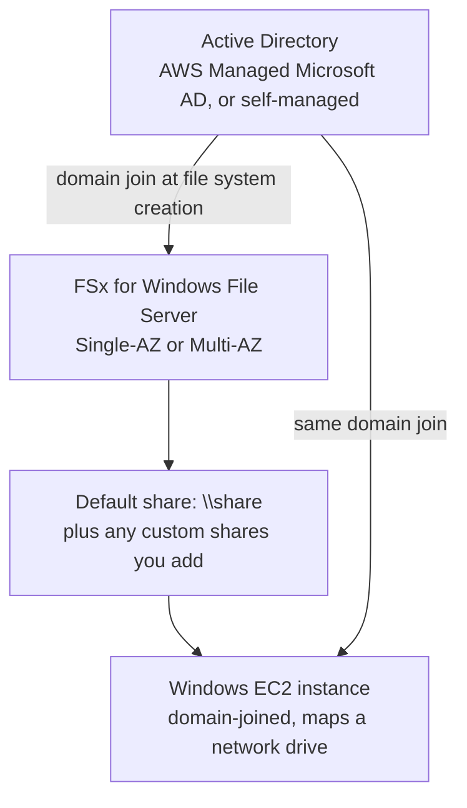

# 20 - FSx for Windows File Server

> Goal: understand FSx for Windows File Server as the direct Windows-world counterpart to EFS — same "shared network drive for many instances" idea, but genuinely native **SMB**/**NTFS**, with the one dependency that changes everything about how you set it up: it needs **Active Directory** ([Active Directory for FSx](21-Active-Directory-for-FSx.md) covers that piece in depth before the hands-on).

---

## 1. Why this exists: EFS can't speak Windows's language

Every file storage note so far in this folder — Instance Store, EBS, EFS — is either block storage or Linux-native NFS. Windows workloads don't work that way: they expect an **SMB** network share, backed by real **NTFS** semantics (Windows ACLs, NTFS permissions, "previous versions" self-service restore), and they expect to authenticate users against **Active Directory**, exactly like an on-premises Windows file server would.

**FSx for Windows File Server** is a fully managed, **real Windows Server** file system underneath — the same SMB protocol versions (2.0-3.1.1), the same NTFS features, joined to Active Directory for authentication, so existing Windows applications, scripts, and admin habits transfer over unchanged.

---

## 2. Architecture & workflow

The instance and the file system both need to trust the **same** Active Directory — that's what lets a domain user authenticate once and have that identity recognized by both.

---

## 3. Deployment types

| Type | Availability model |
|---|---|
| **Single-AZ 1** | Original single-AZ generation |
| **Single-AZ 2** | Newer single-AZ generation — supports both SSD and HDD storage |
| **Multi-AZ** | Primary + standby file server in separate AZs, automatic failover — the same HA pattern as everywhere else in this repo, at extra cost |

---

## 4. Storage types and throughput

| Setting | Options | Best for |
|---|---|---|
| **Storage type** | **SSD** or **HDD** | SSD: databases, media processing, latency-sensitive apps. HDD: home directories, general file/departmental shares, content management — broad, less latency-critical workloads |
| **Provisioned SSD IOPS** | **Automatic** (3 IOPS/GiB) or **User-provisioned** | Automatic is the default and fine for most workloads; provision manually only when a specific IOPS floor is required |
| **Throughput capacity** | AWS-recommended default, or a manually specified value | Recommended is based on storage size; bump it manually if you also enable file access auditing (requires ≥ 32 MBps) |

---

## 5. Windows-native features worth knowing by name

- **Default share (`\share`)** — every file system comes with one built-in share; you create additional ones with the Windows-native **Shared Folders** GUI tool, not a separate AWS console screen.
- **DFS Namespaces** — lets you present shares from multiple file systems (or even multiple AWS accounts/Regions) under one unified namespace path, the same DFS technology Windows admins already use on-premises.
- **Shadow copies** — Windows's "previous versions" self-service restore feature, letting end users right-click a file and roll it back themselves without an admin restoring from backup.
- **NTFS ACLs and quotas** — real per-file/folder Windows permissions and per-user/group storage quotas, not a Unix-permissions approximation.

> 🎯 **Exam tip:** any mention of **SMB**, **Windows Server**, **NTFS ACLs**, **DFS Namespaces**, **shadow copies**, or **"needs Active Directory"** for a shared drive is FSx for Windows File Server — this is the single most exam-relevant FSx type precisely because it's the direct answer to "what's the EFS-equivalent for Windows."

---

## 6. Recap

- FSx for Windows File Server is a fully managed, genuinely native **Windows Server** file system — real SMB, real NTFS, real Windows features (DFS Namespaces, shadow copies, ACLs, quotas).
- **Storage**: SSD or HDD, with Single-AZ 1/2 or Multi-AZ deployment types.
- Its one hard dependency — **Active Directory**, for both the file system and any client that mounts it — is significant enough to get its own note next.
- Next: [Active Directory for FSx](21-Active-Directory-for-FSx.md) — the AWS Managed Microsoft AD vs. self-managed AD decision you have to make *before* creating a Windows File Server file system.

### Sources
- [What is FSx for Windows File Server? — AWS docs](https://docs.aws.amazon.com/fsx/latest/WindowsGuide/what-is.html)
- [Availability and durability: Single-AZ and Multi-AZ file systems — AWS docs](https://docs.aws.amazon.com/fsx/latest/WindowsGuide/high-availability-multiAZ.html)
- [Managing storage capacity and configuration — AWS docs](https://docs.aws.amazon.com/fsx/latest/WindowsGuide/managing-storage-configuration.html)
- [Using DFS Namespaces — AWS docs](https://docs.aws.amazon.com/fsx/latest/WindowsGuide/dfs-namespaces.html)
- [Working with shadow copies — AWS docs](https://docs.aws.amazon.com/fsx/latest/WindowsGuide/using-shadow-copies.html)
