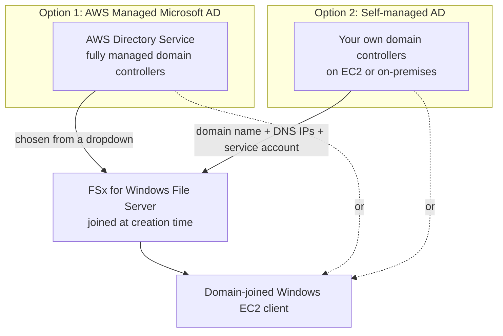

# 21 - Active Directory for FSx

> Goal: make the one decision you have to get right *before* creating an FSx for Windows File Server file system — which Active Directory it joins — since this determines your network setup, your ongoing admin overhead, and whether it can talk to an existing corporate domain at all. The [hands-on that follows](22-FSx-for-Windows-File-Server-HandsOn-Part-1.md) picks the simpler of the two options below and builds it for real.

---

## 1. Why FSx for Windows File Server needs AD at all

SMB file access is authenticated the same way Windows has always authenticated file shares: against **Active Directory**. There's no "just use an IAM role" shortcut here — every FSx for Windows File Server file system must be joined to an AD domain at creation time, and every client that wants to authenticate against it (beyond anonymous/guest access, which most real deployments disable) needs to be joined to that same domain.

---

## 2. The two options AWS actually gives you

| | **AWS Managed Microsoft AD** | **Self-managed Active Directory** |
|---|---|---|
| **What it is** | A real Microsoft AD domain, but AWS provisions, patches, and makes it highly available for you (via AWS Directory Service) | Your own AD — either already running on EC2, or reachable from your on-premises data center over Direct Connect/Site-to-Site VPN |
| **Setup at FSx creation** | Pick **AWS Managed Microsoft Active Directory** → choose your existing Directory Service directory from a dropdown | Pick **Self-managed Microsoft Active Directory** → manually supply domain name, DNS server IPs, and service-account credentials (plaintext, or an AWS Secrets Manager secret ARN — the recommended way) |
| **Ongoing admin burden** | AWS handles patching, backups, HA | You own patching, backups, HA — same as any self-hosted AD |
| **Talks to an existing on-prem domain?** | Only via a **one-way trust** relationship (your corporate domain trusts the managed domain) — extra setup, but keeps FSx fully decoupled from your production AD | Yes, natively — FSx joins your actual existing domain directly, no trust relationship needed |
| **Best fit** | Greenfield/AWS-native environments with no existing AD to integrate with | Enterprises already running AD (on-premises or on EC2) that want FSx to join that exact domain |

> 🧠 **Mental model:** AWS Managed Microsoft AD is "let AWS run your domain controller for you." Self-managed AD is "point FSx at the domain controller you already run." Both result in the exact same SMB authentication experience for end users — the difference is entirely about who operates the domain controller.

---

## 3. What a domain join actually requires

Regardless of which option you pick, FSx needs:

- **Network reachability** to the domain's DNS servers and domain controllers — same VPC for AWS Managed Microsoft AD in the simple case, or a VPN/Direct Connect/peering path for anything off-VPC.
- **A service account** with permission to join computers to the domain (AWS Managed Microsoft AD's admin account works out of the box; a self-managed AD needs a dedicated service account with the right delegated permissions).
- **Security group rules** allowing the AD-related ports (DNS, Kerberos, LDAP, SMB, and more) between the FSx file system's security group and the AD's own security group/domain controllers — the same "add an outbound rule to the AD's SG" step [FSx for Windows File Server](20-FSx-for-Windows-File-Server.md)'s architecture diagram implied.

---

## 4. Architecture & workflow

---

## 5. What the next hands-on note will build

To keep the lab self-contained (no dependency on a pre-existing corporate AD or VPN), [FSx for Windows File Server Hands-On Part 1](22-FSx-for-Windows-File-Server-HandsOn-Part-1.md) uses **AWS Managed Microsoft AD** — genuinely the simpler path for a from-scratch demo, and the option AWS's own getting-started guide defaults to.

> 🎯 **Exam tip:** "join an existing on-premises Active Directory without standing up a new domain in AWS" → **self-managed AD**. "Fully AWS-managed, highly available domain with no on-premises dependency" → **AWS Managed Microsoft AD**. If a question mentions a **trust relationship** between two domains, that's specifically the AWS Managed Microsoft AD path talking to an *existing separate* corporate domain — not the same thing as self-managed AD joining that domain directly.

---

## 6. Recap

- FSx for Windows File Server always requires an Active Directory join — there's no AD-free SMB authentication path.
- **AWS Managed Microsoft AD**: AWS operates the domain controllers for you; connects to an existing on-premises domain only via an optional one-way trust.
- **Self-managed AD**: you point FSx directly at a domain you already run (on EC2 or on-premises); more setup, but joins your real existing domain natively.
- Either way, FSx needs network reachability to DNS/domain controllers, a service account with domain-join rights, and the right security group rules.
- Next: [FSx for Windows File Server Hands-On Part 1](22-FSx-for-Windows-File-Server-HandsOn-Part-1.md) — stand up an AWS Managed Microsoft AD directory and a domain-joined Windows EC2 instance, the prerequisites for Part 2's file system.

### Sources
- [Working with Microsoft Active Directory in FSx for Windows File Server — AWS docs](https://docs.aws.amazon.com/fsx/latest/WindowsGuide/aws-ad-integration-fsxW.html)
- [Using AWS Managed Microsoft AD — AWS Directory Service docs](https://docs.aws.amazon.com/directoryservice/latest/admin-guide/directory_microsoft_ad.html)
- [Using a self-managed Microsoft Active Directory with FSx — AWS docs](https://docs.aws.amazon.com/fsx/latest/WindowsGuide/self-managed-AD.html)
- [Getting started with Amazon FSx for Windows File Server — AWS docs](https://docs.aws.amazon.com/fsx/latest/WindowsGuide/getting-started.html)
