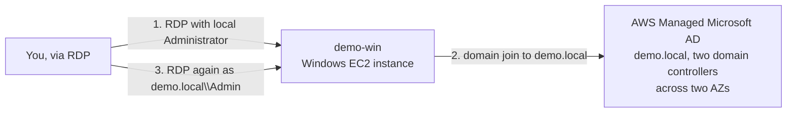

# 22 - FSx for Windows File Server (Hands-On) — Part 1: Active Directory and a Domain-Joined Client

> Goal: build the two prerequisites [Active Directory for FSx](21-Active-Directory-for-FSx.md) flagged as non-negotiable — an **AWS Managed Microsoft AD** directory, and a **Windows EC2 instance joined to it** — before Part 2 actually creates the FSx file system itself. Splitting this into two parts mirrors the real dependency order: AD and a working client have to exist first.

---

## 1. Prerequisites

- A VPC with at least two subnets in two different Availability Zones (AWS Managed Microsoft AD requires two subnets for its own domain controllers, same as any Multi-AZ-style AWS service).
- A key pair for Windows password retrieval, referred to here as `demo-win-key`.

---

## 2. Create the AWS Managed Microsoft AD directory

1. **Directory Service console** → **Directories** → **Set up directory**.
2. **Directory type**: **AWS Managed Microsoft AD**.
3. **Edition**: **Standard** (sufficient for this demo; Enterprise scales further and costs more).
4. **Directory DNS name**: `demo.local`.
5. **Admin password**: set one and **write it down** — you need it again in Section 5, and there's no way to recover a forgotten one without recreating the directory.
6. **VPC**: your VPC → **Subnets**: pick your two subnets (one per AZ) — this is where the directory's own domain controllers get deployed.
7. **Create directory**. This takes a while (20-45 minutes) — AWS is provisioning real, redundant domain controllers behind the scenes.

---

## 3. Launch a Windows EC2 instance

1. **EC2 console** → **Launch instances** → **Name**: `demo-win`.
2. **AMI**: **Windows Server 2022 Base** (or later) → **Instance type**: `t3.micro` (or `t3.small` if you want a bit more headroom for the RDP session).
3. **Key pair**: `demo-win-key`.
4. **Network settings**: same **VPC** as the directory → a **public subnet** (simplest for this demo — RDP access needs a route to it) → **Security group**: allow inbound **RDP 3389** from **My IP**.
5. **Launch instance**.

---

## 4. Connect and retrieve the administrator password

1. **EC2 console** → select `demo-win` → **Connect** → **RDP client** tab → **Get password** → browse to `demo-win-key`'s `.pem` file → **Decrypt password**.
2. **Download remote desktop file**, open it, and connect using the decrypted **Administrator** password.

---

## 5. Join the instance to the domain

1. Inside the RDP session, open **Server Manager** (opens automatically on first login) → **Local Server** → next to **Workgroup**, click the link to open **System Properties**.
2. **Change...** → under **Member of**, select **Domain** → enter `demo.local` → **OK**.
3. When prompted, enter the domain **Admin** credentials — either `demo.local\Admin` or just `Admin`, with the password from Section 2, Step 5.
4. Accept the "Welcome to the demo.local domain" message → **restart the instance** to apply the change.
5. Reconnect over RDP after the restart, this time logging in as `demo.local\Admin` with the same password.

`demo-win` is now a domain member — it trusts `demo.local` for authentication, exactly like an on-premises Windows machine joined to a corporate domain.

---

## 6. Architecture & workflow

---

## 7. Troubleshooting

| Symptom | Likely cause / fix |
|---|---|
| Directory creation stuck at "Creating" for a long time | Normal — this genuinely takes 20-45 minutes; only investigate if it fails outright |
| Domain join fails with "cannot contact the domain" | `demo-win` isn't in the same VPC as the directory, or its security group blocks outbound traffic to the directory's domain controllers — the default VPC security group allows this by default, so this usually means a custom SG was applied |
| Can't RDP after domain join + restart | Try the **fully qualified** login format `demo.local\Admin`, not just `Admin` — Windows needs the domain prefix once the machine is no longer standalone |
| Forgot the directory Admin password | No recovery path — delete the directory and recreate it; this is exactly why Section 2 says to write it down immediately |

---

## 8. Recap

- Created an **AWS Managed Microsoft AD** directory (`demo.local`) spanning two AZs — AWS-operated domain controllers, no self-managed AD infrastructure.
- Launched `demo-win`, a Windows EC2 instance, and joined it to that domain — confirmed by logging back in with domain credentials (`demo.local\Admin`) instead of the local Administrator account.
- This satisfies both of [Active Directory for FSx](21-Active-Directory-for-FSx.md)'s prerequisites: a working AD, and a client that trusts it.
- Next: [FSx for Windows File Server Hands-On Part 2](23-FSx-for-Windows-File-Server-HandsOn-Part-2.md) — create the actual FSx file system joined to `demo.local`, then mount and write to a real SMB share from `demo-win`.

### Sources
- [Getting started with Amazon FSx for Windows File Server — AWS docs](https://docs.aws.amazon.com/fsx/latest/WindowsGuide/getting-started.html)
- [Create your AWS Managed Microsoft AD — AWS Directory Service docs](https://docs.aws.amazon.com/directoryservice/latest/admin-guide/ms_ad_getting_started_create_directory.html)
- [Manually join a Windows instance — AWS Directory Service docs](https://docs.aws.amazon.com/directoryservice/latest/admin-guide/join_windows_instance.html)
