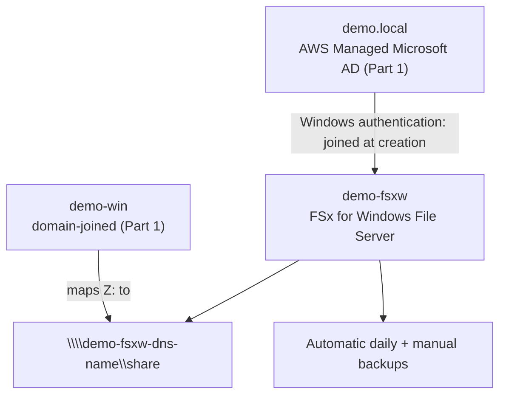

# 23 - FSx for Windows File Server (Hands-On) — Part 2: Create, Mount, and Back Up

> Goal: create the actual FSx for Windows File Server file system, joined to Part 1's `demo.local` directory, then map its default share from `demo-win`, write real data to it, and take a manual backup — completing the same "prove it end to end" pattern as every other hands-on in this folder.

---

## 1. Create the file system

1. **FSx console** → **Create file system** → **FSx for Windows File Server** → **Next**.
2. **Creation method**: **Standard create**.
3. **File system name**: `demo-fsxw`.
4. **Deployment type**: **Single-AZ 2** (cheapest option that still supports both SSD and HDD — Multi-AZ is the same extra-cost HA pattern as every other Multi-AZ option in this repo).
5. **Storage type**: **SSD**.
6. **Provisioned SSD IOPS**: **Automatic**.
7. **Storage capacity**: `32` GiB (the minimum).
8. **Throughput capacity**: leave the recommended default.
9. **Network & security**: **VPC** — the same VPC as Part 1's directory and `demo-win` → **Subnet** — one of the two you used for the directory → **VPC security groups**: the default VPC security group is fine here since it already permits traffic within the VPC (in a real deployment, confirm the rules from [FSx for Windows File Server](20-FSx-for-Windows-File-Server.md)'s architecture diagram — inbound SMB from clients, outbound to the AD's domain controllers).
10. **Windows authentication**: **AWS Managed Microsoft Active Directory** → select your `demo.local` directory from the dropdown.
11. **Encryption**: leave the default `aws/fsx` KMS key.
12. **Backup and maintenance**: leave **Daily automatic backup** enabled, defaults otherwise.
13. **Next** → review → **Create file system**. Wait for status **Available**.

---

## 2. Find the file system's DNS name

1. **FSx console** → `demo-fsxw` → **Attach** (or the **Network & security** tab) → copy the **DNS name**.

---

## 3. Map the default share from `demo-win`

Reconnect to `demo-win` over RDP (logged in as `demo.local\Admin`, per Part 1 Section 5), then:

1. Open **File Explorer** → right-click **Network** → **Map network drive**.
2. **Drive**: any free letter, e.g. `Z:`.
3. **Folder**: `\\<file-system-dns-name>\share` (the default share every FSx for Windows File Server file system ships with).
4. Check **Reconnect at sign-in** → **Finish**.

---

## 4. Prove it works — write data, confirm persistence

1. On the newly mapped `Z:` drive, create a text file (`Notepad` → save to `Z:\hello.txt`, or right-click → **New** → **Text Document**).
2. Confirm it's really on the file system, not local disk: **FSx console** → `demo-fsxw` → note the file system's storage-used metric ticks up slightly, or simply disconnect and remap the drive from a second RDP session to `demo-win` and confirm `hello.txt` is still there.

---

## 5. Take a manual backup

1. **FSx console** → `demo-fsxw` → **Overview** tab → **Create backup**.
2. Name it `demo-fsxw-manual-backup-1` → **Create backup**. Status shows **CREATING**, then **AVAILABLE** after a few minutes.

This is on top of the **daily automatic backup** already running by default (Section 1, step 12) — the same "automatic baseline + manual on-demand" backup pattern [EBS snapshots](08-EBS-Snapshot-Backup-HandsOn.md) and EFS both follow.

---

## 6. Architecture & workflow

---

## 7. Clean up

1. On `demo-win`: disconnect the mapped drive (**File Explorer** → right-click `Z:` → **Disconnect**).
2. **FSx console** → `demo-fsxw` → **Actions** → **Delete file system** — choose whether to keep a final backup, then confirm by typing the file system ID.
3. Delete the manual backup from Section 5 too, if you don't want it kept (**Backups** tab → select it → **Delete backup**).
4. **EC2 console** → terminate `demo-win`.
5. **Directory Service console** → delete the `demo.local` directory from Part 1.

---

## 8. Troubleshooting

| Symptom | Likely cause / fix |
|---|---|
| File system creation fails at the AD step | `demo-fsxw`'s chosen subnet can't reach `demo.local`'s domain controllers — confirm it's in the same VPC as the directory from Part 1 |
| Mapped drive fails with "access denied" | You're not logged into `demo-win` as a `demo.local` domain account — a **local** Administrator session has no domain identity to authenticate the share with |
| Mapped drive fails with "network path not found" | Typo in the UNC path, or you used the file system ID instead of its **DNS name** — recheck Section 2 |
| Backup stuck on **CREATING** for a long time | Normal for larger file systems; only investigate if it eventually shows **FAILED** |

---

## 9. Recap

- Created `demo-fsxw`, an FSx for Windows File Server file system, joined directly to Part 1's `demo.local` AWS Managed Microsoft AD directory.
- Mapped its default `\share` from `demo-win` using a standard Windows **Map network drive** — genuinely native SMB, no special client software.
- Wrote and confirmed persisted data, then took a manual backup on top of the default daily automatic ones.
- This closes the loop on [Active Directory for FSx](21-Active-Directory-for-FSx.md)'s two-option AD decision, using the simpler **AWS Managed Microsoft AD** path end to end.
- Next: [FSx for Lustre](24-FSx-for-Lustre.md) — the fourth and final FSx type, built for a completely different problem: HPC/ML throughput, not shared office file access.

### Sources
- [Getting started with Amazon FSx for Windows File Server — AWS docs](https://docs.aws.amazon.com/fsx/latest/WindowsGuide/getting-started.html)
- [Accessing data using file shares — AWS docs](https://docs.aws.amazon.com/fsx/latest/WindowsGuide/using-file-shares.html)
- [Protecting your data with backups — AWS docs](https://docs.aws.amazon.com/fsx/latest/WindowsGuide/using-backups.html)
