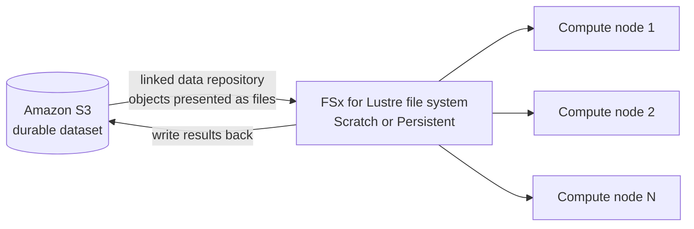

# 24 - FSx for Lustre

> Goal: understand FSx for Lustre's completely different design goal from the other three FSx types — it's not built for "many people share a drive," it's built for **one massive compute job reading and writing data as fast as physically possible**. This closes out the EC2-Storage folder.

---

## 1. Why this exists: HPC and ML don't bottleneck on capacity, they bottleneck on throughput

EFS, FSx for Windows File Server, FSx for ONTAP, and FSx for OpenZFS all solve some version of "many instances need shared access to files." **FSx for Lustre** solves a different problem entirely: **HPC simulations, ML model training, video rendering, financial modeling** — workloads where hundreds or thousands of compute nodes need to read and write a shared dataset **simultaneously, at massive aggregate throughput**, and where storage that can't keep up with compute directly wastes expensive compute time sitting idle.

**Lustre** is a real, widely used open-source parallel file system built specifically for this — it powers many of the world's fastest supercomputers. FSx for Lustre runs it as a managed service, POSIX-compliant, so existing Linux HPC/ML tooling works unmodified.

---

## 2. Deployment types: scratch vs. persistent

| Type | Data durability | Best for |
|---|---|---|
| **Scratch** | **Not replicated** — data is lost if a file server fails | Short-term, throughput-focused processing where the source data lives durably elsewhere (e.g. S3) and can simply be reprocessed if something fails |
| **Persistent** (1 or 2) | **Replicated**, with automatic file server replacement on failure | Longer-term storage and throughput-focused workloads where losing data mid-job isn't acceptable |

> 🧠 **Mental model:** Scratch is genuinely disposable — treat it like a fast local disk you'd never store your only copy of anything on. Persistent is what you reach for the moment "temporary" no longer applies.

---

## 3. Storage classes

| Class | Optimized for |
|---|---|
| **SSD** | Small, random file operations, consistent sub-millisecond latency across the **entire** dataset, up to TBps throughput |
| **Intelligent-Tiering** | Most workloads that don't need low latency on the *whole* dataset — fully elastic, cost-effective, with an optional SSD read cache for frequently accessed data |
| **HDD** | Workloads tolerant of single-digit-millisecond latency, up to tens of GBps — lower cost, with an optional SSD read cache sized at 20% of HDD capacity |

---

## 4. The signature feature: native S3 data repository integration

An FSx for Lustre file system can be **linked directly to an S3 bucket**. Once linked:

- At creation, Amazon FSx imports a **listing** of the bucket's existing objects, presenting them as files — without copying the actual data until it's actually read.
- New objects added to the bucket afterward can also be imported, based on your preferences.
- The file system can **write data back to S3**, and **data repository tasks** manage bulk import/export between the file system and its S3 repository.

This is what makes Lustre a natural fit for cloud-native ML training: point a training job at the Lustre file system, let it transparently pull from S3 on first read (much faster than every node re-downloading from S3 directly), and optionally write results back to S3 when done.

---

## 5. Architecture & workflow

---

## 6. The exception worth remembering: Single-AZ only

Every other FSx type in this folder (Windows File Server, ONTAP, OpenZFS) offers a Multi-AZ option. **FSx for Lustre does not — it's Single-AZ only.** This is a deliberate design trade-off: Lustre's whole value proposition is raw throughput, and the workloads it targets are typically throughput-bound batch/training jobs rather than always-on, availability-critical services — so AWS didn't build a Multi-AZ variant for it.

> 🎯 **Exam tip:** "HPC," "machine learning training," "hundreds of GB/s or TB/s throughput," or "linked to an S3 data repository" → **FSx for Lustre**. And remember the trap: if a question implies Multi-AZ high availability is required *and* the workload is Lustre-flavored, that's a contradiction — Lustre can't do Multi-AZ, so the real answer is probably a different service (or accepting Single-AZ with the durability trade-offs Section 2's Scratch/Persistent split describes).

---

## 7. Recap

- FSx for Lustre solves a fundamentally different problem than EFS/Windows File Server/ONTAP/OpenZFS: **maximum throughput for HPC/ML workloads**, not general-purpose shared file access.
- **Scratch** (fast, not replicated, disposable) vs. **Persistent** (replicated, durable) is the core deployment decision; **SSD/Intelligent-Tiering/HDD** storage classes trade off latency consistency against cost.
- Its signature feature is **native S3 data repository linkage** — S3 objects presented transparently as files, with data written back to S3 when needed.
- **Single-AZ only** — the one FSx type that doesn't offer a Multi-AZ option, a deliberate trade-off given its throughput-focused, typically batch-oriented workload profile.
- This closes the **EC2-Storage** folder: **Instance Store/EBS** (starting at [AWS Storage Basics](01-AWS-Storage-Basics-Overview.md)) cover single-instance block storage and its backup lifecycle; **EFS** (starting at [Elastic File System](12-Elastic-File-System-EFS.md)) covers general-purpose shared Linux file storage; **FSx** (starting at [FSx Introduction](15-FSx-Introduction.md)) covers the four purpose-built managed file systems — Windows/SMB, NetApp ONTAP, OpenZFS, and Lustre — for everything EFS doesn't fit.

### Sources
- [What is Amazon FSx for Lustre? — AWS docs](https://docs.aws.amazon.com/fsx/latest/LustreGuide/what-is.html)
- [Deployment and storage class options for FSx for Lustre file systems — AWS docs](https://docs.aws.amazon.com/fsx/latest/LustreGuide/using-fsx-lustre.html)
- [Using data repositories with Amazon FSx for Lustre — AWS docs](https://docs.aws.amazon.com/fsx/latest/LustreGuide/fsx-data-repositories.html)
- [Getting started with Amazon FSx for Lustre — AWS docs](https://docs.aws.amazon.com/fsx/latest/LustreGuide/getting-started.html)
