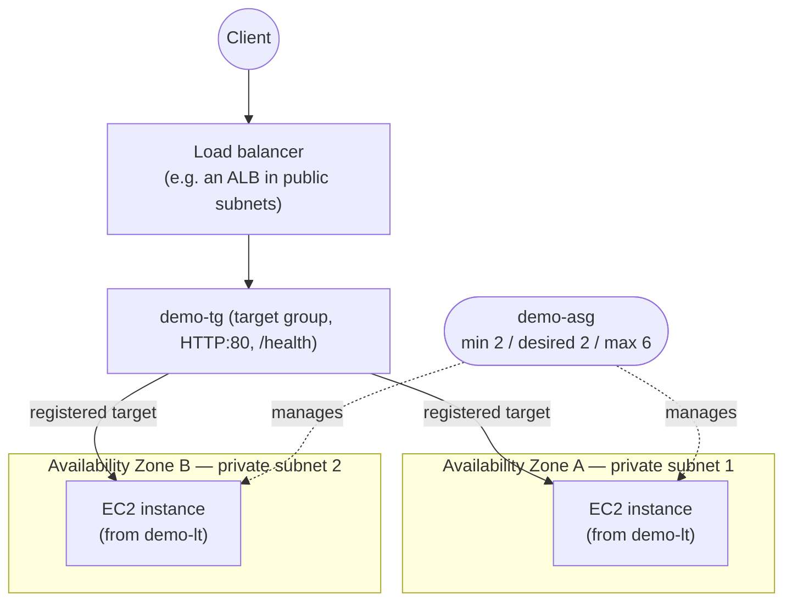

# 01 - Introduction to EC2 Auto Scaling

> Goal of this note: understand **what EC2 Auto Scaling is, the problem it solves, and its core building blocks** before touching the console. No hands-on yet — the next note creates the launch template and the group itself. This series builds one running example — an Auto Scaling group called `demo-asg` — across every note in this folder. All you need to follow along is a VPC with two private subnets in two different Availability Zones; the exact subnet layout isn't important here, since this folder is about scaling, not subnet design.

---

## 1. The problem: guessing capacity manually

Before Auto Scaling, running a fleet of EC2 instances meant a human (or a script) had to decide, ahead of time, exactly how many servers to run:

- **Guess too low** → traffic spikes overwhelm your servers, requests time out, customers leave. This is the classic "site crashed during the sale" story.
- **Guess too high** → you provision for peak load 24/7, and pay for idle CPU the other 22 hours a day.
- **Someone has to notice** a server died (hardware fault, OS crash, bad deploy) and manually launch a replacement — at 3 AM, if you're unlucky.

**EC2 Auto Scaling** removes the guesswork: you describe *rules* (how many instances, when, and under what conditions), and AWS continuously enforces those rules for you — launching instances when needed, terminating them when not, and replacing any that become unhealthy, all without a human clicking "Launch instance" each time.

> 🧠 **Mental model:** Auto Scaling is a **thermostat for compute capacity**. You set the target (or the rules), and it keeps adjusting the number of running instances to match — the same way a thermostat cycles a heater on/off to hold a target temperature, instead of a person manually flipping the switch.

---

## 2. The core building blocks

An Auto Scaling setup is really three cooperating pieces:

| Building block | What it defines |
|---|---|
| **Launch Template** | The "recipe" for a new instance — AMI, instance type, key pair, security group, user data, IAM instance profile. Built hands-on in the next note. |
| **Auto Scaling Group (ASG)** | The *group* of instances — which subnets/AZs, how many (min/max/desired), health checks, which target group to register with. Also built hands-on in the next note. |
| **Scaling policy / schedule** | The *rule* that changes desired capacity over time — manual, scheduled, dynamic, or predictive. Each gets its own hands-on note later in this series. |

- **Launch Template** = *what* an instance looks like when it's born.
- **Auto Scaling Group** = *where* instances live and *how many* should exist right now.
- **Scaling policy** = *why* that "how many" changes over time.

For our running example: the launch template is `demo-lt` (Amazon Linux 2023, `t3.micro`, key pair `demo-key`, security group `demo-app-sg`), and the group built from it is `demo-asg`, spanning two private subnets in two different Availability Zones (call them AZ-a and AZ-b) in your VPC.

---

## 3. The three capacity settings: min, max, desired

Every ASG has exactly three capacity numbers, and mixing these up is one of the most common beginner (and exam) confusions:

| Setting | Meaning |
|---|---|
| **Minimum capacity** | The ASG will never let the running instance count drop below this, even if a scale-in policy or a manual change tries to. |
| **Maximum capacity** | The ASG will never launch more instances than this, even if a scale-out policy asks for more — a hard ceiling that also protects you from runaway cost. |
| **Desired capacity** | The number of instances the ASG is *actively trying to maintain* right now. This is the number that scaling policies and scheduled actions actually change. |

**Concrete example — `demo-asg`:** Min = **2**, Desired = **2**, Max = **6**.

- Day-to-day, `demo-asg` keeps exactly **2** instances running (one per AZ) — that's the desired capacity.
- If a scaling policy decides to scale out under load, it raises desired capacity up to at most **6** — it can never launch a 7th instance.
- If desired capacity is ever pushed down (manually or by a scale-in policy), the ASG will never go below **2** — even if something also terminates an instance directly, the ASG relaunches a replacement to get back to at least the minimum.
- If an instance is terminated outside of the ASG's control (e.g. by an admin, or a hardware failure), the ASG notices the gap between "running" and "desired" and launches a replacement automatically — this self-healing behavior is *always on*, independent of which scaling option you use.

> ⚠️ **Desired capacity is not a suggestion — it's the enforced target.** Manually terminating an instance in the console does not shrink an ASG; the ASG just launches a new one to get back to desired capacity. To actually shrink permanently, you must lower desired (and possibly min) capacity itself — that hands-on exercise (manual scaling) is next after the launch template/ASG build.

---

## 4. How the ASG talks to a Load Balancer (high level)

`demo-asg`'s instances live in **private subnets** with no direct internet exposure. Traffic reaches them through a **target group** — for example, one attached to an Application Load Balancer sitting in public subnets — and that target group's health checks decide which instances actually receive traffic.

At a high level:

1. The ASG is configured to **attach to a target group** (call it `demo-tg`) as part of its setup.
2. Whenever the ASG **launches** a new instance, it automatically **registers** that instance as a target in `demo-tg`.
3. The load balancer only sends traffic to targets that `demo-tg`'s health checks report as **healthy**.
4. Whenever the ASG **terminates** an instance (scale-in, replacement, manual), it automatically **deregisters** that instance from `demo-tg` first, so no traffic is sent to an instance that's about to disappear.

This tight loop — launch → register → serve traffic → (unhealthy or scale-in) → deregister → terminate — is what lets `demo-asg` grow and shrink completely transparently to clients hitting the load balancer's DNS name. The full mechanics (deregistration delay/connection draining, cross-zone load balancing, ELB health check details) belong to load-balancing-specific material, not this ASG series — here it's enough to know registration/deregistration happens automatically as the group scales.

---

## 5. The four categories of scaling

`demo-asg`'s desired capacity can be changed by four different mechanisms — each gets its own hands-on note later in this series:

| Category | One-line summary |
|---|---|
| **Manual scaling** | An admin directly edits min/max/desired in the console/CLI — no automation, no metric involved. |
| **Scheduled scaling** | Change capacity at specific, predictable date/times you configure in advance (e.g. business hours ramp-up). |
| **Dynamic scaling** | Capacity reacts automatically to a **live CloudWatch metric** (e.g. target tracking on CPU, step scaling on an alarm). |
| **Predictive scaling** | Uses **machine learning on historical load patterns** to forecast demand and pre-provision capacity *before* it's needed. |

🎯 **Exam tip:** These four are commonly tested as a "pick the best option" scenario question — e.g. "traffic always spikes at 9 AM on weekdays" → **scheduled scaling**; "traffic is unpredictable and driven by real-time CPU load" → **dynamic scaling**; "we have a recurring but non-trivial daily/weekly demand curve and want AWS to forecast it" → **predictive scaling**; "we need a one-off manual override right now" → **manual scaling**.

---

## 6. Health checks and automatic instance replacement

An ASG continuously checks the health of every instance it manages, using up to two health check types together:

| Health check type | What it verifies | Catches |
|---|---|---|
| **EC2 status checks** | Is the underlying VM/hardware/network even reachable? (`Instance status` + `System status`) | Crashed OS, hypervisor/hardware fault, network config problem |
| **ELB health checks** | Does the load balancer's target group consider this instance healthy? (an HTTP/HTTPS request to a configured path, e.g. `/health`) | App-level failures: process hung, app returns 500s, app never started, dependency (DB) unreachable |

> ⚠️ **An instance can pass EC2 status checks while still being useless.** The OS/VM can be perfectly fine while the web server process on it has crashed or is stuck — that instance is "EC2-healthy" but serving nobody. This is exactly why a web-facing ASG like `demo-asg` should be configured with **both** EC2 *and* ELB health checks — EC2 checks alone are not enough for a fleet sitting behind a target group.

When either check reports an instance as unhealthy (after any configured grace period), the ASG:
1. Marks the instance `Unhealthy`.
2. Terminates it.
3. Launches a replacement instance from the launch template to restore desired capacity.
4. The replacement registers with `demo-tg` and starts receiving traffic once it passes its own health checks.

This replace-on-failure behavior is **always active** for every ASG, regardless of which scaling category (manual/scheduled/dynamic/predictive) is also in use — it's the baseline self-healing guarantee of Auto Scaling.

---

## 7. Recap

- EC2 Auto Scaling replaces manual capacity guessing with rules AWS enforces continuously: launch when needed, terminate when not, replace when unhealthy.
- Three building blocks: **Launch Template** (`demo-lt`, the instance recipe) → **Auto Scaling Group** (`demo-asg`, the fleet + its home subnets) → **scaling policy/schedule** (the rule that adjusts desired capacity).
- Three capacity numbers: **min** (floor), **max** (ceiling), **desired** (the actively enforced target) — `demo-asg` uses min 2 / desired 2 / max 6.
- The ASG auto-registers/deregisters instances with a target group (`demo-tg`) as it scales, so whatever load balancer sits in front always balances traffic across exactly the currently-healthy fleet.
- Four scaling categories: **Manual**, **Scheduled**, **Dynamic**, **Predictive** — each covered hands-on later in this series.
- **EC2 status checks** (is the VM alive?) + **ELB health checks** (is the app healthy?) together decide whether an instance gets replaced — ELB checks catch app-level failures EC2 checks miss.
- Next: Note 02 builds `demo-lt` and `demo-asg` for real in the console.

---

### Sources
- [What is Amazon EC2 Auto Scaling? – AWS docs](https://docs.aws.amazon.com/autoscaling/ec2/userguide/what-is-amazon-ec2-auto-scaling.html)
- [Auto Scaling groups – AWS docs](https://docs.aws.amazon.com/autoscaling/ec2/userguide/auto-scaling-groups.html)
- [Health checks for instances in an Auto Scaling group – AWS docs](https://docs.aws.amazon.com/autoscaling/ec2/userguide/ec2-auto-scaling-health-checks.html)
- [Set the health check grace period for an Auto Scaling group – AWS docs](https://docs.aws.amazon.com/autoscaling/ec2/userguide/health-check-grace-period.html)
