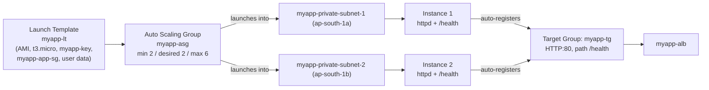

# 02 - Launch Template and Auto Scaling Group (Hands-On)

> Goal: build the two real resources every later note in this series depends on — the launch template **`myapp-lt`** and the Auto Scaling group **`myapp-asg`** — and verify instances actually launch and register as healthy targets. Continues Note 01 (concepts); Notes 03–06 add scaling policies on top of the group built here.

---

## 0. Prerequisites (already built in the VPC folder)

This note does **not** re-create networking — it reuses what VPC Notes 04–09 already built:

- VPC `myapp-vpc` (`10.0.0.0/16`) in `ap-south-1`.
- Private app-tier subnets: `myapp-private-subnet-1` (`10.0.11.0/24`, `ap-south-1a`) and `myapp-private-subnet-2` (`10.0.12.0/24`, `ap-south-1b`) — this is where the ASG's instances will actually launch.
- Public subnets hosting an Application Load Balancer `myapp-alb` with a target group `myapp-tg` (HTTP:80, health check path `/health`) — assumed already created (ALB setup is its own topic, not detailed here).
- Security group `myapp-app-sg`, treated here as: inbound **HTTP:80 from `myapp-alb`'s security group only**, and **SSH:22 from a bastion/Session Manager only** — no direct internet inbound.
- A key pair `myapp-key` (for emergency SSH; day-to-day access should go through SSM Session Manager instead).

---

## 1. Why a Launch Template, not a Launch Configuration

Older AWS material (and some exam questions) still mention **Launch Configurations** — treat these as **legacy**:

| | **Launch Template** (use this) | **Launch Configuration** (legacy) |
|---|---|---|
| Versioning | Yes — multiple versions, roll back anytime | No — immutable, can't even be edited after creation |
| Mixed instance types / Spot | Yes — one template can back a **mixed instances policy** with multiple instance types and On-Demand + Spot | No |
| New EC2 features/instance types | Fully supported, kept up to date | **Frozen** — no new instance types supported as of **Jan 1, 2023** |
| Creating new ones | Always supported | **Blocked.** Accounts created on/after **June 1, 2023** can't create new ones via the console; accounts created on/after **Oct 1, 2024** can't create new ones via **any** method (console, API, CLI, CloudFormation) |
| Can be used with mixed purchase options, capacity reservations, etc. | Yes | No |

> ⚠️ **Exam trap:** if a question describes something that "can't be modified after creation" and is being phased out in favor of a versioned, feature-complete alternative, it's describing a **Launch Configuration** — the expected answer is almost always **Launch Template**. AWS's own guidance is unambiguous: migrate to launch templates; don't create new launch configurations.

We build `myapp-lt` as a Launch Template from the start — no legacy detour.

---

## 2. Create the Launch Template — `myapp-lt`

1. **EC2 console** → left nav → **Launch Templates** → **Create launch template**.
2. **Launch template name**: `myapp-lt`. Add a description (optional).
3. **Application and OS Images (AMI)**: search **Amazon Linux 2023** → select the latest AMI (free-tier eligible).
4. **Instance type**: `t3.micro`.
5. **Key pair (login)**: select existing `myapp-key`.
6. **Network settings**: do **not** pick a subnet or "Auto-assign public IP" here — subnets are chosen later at the ASG level, not the template level, so the same template can be reused across AZs.
7. **Firewall (security groups)**: select existing security group `myapp-app-sg`.
8. **Storage**: leave the default root volume (e.g. 8 GiB gp3) — enough for this demo.
9. **Advanced details**:
   - **IAM instance profile**: `myapp-app-role` (grants SSM Session Manager access so you can shell in without opening SSH inbound — IAM role details are out of scope here).
   - **User data**: paste a small script that installs and starts a web server, and shows the instance ID so scaling is visually obvious later:

```bash
#!/bin/bash
dnf install -y httpd
INSTANCE_ID=$(curl -s http://169.254.169.254/latest/meta-data/instance-id)
echo "<h1>Hello from $INSTANCE_ID</h1>" > /var/www/html/index.html
echo "OK" > /var/www/html/health
systemctl enable httpd
systemctl start httpd
```

   (`/health` matches the target group's configured health check path from Note 0's prerequisites.)

10. Click **Create launch template**.

> 🧠 A launch template is just a **saved, versioned answer** to "if I launch an instance, what should it look like?" It doesn't launch anything by itself — the ASG is what actually calls "launch" using this template as the recipe.

---

## 3. Create the Auto Scaling Group — `myapp-asg`

1. **EC2 console** → left nav → **Auto Scaling Groups** → **Create Auto Scaling group**.
2. **Choose launch template or configuration** page:
   - **Auto Scaling group name**: `myapp-asg`.
   - **Launch template**: `myapp-lt`.
   - **Launch template version**: **Default** (or **Latest**, so future template edits are picked up on next scale-out without editing the ASG).
   - Next.
3. **Choose instance launch options** page:
   - **VPC**: `myapp-vpc`.
   - **Availability Zones and subnets**: select **`myapp-private-subnet-1`** and **`myapp-private-subnet-2`** — spreading across `ap-south-1a`/`ap-south-1b`.
   - Leave **Availability Zone distribution** at its default (balanced-best-effort).
   - Skip **instance type overrides** (not using mixed instances/Spot in this demo).
   - Next.
4. **Integrate with other services** page (this is where load balancing + health checks live):
   - **Load balancing**: choose **Attach to an existing load balancer** → **Choose from your load balancer target groups** → select **`myapp-tg`**.
   - **Health checks**: turn on **ELB health checks** in addition to the default **EC2** health check (checkbox "Turn on Elastic Load Balancing health checks").
   - **Health check grace period**: `90` seconds (default is 300s in the console; a small app like `httpd` starting from user data is ready well before that, but a short buffer avoids marking an instance unhealthy before it's finished booting).
   - Next.
5. **Configure group size and scaling** page:
   - **Desired capacity**: `2`.
   - **Min desired capacity**: `2`.
   - **Max desired capacity**: `6`.
   - **Automatic scaling**: choose **No scaling policies** for now — Notes 04–06 add scheduled/dynamic/predictive policies onto this same group afterward.
   - Leave **Instance maintenance policy**, **Capacity Reservation preference**, **instance scale-in protection**, and **default instance warmup** at their defaults for this demo.
   - Next.
6. **Add notifications** page: skip (optional, not needed for this demo). Next.
7. **Add tags** page: add `Name = myapp-asg-instance` (propagate to instances). Next.
8. **Review** page → **Create Auto Scaling group**.

---

## 4. Verify: instances launch and register healthy

1. **Auto Scaling Groups** → `myapp-asg` → **Activity** tab: you should see two "Launching a new EC2 instance" activities succeed within a minute or two.
2. **Instance management** tab (or the EC2 **Instances** page): two instances appear, one in each private subnet, **Lifecycle state** = `InService`, **Health status** = `Healthy`.
3. **EC2 console** → **Target Groups** → `myapp-tg` → **Targets** tab: the same two instance IDs should appear with **Health status** = `healthy` (this can lag the ASG's own "Healthy" status by the health check interval + grace period — give it a minute).
4. Grab `myapp-alb`'s DNS name (EC2 console → Load Balancers) and `curl` it a few times — you should see different instance IDs in the response, confirming the ALB is spreading requests across both `myapp-asg` instances.



---

## 5. Troubleshooting

| Symptom | Likely cause / fix |
|---|---|
| ASG Activity shows "Launching a new EC2 instance" but it keeps failing | Check the launch template's AMI is valid in this Region and the instance type is available in the chosen AZ; check `myapp-app-role` instance profile exists if referenced. |
| Instances reach `InService` in the ASG but never show `healthy` in `myapp-tg` | Target group health check path (`/health`) doesn't match what the user data script actually serves, or `httpd` failed to start — check user data ran (`/var/log/cloud-init-output.log` via SSM Session Manager). |
| Target group shows targets stuck in `unhealthy` or `initial` | **Security group** problem — confirm `myapp-app-sg` allows inbound **HTTP:80 from `myapp-alb`'s security group**, not just from your own IP. This is the single most common cause. |
| Instances launch into the wrong AZ / only one AZ used | Only one subnet was selected in step 3, or the other subnet has no free IPs — reselect both `myapp-private-subnet-1` and `myapp-private-subnet-2`. |
| `curl` to the ALB DNS name times out | ALB security group doesn't allow inbound HTTP from your test client, or listener/target group mismatch — verify `myapp-alb`'s listener forwards to `myapp-tg`. |
| Instance terminates and relaunches in a loop | EC2 or ELB health check is failing repeatedly right after grace period — check the app actually stays up (not just starts once and crashes). |

---

## 6. ⚠️ Clean up to avoid charges

Do **not** just terminate the two instances one at a time — `myapp-asg` will notice desired capacity (2) is no longer met and immediately relaunch replacements, so you'll pay for a fleet that keeps regenerating itself. To actually stop:

1. Select `myapp-asg` → **Edit** → set **Desired**, **Min**, and **Max** capacity all to **0**, and save — this terminates both instances and the ASG stays at 0 until you scale it again.
2. Or, if you're done with the whole demo permanently: select `myapp-asg` → **Delete** — this deletes the group *and* terminates its instances in one step (you'll be asked to confirm).
3. The launch template `myapp-lt` itself costs nothing to keep around — only running instances, load balancers, and NAT Gateways cost money — but delete it too if you want a clean slate.

---

## 7. Recap

- Built **`myapp-lt`** (Amazon Linux 2023, `t3.micro`, `myapp-key`, `myapp-app-sg`, user data installing `httpd` + `/health`, IAM profile `myapp-app-role`).
- Launch Configurations are legacy: frozen on new instance types since Jan 2023, blocked from console creation since June 2023, blocked from creation by **any** method since Oct 2024 — always use Launch Templates.
- Built **`myapp-asg`** from `myapp-lt`: subnets `myapp-private-subnet-1/2`, attached to `myapp-tg`, EC2 + ELB health checks, size min 2 / desired 2 / max 6, no scaling policy yet.
- Verified instances launch, reach `InService`, and register `healthy` in `myapp-tg`; confirmed the ALB load-balances across both.
- Cleanup means zeroing/deleting the **ASG**, not terminating instances individually.
- Next: Note 03 manually changes `myapp-asg`'s desired capacity to see scale-out/scale-in mechanics before any automation is involved.

---

### Sources
- [Create a launch template for an Auto Scaling group – AWS docs](https://docs.aws.amazon.com/autoscaling/ec2/userguide/create-launch-template.html)
- [Create an Auto Scaling group using a launch template – AWS docs](https://docs.aws.amazon.com/autoscaling/ec2/userguide/create-asg-launch-template.html)
- [Auto Scaling launch configurations – AWS docs](https://docs.aws.amazon.com/autoscaling/ec2/userguide/launch-configurations.html)
- [Migrate your Auto Scaling groups to launch templates – AWS docs](https://docs.aws.amazon.com/autoscaling/ec2/userguide/migrate-to-launch-templates.html)
