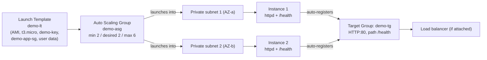

# 02 - Launch Template and Auto Scaling Group (Hands-On)

> Goal: build the two real resources every later note in this series depends on — the launch template **`demo-lt`** and the Auto Scaling group **`demo-asg`** — and verify instances actually launch and register as healthy targets. Continues from the previous note's concepts; later notes add manual, scheduled, dynamic, and predictive scaling policies on top of the group built here.

---

## 0. Prerequisites

This note does **not** teach VPC/subnet design — it assumes you already have:

- A VPC, in whatever Region you're working in.
- **Two private subnets in two different Availability Zones** — this is where the ASG's instances will actually launch. They don't need internet-facing (public) IPs; outbound internet access (for package installs, etc.) can come through a NAT Gateway or VPC endpoints, and inbound SSH access should go through a bastion host or Session Manager rather than a public IP.
- Optionally, a load balancer with a target group already set up in front of those subnets (for example an Application Load Balancer with an HTTP:80 target group, health check path `/health`) — this is **not required** to complete this note. If you don't have one yet, skip the "attach to a load balancer" step below and come back to it once you've built one; the ASG works fine on its own in the meantime, it just won't have anything distributing traffic to it.
- A security group, referred to here as `demo-app-sg`: inbound **HTTP:80 from your load balancer's security group only** (if you have one), and **SSH:22 from a bastion/Session Manager only** — no direct internet inbound.
- A key pair, referred to here as `demo-key` (for emergency SSH; day-to-day access should go through SSM Session Manager instead).

---


## 1. Why a Launch Template, not a Launch Configuration

Older AWS material (and some exam questions) still mention **Launch Configurations** — treat these as **legacy**:

| | **Launch Template** (use this) | **Launch Configuration** (legacy) |
|---|---|---|
| Versioning | Yes — multiple versions, roll back anytime | No — immutable, can't even be edited after creation |
| Mixed instance types / Spot | Yes — one template can back a **mixed instances policy** with multiple instance types and On-Demand + Spot | No |
| New EC2 features/instance types | Fully supported, kept up to date | **Frozen** — no new instance types supported as of **Jan 1, 2023** |
| Creating new ones | Always supported | **Blocked.** Accounts created on/after **June 1, 2023** can't create new ones via the console; accounts created on/after **Oct 1, 2024** can't create new ones via **any** method (console, API, CLI, CloudFormation) |
| Can be used with mixed purchase options, capacity reservations, etc. | Yes | No |

> ⚠️ **Exam trap:** if a question describes something that "can't be modified after creation" and is being phased out in favor of a versioned, feature-complete alternative, it's describing a **Launch Configuration** — the expected answer is almost always **Launch Template**. AWS's own guidance is unambiguous: migrate to launch templates; don't create new launch configurations.

We build `demo-lt` as a Launch Template from the start — no legacy detour.

---

## 2. Create the Launch Template — `demo-lt`

1. **EC2 console** → left nav → **Launch Templates** → **Create launch template**.


2. **Launch template name and description**:
   - **Launch template name** (required): `demo-lt`.
   - **Template version description** (optional): e.g. `Web server for demo-asg`.
   - **Auto Scaling guidance**: check **"Provide guidance to help me set up a template that I can use with EC2 Auto Scaling"** — this template's whole purpose is to back `demo-asg`, and checking this steers the console toward ASG-compatible choices (in particular, it nudges you away from specifying a subnet in the next section).
3. Under **Launch template contents**:
   1. **Application and OS Images (Amazon Machine Image)**: search **Amazon Linux 2023** → select the latest AMI (free-tier eligible).
   2. **Instance type**: `t3.micro`. (The **All generations** toggle and the **Compare instance types** / **Get advice** links next to it are just discovery aids — ignore them once you know the type you want.)
   3. **Key pair (login)** → **Key pair name**: select existing `demo-key`.
   4. **Network settings**:
      - **Subnet**: leave **Don't include in launch template** — subnets are chosen later at the ASG level, not the template level, so the same template can be reused across AZs.
      - **Availability Zone**: leave **Don't include in launch template**, for the same reason.
      - **Firewall (security groups)**: choose **Select existing security group** → **Security groups**: `demo-app-sg`.
   5. **Storage (volumes)**: leave untouched (no volume added). With nothing specified here, a launched instance simply falls back to the AMI's own default root volume (e.g. 8 GiB gp3 for Amazon Linux 2023) — enough for this demo. Only use **Add new volume** if you need to override the size or type.
   6. **Resource tags**: optional — skip for this demo.
4. Expand **Advanced details**:
   - **IAM instance profile**: `demo-app-role` (grants SSM Session Manager access so you can shell in without opening SSH inbound — IAM role details are out of scope here).
   - **User data**: paste a small script that installs and starts a web server, and shows the instance ID so scaling is visually obvious later:

```bash
#!/bin/bash
dnf install -y httpd
INSTANCE_ID=$(curl -s http://169.254.169.254/latest/meta-data/instance-id)
echo "<h1>Hello from $INSTANCE_ID</h1>" > /var/www/html/index.html
echo "OK" > /var/www/html/health
systemctl enable httpd
systemctl start httpd
```

   (`/health` matches the health check path we'll configure on the target group if you attach one, or that a pre-existing target group already expects.)

5. Review the **Summary** panel on the right, then click **Create launch template**.

> 🧠 A launch template is just a **saved, versioned answer** to "if I launch an instance, what should it look like?" It doesn't launch anything by itself — the ASG is what actually calls "launch" using this template as the recipe.

---

## 3. Create the Auto Scaling Group — `demo-asg`

1. **EC2 console** → left nav → **Auto Scaling Groups** → **Create Auto Scaling group**.
2. **Choose launch template or configuration** page:
   - **Auto Scaling group name**: `demo-asg`.
   - **Launch template**: `demo-lt`.
   - **Launch template version**: **Default** (or **Latest**, so future template edits are picked up on next scale-out without editing the ASG).
   - Next.
3. **Choose instance launch options** page:
   - **VPC**: select your VPC.
   - **Availability Zones and subnets**: select your two private subnets, spreading across two different Availability Zones.
   - Leave **Availability Zone distribution** at its default (balanced-best-effort).
   - Skip **instance type overrides** (not using mixed instances/Spot in this demo).
   - Next.
4. **Integrate with other services** page (this is where load balancing + health checks live):
   - **Load balancing**: if you already have a target group set up (e.g. behind an Application Load Balancer), choose **Attach to an existing load balancer** → **Choose from your load balancer target groups** → select it (we'll call it `demo-tg` in later notes). If you don't have one yet, choose **No load balancer** — you can attach one later by editing the ASG.
   - **VPC Lattice integration options**: skip — unrelated, service-mesh-style traffic routing, out of scope for this demo.
   - **Amazon Application Recovery Controller (ARC) zonal shift**: leave unchecked — this is an opt-in safety feature for shifting traffic away from an impaired AZ, not needed here.
   - **Health checks**: if you attached a target group, turn on **ELB health checks** in addition to the default **EC2** health check (checkbox "Turn on Elastic Load Balancing health checks"). Under **Additional health check types**, leave **Turn on Amazon EBS health checks** off for this demo — it flags instances with impaired EBS volumes, not needed for a stateless `httpd` box.
   - **Health check grace period**: `90` seconds (default is 300s in the console; a small app like `httpd` starting from user data is ready well before that, but a short buffer avoids marking an instance unhealthy before it's finished booting).
   - Next.
5. **Configure group size and scaling** page:
   - **Group size** → **Desired capacity**: `2`.
   - **Scaling** → **Scaling limits** → **Min desired capacity**: `2`, **Max desired capacity**: `6`.
   - **Automatic scaling**: choose **No scaling policies** for now — later notes add scheduled/dynamic/predictive (target tracking) policies onto this same group afterward.
   - Leave **Instance maintenance policy**, **Capacity Reservation preference** (under **Additional capacity settings**), **Instance scale-in protection** (under **Additional settings**), **Monitoring** (CloudWatch group metrics collection), and **Default instance warmup** at their defaults for this demo.
   - Next.
6. **Add notifications** page: skip (optional, not needed for this demo). Next.
7. **Add tags** page: add `Name = demo-asg-instance` (propagate to instances). Next.
8. **Review** page → **Create Auto Scaling group**.

---

## 4. Verify: instances launch and register healthy

1. **Auto Scaling Groups** → `demo-asg` → **Activity** tab: you should see two "Launching a new EC2 instance" activities succeed within a minute or two.
2. **Instance management** tab (or the EC2 **Instances** page): two instances appear, one in each private subnet, **Lifecycle state** = `InService`, **Health status** = `Healthy`.
3. If you attached a target group: **EC2 console** → **Target Groups** → `demo-tg` → **Targets** tab: the same two instance IDs should appear with **Health status** = `healthy` (this can lag the ASG's own "Healthy" status by the health check interval + grace period — give it a minute).
4. If you attached a load balancer, grab its DNS name (EC2 console → Load Balancers) and `curl` it a few times — you should see different instance IDs in the response, confirming it's spreading requests across both `demo-asg` instances.


```mermaid
flowchart LR
    LT["Launch Template<br/>demo-lt<br/>(AMI, t3.micro, demo-key,<br/>demo-app-sg, user data)"] --> ASG["Auto Scaling Group<br/>demo-asg<br/>min 2 / desired 2 / max 6"]
    ASG -->|"launches into"| SUB1["Private subnet 1 (AZ-a)"]
    ASG -->|"launches into"| SUB2["Private subnet 2 (AZ-b)"]
    SUB1 --> I1["Instance 1<br/>httpd + /health"]
    SUB2 --> I2["Instance 2<br/>httpd + /health"]
    I1 -->|"auto-registers"| TG["Target Group: demo-tg<br/>HTTP:80, path /health"]
    I2 -->|"auto-registers"| TG
    TG --> ALB["Load balancer (if attached)"]
```

---

## 5. Troubleshooting

| Symptom | Likely cause / fix |
|---|---|
| ASG Activity shows "Launching a new EC2 instance" but it keeps failing | Check the launch template's AMI is valid in this Region and the instance type is available in the chosen AZ; check `demo-app-role` instance profile exists if referenced. |
| Instances reach `InService` in the ASG but never show `healthy` in the target group | Target group health check path (`/health`) doesn't match what the user data script actually serves, or `httpd` failed to start — check user data ran (`/var/log/cloud-init-output.log` via SSM Session Manager). |
| Target group shows targets stuck in `unhealthy` or `initial` | **Security group** problem — confirm `demo-app-sg` allows inbound **HTTP:80 from the load balancer's security group**, not just from your own IP. This is the single most common cause. |
| Instances launch into the wrong AZ / only one AZ used | Only one subnet was selected in step 3, or the other subnet has no free IPs — reselect both private subnets. |
| `curl` to the load balancer's DNS name times out | Load balancer's security group doesn't allow inbound HTTP from your test client, or listener/target group mismatch — verify the listener forwards to the correct target group. |
| Instance terminates and relaunches in a loop | EC2 or ELB health check is failing repeatedly right after grace period — check the app actually stays up (not just starts once and crashes). |

---

## 6. ⚠️ Clean up to avoid charges

Do **not** just terminate the two instances one at a time — `demo-asg` will notice desired capacity (2) is no longer met and immediately relaunch replacements, so you'll pay for a fleet that keeps regenerating itself. To actually stop:

1. Select `demo-asg` → **Edit** → set **Desired**, **Min**, and **Max** capacity all to **0**, and save — this terminates both instances and the ASG stays at 0 until you scale it again.
2. Or, if you're done with the whole demo permanently: select `demo-asg` → **Delete** — this deletes the group *and* terminates its instances in one step (you'll be asked to confirm).
3. The launch template `demo-lt` itself costs nothing to keep around — only running instances, load balancers, and NAT Gateways cost money — but delete it too if you want a clean slate.

---

## 7. Recap

- Built **`demo-lt`** (Amazon Linux 2023, `t3.micro`, `demo-key`, `demo-app-sg`, user data installing `httpd` + `/health`, IAM profile `demo-app-role`).
- Launch Configurations are legacy: frozen on new instance types since Jan 2023, blocked from console creation since June 2023, blocked from creation by **any** method since Oct 2024 — always use Launch Templates.
- Built **`demo-asg`** from `demo-lt`: two private subnets across two AZs, optionally attached to a target group (`demo-tg`), EC2 (+ ELB if attached) health checks, size min 2 / desired 2 / max 6, no scaling policy yet.
- Verified instances launch, reach `InService`, and (if a target group was attached) register `healthy` in it.
- Cleanup means zeroing/deleting the **ASG**, not terminating instances individually.
- Next: [Manual Scaling](03-Manual-Scaling-HandsOn.md) manually changes `demo-asg`'s desired capacity to see scale-out/scale-in mechanics before any automation is involved.

---

### Sources
- [Create a launch template for an Auto Scaling group – AWS docs](https://docs.aws.amazon.com/autoscaling/ec2/userguide/create-launch-template.html)
- [Create an Auto Scaling group using a launch template – AWS docs](https://docs.aws.amazon.com/autoscaling/ec2/userguide/create-asg-launch-template.html)
- [Auto Scaling launch configurations – AWS docs](https://docs.aws.amazon.com/autoscaling/ec2/userguide/launch-configurations.html)
- [Migrate your Auto Scaling groups to launch templates – AWS docs](https://docs.aws.amazon.com/autoscaling/ec2/userguide/migrate-to-launch-templates.html)
