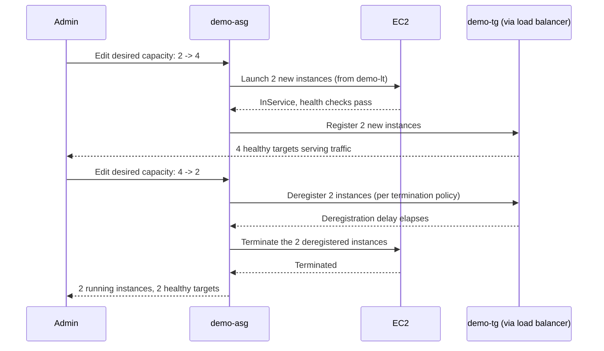

# 03 - Manual Scaling (Hands-On)

> Goal: perform the simplest possible capacity change on `demo-asg` — an admin directly edits the numbers, no metric or schedule involved — and observe exactly what happens to instances and target group registrations. Continues from the launch template/ASG build (the group now exists at min 2 / desired 2 / max 6); next we automate the "up in the morning, down at night" pattern with scheduled scaling.

---

## 1. What manual scaling actually is

**Manual scaling** means a human (or a script/CLI call triggered by a human decision, not a metric) directly edits an ASG's **desired capacity** (and optionally min/max) in the console, CLI, or API — right now, once, with no ongoing automation behind it.

There is no CloudWatch alarm, no schedule, no forecast involved. You type a new number, the ASG enforces it immediately, and it does not change again until *something else* changes it — another manual edit, a scheduled action, or a dynamic/predictive policy re-evaluating.

> 🧠 **Mental model:** manual scaling is the **light switch**, not the thermostat. You flip it because you decided to, right now — nothing "watches" anything to flip it back.

---

## 2. When manual scaling is actually useful

Manual scaling looks primitive next to dynamic/predictive scaling, but it has real, legitimate uses:

- **A known one-off event** you didn't bother automating — e.g. "we're demoing to a customer at 3 PM, bump capacity for the afternoon" (if it happens regularly on a fixed schedule, that belongs in scheduled scaling instead, covered next).
- **Testing** — deliberately forcing scale-out or scale-in to verify your launch template, health checks, and target group registration all behave correctly (exactly what this note does).
- **Emergency override** — an automated dynamic scaling policy is misbehaving (e.g. flapping, or a metric is stuck) and you need to *immediately* force a specific capacity while you investigate, rather than waiting for the policy to self-correct.
- **Planned maintenance** — temporarily raising min/desired capacity before intentionally terminating instances for patching, so capacity never dips.

🎯 **Exam tip:** if a scenario says "no metrics, no schedule — someone just wants to change capacity right now," that's manual scaling. If it says "known in advance, recurring or fixed date/time," that's scheduled scaling even if a human configured it — the distinguishing feature of *manual* scaling is that the change happens the moment you make it, with nothing pre-arranged.

---

## 3. Hands-on: scale `demo-asg` out from 2 to 4

1. **EC2 console** → **Auto Scaling Groups** → select **`demo-asg`**.
2. Click **Edit** (on the group details panel).
3. Change **Desired capacity** from `2` to `4`.
   - Since max is already `6`, no other field needs to change — desired (4) is still within min (2) and max (6).
4. **Update**.

**What happens next:**

1. The ASG immediately compares running (2) to desired (4) and issues two "Launch" activities.
2. Two new instances launch from `demo-lt`, one into each private subnet (the ASG tries to keep the fleet balanced across your two Availability Zones, so you'll typically end up with 2 instances per AZ rather than 4 in one AZ).
3. Each new instance runs the same user data (installs `httpd`, serves its own instance ID, exposes `/health`).
4. Once each instance passes its **health check grace period** and reports healthy, the ASG registers it with the target group (if one is attached — call it `demo-tg`).
5. The load balancer starts sending traffic to the 2 new instances as soon as `demo-tg` reports them `healthy` — check the **Targets** tab, you should now see 4 healthy targets.
6. Re-`curl`-ing the load balancer's DNS name repeatedly now cycles through 4 distinct instance IDs instead of 2.

---

## 4. Hands-on: scale back in from 4 to 2

1. **Auto Scaling Groups** → `demo-asg` → **Edit**.
2. Change **Desired capacity** back to `2`.
3. **Update**.

**What happens next:**

1. The ASG compares running (4) to desired (2) and must terminate 2 instances.
2. It first **deregisters** the chosen instances from `demo-tg` (so the load balancer stops sending them new requests) and waits out the target group's configured **deregistration delay** before actually killing the connection, then **terminates** the underlying EC2 instances.
3. Which 2 of the 4 instances get picked to terminate is governed by the ASG's **termination policy** — by default (`Default` policy) it aims to balance across AZs first, then picks the instance closest to its next billing hour. The full menu of termination policies (`OldestInstance`, `NewestInstance`, `OldestLaunchTemplate`, `ClosestToNextInstanceHour`, custom Lambda-backed policies, etc.) is a deep topic on its own, covered in dedicated notes later in this series.
4. `demo-tg`'s **Targets** tab drops back to 2 healthy targets; `demo-asg` shows 2 running instances again.

---

## 5. Manual scaling by terminating a specific instance

Besides editing desired capacity directly, there's a second manual-scaling technique: **terminating a specific instance and telling the ASG whether to backfill it.**

- **Terminate an instance normally (console "Terminate")** → the ASG sees running count drop below desired capacity and immediately launches a replacement. Net effect: the fleet size is unchanged, you've just forced a specific instance to be replaced (useful for cycling out an instance you suspect has a problem, without waiting for a health check to catch it).
- **Terminate via the API/CLI with `--should-decrement-desired-capacity`** (`terminate-instance-in-auto-scaling-group`) → the ASG terminates that exact instance **and** lowers desired capacity by one at the same time, so no replacement is launched. This is how you manually shrink the fleet by a specific instance rather than by editing the desired-capacity field and letting the ASG pick which instance to remove via its termination policy.

> 🧠 Editing **desired capacity** (Sections 3–4 above) lets the ASG choose *which* instance to add/remove. Terminating a *named* instance with the decrement flag lets *you* choose which instance goes, while still going through the ASG so target group deregistration happens cleanly first — never terminate an ASG-managed instance from plain EC2 without the ASG's involvement if you can avoid it, since a bare EC2 termination still triggers replacement and skips the graceful deregistration step.

---

## 6. Interaction with an active dynamic scaling policy

If `demo-asg` already has a **dynamic scaling policy** attached (e.g. a target-tracking-on-CPU policy, covered in the dynamic scaling note later in this series), a manual desired-capacity change is **not the final word** — it can be overridden the next time the policy re-evaluates:

- Target tracking continuously compares the actual metric (e.g. average CPU) to its target (e.g. 50%) and adjusts desired capacity to match, **regardless of how desired capacity got to its current value**.
- Example: you manually scale `demo-asg` down to desired = 2 to save cost, but real CPU load is still high across those 2 instances. Within a few minutes, the target tracking policy will scale desired capacity back up on its own to bring average CPU back down to 50% — effectively undoing your manual change.
- Conversely, if you manually scale *up* to desired = 6 but CPU load is low, the dynamic policy will eventually scale back down toward whatever desired capacity satisfies its target.

> ⚠️ **A manual change is a one-time nudge, not a lasting override.** If you need capacity to stay at a specific value despite an active dynamic policy, you must either temporarily suspend the scaling process (`ScheduledActions`/`DynamicScaling` suspension — covered alongside cooldowns in a later note) or edit/remove the policy itself — simply editing desired capacity again will just get overridden again on the next evaluation.

---

## 7. Recap

- **Manual scaling** = a direct, one-time edit of desired/min/max capacity — no metric, no schedule, nothing watching afterward.
- Useful for one-off known events, testing (this note), and emergency overrides of a misbehaving automated policy.
- Scaling `demo-asg` from 2 → 4 launched 2 instances that auto-registered with `demo-tg`; scaling back 4 → 2 deregistered then terminated 2 instances, chosen by the ASG's termination policy (detailed in later notes in this series).
- If a **dynamic scaling policy** is also attached to the group, it can silently override your manual change on its next evaluation — manual scaling is not a lasting override of an active policy.
- Next: Note 04 automates the "scale up in the morning, back down at night" pattern with **scheduled actions** instead of manual edits.

---

### Sources
- [Set scaling limits for your Auto Scaling group – AWS docs](https://docs.aws.amazon.com/autoscaling/ec2/userguide/asg-capacity-limits.html)
- [Manual scaling for Amazon EC2 Auto Scaling – AWS docs](https://docs.aws.amazon.com/autoscaling/ec2/userguide/ec2-auto-scaling-scaling-manually.html)
- [Auto Scaling groups – AWS docs](https://docs.aws.amazon.com/autoscaling/ec2/userguide/auto-scaling-groups.html)
