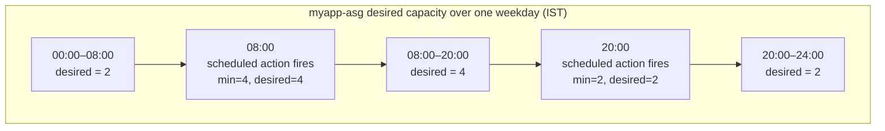

# 04 - Scheduled Scaling (Hands-On)

> Goal: automate the predictable "more capacity during business hours, less overnight" pattern using **scheduled actions** on `myapp-asg` — no metrics, no manual clicking, just date/time rules. Continues Note 03 (manual scaling); next is Note 05, dynamic scaling, which reacts to *real* load instead of the clock.

---

## 1. What scheduled scaling is

**Scheduled scaling** changes an ASG's desired (and optionally min/max) capacity at **specific, predictable date/times** that you configure ahead of time via a **scheduled action**. AWS just executes the change at the moment you told it to — there's no CloudWatch metric, no reaction to real traffic, nothing "smart" about it.

It's the right tool when you already **know** your load pattern in advance:

- Predictable **business-hours** traffic (busy 9-to-5 on weekdays, quiet nights/weekends).
- A known **one-time event** — a product launch, a Black Friday sale, a scheduled batch job window.
- Cost optimization — shrink capacity to the minimum overnight/on weekends when you're confident nobody needs it, without waiting for a dynamic policy to notice low CPU and scale in on its own.

> 🧠 **Mental model:** scheduled scaling is a **calendar reminder**, not a sensor. It fires at the time you wrote down, whether or not anything is actually happening on your servers at that moment.

Each scheduled action sets a group's desired, min, and/or max capacity **at the date and time specified** — you can create a **one-time** action (a single date/time) or a **recurring** action (a cron expression that fires repeatedly).

---

## 2. Recurring (cron) vs one-time schedules

| | **One-time** | **Recurring** |
|---|---|---|
| Trigger | A single specific date + time | A cron expression, fires every time it matches |
| Use case | A specific known event (e.g. "the Aug 15 product launch") | A repeating pattern (e.g. "every weekday morning") |
| Console fields | Just **Start time** | **Recurrence** pattern (built from cron fields) + optional **Start time** / **End time** window |
| Expires automatically? | Yes — runs once, done | Keeps firing until you delete it or its optional **End time** is reached |

The cron format used by Amazon EC2 Auto Scaling has **5 fields**: `[Minute] [Hour] [Day_of_Month] [Month] [Day_of_Week]`, same syntax as standard Unix cron. Example: `30 6 * * 2` fires every Tuesday at 6:30 AM.

---

## 3. Start/end time and time zone considerations

- **Time zone**: by default, recurring schedules are interpreted in **UTC**. The console lets you pick an **IANA time zone** (e.g. `Asia/Kolkata` for IST) instead — the schedule then automatically adjusts for that zone, including Daylight Saving Time if applicable (not relevant for IST, which has no DST).
- **Start time**: if set, the action first fires at exactly that time, then follows the recurrence pattern afterward.
- **End time**: if set, the recurring action stops firing after that time and is effectively retired — useful for a schedule that should only apply "until further notice" or for a limited campaign window.
- Scheduled actions can be delayed **up to ~2 minutes** from their exact scheduled time under normal operation — don't rely on second-level precision.
- A scheduled action generally needs to specify **desired capacity**, and — critically — if the new desired value would fall outside the group's *current* min/max, you must also update min/max in the same action, or the action is rejected/adjusted.

🎯 **Exam tip:** scheduled scaling and a dynamic scaling policy can run **on the same group simultaneously** — the scheduled action sets a new min/max/desired baseline, and any active dynamic policy continues to scale within (and can move desired further within) whatever min/max the schedule most recently set.

---

## 4. Hands-on: two scheduled actions on `myapp-asg`

We add two recurring scheduled actions to the `myapp-asg` built in Note 02 (currently min 2 / desired 2 / max 6, no scaling policy):

- **Scale up** every weekday at **8:00 AM IST** → desired = 4, min = 4.
- **Scale down** every weekday at **8:00 PM IST** → desired = 2, min = 2.

### Step 1 — Create the "scale up" action

1. **EC2 console** → **Auto Scaling Groups** → `myapp-asg` → **Automatic scaling** tab → **Scheduled actions** section → **Create scheduled action**.
2. **Name**: `myapp-scale-up-business-hours`.
3. **Min desired capacity**: `4`.
4. **Max desired capacity**: leave `6` (unchanged — no need to raise the ceiling).
5. **Desired capacity**: `4`.
6. **Recurrence**: choose **Cron expression** and enter:

   ```
   0 8 * * 1-5
   ```

   Read as: minute `0`, hour `8`, any day-of-month, any month, weekdays `1-5` (Monday–Friday) → fires at **8:00 AM** every weekday.
7. **Time zone**: `Asia/Kolkata` (IST — no separate UTC offset math needed).
8. Leave **Start time**/**End time** blank (recurs indefinitely).
9. **Create**.

### Step 2 — Create the "scale down" action

1. **Create scheduled action** again.
2. **Name**: `myapp-scale-down-evening`.
3. **Min desired capacity**: `2`.
4. **Max desired capacity**: `6` (unchanged).
5. **Desired capacity**: `2`.
6. **Recurrence** → **Cron expression**:

   ```
   0 20 * * 1-5
   ```

   Minute `0`, hour `20` (8:00 PM in 24-hour form), weekdays `1-5` → fires at **8:00 PM** every weekday.
7. **Time zone**: `Asia/Kolkata`.
8. **Create**.

### What happens at runtime

- At 8:00 AM IST Mon–Fri: `myapp-scale-up-business-hours` sets min=4/desired=4 → the ASG launches 2 more instances (2 → 4), which register with `myapp-tg` as they pass health checks.
- Through the day: capacity sits at 4 (nothing else is changing it, since no dynamic policy is attached in this note).
- At 8:00 PM IST Mon–Fri: `myapp-scale-down-evening` sets min=2/desired=2 → the ASG deregisters and terminates 2 instances, chosen per the group's termination policy (Notes 08–10), back down to 2.
- Weekends: neither action fires (cron field restricts to Mon–Fri), so capacity simply stays wherever the last action left it — in this case 2, since Friday evening's scale-down already ran.



### Verify

- **Auto Scaling Groups** → `myapp-asg` → **Automatic scaling** tab → **Scheduled actions**: both actions listed with their next scheduled run time shown.
- Around 8:00 AM/8:00 PM IST, check the **Activity** tab for "Launching"/"Terminating" activities matching the schedule, and confirm `myapp-tg`'s target count moves 2 → 4 → 2 accordingly.

---

## 5. Exam tip: scheduled vs dynamic scaling

🎯 **Exam tip:** **Scheduled scaling never looks at real load — it is purely time-based.** If the exam scenario says traffic is "predictable" or gives specific times/dates, the answer is scheduled scaling. If it says traffic is "variable," "unpredictable," or references a **CloudWatch metric/alarm** driving the change, that's **dynamic scaling** (Note 05) instead. A well-designed production ASG often uses **both together** — e.g. scheduled actions raise the *minimum* baseline before an expected traffic ramp, while a target-tracking dynamic policy still handles moment-to-moment fluctuations within whatever min/max the schedule currently allows.

---

## 6. Recap

- **Scheduled scaling** = pre-configured capacity changes at specific date/times via **scheduled actions** — no metric involved, purely time-driven.
- **One-time** actions run once at a fixed date/time; **recurring** actions use a 5-field cron expression (`Minute Hour Day_of_Month Month Day_of_Week`) and repeat until deleted or an optional end time is reached.
- Time zone defaults to UTC; specifying an IANA zone like `Asia/Kolkata` lets you write schedules in local time directly.
- Built two actions on `myapp-asg`: `myapp-scale-up-business-hours` (`0 8 * * 1-5`, IST) → min/desired 4; `myapp-scale-down-evening` (`0 20 * * 1-5`, IST) → min/desired 2 — producing a 2 → 4 → 2 daily capacity curve on weekdays.
- Scheduled and dynamic scaling can coexist on the same group; the schedule sets the baseline min/max/desired, dynamic policies react within it.
- Next: Note 05 replaces (or complements) the clock with a live CloudWatch metric — dynamic scaling.

---

### Sources
- [Scheduled scaling for Amazon EC2 Auto Scaling – AWS docs](https://docs.aws.amazon.com/autoscaling/ec2/userguide/ec2-auto-scaling-scheduled-scaling.html)
- [Create a scheduled action – AWS docs](https://docs.aws.amazon.com/autoscaling/ec2/userguide/scheduled-scaling-create-scheduled-action.html)
- [Choose your scaling method – AWS docs](https://docs.aws.amazon.com/autoscaling/ec2/userguide/scaling-overview.html)
