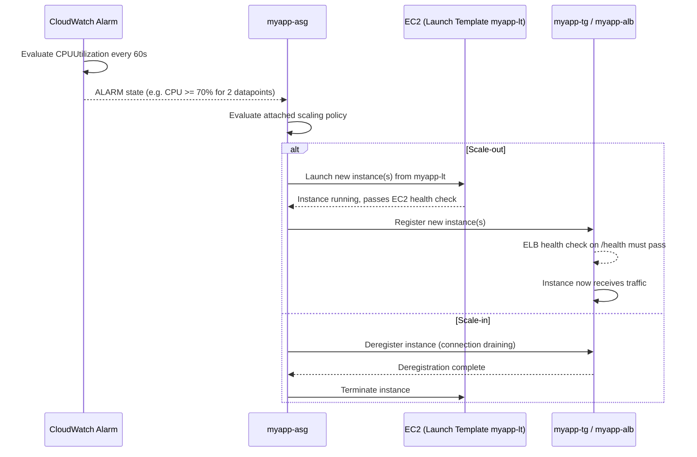

# 05 - Dynamic Scaling (Hands-On)

> Goal: move `myapp-asg` (built in Note 02, running Note 03's manual scaling and Note 04's scheduled scaling) onto **dynamic scaling** — policies that react automatically to **real-time CloudWatch metrics** instead of a human click or a fixed clock time. We add a **target tracking** policy (keep average CPU at 50%) and a **step scaling** policy (bigger CPU breach = bigger response), and trace the full alarm → scale → register sequence.

---

## 1. Manual vs Scheduled vs Dynamic — where this fits

| Approach | Trigger | Covered in |
|---|---|---|
| **Manual scaling** | You edit desired/min/max yourself | Note 03 |
| **Scheduled scaling** | A fixed clock time you predict in advance | Note 04 |
| **Dynamic scaling** | A **live CloudWatch alarm** crossing a threshold, right now | This note |
| **Predictive scaling** | An ML forecast of future load, acting ahead of time | Note 06 |

> 🧠 **Mental model:** scheduled scaling says "I *know* Monday 8 AM is busy." Dynamic scaling says "I *don't know* when it'll get busy, but I'm watching CPU every minute and will react the moment it does." Dynamic scaling is what most people mean by "Auto Scaling" in casual conversation.

Dynamic scaling always has the same three parts:
1. A **CloudWatch alarm** watching a metric (e.g. `CPUUtilization` averaged across the group).
2. A **scaling policy** attached to `myapp-asg` that says what to do when the alarm fires.
3. The **ASG** actually launching/terminating instances and (if attached) registering/deregistering them with `myapp-tg`.

---

## 2. The three dynamic scaling policy types

| | **Target Tracking** | **Step Scaling** | **Simple Scaling** |
|---|---|---|---|
| How it works | You pick a metric + a target value; AWS creates and manages the CloudWatch alarms and math for you | You define one or more alarms plus a set of **step adjustments** whose size depends on **how far** the alarm was breached | You define one alarm plus a **single** scaling adjustment, then wait out a cooldown before reacting again |
| Example | "Keep average CPU at 50%" | "CPU 70–80% → add 1; CPU >80% → add 3" | "CPU > 70% → add 2 instances" |
| Granularity | AWS-managed, self-correcting | Fine-grained — different response sizes for different breach sizes | Coarse — one fixed response regardless of breach size |
| Cooldown behavior | Continuously re-evaluates, no fixed cooldown gate | Has its own built-in warm-up handling between step evaluations | Must fully wait out the **cooldown period** (default 300s) before the *next* alarm-triggered change, even if the metric is still breaching |
| Status (2026) | **Modern recommended default** | Recommended when you need graduated responses | **Legacy** — superseded by step scaling, still supported for existing configs/exam trivia |
| Console location | Automatic Scaling tab → Create dynamic scaling policy → Target tracking scaling policy | Automatic Scaling tab → Create dynamic scaling policy → Step scaling | Automatic Scaling tab → Create dynamic scaling policy → Simple scaling |

🎯 **Exam tip:** if a question just says "keep CPU around X%" with no mention of graduated responses, **target tracking** is the right answer. Reach for **step scaling** only when the question explicitly wants different-sized responses for different-sized breaches (e.g. "small breach = add 1, large breach = add 3"). **Simple scaling** shows up mostly as a distractor / "this is the legacy one" trivia question.

---

## 3. Why target tracking is the modern default

With target tracking you don't design alarms yourself — you just say **what number you want** and AWS figures out the rest:

- You pick a metric (e.g. `ASGAverageCPUUtilization`, `ALBRequestCountPerTarget`, or a custom metric) and a **target value** (e.g. `50`).
- AWS automatically creates the CloudWatch alarms (both a high alarm to scale out and a low alarm to scale in) and continuously adjusts capacity to hold the metric near the target.
- It self-corrects: if actual CPU drifts to 70%, it scales out; if it drifts to 20%, it scales in — without you hand-tuning thresholds.

This removes the two hardest parts of dynamic scaling (choosing thresholds, choosing step sizes) for the common case.

---

## 4. Hands-on: create a target tracking policy on `myapp-asg`

**Goal:** keep average CPU utilization across `myapp-asg` at 50%.

1. Console → **EC2 → Auto Scaling Groups → `myapp-asg`**.
2. Select the **Automatic Scaling** tab.
3. Click **Create dynamic scaling policy**.
4. **Policy type**: **Target tracking scaling**.
5. **Name**: `myapp-cpu-target-50`.
6. **Metric type**: **Average CPU utilization**.
7. **Target value**: `50`.
8. **Instances need**: leave the default **Instance warmup** (time before a new instance's metrics count toward the average — give it enough time for `httpd`/`nginx` from the `myapp-lt` user data to actually be serving traffic, e.g. 300s).
9. Leave **Disable scale-in** unchecked (so this policy handles both scale-out AND scale-in).
10. **Create**.

Behind the scenes AWS now maintains two CloudWatch alarms on `myapp-asg`'s average CPU — one to add capacity when CPU is sustained above 50%, one to remove capacity when it's sustained below.

> ⚠️ Target tracking respects your Min/Max (2/6 for `myapp-asg`). It will never scale below 2 or above 6 no matter how the metric behaves.

---

## 5. Hands-on: create a step scaling policy on `myapp-asg`

Say you also want a coarser, faster-reacting safety net: a bigger CPU breach should add more capacity immediately, not wait for target tracking's steady convergence.

### Step 1 — create the CloudWatch alarms

1. Console → **CloudWatch → Alarms → Create alarm**.
2. **Metric**: `CPUUtilization`, namespace `AWS/EC2`, dimension = `myapp-asg` (or use the ASG's aggregated metric).
3. **Statistic**: Average, **Period**: 1 minute.
4. **Condition**: `CPUUtilization >= 70` for **2 out of 2 datapoints** (2 consecutive breaches, avoids reacting to a single noisy spike).
5. Name it `myapp-cpu-high-70`.
6. Repeat for a low alarm: `CPUUtilization < 30` for 2 datapoints → name it `myapp-cpu-low-30`.

### Step 2 — create the step scaling policy

1. Back in **EC2 → Auto Scaling Groups → `myapp-asg` → Automatic Scaling → Create dynamic scaling policy**.
2. **Policy type**: **Step scaling**.
3. **Name**: `myapp-step-scale-out`.
4. **CloudWatch alarm**: `myapp-cpu-high-70`.
5. **Add step adjustments**:
   | If metric value is... | Then... |
   |---|---|
   | Between 70 and 80 | Add **1** capacity unit |
   | ≥ 80 | Add **3** capacity units |
6. **Create** a second policy `myapp-step-scale-in` on alarm `myapp-cpu-low-30`:
   | If metric value is... | Then... |
   |---|---|
   | < 30 | Remove **1** capacity unit |

Now `myapp-asg` scales out by 1 for a moderate breach (70–80%) and by 3 for a severe one (>80%), while scaling in gently (−1) when CPU is low — a graduated response the flat target-tracking-only setup can't express.

> ⚠️ **Running both target tracking and step scaling on the same ASG at once is unusual** — normally you pick one strategy per metric. This note runs both purely to demonstrate each policy type against the same `myapp-asg`; in a real deployment you'd typically standardize on target tracking unless you have a specific reason for graduated step responses.

---

## 6. Sequence: alarm breach → scale → register

Note the two health gates on scale-out: the instance must pass its **EC2 status check**, then its **ELB target group health check** (`/health`) before `myapp-alb` actually routes traffic to it — this is why Note 02's **EC2 + ELB combined health checks** matter so much for dynamic scaling to work correctly.

---

## 7. Common beginner problems

| Problem | Likely cause / fix |
|---|---|
| ASG scales out but new instances never get traffic | Target group health check (`/health`) is failing — instance is EC2-healthy but app-unhealthy. Check the `myapp-lt` user data actually started `httpd`/`nginx`. |
| Target tracking seems to "overshoot" then settle | Normal — target tracking converges over a few evaluation cycles, it isn't instantaneous. |
| Step scaling never fires | Check the CloudWatch alarm is actually in `ALARM` state (not `INSUFFICIENT_DATA`) and its **datapoints-to-alarm** setting matches what you expect. |
| Scale-in keeps fighting scale-out (flapping) | Two competing policies with overlapping thresholds — the ASG uses whichever policy calculates the **larger** desired capacity, but flapping usually means your thresholds/step boundaries are too close together. Widen the gap (e.g. scale-out at 70%, scale-in at 30%, not 45%/50%). |
| Newly launched instance's high CPU during boot triggers another scale-out immediately | **Instance warmup** period too short — CloudWatch is counting a booting instance's transient CPU spike toward the average. |

---

## 8. Exam tips

🎯 **Exam tip:** **Target tracking is the modern recommended default** — if the exam question doesn't call for graduated, breach-size-dependent responses, target tracking is almost always the intended answer.

🎯 **Exam tip:** **Simple scaling is legacy** and enforces a strict **cooldown** before it can react again, even if the alarm is still breaching. **Step scaling** replaced it because step scaling can apply multiple step adjustments in quick succession based on the size of the breach, without waiting out a fixed cooldown between each one.

🎯 **Exam tip:** dynamic scaling always needs **both** a CloudWatch alarm and a scaling policy — the alarm decides *when*, the policy decides *what to do*. With target tracking AWS creates the alarms for you; with step/simple scaling you (or the wizard) create them explicitly.

---

## 9. Recap

- Dynamic scaling reacts to **real-time CloudWatch metrics**, unlike scheduled (fixed time) or manual (human-driven) scaling.
- **Target tracking** (set-and-forget, AWS manages the alarms/math) is the modern default; **step scaling** gives graduated, breach-size-aware responses; **simple scaling** is legacy, gated by a fixed cooldown.
- Built `myapp-cpu-target-50` (target tracking, average CPU = 50%) and `myapp-step-scale-out`/`myapp-step-scale-in` (step scaling, CPU 70–80%→+1, >80%→+3, <30%→−1) on `myapp-asg`.
- Scale-out only finishes once the new instance passes **both** the EC2 status check and the `myapp-tg` ELB health check.
- Next: Note 06 covers **predictive scaling** — using ML forecasts to scale *ahead* of demand instead of reacting to it.

---

### Sources
- [Dynamic scaling for Amazon EC2 Auto Scaling](https://docs.aws.amazon.com/autoscaling/ec2/userguide/as-scale-based-on-demand.html)
- [Target tracking scaling policies for Amazon EC2 Auto Scaling](https://docs.aws.amazon.com/autoscaling/ec2/userguide/as-scaling-target-tracking.html)
- [Step and simple scaling policies for Amazon EC2 Auto Scaling](https://docs.aws.amazon.com/autoscaling/ec2/userguide/as-scaling-simple-step.html)
- [Create a target tracking scaling policy](https://docs.aws.amazon.com/autoscaling/ec2/userguide/policy_creating.html)
