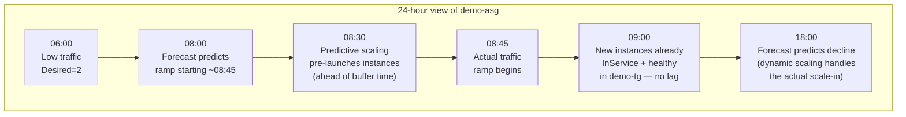

# 06 - Predictive Scaling (Hands-On)

> Goal: add **predictive scaling** to `demo-asg` — instead of *reacting* to a CloudWatch alarm breach like the previous note's dynamic scaling, predictive scaling uses **machine learning on historical load** to *forecast* tomorrow's traffic and pre-launch capacity **before** it's needed. We enable it in Forecast-only mode first, review the forecast, then switch to Forecast-and-scale.

---

## 1. What predictive scaling is

**Predictive scaling** analyzes historical CloudWatch metric data for `demo-asg` — at minimum **24 hours**, ideally up to **14 days** — to detect **recurring daily/weekly patterns**, then generates an **hourly forecast of the next 48 hours of capacity needs**. The forecast is refreshed roughly every 6 hours as new data arrives. Instead of waiting for CPU to actually cross 70% at 9 AM, predictive scaling looks at the last two weeks of "CPU always climbs around 8:45 AM on weekdays" and **launches instances in advance** so they're already warmed up when the real traffic hits.

> 🧠 **Mental model:** dynamic scaling (covered in the previous note) is a driver braking *after* seeing brake lights ahead. Predictive scaling is a driver who's driven this route every day for two weeks and already knows there's a red light coming — they ease off the gas *before* they even see it.

---

## 2. Predictive vs Dynamic vs Scheduled — the full picture

| | **Predictive Scaling** | **Dynamic Scaling** | **Scheduled Scaling** |
|---|---|---|---|
| Basis | ML forecast from historical CloudWatch data | Live CloudWatch alarm, right now | A fixed clock time you configure |
| Timing | **Proactive** — scales ahead of predicted demand | **Reactive** — scales after a threshold is breached | Proactive, but with **no intelligence** — just a clock |
| Best fit | Recurring, cyclical patterns (business-hours traffic, batch jobs) | Unpredictable, spiky, one-off traffic | Predictable, human-known schedules that don't need ML (e.g. "office opens at 8") |
| Learns over time? | Yes — improves as more historical data accumulates | No — always evaluates the current metric only | No — a static time you set once |
| Needs history? | **Yes**, minimum 24h, best with 14 days | No | No |
| Can decrease capacity? | No by itself — forecast-and-scale only scales **out** ahead of predicted increases; use dynamic scaling alongside it to scale back **in** | Yes, both directions | Yes, if you schedule a scale-down action |

🎯 **Exam tip:** predictive scaling **needs historical data** to work — a brand-new ASG with no traffic history can't use it effectively on day one. This is a favorite exam trap: "we just launched a new ASG last night, should we turn on predictive scaling to handle tomorrow's launch traffic spike?" → **No**, there isn't 24 hours of history yet, use dynamic (or scheduled) scaling instead until enough history accumulates.

---

## 3. The two policy modes

| Mode | What it does | When to use |
|---|---|---|
| **Forecast only** | Generates capacity forecasts and lets you view them (forecast vs actual graphs), but does **not** actually change `demo-asg`'s capacity | Always start here — validate the forecast is sane before trusting it to act |
| **Forecast and scale** | Actually adjusts capacity ahead of the predicted demand curve, scaling **out** before forecasted peaks | Once you've confirmed (over a few days) that the forecast tracks real traffic well |

Every predictive scaling policy starts life in **Forecast only** mode automatically — AWS deliberately doesn't let a brand-new policy immediately start changing your live capacity.

> ⚠️ Even in **Forecast and scale** mode, predictive scaling by itself only ever scales **out** ahead of a predicted increase — it does **not** scale in when it forecasts a decrease. Pair it with a dynamic scaling policy (like the target tracking policy from the previous note) to actually scale back down when load subsides; when both policies are active, the ASG's desired capacity becomes the **maximum** of what each policy independently calculates.

---

## 4. Hands-on: enable Forecast-only predictive scaling on `demo-asg`

We reuse the same metric as the previous note's target tracking policy — average CPU utilization at a target of 50% — so predictive scaling is forecasting the same signal target tracking reacts to.

1. Console → **EC2 → Auto Scaling Groups → `demo-asg`**.
2. Select the **Automatic Scaling** tab.
3. Scroll to **Predictive scaling** → **Create predictive scaling policy**.
4. **Policy name**: `demo-predictive-cpu-50`.
5. **Metric type**: **Average CPU utilization** (matches `demo-cpu-target-50` from the previous note), **Target value**: `50`.
6. **Predictive scaling mode**: **Forecast only**.
7. **Scheduling buffer time** (a.k.a. pre-launch instances): leave default for now (this controls how far ahead of the forecasted hour AWS starts launching instances — enough time for `t3.micro` instances running `demo-lt`'s user data to boot and pass health checks before the predicted peak).
8. **Max capacity behavior**: leave the default (don't auto-increase max capacity beyond `demo-asg`'s Max of 6 for now).
9. **Create**.

Because `demo-asg` is a fresh group with little history, the console will likely show a message that there isn't yet enough data (minimum 24 hours) to generate a forecast. Wait at least a day (ideally let it run through a couple of full days of your app's real traffic pattern) before evaluating results.

### View the forecast vs actual graph

1. Same **Automatic Scaling** tab → select `demo-predictive-cpu-50` → **View forecast**.
2. You'll see two overlaid lines per metric:
   - **Forecasted capacity/load** (the ML prediction)
   - **Actual capacity/load** (what really happened)
3. AWS also surfaces a **recommendation** on how well the policy is likely to perform, based on how closely history matches a repeating pattern.

Evaluate this for several days. If the forecast line tracks the actual line reasonably well, it's safe to start scaling based on it.

---

## 5. Hands-on: switch to Forecast-and-scale

Once you trust the forecast:

1. **Automatic Scaling** tab → select `demo-predictive-cpu-50` → **Edit**.
2. **Predictive scaling mode**: change to **Forecast and scale**.
3. **Save**.

From now on, at the start of each forecasted hour (or earlier, per your **Scheduling buffer time**), `demo-asg` pre-launches instances so they're already `InService` and passing `demo-tg` health checks by the time the predicted peak actually arrives — rather than only starting to launch instances after a CPU alarm crosses 70% the way pure dynamic scaling would.

> ⚠️ Predictive scaling respects `demo-asg`'s Min/Max (2/6) unless you've explicitly configured **Max capacity behavior** to allow the max to auto-increase when the forecast approaches it — and if you do, remember the max does **not** automatically shrink back down afterward; you'd have to lower it manually.

---

## 6. Diagram: forecast curve vs actual load vs pre-launch timing

Compare this to the previous note's sequence diagram: with pure dynamic scaling, the launch only *starts* after the 08:45 CPU alarm fires — meaning new instances aren't ready until several minutes *into* the traffic ramp. With predictive scaling, the launch already happened at 08:30, so capacity is ready right as the ramp begins.

---

## 7. Best-fit workloads

| Workload pattern | Best scaling approach |
|---|---|
| Predictable daily/weekly cycle (e.g. heavy business-hours traffic 9–6 IST, quiet overnight/weekends) | **Predictive scaling** |
| Sudden, unpredictable spikes (viral post, flash sale with no fixed time) | **Dynamic scaling** (reactive, no history needed) |
| A one-off known event at a fixed time (a scheduled maintenance window, a marketing email blast at exactly 10 AM) | **Scheduled scaling** — no ML needed, you already know the time |
| Slow-booting application instances where a few minutes of "cold" capacity during a ramp genuinely hurts users | **Predictive scaling** (pre-launch gives instances time to warm up before real load arrives) |

---

## 8. Common beginner problems

| Problem | Likely cause / fix |
|---|---|
| Console says "not enough data" | Fewer than 24 hours of CloudWatch history for the chosen metric — wait, or enable predictive scaling earlier next time |
| Forecast looks flat/wrong | Traffic pattern isn't actually cyclical yet, or too little history (best results need ~14 days) — stay in Forecast-only longer |
| Enabled Forecast-and-scale but capacity never seems to shrink after a predicted peak | Expected — predictive scaling **only scales out** proactively; pair it with a dynamic (target tracking) policy for scale-in |
| Max capacity crept up and stayed high | **Max capacity behavior** was set to auto-increase and never reset — check `demo-asg`'s Max field and lower it manually if no longer needed |

---

## 9. Exam tips

🎯 **Exam tip:** predictive scaling needs **historical data** — minimum 24 hours, ideally 14 days. A brand-new ASG cannot benefit from it immediately; that's the classic exam trap.

🎯 **Exam tip:** predictive scaling is **proactive** (forecasts ahead), dynamic scaling is **reactive** (waits for a threshold breach). If the question says "recurring pattern," "known business hours," or "avoid lag during ramp-up," think predictive scaling. If it says "unpredictable spike," think dynamic scaling.

🎯 **Exam tip:** always start a new predictive scaling policy in **Forecast only** mode to validate accuracy before switching to **Forecast and scale** — this is the recommended AWS workflow, not just a best practice suggestion.

---

## 10. Recap

- Predictive scaling uses ML on historical CloudWatch data (min 24h, ideally 14 days) to **forecast** load and proactively scale `demo-asg` ahead of predicted peaks — unlike the previous note's reactive dynamic scaling.
- Two modes: **Forecast only** (observe, don't act — always start here) and **Forecast and scale** (actually pre-launches capacity).
- Best fit: recurring daily/weekly patterns. Contrast: dynamic scaling for unpredictable spikes, scheduled scaling for fixed, human-known times.
- Built `demo-predictive-cpu-50` on the same average-CPU-at-50% metric as the previous note's target tracking policy, validated the forecast-vs-actual graph, then switched to Forecast-and-scale.
- Predictive scaling only scales **out** proactively — pair it with dynamic scaling for scale-in.
- Next: Note 07 covers the **Instance Maintenance Policy** — controlling *how* instances get replaced (not *whether* to scale) during instance refresh, AZ rebalancing, and health-check-triggered replacement.

---

### Sources
- [Predictive scaling for Amazon EC2 Auto Scaling](https://docs.aws.amazon.com/autoscaling/ec2/userguide/ec2-auto-scaling-predictive-scaling.html)
- [How predictive scaling works](https://docs.aws.amazon.com/autoscaling/ec2/userguide/predictive-scaling-policy-overview.html)
- [Create a predictive scaling policy](https://docs.aws.amazon.com/autoscaling/ec2/userguide/predictive-scaling-create-policy.html)
- [Evaluate your predictive scaling policies](https://docs.aws.amazon.com/autoscaling/ec2/userguide/predictive-scaling-graphs.html)
