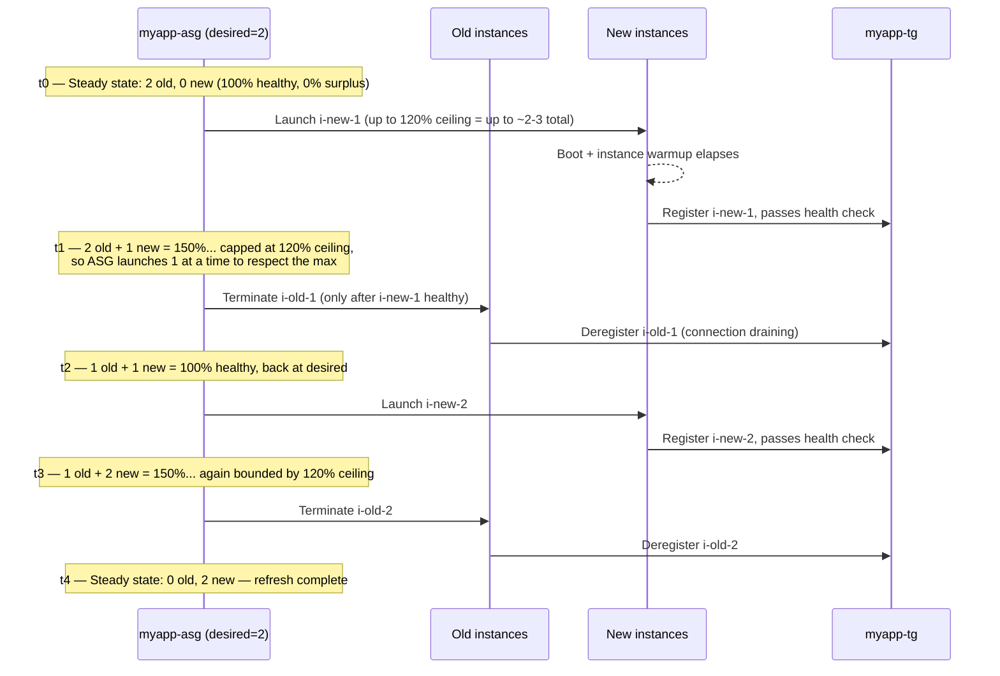

# 07 - Instance Maintenance Policy (Hands-On)

> Goal: control **how** `myapp-asg` replaces instances during an instance refresh, AZ rebalancing, or health-check-triggered replacement — not *whether* to scale (that's Notes 04–06), but the mechanics of *swap-out*. We configure a **launch-first** maintenance policy (min healthy 100%, max healthy 120%) and trigger an instance refresh to watch it work.

---

## 1. What an Instance Maintenance Policy is

An **instance maintenance policy** is a relatively newer ASG feature (GA since late 2023) that governs the balance between **availability** and **extra capacity** whenever `myapp-asg` needs to **replace** instances — as opposed to *scaling* the group up or down. It applies to these replacement events:

- **Instance refresh** (rolling out a new `myapp-lt` launch template version to all instances — covered more in later infrastructure-update notes).
- **AZ rebalancing** (ASG restoring balance across `ap-south-1a`/`ap-south-1b` after an AZ becomes unavailable or unbalanced).
- **Health-check-triggered replacement** (an instance fails its EC2 or `myapp-tg` ELB health check and must be swapped out).
- **Maximum instance lifetime** replacement, if configured.

> 🧠 **Mental model:** scaling policies (Notes 04–06) decide "do we need 2, or 4, or 6 instances right now?" The instance maintenance policy decides, once AWS has already decided an instance needs to be *swapped*, "do we launch the replacement first and then remove the old one, or remove the old one first and then launch, or something in between?"

🎯 **Exam tip:** this note is about **how replacement happens**, not about **deciding whether to scale**. If a question asks about CPU thresholds or forecasts, that's Notes 05/06. If it asks about "minimizing capacity dip during instance refresh" or "avoiding over-provisioning during replacement," that's this note.

---

## 2. The two key settings

| Setting | Role | Valid range | What it governs |
|---|---|---|---|
| **Minimum healthy percentage** | The **floor** | 0–100% | How far **below** desired capacity the group is allowed to drop (in healthy, in-service instances) while replacement is happening |
| **Maximum healthy percentage** | The **ceiling** | 100–200% | How far **above** desired capacity the group is allowed to grow (extra, surplus instances launched but not yet removed) while replacement is happening |

Both are expressed as a **percentage of desired capacity**, not of max capacity. For `myapp-asg` with **desired = 2**:

- **Minimum healthy percentage = 100%** → never drop below 2 healthy instances during replacement.
- **Maximum healthy percentage = 120%** → allow up to `ceil(2 × 1.2)` = up to roughly 2–3 extra/surplus instances momentarily in service before old ones terminate (AWS rounds up; the exact instance count scales with desired capacity — e.g. at desired=100 instead of 2, 120% = up to 120 instances).

An instance only counts toward the **minimum healthy percentage** once it's actually `InService`, has passed its first health check, **and** the group's configured **instance warmup** time has elapsed — this stops a still-booting instance from being wrongly counted as "already handling load."

---

## 3. The three resulting behaviors

| Behavior | Min healthy % | Max healthy % | What happens |
|---|---|---|---|
| **Launch first** ("Launch before terminating") | 100% | > 100% (e.g. 120%) | New instance(s) launch and become healthy **first**; only then are old instances terminated. Capacity never dips below desired, but briefly exceeds it. Favors **availability**. |
| **Terminate first** ("Terminate and launch") | < 100% (e.g. 90%) | 100% | Old instances are terminated **at the same time** new ones are launched — capacity can briefly dip below desired but never exceeds it. Favors **cost** (never pay for surplus capacity). |
| **Mixed launch-and-terminate** ("Custom policy") | e.g. 90% | e.g. 110% | A blended window — capacity can dip a little **and** bulge a little at the same time, replacing instances faster than a strict launch-first approach while still bounding both extremes. Balances cost and availability. |

> ⚠️ The **default behavior when no instance maintenance policy is set** is effectively **terminate and launch** for health-check failures, instance refresh, and max-instance-lifetime replacement — but **launch before terminating** for AZ rebalancing (which can exceed group size limits by up to 10% of **max** capacity, or 10% of **desired** capacity if Capacity Rebalancing is enabled). Setting an explicit policy makes this behavior **consistent** across all these events instead of varying by event type.

---

## 4. Diagram: launch-first flow (min healthy 100%, max healthy 120%)

`myapp-asg` desired capacity = 2. An instance refresh needs to replace both old instances (`i-old-1`, `i-old-2`) with new ones running an updated `myapp-lt` version.

At no point does healthy capacity drop below **100% of desired (2 instances)** — that's the min healthy percentage floor doing its job — and the ASG paces launches so surplus never exceeds the **120% ceiling**, launching new instances a few at a time rather than all at once.

---

## 5. Hands-on: set a launch-first maintenance policy on `myapp-asg`

1. Console → **EC2 → Auto Scaling Groups**.
2. Check the box next to **`myapp-asg`** (opens the details split-pane at the bottom — don't click into the group name).
3. Go to the **Details** tab → find **Instance maintenance policy** → click **Edit**.
4. **Replacement behavior**: choose **Launch before terminating**.
5. **Maximum healthy percentage**: `120`.
   - Minimum healthy percentage is fixed at **100%** automatically for this option (you can't drop below desired capacity when launch-first is selected).
6. Click **Update**.

`myapp-asg` will now use this policy for every future instance refresh, AZ rebalance, and health-check replacement.

### Trigger an instance refresh to see it in action

1. Same **Auto Scaling Groups** page → select `myapp-asg` → **Instance refresh** tab → **Start instance refresh**.
2. **Minimum healthy percentage**: this instance-refresh-specific setting can override the group's default for this one refresh — leave it consistent with the maintenance policy (100%) for this demo, or leave blank to inherit the group's policy.
3. **Instance warmup**: match what you configured for scaling policies in Note 05 (e.g. 300s) so newly launched instances aren't rushed into being counted healthy.
4. **Start instance refresh**.
5. Watch **EC2 → Instances** and `myapp-tg`'s **Registered targets** tab: you'll see new instances appear and register **before** old ones disappear and deregister — exactly the launch-first pattern from the diagram above.
6. The **Instance refresh** tab shows live progress (percentage complete, instances replaced so far).

> ⚠️ An instance refresh can be **cancelled** mid-flight (Instance refresh tab → **Cancel**) — it will finish replacing any instance currently mid-swap, then stop, leaving a mix of old and new instances until you start a new refresh.

---

## 6. Common beginner problems

| Problem | Likely cause / fix |
|---|---|
| Instance refresh seems to hang below 100% for a while | New instance hasn't finished its **instance warmup** period yet, or its `myapp-tg` health check hasn't passed yet — check `/health` and the httpd/nginx user data actually ran |
| Refresh briefly exceeds `myapp-asg`'s Max (6) | Shouldn't happen — the maintenance policy's max healthy percentage is capped by the group's Max capacity too; if you see this, double check your Max setting |
| Chose "Terminate and launch" but app briefly served 503s | Expected trade-off — terminate-first can dip capacity below desired momentarily; if that's unacceptable, switch to launch-first (accepting a brief surplus/cost bump instead) |
| Custom policy values rejected | Min healthy percentage must be 0–100; Max healthy percentage must be 100–200; and max must be ≥ min |

---

## 7. Exam tips

🎯 **Exam tip:** this is about **how** replacement happens (availability vs cost trade-off during a swap), not about **whether/when** to scale — don't confuse it with dynamic (Note 05) or predictive (Note 06) scaling policies.

🎯 **Exam tip:** memorize the pattern — **Launch before terminating** = min healthy 100%, max healthy > 100% (favors availability, brief surplus cost). **Terminate and launch** = max healthy 100%, min healthy < 100% (favors cost, brief capacity dip). A **Custom policy** lets you set both independently for a blended approach.

---

## 8. Recap

- The **instance maintenance policy** controls replacement behavior during instance refresh, AZ rebalancing, and health-check-triggered replacement — governed by **minimum healthy percentage** (the floor, 0–100%) and **maximum healthy percentage** (the ceiling, 100–200%), both expressed relative to desired capacity.
- **Launch first** (min=100%, max>100%) favors availability; **terminate first** (max=100%, min<100%) favors cost; **custom/mixed** blends both.
- Set `myapp-asg` to **Launch before terminating** with **max healthy 120%**, then triggered an instance refresh and watched new instances register in `myapp-tg` before old ones deregistered.
- Next: Notes 09–10 cover overriding the **default termination policy** itself — i.e., once the ASG has decided *how many* instances to remove, which specific instance(s) it picks.

---

### Sources
- [Instance maintenance policies for Amazon EC2 Auto Scaling](https://docs.aws.amazon.com/autoscaling/ec2/userguide/ec2-auto-scaling-instance-maintenance-policy.html)
- [Instance maintenance policy for Auto Scaling group — overview and considerations](https://docs.aws.amazon.com/autoscaling/ec2/userguide/instance-maintenance-policy-overview-and-considerations.html)
- [Set an instance maintenance policy on your Auto Scaling group](https://docs.aws.amazon.com/autoscaling/ec2/userguide/set-instance-maintenance-policy.html)
- [Introducing instance maintenance policy for Amazon EC2 Auto Scaling – AWS blog](https://aws.amazon.com/blogs/compute/introducing-instance-maintenance-policy-for-amazon-ec2-auto-scaling/)
