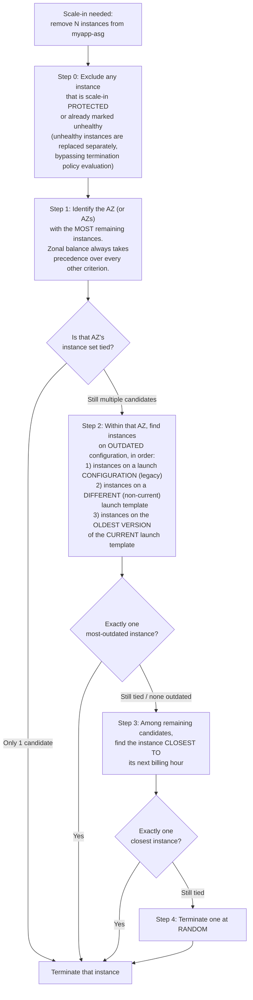

# 08 - Default Termination Policy (Hands-On)

> Goal: understand exactly **which** instance an Auto Scaling group picks when it must remove one but several healthy candidates exist, using AWS's built-in **`Default`** termination policy on `myapp-asg`. We verify the precise, ordered algorithm against AWS docs and walk a concrete 3-instance, 2-AZ scenario through it step by step. Notes 09–10 cover the predefined alternatives and custom (Lambda-backed) termination policies that can override this default.

---

## 1. When does the ASG even need to *choose* an instance to terminate?

Most of the time, scaling events are unambiguous: scale desired capacity from 2 to 4, and the ASG simply launches 2 new instances — no choice needed. But several events **reduce** capacity while **multiple healthy instances exist**, forcing the ASG to pick *which one(s)* go:

- **Scale-in** events (a dynamic scaling policy from Note 05 lowers desired capacity, e.g. the step-scaling `myapp-step-scale-in` policy removing 1 instance when CPU < 30%).
- **AZ rebalancing** (restoring an even instance count across `ap-south-1a`/`ap-south-1b`, e.g. after an AZ was temporarily unavailable).
- **Instance refresh** without a strict launch-first maintenance policy (Note 07), where the ASG must decide which "old" instance to retire at each step.
- **Manually setting a lower desired/max capacity** (Note 03) when more instances are currently running than the new max allows.

In every one of these cases, if several instances are equally healthy and not scale-in **protected**, the ASG needs a rule to break the tie. That rule is the **termination policy** — and unless you've explicitly changed it, `myapp-asg` uses AWS's built-in **`Default`** policy.

> 🧠 **Mental model:** think of it as a strict, ordered tie-breaker tournament — AZ balance first, then "which instance is running the stalest configuration," then "which instance is closest to a wasted hour," and only truly at random if everything else is a dead tie.

---

## 2. The Default termination policy algorithm (verified against AWS docs)

AWS evaluates these criteria **in order**, moving to the next only when the previous step leaves more than one instance tied:

| Step | Criterion | Notes |
|---|---|---|
| 0 | Exclude protected/unhealthy instances | Scale-in protected instances are never picked; unhealthy instances are replaced through the normal health-check path, not this termination-policy evaluation |
| 1 | **AZ balance** | Whichever AZ has the most instances is evaluated first — this **always** takes precedence over every other rule, even in `OldestInstance`/`NewestInstance`/etc. predefined policies (Note 09) |
| 2 | **Outdated launch template/configuration** | Legacy launch-configuration instances first, then instances on a different (non-current) template, then instances on the oldest version of the current template |
| 3 | **Closest to next billing hour** | A holdover from per-hour EC2 billing; most usage today is billed per-second, so this step rarely changes real-world outcomes anymore, but it's still evaluated |
| 4 | **Random** | Only reached if every prior step still leaves an exact tie |

🎯 **Exam tip:** the single most commonly mis-remembered detail — **AZ balancing always wins first**, before configuration age or anything else. This means the Default policy can terminate a *newer* instance in an overloaded AZ before an *older* instance in a balanced AZ. The exam loves testing this exact "why did the newer instance get terminated?" scenario.

---

## 3. Worked scenario: `myapp-asg` with 3 instances across 2 AZs

Suppose a dynamic scaling policy (Note 05) just decided `myapp-asg` should scale in from 3 instances to 2. The current fleet, none of them scale-in protected or unhealthy:

| Instance | AZ | Launched | Launch template version |
|---|---|---|---|
| `i-old1` | `ap-south-1a` | Day 1, 09:00 | `myapp-lt` **v1** (original) |
| `i-new1` | `ap-south-1a` | Day 20, 14:00 | `myapp-lt` **v2** (current — template was updated on Day 18 to bump the AMI) |
| `i-mid1` | `ap-south-1b` | Day 3, 10:00 | `myapp-lt` **v1** |

Walking the algorithm:

**Step 1 — AZ balance.** `ap-south-1a` has 2 instances (`i-old1`, `i-new1`); `ap-south-1b` has 1 instance (`i-mid1`). `ap-south-1a` has the most instances, so it's evaluated first — **`i-mid1` in `ap-south-1b` is not even considered**, no matter how old it is.

**Step 2 — outdated configuration, within `ap-south-1a` only.** Comparing `i-old1` and `i-new1`:
- `i-old1` is running **`myapp-lt` v1**, which is now an outdated (non-current) version of the launch template.
- `i-new1` is running **`myapp-lt` v2**, the current version.

`i-old1` is uniquely identified as outdated — **the algorithm stops here.**

**Result: `i-old1` is terminated.**

Notice what *didn't* decide this: not launch time alone (that would have picked `i-mid1`, the oldest of all three by wall-clock age, since `i-old1` is actually the very oldest — but AZ balance excluded `ap-south-1b` from consideration entirely before age was ever compared), and the billing-hour/random tiebreakers were never reached because Step 2 already produced a unique answer.

> ⚠️ If `i-old1` and `i-new1` had **both** been on `myapp-lt` v2 (i.e., no outdated instance in the imbalanced AZ), the algorithm would have moved to Step 3 (closest to next billing hour) and, if still tied, Step 4 (random) — still confined to `ap-south-1a`, never considering `i-mid1`.

---

## 4. Where the Default policy applies vs where you can override it

| Scope | Behavior |
|---|---|
| `myapp-asg` uses only the **`Default`** predefined policy | Everything above applies exactly as described |
| `myapp-asg` uses a **mixed instances group** (multiple instance types / Spot+On-Demand) | An extra Step 1.5 is inserted **before** the configuration-age check: first identify which purchase option (Spot vs On-Demand) needs rebalancing to match your target allocation strategy, then apply outdated-config and billing-hour checks *within* that purchase option and AZ |
| You select a **different predefined policy** (`OldestInstance`, `NewestInstance`, `OldestLaunchTemplate`, `ClosestToNextInstanceHour`, `AllocationStrategy`) | AZ balancing **still always happens first** — the predefined policy only changes the tie-breaking logic *within* the already-selected imbalanced AZ (covered in Note 09) |
| You attach a **custom Lambda-backed termination policy** | You fully control which instance(s) are selected, though AWS still recommends respecting AZ balance yourself (covered in Note 10) |

---

## 5. Common beginner problems

| Problem | Likely cause / fix |
|---|---|
| "Why did my newer instance get terminated instead of the older one?" | AZ balancing ran first — the older instance was in a different, already-balanced AZ and was never a candidate | 
| Termination "ignored" an instance I expected to be picked | It was scale-in **protected**, or it was flagged unhealthy (unhealthy instances follow the health-check replacement path, not termination-policy evaluation) |
| Instance refresh terminated instances in an order I didn't expect | Instance refresh interacts with both the **instance maintenance policy** (Note 07, controls the pacing/healthy-percentage bounds) and the **termination policy** (this note, controls *which* instance within that pacing) — they're independent settings working together |
| Can't tell why two seemingly-identical instances resolved differently | Check launch template version and exact launch timestamp — Steps 2 and 3 are more granular than they first appear |

---

## 6. Exam tips

🎯 **Exam tip:** memorize the order — **(1) AZ balance → (2) outdated launch template/configuration → (3) closest to next billing hour → (4) random.** AZ balance is evaluated *first, always*, regardless of which termination policy (default or predefined) is active.

🎯 **Exam tip:** unhealthy or scale-in-protected instances are **excluded** from termination policy evaluation entirely — they're handled by separate mechanisms (health-check replacement, or simply never picked while protected).

---

## 7. Recap

- The ASG must **choose** which instance to terminate whenever a scale-in, AZ rebalance, or instance refresh reduces capacity while multiple healthy, unprotected candidates exist.
- The **`Default`** termination policy evaluates, in strict order: **AZ balance first**, then **outdated launch template/configuration**, then **closest to next billing hour**, then **random** as a last resort.
- Worked `myapp-asg` scenario: 2 instances in `ap-south-1a` (one on outdated `myapp-lt` v1, one on current v2) vs 1 instance in `ap-south-1b` → AZ balance picks `ap-south-1a` for evaluation → outdated-config check picks `i-old1` (v1) for termination, without ever comparing wall-clock age against the `ap-south-1b` instance.
- This is the **built-in default** — Note 09 covers the other predefined policies (`OldestInstance`, `NewestInstance`, `OldestLaunchTemplate`, `ClosestToNextInstanceHour`, `AllocationStrategy`), and Note 10 covers fully custom Lambda-backed termination policies.

---

### Sources
- [Configure termination policies for Amazon EC2 Auto Scaling](https://docs.aws.amazon.com/autoscaling/ec2/userguide/ec2-auto-scaling-termination-policies.html)
- [Change the termination policy for an Auto Scaling group](https://docs.aws.amazon.com/autoscaling/ec2/userguide/custom-termination-policy.html)
- [Amazon EC2 Auto Scaling FAQs](https://aws.amazon.com/ec2/autoscaling/faqs/)
