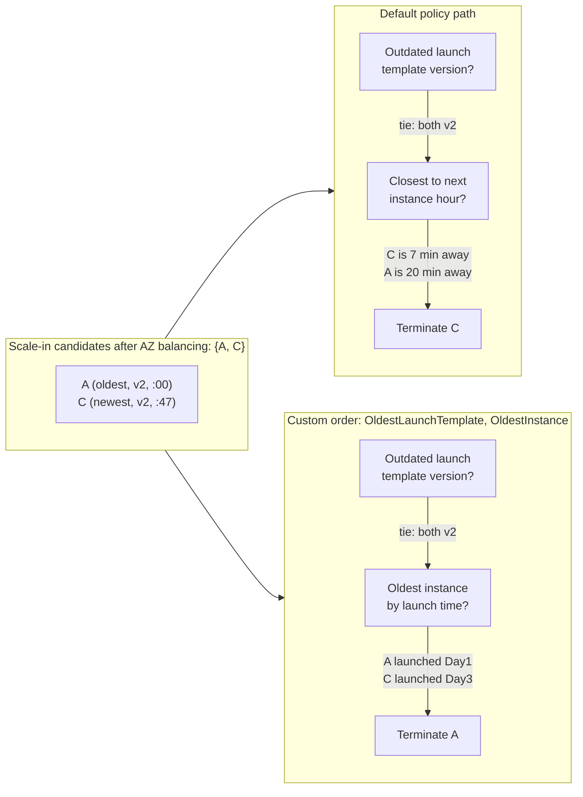

# 09 - Built-in Termination Policies (Hands-On)

> Goal: go beyond the **Default** termination policy (Note 08) and learn the other **predefined termination policy options** AWS lets you pick and combine explicitly. We reconfigure `myapp-asg` with a custom policy order and replay the same 3-instance scenario from Note 08 to see how the outcome changes.

---

## 1. Why you'd ever change it away from Default

The Default policy (Note 08) is a reasonable general-purpose choice — it phases out outdated launch template versions first, then breaks ties by billing-hour proximity. But it doesn't let you express intent like:

- "I'm doing a fleet refresh — always kill the **oldest** instance, period."
- "I'm canary-testing a new launch template version — if this goes wrong, kill the **newest** instances first to back out fast."
- "I'm running mixed Spot/On-Demand capacity — terminate instances that keep me aligned with my **allocation strategy**, not just age."

For these, AWS gives you **predefined (built-in) termination policies** you select explicitly, instead of relying on the multi-step Default algorithm.

---

## 2. The built-in termination policy options

| Policy | What it optimizes for | When to pick it |
|---|---|---|
| **`OldestInstance`** | Terminate the oldest running instance in the group | Regularly refreshing your fleet onto newer AMIs/instance types — gradually replace old instances with new ones over time |
| **`NewestInstance`** | Terminate the newest instance in the group | You're testing a new launch template version (canary) and want to **back it out fast** if something's wrong, without touching stable older instances |
| **`OldestLaunchTemplate`** | Terminate instances still running an outdated launch template version (or a different template entirely) | Phasing out an old configuration after updating `myapp-lt` — same idea as Default's first step, but usable standalone/reorderable |
| **`ClosestToNextInstanceHour`** | Terminate the instance closest to completing a full, paid instance-hour | Historically a cost play (don't waste a partially-used hour). ⚠️ With **per-second billing** for Linux instances, this optimization barely matters anymore — you're billed for exactly what you use either way. Still useful as a **deterministic tie-breaker** even though it no longer "saves" a rounded-up hour. |
| **`AllocationStrategy`** | Terminate instances to keep a **mixed instances group** (Spot + On-Demand, multiple instance types) aligned with your configured allocation strategy | Only relevant if `myapp-asg` used a [mixed instances policy](https://docs.aws.amazon.com/autoscaling/ec2/userguide/ec2-auto-scaling-mixed-instances-groups.html) — e.g. keep drifting back toward your cheapest Spot pools, or a preferred On-Demand instance type ordering |
| **`Default`** | The full multi-step algorithm from Note 08 (outdated config → then closest-to-next-instance-hour) | Used automatically if you specify nothing; also useful as the **final catch-all tie-breaker** in a custom list |

> 🧠 **Mental model:** think of these as **named shortcuts into the Default algorithm's individual steps**. `OldestLaunchTemplate` and `ClosestToNextInstanceHour` are literally the two steps Default already performs, in order — picking them explicitly (and adding `OldestInstance`/`NewestInstance`) just lets you reorder, mix, or replace those steps with your own priorities.

`myapp-asg` currently launches only `t3.micro` (no mixed instances policy), so `AllocationStrategy` doesn't apply to it today — it's listed here because the exam tests it as a concept, and it becomes directly relevant the moment you add Spot capacity to the group.

---

## 3. How multiple policies combine

You don't have to pick just one — you supply an **ordered list**. AWS evaluates them **in the order you list them**, and each policy only acts as a **tie-breaker** for whatever candidates the previous policy couldn't narrow down to a single instance:

1. Amazon EC2 Auto Scaling **always balances across Availability Zones first** — this happens *regardless* of which termination policy(ies) you configure. If one AZ has more instances than the others, only that AZ's instances are candidates at all.
2. Within the imbalanced AZ, policy #1 in your list is applied. If it narrows the field to exactly one instance, that instance is terminated.
3. If policy #1 still leaves a tie (multiple equally-qualifying instances), policy #2 in your list breaks the tie. And so on.
4. If you include `Default`, it must be **last** in the list (it's the ultimate catch-all).
5. If you include a **custom Lambda-backed policy** (Note 10), it must be **first** in the list.

> ⚠️ **AZ balancing always wins first**, even over a custom Lambda policy. You can never terminate your way into an AZ imbalance through termination policy choice alone — the group will rebalance itself over subsequent scale-in events if needed.

---

## 4. Hands-on: set `myapp-asg`'s termination policy order

We'll configure `myapp-asg` to use **`[OldestLaunchTemplate, OldestInstance]`** — useful if the team's priority is "always finish rolling off old launch template versions first, and once everyone's on the current version, just cull the oldest instances to keep the fleet fresh."

### Console

1. EC2 console → **Auto Scaling Groups** → select **`myapp-asg`**.
2. In the details pane at the bottom, go to the **Details** tab → **Advanced configurations** → **Edit**.
3. Under **Termination policies**, remove `Default` and add, **in this order**:
   1. `OldestLaunchTemplate`
   2. `OldestInstance`
4. Click **Update**.

### AWS CLI

```bash
aws autoscaling update-auto-scaling-group \
  --auto-scaling-group-name myapp-asg \
  --termination-policies "OldestLaunchTemplate" "OldestInstance"
```

---

## 5. Replaying the Note 08 scenario with the new policy order

Recall the shared 3-instance scenario (Note 08): `myapp-asg` briefly runs 3 instances across its two subnets while we observe a scale-in.

| Instance | AZ / Subnet | Launched | Launch template version |
|---|---|---|---|
| **A** — `i-0a1b2c3d4e5f60111` | `ap-south-1a` / `myapp-private-subnet-1` | Day 1, 09:00 IST | `myapp-lt` v2 (current) |
| **B** — `i-0a1b2c3d4e5f60222` | `ap-south-1b` / `myapp-private-subnet-2` | Day 1, 09:03 IST | `myapp-lt` v2 (current) |
| **C** — `i-0a1b2c3d4e5f60333` | `ap-south-1a` / `myapp-private-subnet-1` | Day 3, 15:47 IST | `myapp-lt` v2 (current) |

All three now run the **same, current** launch template version (the earlier v1 instances have already cycled out). A CloudWatch alarm fires a scale-in event, dropping desired capacity from 3 to 2, at **Day 4, 10:40 IST**.

**Step 1 — AZ balance (applies no matter what policy you use):** `ap-south-1a` has 2 instances (A, C), `ap-south-1b` has 1 (B). AZ-a is imbalanced → **candidates are narrowed to {A, C}** only. B is safe purely because of AZ balancing.

**Step 2a — under the `Default` policy:** within {A, C}, both run the same current launch template version → tie, no outdated config. Move to the next Default step: **closest to next instance hour**.
- A launched at `:00` past the hour → at 10:40, its next billing-hour boundary is 11:00 → **20 minutes away**.
- C launched at `:47` past the hour → at 10:40, its next boundary is 10:47 → **7 minutes away**.
- C is closer → **Default terminates instance C** (the *newer* of the two, purely because of where its launch second happened to fall).

**Step 2b — under our custom `[OldestLaunchTemplate, OldestInstance]` policy:** within {A, C}, `OldestLaunchTemplate` finds both on the same current version → tie, moves to the next policy in the list: `OldestInstance`.
- A launched Day 1, 09:00 — the older of the two.
- C launched Day 3, 15:47 — the newer.
- **Custom policy terminates instance A** (the genuinely older instance).

**The outcomes differ**: Default happens to terminate the newer instance C (an artifact of billing-hour timing that barely matters under per-second billing), while the explicit `[OldestLaunchTemplate, OldestInstance]` order reliably terminates the actually-oldest instance A — which is what a "keep refreshing the fleet" strategy actually wants.

---

## 6. Diagram: Default vs custom-ordered decision paths



---

## 7. Common beginner problems

| Problem | Likely cause / fix |
|---|---|
| Changed the policy but termination order looks unchanged | AZ balancing always applies first — if your AZs are imbalanced, only the imbalanced AZ's instances are candidates regardless of policy |
| Put `Default` first in a custom list | Invalid — `Default` must always be **last** if included; the console/CLI will reject or reorder it |
| Expected `AllocationStrategy` to do something | It only affects **mixed instances groups** (Spot/On-Demand or multiple instance types) — no effect on a single-instance-type ASG like today's `myapp-asg` |
| Assumed `ClosestToNextInstanceHour` saves money | Mostly true only for **hourly-billed** resources; Linux On-Demand/Spot instances bill per second, so this is now primarily a deterministic tie-breaker, not a cost lever |

---

## 8. Exam tips

🎯 **Exam tip:** Availability Zone balancing **always** takes precedence over whichever termination policy(ies) you've configured — memorize this, it's a frequent trick answer ("the ASG terminated a newer instance even though I set OldestInstance" → because AZ balance forced the candidate pool first).

🎯 **Exam tip:** know the ordering rule — a **custom Lambda policy must be first**, `Default` **must be last**, when combined with other policies in the list.

🎯 **Exam tip:** `ClosestToNextInstanceHour` is a legacy-flavored answer choice; the exam may test whether you know it's **less impactful now that most EC2 usage is billed per second**.

---

## 9. ⚠️ Clean up to avoid charges

Changing termination policies costs nothing by itself — no extra billing risk here. But if you scaled `myapp-asg` up to 3 instances purely to run this demo, remember to bring it back down:

```bash
aws autoscaling update-auto-scaling-group \
  --auto-scaling-group-name myapp-asg \
  --desired-capacity 2 --min-size 2
```

And if you no longer want the custom order, revert to Default:

```bash
aws autoscaling update-auto-scaling-group \
  --auto-scaling-group-name myapp-asg \
  --termination-policies "Default"
```

---

## 10. Recap

- Built-in termination policies: `OldestInstance`, `NewestInstance`, `OldestLaunchTemplate`, `ClosestToNextInstanceHour`, `AllocationStrategy` (mixed instances only), and `Default` itself as a catch-all.
- You supply an **ordered list**; each entry only breaks ties left by the previous one. AZ balancing always happens first, before any policy is consulted.
- Reconfigured `myapp-asg` with `[OldestLaunchTemplate, OldestInstance]` and showed it terminates the truly oldest instance in a scenario where Default instead picked the newer one via billing-hour proximity.
- Next: Note 10 covers **custom, Lambda-backed termination policies** for when even these built-in options aren't expressive enough for your business logic.

---

### Sources
- [Configure termination policies for Amazon EC2 Auto Scaling – AWS docs](https://docs.aws.amazon.com/autoscaling/ec2/userguide/ec2-auto-scaling-termination-policies.html)
- [Change the termination policy for an Auto Scaling group – AWS docs](https://docs.aws.amazon.com/autoscaling/ec2/userguide/custom-termination-policy.html)
- [update-auto-scaling-group – AWS CLI reference](https://awscli.amazonaws.com/v2/documentation/api/latest/reference/autoscaling/update-auto-scaling-group.html)
- [Amazon EC2 pricing (per-second billing) – AWS](https://aws.amazon.com/ec2/pricing/)
