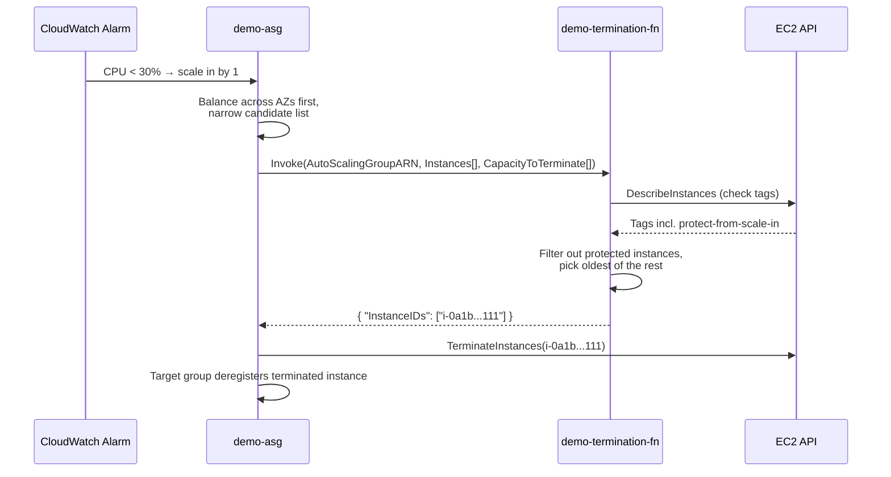

# 10 - Custom Termination Policies with Lambda (Hands-On)

> Goal: understand what a **custom (Lambda-backed) termination policy** is, when the built-in options from the previous note aren't expressive enough, and how to attach one to `demo-asg`. We also cover the lighter-weight alternative — **instance scale-in protection** — for the common case where all you need is "never terminate this specific instance."

---

## 1. Why built-in policies aren't always enough

The previous note's built-in policies (`OldestInstance`, `OldestLaunchTemplate`, etc.) only understand generic, structural facts about an instance — its age, its launch template version, its billing-hour position. None of them can answer business questions like:

- "Is this instance in the middle of processing a long job right now?"
- "Does this instance have a `protect-from-scale-in=true` tag?"
- "Is this instance in the Availability Zone with the currently cheaper Spot price?"

For logic like this, EC2 Auto Scaling lets you hand the termination decision to **your own AWS Lambda function**.

> 🧠 **Mental model:** a custom termination policy is EC2 Auto Scaling saying *"here's who I'm considering firing — you tell me who actually goes"* to a Lambda function you wrote, instead of applying a fixed built-in rule.

---

## 2. How it works: input and output contract

When a scale-in event happens (or an instance refresh / max-instance-lifetime replacement / AZ rebalance triggers a termination), EC2 Auto Scaling **invokes your Lambda synchronously** with a JSON payload.

### Input — what the ASG sends your function

```json
{
  "AutoScalingGroupARN": "arn:aws:autoscaling:ap-south-1:123456789012:autoScalingGroup:...:autoScalingGroupName/demo-asg",
  "AutoScalingGroupName": "demo-asg",
  "CapacityToTerminate": [
    { "AvailabilityZone": "ap-south-1a", "Capacity": 1, "InstanceMarketOption": "on-demand" }
  ],
  "Instances": [
    { "AvailabilityZone": "ap-south-1a", "InstanceId": "i-0a1b2c3d4e5f60111", "InstanceType": "t3.micro", "InstanceMarketOption": "on-demand" },
    { "AvailabilityZone": "ap-south-1a", "InstanceId": "i-0a1b2c3d4e5f60333", "InstanceType": "t3.micro", "InstanceMarketOption": "on-demand" }
  ],
  "Cause": "SCALE_IN"
}
```

- `CapacityToTerminate` — how much capacity needs to go, broken down by AZ and purchase option (already AZ-balanced by the ASG before your function is even called).
- `Instances` — the candidate instances the ASG suggests, narrowed to the imbalanced AZ (same AZ-balancing rule as the previous note applies **before** your Lambda is invoked).
- `Cause` — one of `SCALE_IN`, `INSTANCE_REFRESH`, `MAX_INSTANCE_LIFETIME`, `REBALANCE`.

### Output — what your function must return

```json
{ "InstanceIDs": ["i-0a1b2c3d4e5f60111"] }
```

- Return the instance ID(s) you've decided are safe/ready to terminate.
- Return `{ "InstanceIDs": [] }` if **nothing** should be terminated right now (e.g. every candidate is mid-job) — the ASG will retry your function later.
- You can return instances **not** in the original candidate list — this overrides the ASG's suggestion; if that creates AZ imbalance, the ASG will launch replacement capacity first, then gradually rebalance.

> ⚠️ **Hard limits to know:** your Lambda has a **2-second maximum runtime** for the ASG to accept its response — if you exceed it, the scale-in is put on hold and retried. Cross-account Lambda functions are **not supported** (must be same account as the ASG). The candidate list is capped at **30,000 instances** per invocation.

---

## 3. Required permissions: a resource-based policy on the Lambda

The ASG doesn't assume a role into your account — it invokes your function using its own **service-linked role** (`AWSServiceRoleForAutoScaling`). You grant that role permission via a **resource-based policy on the Lambda function itself** (like you would for S3 or SNS to invoke a function):

- **Principal**: `arn:aws:iam::<account-id>:role/aws-service-role/autoscaling.amazonaws.com/AWSServiceRoleForAutoScaling`
- **Action**: `lambda:InvokeFunction`
- **Resource**: your function's ARN

Console path: Lambda console → your function → **Configuration** → **Permissions** → **Resource-based policy statements** → **Add permissions** → choose **AWS account**, paste the service-linked role ARN as principal, action `lambda:InvokeFunction`.

---

## 4. Precedence: custom policy first, built-ins as fallback

A custom Lambda termination policy is referenced by **ARN** in the same `--termination-policies` list as the built-ins from the previous note — but with rules:

- The Lambda ARN **must be listed first**.
- Only **one** Lambda function can be specified per ASG.
- Anything the Lambda *doesn't* fully resolve (e.g. it returns more candidates than capacity needed to terminate) falls through to the **next policy in the list** as a tie-breaker — exactly like the previous note's chaining, just with the Lambda occupying slot #1.
- You can reference an **unqualified ARN** (uses the unpublished/`$LATEST` code, but the resource policy must be on the unpublished version) or a **qualified ARN** with a version/alias suffix (not `$LATEST` — that specific suffix is rejected).

Example combining a custom policy with a built-in fallback:

```
["arn:aws:lambda:ap-south-1:123456789012:function:demo-termination-fn:prod", "OldestInstance"]
```

---

## 5. Hands-on: attach a custom Lambda termination policy to `demo-asg`

**Scenario:** protect any instance tagged `protect-from-scale-in=true` (e.g. one running a long batch job); for everything else, fall back to terminating the oldest instance.

### Step 1 — Minimal Lambda (Python pseudocode)

```python
import boto3

ec2 = boto3.client("ec2")

def lambda_handler(event, context):
    candidates = event["Instances"]
    instance_ids = [i["InstanceId"] for i in candidates]

    # Look up the protect-from-scale-in tag for all candidates in one call
    tags = ec2.describe_instances(InstanceIds=instance_ids)
    protected = set()
    for reservation in tags["Reservations"]:
        for inst in reservation["Instances"]:
            for tag in inst.get("Tags", []):
                if tag["Key"] == "protect-from-scale-in" and tag["Value"] == "true":
                    protected.add(inst["InstanceId"])

    unprotected = [i for i in instance_ids if i not in protected]

    if not unprotected:
        # everything is protected right now — terminate nothing, ASG will retry later
        return {"InstanceIDs": []}

    # Fall back to "oldest instance" logic among the unprotected candidates
    details = ec2.describe_instances(InstanceIds=unprotected)
    instances_by_launch_time = sorted(
        (inst for r in details["Reservations"] for inst in r["Instances"]),
        key=lambda inst: inst["LaunchTime"],
    )
    oldest_unprotected = instances_by_launch_time[0]["InstanceId"]
    return {"InstanceIDs": [oldest_unprotected]}
```

Deploy this, publish a version (e.g. `prod` alias), and add the resource-based policy from Section 3.

### Step 2 — Attach it to `demo-asg`

**Console:**
1. EC2 console → **Auto Scaling Groups** → `demo-asg` → **Details** → **Advanced configurations** → **Edit**.
2. Under **Termination policies**, choose **Custom termination policy**, select your Lambda function and the `prod` version/alias.
3. Keep `OldestInstance` as a second entry (fallback), in that order.
4. **Update**.

**AWS CLI:**
```bash
aws autoscaling update-auto-scaling-group \
  --auto-scaling-group-name demo-asg \
  --termination-policies \
    "arn:aws:lambda:ap-south-1:123456789012:function:demo-termination-fn:prod" \
    "OldestInstance"
```

### Step 3 — Tag an instance to test it

```bash
aws ec2 create-tags \
  --resources i-0a1b2c3d4e5f60111 \
  --tags Key=protect-from-scale-in,Value=true
```

Trigger a scale-in (e.g. lower desired capacity by 1) and confirm the tagged instance survives while an untagged, older instance is terminated instead.

---

## 6. Diagram: the custom termination policy sequence



---

## 7. The lighter-weight alternative: instance scale-in protection

For the very common, simpler need — **"never let the ASG terminate this one specific instance"** — you don't need a Lambda at all. **Instance scale-in protection** is a boolean flag you can set at the group level (applies to all newly-launched instances) or per individual instance:

```bash
# Protect one running instance from scale-in
aws autoscaling set-instance-protection \
  --instance-ids i-0a1b2c3d4e5f60111 \
  --auto-scaling-group-name demo-asg \
  --protected-from-scale-in
```

| | **Instance scale-in protection** | **Custom Lambda termination policy** |
|---|---|---|
| Complexity | One boolean flag per instance/group | A Lambda function + IAM resource policy + your own logic |
| Granularity | "Protect this exact instance" | Arbitrary business logic across all candidates |
| Good for | A handful of known instances that must never be picked | Dynamic/conditional decisions (tags, job status, cost signals) that change over time |
| Still works during... | Termination policy evaluation, scheduled scale-in | Termination policy evaluation only |
| Does **not** protect against | Failed health checks, Spot interruption, Capacity Block reclaim, manual termination via EC2 console/API/CLI | Same — a custom policy also can't stop health-check-driven replacement |

> ⚠️ If **every** instance in the group is protected and a scale-in event needs capacity removed, the ASG **cannot comply** — desired capacity drops but nothing terminates, and the Activity History shows *"Could not scale to desired capacity because all remaining instances are protected from scale in."* Don't protect 100% of a group you also expect to shrink.

🎯 **Exam tip:** reach for **instance scale-in protection** first for "don't terminate this instance" scenarios — it's the expected answer when the question doesn't mention custom business logic. Reserve **custom Lambda termination policies** for questions that explicitly describe conditional/dynamic decision-making (tags, job state, cost optimization across purchase options).

---

## 8. ⚠️ Clean up to avoid charges

- Revert `demo-asg`'s termination policy back to `Default` (or `OldestInstance`) once done testing:
  ```bash
  aws autoscaling update-auto-scaling-group --auto-scaling-group-name demo-asg --termination-policies "Default"
  ```
- Delete the demo Lambda function if you created one solely for this exercise (Lambda has its own free tier, but tidy up regardless).
- Remove the resource-based policy / test tag if you no longer need them.
- As always: bring `demo-asg` back to desired=2/min=2 if you scaled up purely to test scale-in behavior.

---

## 9. Recap

- A **custom termination policy** hands the terminate-which-instance decision to your own Lambda function, receiving `Instances`/`CapacityToTerminate` and returning `InstanceIDs` to terminate.
- Requires a **resource-based policy** on the Lambda granting `lambda:InvokeFunction` to the ASG's service-linked role; runtime is capped at **2 seconds**; **no cross-account** support.
- Must be listed **first** in `--termination-policies`; built-in policies after it act as fallback tie-breakers.
- For the simpler "protect this one instance" need, use **instance scale-in protection** instead — no Lambda required.
- Next: Note 11 untangles the different **timers/cooldowns** (default cooldown, health check grace period, default instance warmup) that govern how an ASG behaves around a scaling event.

---

### Sources
- [Create a custom termination policy with Lambda – AWS docs](https://docs.aws.amazon.com/autoscaling/ec2/userguide/lambda-custom-termination-policy.html)
- [Change the termination policy for an Auto Scaling group – AWS docs](https://docs.aws.amazon.com/autoscaling/ec2/userguide/custom-termination-policy.html)
- [Use instance scale-in protection to control instance termination – AWS docs](https://docs.aws.amazon.com/autoscaling/ec2/userguide/ec2-auto-scaling-instance-protection.html)
- [set-instance-protection – AWS CLI reference](https://awscli.amazonaws.com/v2/documentation/api/latest/reference/autoscaling/set-instance-protection.html)
