# 11 - Auto Scaling Timers and Cooldowns

> Goal: untangle three timers that trip up nearly everyone learning Auto Scaling — **default cooldown**, **health check grace period**, and **default instance warmup**. They all involve "waiting a bit after launch," but they block/affect completely different things. We finish by tuning both the grace period and the warmup time on `demo-asg`.

---

## 1. Why three separate timers exist

`demo-asg` launches a `t3.micro` running the same user-data script we set up when building the launch template — it takes a little while after boot for `httpd`/`nginx` to actually start and begin serving `/health` successfully. During that startup window, several different ASG subsystems need to know: *"is this instance ready yet, and should I trust its data?"* Each one asks that question for a different reason, so AWS gives each its own timer instead of one blanket setting.

> 🧠 **Mental model:** a new instance goes through three overlapping "not fully trusted yet" windows — one for *scaling decisions* (cooldown), one for *health-based replacement* (grace period), and one for *metric aggregation* (warmup). They can have completely different lengths, and mixing them up is the single most common source of confusion in this topic.

---

## 2. Default cooldown

**What it is:** after a **Simple Scaling** policy's scaling activity (add or remove instances) *completes*, the ASG waits a **cooldown period** before it will let that same policy type start another scaling activity.

**Why it exists:** a newly launched instance needs real time to boot, join the target group, and actually start absorbing load. If the ASG re-evaluated the alarm immediately, it might see CPU still elevated (because the new instance hasn't taken traffic yet) and launch *even more* instances than needed — an overshoot loop.

- **Default value:** **300 seconds** (5 minutes).
- **Applies to:** primarily **Simple Scaling** policies. **Step Scaling** and **Target Tracking** policies mostly manage their own warm-up behavior via **Default Instance Warmup** (Section 4) — but if you haven't configured a default instance warmup, they fall back to using the group's default cooldown value as their warmup time.
- **Configured:** per-ASG (`--default-cooldown`), and individual Simple Scaling policies can also override it per-policy.

---

## 3. Health check grace period

**What it is:** how long a **newly launched instance** is given before the ASG starts counting **failed EC2/ELB health checks** against it.

**Why it exists:** ELB health checks begin running the moment an instance registers with the target group — often before the application has even finished starting. Without a grace period, the ASG would see early failing health checks, decide the instance is `Unhealthy`, terminate it, launch a replacement... which also fails its first health checks... a **replacement crash-loop**.

- **Default value:** **300 seconds** when created via the **console**; **0 seconds** (effectively off) when created via **CLI/SDK** without specifying it.
- **Applies to:** newly launched instances, instances returning from Standby, and instances manually attached to the group.
- **Configured:** per-ASG, under **Details → Health checks → Edit** (console) or `--health-check-grace-period` (CLI).
- **Note:** during the grace period, the ASG still immediately replaces an instance if EC2 itself reports it's no longer `running` (e.g. you stopped it manually) — the grace period only shields against *health-check-based* unhealthy verdicts, not a genuinely stopped/terminated instance.

---

## 4. Default instance warmup

**What it is:** a newer, more granular setting — how long a new `InService` instance needs before its **CloudWatch metrics are trusted and folded into the aggregate metric** used by Target Tracking / Step Scaling policies (and Instance Refresh / Instance Maintenance Policy minimum-healthy-percentage calculations).

**Why it exists:** a cold instance can show artificially high CPU/network usage right after boot (installing packages, warming caches, JIT-compiling, etc.). If that instance's numbers are averaged in immediately, they skew the group's aggregate metric — potentially triggering **more scale-out** than actually needed, or causing the alarm to flap.

- **Default value:** **not enabled by default** — AWS explicitly recommends you turn it on. If left unset: Instance Refresh falls back to using the **health check grace period** as its warmup, and Target Tracking/Step Scaling fall back to the **default cooldown** value. Predictive Scaling has no fallback warmup at all.
- **Applies to:** metric aggregation for dynamic scaling policies, and minimum-healthy-percentage counting during Instance Refresh / Instance Maintenance Policy operations.
- **Configured:** per-ASG, under **Details → Advanced configurations → Edit** (console) or `--default-instance-warmup` (CLI), 0–3600 seconds.

---

## 5. Comparison table

| Timer | What triggers the clock | What it blocks / affects | Typical default | Where configured |
|---|---|---|---|---|
| **Default cooldown** | A Simple Scaling activity completes | Whether *another* Simple Scaling activity can start | 300s | ASG-level (`--default-cooldown`); can be overridden per Simple Scaling policy |
| **Health check grace period** | Instance enters `InService` | When failed EC2/ELB health checks start counting toward replacement | 300s (console) / 0s (CLI/SDK) | ASG **Details → Health checks → Edit**, or `--health-check-grace-period` |
| **Default instance warmup** | Instance enters `InService` | When the instance's CloudWatch metrics join the aggregate used by Target Tracking / Step Scaling / Instance Refresh healthy-percentage math | Not enabled by default | ASG **Details → Advanced configurations → Edit**, or `--default-instance-warmup` |

---

## 6. Diagram: an instance's timeline through all three windows

```mermaid
gantt
    title demo-asg instance timeline (illustrative seconds after launch)
    dateFormat X
    axisFormat %Ss

    section Boot
    Instance launching (user-data runs httpd) :active, boot, 0, 60

    section Health checks
    EC2 + ELB health checks running, failures ignored (grace period) :grace, 0, 120
    Health check failures now count toward replacement :crit, afterGrace, 120, 400

    section Metric warm-up
    Instance InService, metrics excluded from aggregate (warmup) :warmup, 0, 180
    Metrics now included in Target Tracking aggregate :done, afterWarmup, 180, 400
```



- **0–60s**: user-data script is still installing/starting `httpd`; instance is `InService` but not really "ready" yet.
- **0–120s**: health check grace period — failing `/health` checks during this window do **not** trigger termination.
- **0–180s**: default instance warmup — CPU/network metrics from this instance are excluded from the Target Tracking average.
- **After 120s**: a failing health check now counts against the instance.
- **After 180s**: this instance's metrics fully join the aggregate CPU calculation used by the target-tracking-on-50%-CPU policy.

---

## 7. Hands-on: set grace period and warmup on `demo-asg`

The user-data script from when we built the launch template (install + start web server, write instance ID to the index page) typically finishes within ~60–90 seconds on a `t3.micro`, but we'll size both timers generously to be safe: **120 seconds** health check grace period, **180 seconds** default instance warmup.

### Console

1. EC2 console → **Auto Scaling Groups** → `demo-asg`.
2. **Details** tab → **Health checks** → **Edit**.
   - **Health check grace period**: `120` seconds → **Update**.
3. **Details** tab → **Advanced configurations** → **Edit**.
   - **Default instance warmup**: `180` seconds → **Update**.

### AWS CLI

```bash
aws autoscaling update-auto-scaling-group \
  --auto-scaling-group-name demo-asg \
  --health-check-grace-period 120 \
  --default-instance-warmup 180
```

Verify:

```bash
aws autoscaling describe-auto-scaling-groups \
  --auto-scaling-group-names demo-asg \
  --query "AutoScalingGroups[0].[HealthCheckGracePeriod,DefaultInstanceWarmup]"
```

---

## 8. Common beginner problems

| Problem | Likely cause / fix |
|---|---|
| New instances get terminated almost immediately after launch | Health check grace period is shorter than real app startup time — increase it (classic trap with slow-booting Windows/Java apps, see Exam tip below) |
| Target tracking scales out way more than expected right after a scale-out | No default instance warmup set — cold instance metrics are skewing the aggregate; enable and size it to real warm-up time |
| Simple scaling policy seems "stuck" not adding more instances | Still inside the default cooldown window from the previous activity — check `--default-cooldown` and whether the policy has its own override |
| Confused why CLI-created ASG behaves differently from a console-created one | CLI/SDK defaults health check grace period to **0s** unless you set it explicitly; console defaults to 300s |

---

## 9. Exam tips

🎯 **Exam tip:** a classic exam scenario — *"instances keep getting terminated shortly after launch, and the app is a slow-booting Windows Server / Java (Tomcat/Spring Boot) app"* — the fix is **increase the health check grace period** to match real startup time. This is one of the most reliably tested ASG scenarios on SAA-C03.

🎯 **Exam tip:** don't confuse **cooldown** (blocks another *Simple Scaling activity*) with **grace period** (blocks *health-check-driven replacement*) with **warmup** (blocks *metric aggregation*) — the exam will describe one specific symptom (e.g. "scaling out too aggressively" vs "instance terminated too early") and expects you to map it to the right timer.

🎯 **Exam tip:** default cooldown is **300 seconds** — memorize this number, it shows up directly in questions.

---

## 10. Recap

- **Default cooldown** (300s default) — blocks back-to-back **Simple Scaling** activities so new capacity has time to take load.
- **Health check grace period** (300s console / 0s CLI default) — blocks **EC2/ELB health-check-triggered replacement** during early boot.
- **Default instance warmup** (off by default, recommended to enable) — blocks a cold instance's **metrics** from skewing the Target Tracking/Step Scaling aggregate and Instance Refresh healthy-percentage math.
- Tuned `demo-asg` to a **120s grace period** and **180s default instance warmup** to match its user-data boot time.
- Next: Note 12 closes out the series by clarifying exactly how **Auto Scaling and Elastic Load Balancing divide responsibilities** — a favorite exam comparison.

---

### Sources
- [Scaling cooldowns for Amazon EC2 Auto Scaling – AWS docs](https://docs.aws.amazon.com/autoscaling/ec2/userguide/ec2-auto-scaling-scaling-cooldowns.html)
- [Set the health check grace period for an Auto Scaling group – AWS docs](https://docs.aws.amazon.com/autoscaling/ec2/userguide/health-check-grace-period.html)
- [Set the default instance warmup for an Auto Scaling group – AWS docs](https://docs.aws.amazon.com/autoscaling/ec2/userguide/ec2-auto-scaling-default-instance-warmup.html)
- [Available warm-up and cooldown settings – AWS docs](https://docs.aws.amazon.com/autoscaling/ec2/userguide/consolidated-view-of-warm-up-and-cooldown-settings.html)
