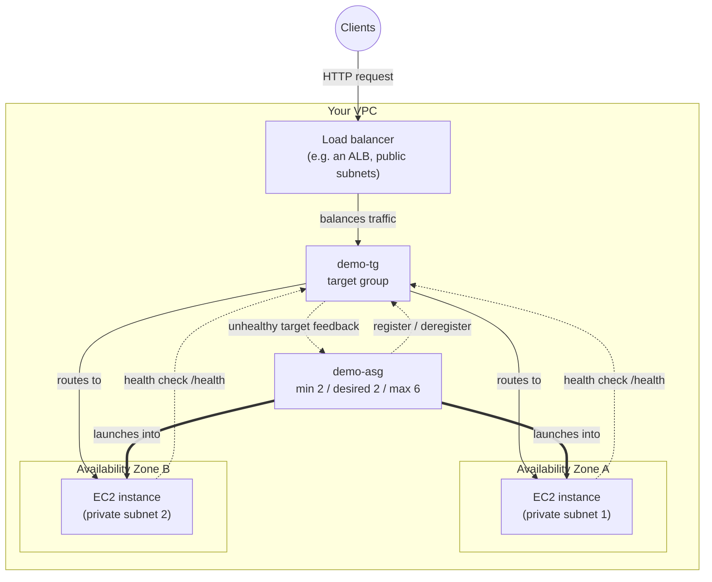

# 12 - Auto Scaling vs Elastic Load Balancer

> Goal: a focused comparison note — a favorite SAA-C03 exam angle — clarifying that **ASG and ELB are complementary, not competing, services** with distinct jobs. This is the natural capstone of the ASG folder: it ties `demo-asg` back to a load balancer and target group (e.g. `demo-tg` behind an ALB) and shows the whole picture working together.

---

## 1. Two different jobs, easy to conflate

Both services live in the "keep my app available and scalable" space, which is exactly why they get mixed up. But ask each one "what is your job?" and the answers don't overlap:

- **Elastic Load Balancer** (e.g. an Application Load Balancer): *"Given whatever healthy targets currently exist, distribute incoming traffic across them, and give clients one stable place to connect to."*
- **Auto Scaling Group (`demo-asg`)**: *"Decide how many EC2 instances should exist right now, and keep launching/terminating instances to make that true — and keep the ones that exist healthy."*

Neither one does the other's job:

- The load balancer has **no idea** why the instance count changed — it doesn't scale anything itself. It just keeps balancing across whatever's currently registered and healthy in its target group.
- `demo-asg` has **no ability** to route or balance traffic itself — it only launches/terminates EC2 instances and (if attached) registers/deregisters them with a target group. Without a load balancer in front, clients would have to somehow know which of the ASG's instances to talk to.

> 🧠 **Mental model:** the ELB is the **receptionist** — always at the front desk, directing visitors to whichever staff are currently available. The ASG is **HR** — deciding how many staff should be on shift and hiring/firing to match, but never talking to visitors directly.

---

## 2. How they work together

Putting the pieces from this series together with a load balancer in front:

- A load balancer (e.g. an ALB) sits in the **public subnets**, is the single DNS-addressable entry point, and performs health checks against its target group (call it `demo-tg`, HTTP, path `/health`).
- `demo-asg` launches instances from `demo-lt` into **private subnets**, with `demo-tg` attached as its load balancer target group.
- Health checks are configured as **EC2 + ELB** (as we set up when first building the ASG) — meaning the ASG doesn't only trust the EC2-level status checks, it also asks the target group "is this instance passing your app-level health check?"

The feedback loop:

1. `demo-asg` launches a new instance → once it passes the **health check grace period**, the ASG **registers it with `demo-tg`**.
2. The load balancer starts running its own target-group health checks against the instance's `/health` path, **independently** of the ASG.
3. If the load balancer marks the target `unhealthy` (app-level failure — e.g. the process crashed, but the OS/EC2 status checks still look fine), that unhealthy verdict **feeds back into `demo-asg`**, which treats the instance as unhealthy and replaces it — this is exactly why ELB health checks matter: **an instance can be EC2-healthy but application-broken**, and only the ELB health check would ever catch that.
4. When `demo-asg` terminates an instance (health failure, scale-in, termination policy pick — all covered earlier in this series), it **deregisters** it from `demo-tg` first (connection draining applies), so the load balancer stops sending it new requests.
5. Throughout all of this, the load balancer keeps balancing traffic across **however many** instances currently exist — it doesn't care whether the count changed due to a target-tracking policy, a schedule, manual scaling, or a termination policy decision. That's the whole point of the separation.

---

## 3. Big comparison table

| | **Elastic Load Balancer** (e.g. an ALB) | **Auto Scaling Group (`demo-asg`)** |
|---|---|---|
| **Purpose** | Distribute incoming traffic across healthy targets; single stable endpoint | Maintain the right number of healthy EC2 instances |
| **Layer** | Layer 4 (Network LB) or Layer 7 (Application LB / Gateway LB), depending on type | Not a networking layer construct — it's a *control plane* for EC2 capacity |
| **What it decides** | Which healthy target receives each request/connection (round robin, least outstanding requests, etc.) | How many instances should exist (desired/min/max) and when to launch/terminate them |
| **What it does NOT do** | Launch, terminate, or scale EC2 instances; has no opinion on instance count | Route or balance any traffic; has no concept of "requests" at all |
| **Health checks** | Runs its own target-group health checks (TCP/HTTP/HTTPS/gRPC) against registered targets | Consumes EC2 status checks and (optionally) ELB target health as input to replacement decisions |
| **Endpoint exposed to clients** | Yes — a stable DNS name (e.g. `demo-alb-xxxx.<region>.elb.amazonaws.com`) | No — an ASG has no client-facing endpoint of its own |
| **Unit of billing** | Load Balancer Capacity Units (LCU-hours) + hourly charge per LB | No charge for the ASG itself — you pay for the EC2 instances (+ EBS, etc.) it launches |

---

## 4. Diagram: the combined architecture

- **Solid arrows** = live request traffic (load balancer → target group → instances).
- **Dashed arrows** = health-check feedback loop (instance → target group, target group → ASG).
- **Double-line arrows** = the ASG's own launch/manage relationship to the instances — nothing to do with traffic.

---

## 5. Can you have one without the other?

**ELB without ASG** — perfectly valid. A **static fleet** of manually-launched EC2 instances registered to a target group, scaled up/down by hand (or never). You lose self-healing and elasticity, but the load balancer works fine distributing traffic across whatever's registered. Common in small/simple workloads or where capacity is genuinely fixed.

**ASG without ELB** — also perfectly valid, and a **common exam scenario**: a fleet of **worker instances pulling jobs from an SQS queue**. There's no inbound client traffic to balance at all — each worker independently polls SQS, processes messages, and there's nothing for a load balancer to do. Here the ASG is used purely for its *other* job: keeping N healthy workers running, scaling `desired capacity` based on **queue depth** (e.g. `ApproximateNumberOfMessagesVisible` via a target tracking or step scaling policy) rather than CPU. This cleanly proves the two services are independent tools, not a package deal.

> ⚠️ If a question describes a **queue-processing / backend-worker** pattern with "scale based on queue depth, no load balancer mentioned" — that's your cue this is an **ASG-only** design; don't assume an ELB is required just because an ASG is present.

---

## 6. Exam tips

🎯 **Exam tip:** "An instance passes EC2 status checks but the application inside has crashed" → only an **ELB (target group) health check** at the application layer catches this; EC2 status checks alone would not. This is the textbook justification for using **ELB health checks (not just EC2)** on an ASG, as configured on `demo-asg` since we first built it.

🎯 **Exam tip:** ELB is billed by **LCU-hours + an hourly charge**; the ASG itself has **no direct charge** — you're billed for the EC2 instances (and their EBS volumes, etc.) it manages. Don't let a question trick you into thinking "Auto Scaling" is a separately-billed line item.

🎯 **Exam tip:** know the **SQS worker fleet** pattern cold — it's the standard "ASG without a load balancer" exam scenario, scaling on queue depth instead of CPU/request count.

---

## 7. Recap

- **ELB** = traffic distribution + stable endpoint + health checks against current targets. **ASG** = decide instance count + launch/terminate + replace unhealthy instances. Neither substitutes for the other.
- Put together: `demo-asg` launches instances into private subnets and registers them with a target group (`demo-tg`); the load balancer in front balances traffic across whatever's currently registered and feeds health-check failures back to the ASG for replacement.
- Both **ELB-without-ASG** (static, manually-scaled fleet) and **ASG-without-ELB** (SQS worker fleet, scaling on queue depth) are valid, testable architectures.
- This wraps the core Auto Scaling series (Notes 01–12): launch templates, manual/scheduled/dynamic/predictive scaling, instance maintenance policy, default/built-in/custom termination policies, timers, and now how it all meets the load balancer. Put together with your own VPC and a load balancer/target group in front, `demo-asg` forms a complete, self-healing, load-balanced compute tier.

---

### Sources
- [What is Amazon EC2 Auto Scaling? – AWS docs](https://docs.aws.amazon.com/autoscaling/ec2/userguide/what-is-amazon-ec2-auto-scaling.html)
- [Health checks for instances in an Auto Scaling group – AWS docs](https://docs.aws.amazon.com/autoscaling/ec2/userguide/ec2-auto-scaling-health-checks.html)
- [What is Elastic Load Balancing? – AWS docs](https://docs.aws.amazon.com/elasticloadbalancing/latest/userguide/what-is-load-balancing.html)
- [Elastic Load Balancing pricing – AWS](https://aws.amazon.com/elasticloadbalancing/pricing/)
