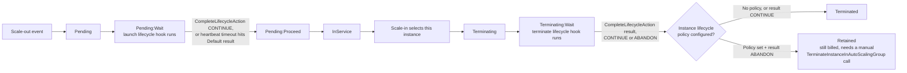
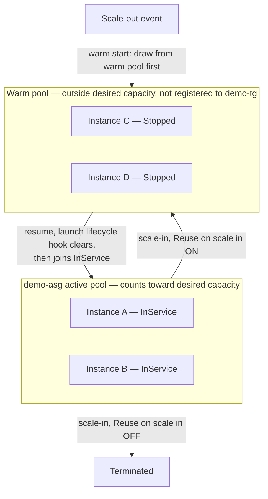

# 13 - Lifecycle Hooks, Instance Lifecycle Policy, and Warm Pools (Hands-On)

> Goal: cover the three related features that all live together on `demo-asg`'s **Instance management** tab — **Lifecycle hooks** (pause an instance mid-launch or mid-termination to run a custom action), the newer **Instance lifecycle policy** (protects against lost cleanup work when a termination hook is abandoned), and **Warm pools** (a standby pool of pre-initialized instances that cuts scale-out latency). They're grouped in the console for a reason: warm pools actually *depend on* lifecycle hooks to work correctly, and the instance lifecycle policy only does anything if a termination lifecycle hook already exists. Build all three on `demo-asg`.

---

## 1. Part A — Lifecycle hooks: the problem they solve

By default, the moment an ASG decides to launch or terminate an instance, that transition happens **immediately** — the instance goes straight from `Pending` to `InService`, or straight from `Terminating` to `Terminated`. Most of the time that's fine. But sometimes you need a **pause** in the middle to run a custom action first:

- **On launch**: pull a config bundle, register with an internal service registry or config management tool, warm an application cache — *before* the instance is allowed to receive real traffic.
- **On termination**: drain in-flight requests, upload final logs to S3, deregister from a service mesh, flush a local cache to persistent storage — *before* the instance disappears for good.

A **lifecycle hook** inserts exactly that pause: `Pending:Wait` on launch, `Terminating:Wait` on termination. The instance sits there until either your custom action explicitly says "done" (`CompleteLifecycleAction`), or a timeout expires and a configured default behavior takes over.

> 🧠 **Mental model:** the instance maintenance policy (covered in an earlier note) decides *how many* old vs. new instances exist at once during a replacement. A lifecycle hook decides whether a *single* instance is allowed to skip straight through `Pending`/`Terminating`, or has to pause and wait for something else to finish first.

---

## 2. Lifecycle states and where hooks pause them



The `Retained` branch is new (Section 6) — without an instance lifecycle policy, `ABANDON` still just terminates the instance, same as `CONTINUE`.

---

## 3. Lifecycle hook settings

| Setting | Options | What it governs |
|---|---|---|
| **Lifecycle transition** | **Instance launch** or **Instance terminate** | You need **two separate hooks** if you want to pause both ends — one hook only covers one direction |
| **Heartbeat timeout** | 30–7200 seconds (default when created via CLI: 3600s) | How long the instance waits in `Pending:Wait` / `Terminating:Wait` before the timeout fires. AWS recommends a **short** timeout (30–120s) for termination hooks, and a longer one for launch hooks if your custom action genuinely takes a while |
| **Default result** | **CONTINUE** or **ABANDON** | What happens when the heartbeat timeout elapses (or an unexpected failure occurs) before your action calls `CompleteLifecycleAction`. On launch: `CONTINUE` lets the instance become `InService` anyway; `ABANDON` terminates it immediately. On termination: both let the instance terminate — the only difference is what an instance lifecycle policy does with `ABANDON` (Section 6) |
| **Notification metadata** (optional) | Free-text | Extra context included in the notification message sent when the hook fires |
| **Notification target** | — | When you create a hook **from the console**, Amazon EC2 Auto Scaling automatically sends lifecycle event notifications to **Amazon EventBridge** — no SNS topic or IAM role to set up by hand. (SNS/SQS/Lambda targets are still supported, but only via the CLI's `--notification-target-arn`/`--role-arn` options.) |
| **RecordLifecycleActionHeartbeat** | API/CLI only | Extends the wait state by the hook's timeout value again, if your custom action needs more time than the configured heartbeat timeout allows |

---

## 4. Hands-on: add a launch hook and a terminate hook to `demo-asg`

### 4.1 Launch (scale-out) hook

1. **EC2 console** → **Auto Scaling Groups** → check the box next to **`demo-asg`** (opens the split pane at the bottom — don't click into the group name).
2. **Instance management** tab → **Lifecycle hooks** → **Create lifecycle hook**.
3. **Lifecycle hook name**: `demo-launch-hook`.
4. **Lifecycle transition**: **Instance launch**.
5. **Heartbeat timeout**: `300` (our `httpd` user data finishes in seconds, so this is generous for the demo).
6. **Default result**: **CONTINUE** — if nothing completes the action in time, let the instance become `InService` anyway rather than losing it.
7. **Notification metadata**: leave blank.
8. **Create**.

### 4.2 Terminate (scale-in) hook

1. **Create lifecycle hook** again.
2. **Lifecycle hook name**: `demo-terminate-hook`.
3. **Lifecycle transition**: **Instance terminate**.
4. **Heartbeat timeout**: `60` (AWS's recommended short window for termination hooks).
5. **Default result**: **CONTINUE** for now — Section 6 revisits this once the instance lifecycle policy is in place.
6. **Create**.

### 4.3 Watch a hook actually pause an instance

1. Trigger a scale-out the same way as the [manual scaling note](03-Manual-Scaling-HandsOn.md): bump `demo-asg`'s desired capacity from 2 to 3.
2. **EC2 → Instances**: the new instance appears, but its ASG **Lifecycle state** (visible on the **Instance management** tab's instance table) shows **`Pending:Wait`**, not `InService` — the launch hook is holding it there.
3. Since we didn't build a real custom action for this demo, either wait out the 300-second heartbeat timeout (it will auto-`CONTINUE` into `InService`), or complete it immediately yourself via **CloudShell** (the AWS Console's built-in terminal — top navigation bar, `>_` icon):
   ```bash
   aws autoscaling complete-lifecycle-action \
     --lifecycle-hook-name demo-launch-hook \
     --auto-scaling-group-name demo-asg \
     --lifecycle-action-result CONTINUE \
     --instance-id <the-new-instance-id>
   ```
4. Scale back down to 2 and repeat the same observation for `Terminating:Wait` — the instance lingers there briefly before actually disappearing.

> 🧠 A real deployment wouldn't complete the action manually like this — instead, the EventBridge notification (Section 3) would trigger a Lambda function or Systems Manager Automation runbook that does the actual work (config pull, log upload, deregistration, etc.) and then calls `CompleteLifecycleAction` itself once done.

---

## 5. Part B — Instance lifecycle policy: don't lose an instance whose cleanup failed

This is a newer, narrower feature (GA November 2025) that only matters if you already have a **termination** lifecycle hook. Recall from Section 3: if a termination hook's result is `ABANDON` (either explicitly, or via a timed-out `Default result`), the instance **still just terminates** — `ABANDON` on termination doesn't currently mean anything different from `CONTINUE` by default. That's a problem if `ABANDON` was signaling a genuine failure — e.g. a database node that couldn't finish flushing data to disk before its termination hook timed out. Losing that instance immediately means losing the chance to investigate or recover anything.

An **instance lifecycle policy** changes that: when its `TerminateHookAbandon` trigger is configured, an `ABANDON` result moves the instance into a **Retained** state instead of terminating it.

| While Retained | |
|---|---|
| **Billing** | Still incurs standard EC2 charges — it's just a normal running (or stopped) instance now, sitting outside the ASG's management |
| **Desired capacity** | Doesn't count toward it — the ASG launches a replacement instance to make up the difference |
| **Instance refresh / max instance lifetime** | Both ignore retained instances entirely |
| **Getting rid of it** | Only a manual `TerminateInstanceInAutoScalingGroup` API call actually removes it — there's no automatic cleanup |

> 🎯 **Exam tip**: this is the answer whenever a scenario says something like "we need to guarantee a failed graceful shutdown never silently destroys an instance we might need to investigate" — instance lifecycle policy + a termination lifecycle hook using `ABANDON` as its signal for failure.

## 6. Hands-on: set the Termination hook abandon behavior to Retain

1. `demo-asg` → **Instance management** tab → **Instance lifecycle policy for lifecycle hooks** panel → **Manage policy**.
2. **Termination hook abandon behavior**: switch from **Terminate (default)** to **Retain**.
3. Save.

This only has any effect because `demo-terminate-hook` already exists (Section 4.2) — an instance lifecycle policy with no termination hook configured on the group does nothing at all. From now on, if you (or a real automation) ever completes `demo-terminate-hook` with `--lifecycle-action-result ABANDON` instead of `CONTINUE`, that instance moves to **Retained** instead of disappearing — check for it under **EC2 → Instances**, filtered by `demo-asg`'s tag, state still `running` even though the ASG itself no longer lists it as a managed instance.

---

## 7. Part C — Warm pools: the problem they solve

Some applications have a genuinely **long boot time** — writing a large dataset to local disk, warming a big in-memory cache, running a lengthy configuration management pass — long enough that a normal scale-out event leaves users waiting for new capacity to actually become useful. The naive fix is over-provisioning (running more instances than you need, all the time, just so scale-out never has to wait for a cold boot) — expensive, and it doesn't actually fix the underlying latency, it just hides it behind idle spend.

A **warm pool** is a separate pool of instances that sit **pre-initialized** — already booted, past the slow setup work — but **outside** the ASG's active, in-service pool. When a scale-out event happens, the ASG draws from the warm pool first (a **warm start**) instead of launching a fully cold instance from scratch.

---

## 8. Warm pool instance states — the cost/speed trade-off

| State | Speed to become `InService` | What you pay for while parked |
|---|---|---|
| **Stopped** (default) | Slowest of the three warm options (still needs a normal EC2 start), but far faster than a genuine cold launch since setup work is already done | Just EBS volumes + any Elastic IPs — **no compute charge at all** |
| **Hibernated** | Faster than Stopped — RAM contents are restored from the EBS root volume instead of the OS booting from scratch | EBS volumes (including RAM-contents storage) + Elastic IPs — still **no compute charge** |
| **Running** | Fastest — already fully up | Full EC2 compute charge the entire time it sits idle in the pool — **AWS explicitly discourages this** unless latency is more critical than cost |

> ⚠️ **Requirements**: `Stopped`/`Hibernated` both require an **EBS-backed root volume** (instance-store-backed AMIs can't be stopped or hibernated at all). `Hibernated` additionally requires the instance type and AMI to meet [EC2's hibernation prerequisites](https://docs.aws.amazon.com/AWSEC2/latest/UserGuide/hibernating-prerequisites.html) — if they don't, instances silently fall back to `Stopped` instead.

---

## 9. Architecture & workflow



Note the direct callback to Part A: AWS explicitly recommends a **launch lifecycle hook** whenever you use a warm pool — instances entering the pool get stopped/hibernated the moment they're created, **without waiting for user data to finish**. Without a hook holding it in `Pending:Wait` until initialization genuinely completes, a warm-pool instance could get stopped mid-boot and later resumed still half-configured.

---

## 10. Warm pool settings

| Setting | What it does |
|---|---|
| **Warm pool instance state** | `Stopped` (default), `Hibernated`, or `Running` — see Section 8 |
| **Minimum warm pool size** | A static floor for how many instances stay parked in the pool, regardless of the group's current desired capacity |
| **Instance reuse** — **Reuse on scale in** | If checked, an instance being scaled *in* returns to the warm pool instead of terminating — reuses an already-configured instance instead of paying full boot cost again next time |
| **Warm pool size** — **Default specification** | Pool size = group's **Max capacity − desired capacity**, recalculated automatically as those change |
| **Warm pool size** — **Custom specification** | Pool size = a custom target capacity (`MaxGroupPreparedCapacity`) − desired capacity, letting you decouple warm pool size from the group's own Max — useful at large scale where "warm pool as big as headroom to Max" would be wastefully large |

---

## 11. Hands-on: create a warm pool on `demo-asg`

`demo-asg` is currently Min 2 / Desired 2 / Max 6 (from the [launch template and ASG note](02-Launch-Template-and-ASG-HandsOn.md)) and already has `demo-launch-hook` from Section 4 — satisfying the "add a lifecycle hook first" prerequisite.

1. `demo-asg` → **Instance management** tab → **Warm pool** panel → **Create warm pool**.
2. **Warm pool instance state**: **Stopped**.
3. **Minimum warm pool size**: `1`.
4. **Instance reuse**: check **Reuse on scale in**.
5. **Warm pool size**: **Default specification** — with Max 6 and desired 2, this evaluates to a pool of **4** instances.
6. Check the **Estimated warm pool size based on current settings** readout to confirm it shows `4`.
7. **Create**.

### Watch it work

1. **Warm pool instances** panel fills in with 4 instances launching, then transitioning to **Stopped** once `demo-launch-hook`'s action clears each one.
2. Trigger a scale-out (desired capacity 2 → 4, same as the [manual scaling note](03-Manual-Scaling-HandsOn.md)): watch **Instances (N)** on the main **Instance management** table grow by resuming instances **out of the warm pool** rather than launching brand-new ones — noticeably faster than the cold-launch timing you saw in earlier notes.
3. Scale back in to 2: with **Reuse on scale in** checked, the two instances that leave the active pool reappear in **Warm pool instances** as `Stopped`, instead of vanishing entirely.

---

## 12. Common problems

| Problem | Likely cause / fix |
|---|---|
| New instance stuck in `Pending:Wait` far longer than expected | Nothing ever called `CompleteLifecycleAction` and the heartbeat timeout hasn't elapsed yet — either wait it out or complete it manually (Section 4.3) |
| Instance terminates immediately despite `Default result = CONTINUE` on a launch hook | Double-check you edited the **launch** hook, not the **terminate** hook — they're separate resources with separate settings |
| `Manage policy` → **Retain** doesn't seem to do anything | An instance lifecycle policy has no effect without an existing **termination** lifecycle hook on the group — confirm `demo-terminate-hook` exists (Section 4.2) |
| Retained instance never disappears on its own | Expected — retained instances require a manual `TerminateInstanceInAutoScalingGroup` call; there's no automatic cleanup by design |
| Warm pool instances stuck launching, never reach `Stopped` | No launch lifecycle hook exists, or its custom action never completes — a warm pool without a lifecycle hook can stop instances mid-boot before initialization genuinely finishes |
| Scale-out still looks like a cold launch even with a warm pool configured | Warm pool was empty/depleted at the moment of scale-out (falls back to a cold start automatically), or the AZ had no available capacity |
| Warm pool won't create at all | Check your launch template isn't using a weighted mixed-instances policy or Spot — warm pools don't support either |

---

## 13. Exam tips

🎯 **Exam tip:** "pause an instance to run a custom script before it goes into service / before it terminates" → **lifecycle hooks**. "Don't lose an instance whose graceful shutdown failed" → **instance lifecycle policy** (and it requires a termination hook to already exist). "Reduce scale-out latency for an app with a long boot process" → **warm pools**.

🎯 **Exam tip:** by default, `ABANDON` on a termination hook still terminates the instance — the same as `CONTINUE`. The **only** thing that changes that is an instance lifecycle policy explicitly configured to retain on `TerminateHookAbandon`.

🎯 **Exam tip:** console-created lifecycle hooks notify via **EventBridge** by default now — if a question describes SNS/SQS/Lambda as the notification target, that's the CLI/API path (`--notification-target-arn`), not the default console behavior.

---

## 14. ⚠️ Clean up to avoid charges

1. **Warm pool**: `demo-asg` → **Instance management** → **Warm pool** → **Actions** → **Delete** — this terminates every instance sitting in the pool.
2. **Instance lifecycle policy**: **Manage policy** → set back to **Terminate (default)** if you don't want retained instances lingering (or manually terminate any retained instance via `TerminateInstanceInAutoScalingGroup` first).
3. **Lifecycle hooks**: select `demo-launch-hook` and `demo-terminate-hook` → **Actions** → **Delete** — hooks themselves cost nothing, but delete them if you want `demo-asg` back to a clean baseline for later notes.
4. Bring `demo-asg`'s desired capacity back to its normal value (2) if any of the demos above left it scaled up.

---

## 15. Recap

- **Lifecycle hooks** pause an instance at `Pending:Wait` (launch) or `Terminating:Wait` (termination) so a custom action can run first — cleared via `CompleteLifecycleAction`, or a `Default result` (`CONTINUE`/`ABANDON`) after a `Heartbeat timeout` (30–7200s). Console-created hooks notify via **EventBridge** by default.
- An **instance lifecycle policy** (GA Nov 2025) adds a **Retained** state for termination hooks that complete with `ABANDON` — the instance keeps running (still billed, doesn't count toward desired capacity) until manually terminated. It requires a termination lifecycle hook to already exist; without one, it's a no-op.
- **Warm pools** keep a standby set of pre-initialized instances — `Stopped` (cheapest), `Hibernated` (faster resume, still no compute charge), or `Running` (fastest, full cost, generally discouraged) — outside the group's desired capacity, drawn from first on scale-out (**warm start**) instead of a cold launch.
- Warm pools **depend on** a launch lifecycle hook to avoid stopping instances mid-boot — this is why AWS groups all three features on the same **Instance management** tab.
- Built `demo-launch-hook` and `demo-terminate-hook`, set the instance lifecycle policy to **Retain**, and created a 4-instance default-specification warm pool with **Reuse on scale in** enabled — then watched a scale-out draw from the warm pool instead of cold-launching.
- Next: return to [Manual Scaling](03-Manual-Scaling-HandsOn.md) and [Instance Maintenance Policy](07-Instance-Maintenance-Policy-HandsOn.md) if you want to see how these hooks interact with an instance refresh's launch-first/terminate-first replacement pacing.

---

### Sources
- [How lifecycle hooks work in Amazon EC2 Auto Scaling groups](https://docs.aws.amazon.com/autoscaling/ec2/userguide/lifecycle-hooks-overview.html)
- [Add lifecycle hooks to your Auto Scaling group](https://docs.aws.amazon.com/autoscaling/ec2/userguide/adding-lifecycle-hooks.html)
- [Control instance retention with instance lifecycle policies](https://docs.aws.amazon.com/autoscaling/ec2/userguide/instance-lifecycle-policy.html)
- [EC2 Auto Scaling introduces instance lifecycle policy — AWS What's New](https://aws.amazon.com/about-aws/whats-new/2025/11/ec2-auto-scaling-instance-lifecycle-policy/)
- [Decrease latency for applications with long boot times using warm pools](https://docs.aws.amazon.com/autoscaling/ec2/userguide/ec2-auto-scaling-warm-pools.html)
- [Create a warm pool for an Auto Scaling group](https://docs.aws.amazon.com/autoscaling/ec2/userguide/create-warm-pool.html)
- [Use lifecycle hooks with a warm pool in Auto Scaling group](https://docs.aws.amazon.com/autoscaling/ec2/userguide/warm-pool-instance-lifecycle.html)
