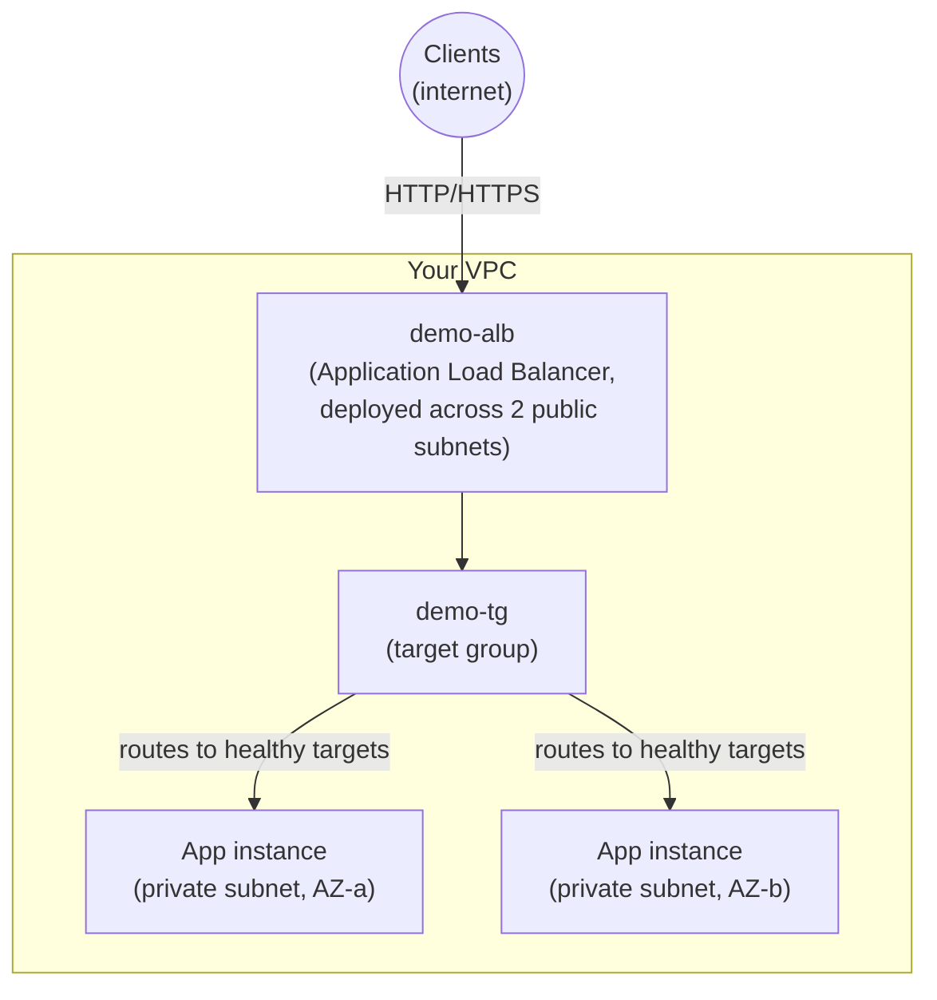

# 01 - Introduction to Load Balancing

> Goal: understand **what a load balancer is and why it exists**, before touching any console screen. This folder builds a small, self-contained demo: a VPC with public and private subnets, a couple of backend EC2 instances, and — starting at Note 05 — a real, working **`demo-alb`**.

---

## 1. The problem: a single server can't do this job

Imagine you had just **one** EC2 instance serving your application directly to the internet, with no load balancer in front of it. Two things go wrong immediately:

1. **Single point of failure.** That one instance crashes, gets patched, or its AZ has an outage → your entire application is down. There is no "spare" to fail over to.
2. **Can't handle scale.** One instance has a hard ceiling on CPU, memory, and network throughput. Once traffic exceeds that ceiling, requests queue up and start timing out — and you can't "add more capacity" to a single running box beyond resizing it (which still means downtime).

Even if you manually launched 3-4 identical instances to fix both problems, you'd immediately hit a **third** problem: **how does a client know which of those instance IPs to call?** Instance IPs change when instances are replaced, and hardcoding a list of IPs into a client (or a DNS record with several A-records and no health awareness) doesn't tell the client which instances are currently healthy.

> 🧠 **Mental model:** a load balancer is the **receptionist at a busy office** — visitors (requests) never need to know which staff member (instance) is free; they just walk up to the front desk (one stable address) and the receptionist sends them to whoever is available and capable right now.

---

## 2. What a load balancer actually does

A **load balancer** sits in front of a fleet of backend servers ("targets") and does three jobs at once:

1. **Distributes incoming traffic** across multiple targets, instead of every client hammering one server.
2. **Continuously health-checks** those targets, and only sends traffic to the ones currently passing health checks — an unhealthy target is silently skipped.
3. **Gives clients one single, stable entry point** (a DNS name) to connect to, regardless of how many targets exist behind it, in which AZs, or how often they change.

With a load balancer in place, a client never needs to know about individual backend instances (which can be launched/terminated constantly as a fleet scales) — it only ever needs to know the load balancer's DNS name. Everything behind that name can scale, heal, and change shape freely without the client noticing.

---

## 3. Why use AWS-managed Elastic Load Balancing (ELB) instead of running your own?

You *could* run your own reverse proxy (e.g. an EC2 instance running NGINX or HAProxy) as a "load balancer." AWS's managed **Elastic Load Balancing (ELB)** service beats that approach on every axis that matters for production:

| | **Self-run load balancer (EC2 + NGINX/HAProxy)** | **AWS Elastic Load Balancing** |
|---|---|---|
| High availability | You must build your own HA pair + failover | **Built in** — ELB nodes span every enabled AZ automatically |
| Scaling | You resize/patch the instance yourself as traffic grows | **Scales itself** automatically to handle load, no capacity planning needed |
| Patching/maintenance | Your responsibility (OS, proxy software, security patches) | Fully AWS-managed, zero patching |
| TLS certificates | You manage certs and renewals yourself | Integrates natively with **AWS Certificate Manager (ACM)** — free certs, auto-renewal |
| Web application firewall | You'd bolt on your own WAF/ModSecurity | Integrates natively with **AWS WAF** |
| Autoscaling integration | Manual scripting to register/deregister targets | Native **Auto Scaling Group** attachment — if a target group is attached to an Auto Scaling group, instances register/deregister automatically as it scales |
| DNS / routing | You manage your own DNS records | Integrates natively with **Route 53** (alias records point straight at the LB) |
| Billing | Pay for the EC2 instance(s) running the proxy, 24/7, whether busy or idle | Pay hourly + Load Balancer Capacity Units (LCU) — still not free, but no infrastructure to run |

This is exactly why this folder's demo build uses a real managed load balancer (`demo-alb`, starting at Note 05), not a hand-rolled proxy instance.

---

## 4. Preview: the 4 types of Elastic Load Balancer

AWS offers four load balancer types, each operating at a different networking layer with a different purpose. Detail on each comes in later notes — this is just the map:

| Type | Full name | OSI Layer | One-line description |
|---|---|---|---|
| **ALB** | Application Load Balancer | Layer 7 (Application) | Understands HTTP/HTTPS — routes by URL path, hostname, headers; the type this folder's `demo-alb` demo uses |
| **NLB** | Network Load Balancer | Layer 4 (Transport) | Ultra-high-performance TCP/UDP routing, static IP support, millions of requests/sec |
| **GWLB** | Gateway Load Balancer | Layer 3 (Network, GENEVE encapsulation) | Transparently routes traffic through third-party virtual appliances (firewalls, IDS/IPS) |
| **CLB** | Classic Load Balancer | Layer 4 / Layer 7 (limited) | Legacy, pre-dates the other three — avoid for new designs |

🎯 **Exam tip:** "ALB = Layer 7, NLB = Layer 4, GWLB = Layer 3 (GENEVE)" is one of the most frequently tested one-liners on the SAA-C03. If a question mentions **path-based or host-based routing**, the answer is always **ALB**. If it mentions **static IP, extreme throughput, or TCP/UDP passthrough**, the answer is **NLB**. If it mentions **inline traffic inspection via third-party firewall appliances**, the answer is **GWLB**.

---

## 5. Where this folder is headed

This folder is self-contained: it needs only a VPC with two public subnets (in two different Availability Zones) and, for the private-subnet targets, two private application subnets — any VPC built that way works, regardless of how or where it was created. Notes 02-04 prepare the concepts, network verification, and security groups needed to build a load balancer correctly; **Note 05 is where a real target group (`demo-tg`) and load balancer (`demo-alb`) actually get built.**

---

## 6. Exam tips

🎯 **Exam tip:** a question describing "single point of failure," "manual failover," or "can't scale beyond one server" is describing the problem ELB solves — the expected fix is almost always "put an Elastic Load Balancer in front of the fleet," not "buy a bigger instance."

🎯 **Exam tip:** know that ELB gives you **one stable DNS name** regardless of how many/which targets exist behind it — this is why clients (and Route 53 records) point at the load balancer, never at individual instance IPs.

---

## 7. Recap

- A single server is a **single point of failure** and has a **hard scaling ceiling** — a load balancer solves both by distributing traffic across multiple healthy targets behind one stable endpoint.
- AWS-managed **Elastic Load Balancing (ELB)** beats a self-run proxy on HA, auto-scaling, patching, and native integration with ACM, WAF, Auto Scaling, and Route 53.
- Four ELB types exist: **ALB** (L7, HTTP-aware), **NLB** (L4, TCP/UDP, extreme performance), **GWLB** (L3, GENEVE, appliance traffic inspection), **CLB** (legacy).
- This folder is self-contained: it just needs a VPC with two public subnets across two AZs (and, for targets, two private subnets); `demo-tg` and `demo-alb` get created for real starting at Note 05.
- Next: Note 02 — Load Balancer Terminology.

---

### Sources
- [What is Elastic Load Balancing? – AWS docs](https://docs.aws.amazon.com/elasticloadbalancing/latest/userguide/what-is-load-balancing.html)
- [Application Load Balancers – AWS docs](https://docs.aws.amazon.com/elasticloadbalancing/latest/application/application-load-balancers.html)
- [What is a Gateway Load Balancer? – AWS docs](https://docs.aws.amazon.com/elasticloadbalancing/latest/gateway/introduction.html)
- [Elastic Load Balancing pricing – AWS](https://aws.amazon.com/elasticloadbalancing/pricing/)
