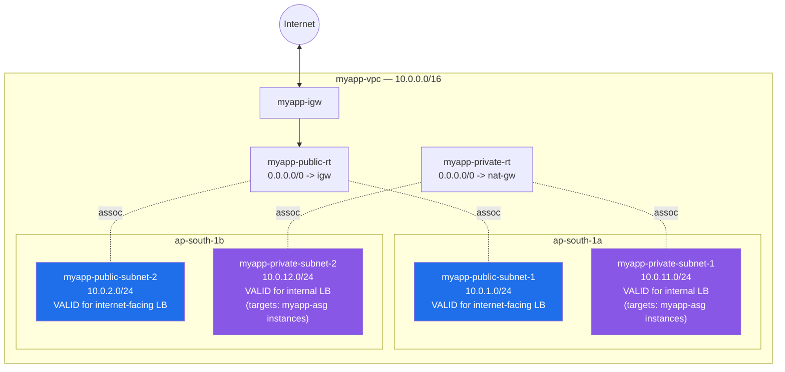

# 03 - Load Balancer VPC Design (Hands-On)

> Goal: verify the **network prerequisites** an Application Load Balancer needs — this note does **not** create a VPC or subnets from scratch (that's already done in `VPC\04-Create-VPC-HandsOn.md` and `VPC\05-Create-Subnets-HandsOn.md`). Instead we walk through confirming `myapp-vpc`'s existing subnets actually satisfy what `myapp-alb` will require in Note 05. Continues Note 02 (terminology); Note 04 layers security groups on top of this same network.

---

## 1. What an ALB/NLB actually requires from the network

Before you can even open the "Create Load Balancer" wizard successfully, the underlying VPC must satisfy a few hard requirements — these are **enforced by the console/API**, not just best-practice suggestions:

1. **At least 2 Availability Zones.** You must select subnets in **2 or more different AZs** — AWS will not let you create an ALB/NLB with only one AZ enabled. Each enabled AZ gets its own load balancer node.
2. **One subnet per AZ, per load balancer.** You cannot pick two subnets that happen to sit in the same AZ — the console will only let you select one subnet per AZ.
3. **Subnet size matters.** AWS recommends each selected subnet have a CIDR block of at least `/27` (giving at least 8 free IP addresses) — the load balancer reserves IPs in each subnet to scale itself, and can enter a degraded state if it runs out.
4. **Internet-facing vs internal changes which subnets are valid:**
   - **Internet-facing** load balancer → needs subnets with a route to an **Internet Gateway** (our public subnets).
   - **Internal** load balancer → needs subnets **without** a direct IGW route (our private subnets) — clients must already be inside the VPC (or connected via VPN/peering/Transit Gateway) to reach it.

> ⚠️ This is exactly why `myapp-vpc` was deliberately built with **2 public subnets in 2 different AZs** (`VPC\05`) — it wasn't just for the EC2 instances in Note `VPC\08`, it was already anticipating this load balancer requirement.

🎯 **Exam tip:** "Highly available load balancer" on the exam always means **2+ AZs, 2+ subnets** — a design that only enables one AZ for the ALB is a guaranteed wrong answer on an HA question, and the console won't even let you build it that way.

---

## 2. Internet-facing vs internal — which `myapp` subnets apply

| Load balancer scheme | Needs subnets with... | `myapp-vpc` subnets that qualify |
|---|---|---|
| **Internet-facing** (clients from the public internet) | A route table with `0.0.0.0/0 → myapp-igw` | `myapp-public-subnet-1` (`10.0.1.0/24`, `ap-south-1a`), `myapp-public-subnet-2` (`10.0.2.0/24`, `ap-south-1b`) |
| **Internal** (clients only from inside the VPC / peered VPC / on-prem via VPN) | No direct IGW route — routed only via `local` (+ NAT for outbound, if needed) | `myapp-private-subnet-1` (`10.0.11.0/24`, `ap-south-1a`), `myapp-private-subnet-2` (`10.0.12.0/24`, `ap-south-1b`) |

`myapp-alb` (built in Note 05) is **internet-facing**, so it goes into the two public subnets — even though the actual application instances it forwards to (`myapp-asg`) live in the **private** subnets. The load balancer's own subnet placement and its targets' subnet placement are two separate decisions.

---

## 3. Hands-on: verify `myapp-vpc`'s subnets satisfy these requirements

We are **not** creating anything new here — just confirming, via the VPC console, that the existing build is actually ready for Note 05.

### Step 1 — Confirm 2+ AZs exist with public subnets

1. **VPC console** → left nav → **Subnets**.
2. Filter/search for `myapp-public`.
3. Confirm you see exactly:
   - `myapp-public-subnet-1` → **Availability Zone** column shows `ap-south-1a`, **IPv4 CIDR** shows `10.0.1.0/24`.
   - `myapp-public-subnet-2` → **Availability Zone** column shows `ap-south-1b`, **IPv4 CIDR** shows `10.0.2.0/24`.
4. Both AZ values must be **different** — if both show `ap-south-1a`, that's a problem (see troubleshooting below).

### Step 2 — Confirm the public subnets' route tables point to the IGW

1. Select `myapp-public-subnet-1` → **Route table** tab.
2. Confirm the associated route table (`myapp-public-rt`, from `VPC\06`) has a route: `0.0.0.0/0 → myapp-igw`.
3. Repeat for `myapp-public-subnet-2` — it should be associated with the **same** `myapp-public-rt`.

### Step 3 — Confirm the private subnets (for reference — targets live here, the LB itself does not)

1. Filter/search for `myapp-private`.
2. Confirm `myapp-private-subnet-1` (`10.0.11.0/24`, `ap-south-1a`) and `myapp-private-subnet-2` (`10.0.12.0/24`, `ap-south-1b`) exist, each associated with `myapp-private-rt` (`0.0.0.0/0 → myapp-nat-gw`, from `VPC\09`) — **not** a direct IGW route.
3. This confirms `myapp-asg`'s instances (which launch into these subnets, per `EC2\ASG\02`) are correctly unreachable from the internet directly.

### Step 4 — Confirm subnet size (CIDR)

All four subnets use a `/24` (256 addresses each) — comfortably larger than the AWS-recommended `/27` minimum, so there's no capacity concern here.

If all four checks pass, `myapp-vpc` is ready for the ALB build in Note 05 — no further networking changes are needed.

---

## 4. Diagram: `myapp-vpc` subnet layout annotated for load balancer eligibility

`myapp-alb` (internet-facing) will be deployed across the two **blue** subnets. If we were instead building an **internal** load balancer, it would use the two **purple** subnets.

---

## 5. Troubleshooting

| Symptom | Likely cause | Fix |
|---|---|---|
| Only one subnet shows up as selectable when creating the load balancer | Only one AZ actually has a subnet available, or you picked the wrong VPC in the wizard | Check the **VPC** dropdown at the top of the create-LB wizard is `myapp-vpc`; check **Subnets** page for a second AZ's subnet |
| Two public subnets both show the same AZ | Subnets were created with "No preference" for AZ instead of pinning it (see `VPC\05` §1's warning) | Edit/recreate one subnet, explicitly choosing the other AZ |
| Console won't let you select a private subnet for an internet-facing LB | Internet-facing LBs still let you pick any subnet, but traffic won't reach clients correctly without an IGW route — the ALB will provision but be unreachable | Re-select the public subnets that have the `0.0.0.0/0 → igw` route |
| ALB creation succeeds but shows `provisioning` then `failed` | A selected subnet has too few free IPs (violates the `/27`, 8-free-IP guidance) | Free up IPs in that subnet, or use a larger/different subnet |
| Load balancer created but clients can't reach it at all | Selected private subnets for an internet-facing LB, or the public route table is missing the IGW route | Re-check Steps 1-2 above; confirm subnet-to-route-table association |

---

## 6. Recap

- An ALB/NLB requires **at least 2 AZs** (2+ subnets, one per AZ) — this is enforced, not optional.
- **Internet-facing** load balancers need subnets routed to an **IGW** (`myapp-public-subnet-1/2`); **internal** ones need subnets without a direct IGW route (`myapp-private-subnet-1/2`).
- You can never select two subnets from the **same** AZ for one load balancer.
- Verified `myapp-vpc`'s existing subnets (from `VPC\04-05`) already satisfy all of this — no new subnets needed for `myapp-alb`.
- Next: Note 04 builds the **security groups** (`myapp-alb-sg`, updated `myapp-app-sg`) this same network needs before Note 05's actual ALB build.

---

### Sources
- [Application Load Balancers – Subnets for your load balancer – AWS docs](https://docs.aws.amazon.com/elasticloadbalancing/latest/application/application-load-balancers.html#subnets-load-balancer)
- [Availability Zones for your Application Load Balancer – AWS docs](https://docs.aws.amazon.com/elasticloadbalancing/latest/application/load-balancer-subnets.html)
- [What is Amazon VPC? – AWS docs](https://docs.aws.amazon.com/vpc/latest/userguide/what-is-amazon-vpc.html)
